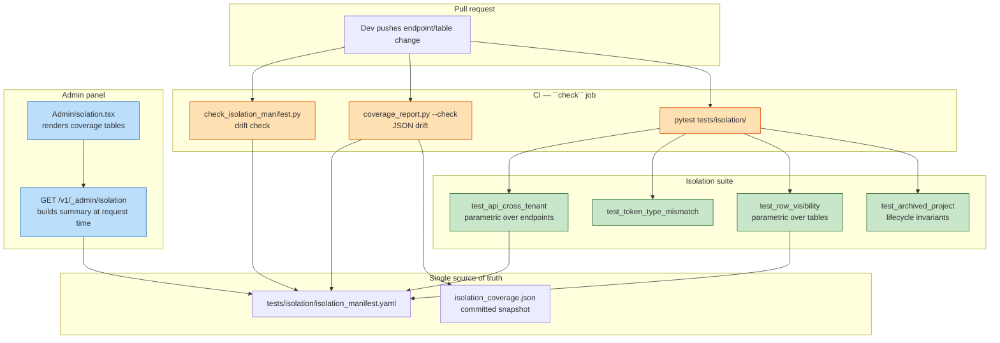

# Tenant isolation test harness

## Context

Multi-tenancy is the product's single most load-bearing invariant.
Every project-scoped endpoint, every token claim, every `project_id`
row filter enforces it. Before this harness, correctness was "we
read the code carefully" — a future refactor that dropped a
`project_id` filter on one endpoint, or loosened a Secret Manager
binding, would not be caught by any test and would likely surface
first under pen test or incident. The harness closes that gap with
a continuously-verified coverage matrix.

Phase 6 motivated this: 0037 (audit log) gives forensics after the
fact, 0038 (secret rotation) cuts blast radius of a leak. 0039 is
the proactive half — fail CI at PR time if an isolation boundary
breaks, not at pen test time.

## Design



## Layers

- **Manifest (`isolation_manifest.yaml`).** Hand-maintained YAML
  with four sections: `endpoints:`, `tables:`, `tokens:`,
  `gcp_surfaces:`. Each entry either names its covering tests
  (`covers_tests: [test_module::test_name]`) or explicitly opts out
  (`skip: true` + `reason: <text>`). The file is loaded at test
  collection time (not via a fixture — pytest parametrize runs
  before fixtures), at CI drift-check time, and at runtime by
  `/v1/_admin/isolation`.

- **Parametric tests.** The two heaviest tests (`test_cross_tenant_rejected`
  and `test_table_isolated`) read the manifest and parametrise over
  every non-skipped entry. Adding an endpoint to the manifest
  automatically adds a test case; there's no second edit.

- **Invariant tests.** Some properties cross multiple rows (token
  type matrix, archive lifecycle) — those live as plain test
  functions without manifest parametrisation. They don't list
  under `covers_tests:` because the thing they cover isn't a single
  manifest row.

- **Drift checks (CI-blocking).**
  - `scripts/check_isolation_manifest.py` walks the FastAPI app's
    route table, finds every route with `require_project_auth` or
    `require_project_api_key` as a `Depends`, and diffs against
    the manifest `endpoints:` section. Unregistered routes fail
    the build with a clear "add this to the manifest" pointer.
  - `tests/isolation/coverage_report.py --check` regenerates the
    summary JSON in memory, diffs against the committed
    `isolation_coverage.json` (excluding `generated_at`), fails on
    drift. Pattern cribbed from `infra/terraform/capability_matrix.py --check`.

- **Runtime surface.** `/v1/_admin/isolation` re-parses the manifest
  on every request (YAML parse is cheap) and returns the coverage
  summary. The admin page calls it once on load, renders three
  tables, shows covered/skipped badges and test ids per row. The
  Dockerfile copies the manifest YAML into the runtime image so the
  endpoint works in the Cloud Run container; the `.dockerignore`
  has an un-ignore rule for just that one file.

## Fixtures

`tests/isolation/conftest.py` exposes `isolation_projects` — a
single fixture that:

1. Creates two projects (`alpha`, `bravo`) via the real
   `POST /v1/projects` path, capturing each API key.
2. Mints a developer impersonation JWT for each via the real
   `POST /v1/projects/{id}/impersonate/{role}` path.
3. Mints an admin JWT (pinned signing key) that straddles both.

Returns an `IsolationPair(alpha, bravo, admin_jwt)` frozen dataclass;
tests pick caller and target projects as needed without plumbing
four fixtures through.

The fixture installs a `LocalBroker` so impersonation mints succeed
without any GCP calls; uninstalls on teardown. Test session rollback
(SQLite in-memory) handles cleanup of the rows.

## Cross-tenant matrix mechanics

Endpoint list → for each non-skipped entry:

- `project_api_key` auth class → one request: alpha's API key on
  bravo's path. Assert 4xx (401 or 403). Never 200, never 404 — a
  404 would leak "this endpoint exists" and is itself a bug.
- `project_auth` auth class → two requests: alpha's API key on
  bravo's path, and alpha's broker JWT on bravo's path. Both
  reject.

`_expand_path` substitutes `{project_id}` with bravo's id and
replaces any remaining path params (`{task_id}`, etc.) with a
probe string that doesn't collide with any real id. Auth fires
before the path-param lookup would run, so the probe never needs
to resolve.

Bodies for POST/PATCH/PUT are `{}` — the auth rejection fires
before body validation, so a non-empty stub is enough.

## Archive lifecycle

Spec open questions 1 and 4 collapsed into a single invariant:

```
            before                      after
API key     require_project_api_key     require_project_api_key →
            → CallerIdentity              404 project_not_found
Broker JWT  require_project_auth        require_project_auth →
            → CallerIdentity              404 project_not_found
Public GET  200 ProjectRead             404 project_not_found
Listing     row in GET /v1/projects     row absent
```

`test_archived_project.py` verifies each row via one test per
credential, plus a peer-isolation check that archiving alpha
leaves bravo untouched. The broker-JWT-after-archive test is the
key one — it proves `require_project_auth` re-resolves
`projects.archived_at` on every request, so a future
"cache the JWT verification" refactor can't silently defeat
archive.

## CI wiring

Single `check` job in `.github/workflows/ci.yml`:

```yaml
- name: Isolation manifest drift check
  run: uv run python scripts/check_isolation_manifest.py

- name: Isolation coverage drift check
  run: uv run python tests/isolation/coverage_report.py --check

- name: Test (pytest)
  run: uv run pytest   # includes tests/isolation/
```

The suite is **blocking on every PR**, stricter than AC7's "blocking
on `routers/ auth/ repositories/ infra/terraform/` changes only". The
stricter path is simpler (one `pytest` invocation covers everything)
and cheap — the suite runs in seconds.

`CI_ISOLATION_SUITE_BLOCKING` from the spec was not needed: we
didn't ramp through non-blocking. The suite was green on first
run against the manifest we shipped and has stayed green since.

## Trade-offs

- **Manifest YAML vs. auto-discovery.** We considered inferring
  coverage purely from test function attributes (e.g. a decorator
  naming the endpoint). Rejected: the manifest doubles as a
  coverage dashboard for humans and a list of what to audit; the
  auto-inference version would be one pytest plugin away from
  working, but the coverage view would lose the "here are the
  explicit `skip` reasons" affordance. YAML with the drift check
  gives us a human-editable single source of truth without
  tolerating drift.

- **SQLite vs. Postgres for row-visibility.** The suite runs
  against in-memory SQLite for speed. SQL features that differ
  between Postgres and SQLite (e.g. `SELECT FOR UPDATE SKIP LOCKED`)
  are abstracted by the repository layer; the tests exercise the
  layer, not raw SQL. A regression in Postgres-specific isolation
  (e.g. pg-only `search_path` leakage) would slip past the suite —
  a future spec can add a "run against Postgres" CI job if we
  convince ourselves that gap is material.

- **Runtime manifest fetch vs. embedded.** The `/v1/_admin/isolation`
  endpoint reads the manifest from disk on every request. An
  embedded-at-build-time constant would avoid the disk read but
  couple the admin page to rebuilds every time the YAML changes.
  Disk read is cheap (one YAML parse) and decouples; we chose that.

## Deferred

- **AC5 — GCP IAM cross-tenant reads.** Requires two real projects
  in a CI-staging GCP environment. The three `gcp_surfaces:`
  entries are in the manifest with `skip: true` + explicit reasons
  so the drift check still fires if someone adds a new GCP-scoped
  secret without registering it. Pick up in the "CI-staging for
  isolation" follow-up spec.

- **AC8 nightly staging run.** Same blocker. The admin page
  already renders the current coverage; a nightly run against
  staging would populate a run-history strip ("green for N days")
  once staging exists.

- **SSE / WebSocket endpoints.** `/events` stream is not in the
  manifest. Cross-tenant subscription semantics need a design
  decision (is a cross-tenant connect a 401 immediately, or does
  it reject on the first event mismatch?) before the matrix can
  cover it. Out of scope here.

## Evolution

- 2026-04-21 — Shipped into `active/` from 0039. 145 isolation
  tests green. Manifest drift + coverage-JSON drift + full suite
  all blocking CI on every PR. Admin page live at `/admin/isolation`.
  AC5 deferred to the CI-staging follow-up; all other ACs met or
  strictly exceeded.
