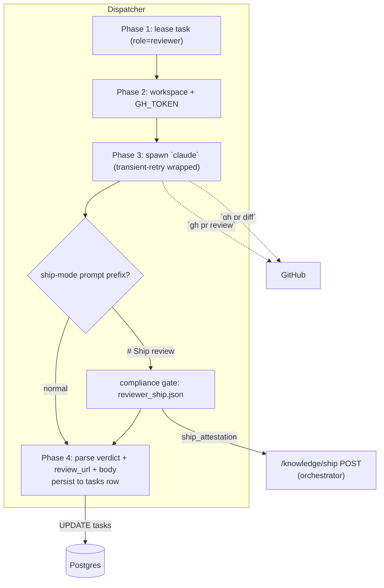

# Reviewer Worker

## What it is

The Reviewer worker is the first automated gate between a developer's
PR and a human-facing merge decision. Given a `role=reviewer` task
carrying a PR URL, it spawns a `claude` CLI subprocess that
`gh pr diff`s the PR, loads the project's conventions / ADRs /
designs from the knowledge API, and submits a grounded `approve` or
`request-changes` verdict via `gh pr review`. In ship-mode it also
emits a structured `ship_attestation` payload that drives the
ship-gate panel and the orchestrator's `/knowledge/ship` POST.

Decoupling the reviewer from the PM was decided in
ADR [0007](../../../adrs/0007-reviewer-separated-from-pm.md).

## Architecture

### Parts

- **`workers/reviewer.py::run_reviewer_task`** — subprocess runner.
  Builds workspace, applies `GH_TOKEN` via the shared
  `_github_env.apply_github_token_env` helper, and spawns `claude`.
  System prompt is assembled per
  [0057-role-prompt-knowledge-layout](./role-prompt-knowledge-layout.md):
  `common_preamble` + `roles/reviewer/role.md` +
  `roles/reviewer/tasks/review.md`. Mode is hardcoded to
  `"review"`.
- **Result parsers — `parse_claude_json_envelope`,
  `parse_review_verdict`, `parse_review_url`** in the dispatcher.
  Phase 4 writes `tasks.review_verdict` (`"approve"` |
  `"request_changes"`), `tasks.review_url` (GitHub review
  permalink), and `tasks.review_body` (full prose verdict).
- **Compliance gate (ship-mode and non-ship)** —
  `workers/_compliance.py::resolve_schema_name` routes by mode.
  Ship-mode (prompt prefix `"# Ship review"`) loads
  `workers/schemas/reviewer_ship.json`; non-ship reviewer runs
  load `workers/schemas/reviewer.json`. Both paths run
  `validate_and_retry`. The ship-mode schema requires `verdict`,
  `review_url`, and a `ship_attestation` block pairing every AC
  of the shipping WIP with either a target `active/`
  artifact + section or an explicit drop reason. The non-ship
  reviewer schema requires `verdict`, `review_url`,
  `security_findings` (array), and `performance_findings`
  (array) — finding objects carry
  `{category, severity: critical|high|medium|low|info, file, line?, description}`.
  A schema-level `if/then` rejects `verdict: "approve"` when any
  `security_findings` entry carries `severity: "critical"`. The
  gate re-prompts up to `worker_output_compliance_budget`;
  budget exhaustion lands `failure_kind="schema"` with the raw
  output in `raw_output_held`. ADR
  [0039](../../../adrs/0039-enable-compliance-gate-for-normal-reviewer-runs-over-free-text-verdict-protocol.md)
  documents why the gate now covers normal runs.
- **Transient retry** — same wrapper as the developer worker; ADR
  [0013](../../../adrs/0013-worker-level-transient-retry.md).
- **Dispatcher registration.** `_RUNNERS["reviewer"] =
  run_reviewer_task` alongside the other roles.
- **Findings persistence.** After the compliance gate passes, the
  dispatcher reviewer branch JSON-parses `result.result` and writes
  `len(security_findings)` to `tasks.security_finding_count` and
  `len(performance_findings)` to `tasks.performance_finding_count`
  (both nullable INTEGER columns, added by a single ADR-0021
  deprecate-then-remove migration). Pre-existing reviewer rows keep
  `NULL`; the admin panel chips render only when non-null. Each
  finding posts to GitHub as an inline `[security][{severity}]` or
  `[performance]` PR comment on the offending line, distinct from
  convention comments.
- **Admin chips (`coder-admin`).** `TaskDetail.tsx` renders
  `SecurityFindingsChip` and `PerformanceFindingsChip` alongside
  the verdict chip for `role=reviewer` tasks. Zero counts render
  green; any non-zero security count renders amber (critical
  findings would have already forced `request-changes`). Behind
  `VITE_REVIEWER_FINDINGS_ENABLED`.

### Data flow

1. Developer worker emits a PR; orchestrator creates a
   `role=reviewer` task carrying the PR URL.
2. Reviewer worker spawns `claude`, which loads project
   conventions / ADRs / designs from the knowledge API and runs
   `gh pr diff <url>`.
3. Claude submits a grounded review via `gh pr review` (approve or
   request-changes with inline comments citing specific
   conventions / ADRs).
4. Phase 4 parses the envelope and persists `review_verdict`,
   `review_url`, `review_body` to the task row.
5. **Approve path:** orchestrator transitions the task to
   `accepted`; the merge gate (ship-mode) or human reviewer takes
   over.
6. **Request-changes path:** orchestrator dispatches a fresh
   `role=developer` task with the verdict body as the
   `fix_context` prefix.

### Invariants

- **Verdict is structural, not advisory.** The reviewer must submit
  a formal `approve` or `request_changes` via `gh pr review` — a
  comment-only response is treated as a missing verdict.
- **Reviews are grounded.** Comments cite specific
  conventions / ADRs / designs from the knowledge API rather than
  generic style notes.
- **Ship-mode requires AC-level coverage.** In ship-mode, every AC
  of the shipping WIP must map to either a destination
  artifact + section or an explicit drop reason; an `approve` that
  fails this rule is rejected by the schema, not by a reviewer.
- **Critical security findings block approve.** The non-ship
  schema's `if/then` clause rejects `verdict: "approve"` when any
  `security_findings` entry has `severity: "critical"` — the
  schema, not the reviewer, enforces AC3 of spec 0094.
- **Workspace cleanup is unconditional.** Same `try/finally`
  pattern as the developer worker.

## Interfaces

- **Task API:** `role=reviewer`, prompt carries a PR URL and a
  ship-mode header (`"# Ship review"`) when applicable.
- **Writes:** `tasks.review_verdict`, `tasks.review_url`,
  `tasks.review_body`, `tasks.transient_retry_history`,
  `task_logs` rows.
- **GitHub:** review submitted via `gh pr review`; inline comments
  posted on the PR.
- **Knowledge:** reads conventions / ADRs / designs via the
  knowledge API.
- **Ship-mode envelope:** `ship_attestation` payload feeds the
  admin ship-gate panel and is the orchestrator's request body for
  `POST /knowledge/ship`.
- **System prompt path:** `system/roles/reviewer/role.md` +
  `system/roles/reviewer/tasks/review.md` (per [design 0057](./role-prompt-knowledge-layout.md)).

## Evolution

- 0009 — `workers/reviewer.py`, `review_verdict` and `review_url`
  columns (migration 0009), knowledge-grounded reviews; first live
  review caught a real convention violation.
- 0027 — transient-failure retry around the claude spawn.
- 0044 — ship-mode reviewer schema (`reviewer_ship.json`) with
  required `ship_attestation`; gated through the spec 0025
  `validate_and_retry` compliance loop. Non-ship reviews unchanged.
- 0055 — `GH_TOKEN` injection routed through the shared
  `_github_env.apply_github_token_env` helper.
- [design 0057](./role-prompt-knowledge-layout.md) — prompt assembly
  from common preamble + role + task-mode files; mode hardcoded to
  `"review"` for this worker.
- 0094 — Structured security and performance analysis pass on
  every reviewer run; `reviewer.json` schema with critical-blocks-approve
  `if/then` clause; `security_finding_count` /
  `performance_finding_count` columns; admin chips in
  TaskDetail. ADR 0039 turns the compliance gate on for normal
  reviewer runs.

## Links

- Specs: [reviewer-worker](../../../product-specs/active/reviewer-worker.md),
  [task-orchestration](../../../product-specs/active/task-orchestration.md)
- Designs: [worker-roles](../worker-roles.md),
  [worker-communication](../pipeline/worker-communication.md),
  [developer-worker](./developer-worker.md),
  [knowledge-write-api](../knowledge/knowledge-write-api.md)
- ADRs: [0007](../../../adrs/0007-reviewer-separated-from-pm.md),
  [0013](../../../adrs/0013-worker-level-transient-retry.md),
  [0039](../../../adrs/0039-enable-compliance-gate-for-normal-reviewer-runs-over-free-text-verdict-protocol.md)
- Services: `coder-core`, `coder-admin`
