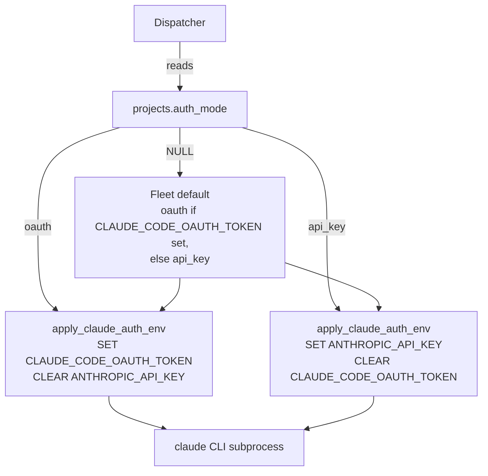

# Worker auth env wiring

## What it is

Each worker subprocess shells out to the `claude` CLI and needs exactly
one credential. The dispatcher resolves which credential per-task from
`projects.auth_mode` (falling back to a fleet default), and the
env-setup helper writes one credential into the child env while
**explicitly clearing the other**. The clear is load-bearing: the
`claude` CLI prefers `ANTHROPIC_API_KEY` whenever present, so a stale
key from the parent env would silently defeat OAuth dispatch.

## Architecture

### Parts

- `apply_claude_auth_env` — mutates a child-env dict to set one credential and pop the other; falls back to `~/.claude` state when neither is configured (dev workstation only).
- `apply_github_token_env` — sibling for the GitHub installation token; used by all roles so `gh` commands authenticate without manual login.
- `_build_workspace` (in dispatcher) — plumbs the GitHub token into the workspace `.netrc`, never onto a command line.
- `scripts/verify_oauth_auth_mode.py` — three-scenario verifier (OAuth task, API-key task, no creds).

### Data flow

Dispatcher reads `projects.auth_mode` → resolves to `oauth` or `api_key`
(fleet default if NULL). Builds `WorkerInput` carrying the auth mode +
both credentials. Worker calls `apply_claude_auth_env(env, ...)` before
spawn. CLI subprocess inherits exactly one credential.

### Invariants

- Exactly one credential is set in the child env, the other is explicitly popped. Never both present (CLI ambiguity); never both absent in fleet mode (`~/.claude` fallback is dev-only).
- `projects.auth_mode = NULL` means "use fleet default" — operators don't touch it unless overriding per-project.
- GitHub token is set separately via `apply_github_token_env`; never passed on a `git` command line (uses `.netrc`).

## Interfaces

| Auth mode | Set | Cleared |
|---|---|---|
| `oauth` | `CLAUDE_CODE_OAUTH_TOKEN` | `ANTHROPIC_API_KEY` |
| `api_key` | `ANTHROPIC_API_KEY` | `CLAUDE_CODE_OAUTH_TOKEN` |
| (neither configured) | (both cleared) | — |

## Where in code

- `src/coder_core/workers/_auth_env.py` — `apply_claude_auth_env` (resolve mode → set one credential, clear other)
- `src/coder_core/workers/_github_env.py` — `apply_github_token_env` (sibling for GitHub token)
- `src/coder_core/workers/dispatcher.py` — `_build_workspace` (workspace config + token plumbing)
- `scripts/verify_oauth_auth_mode.py` — three-scenario verifier

## Evolution

- Spec 0055: per-project credentials via the broker.
- 2026-02 fix: explicit-clear rule landed after CLI silently used a stale `ANTHROPIC_API_KEY` from the parent env in an OAuth-mode dispatch.

## Links

- Specs: worker-roles
- Designs: worker-roles, worker-communication
- Repos: coder-core
