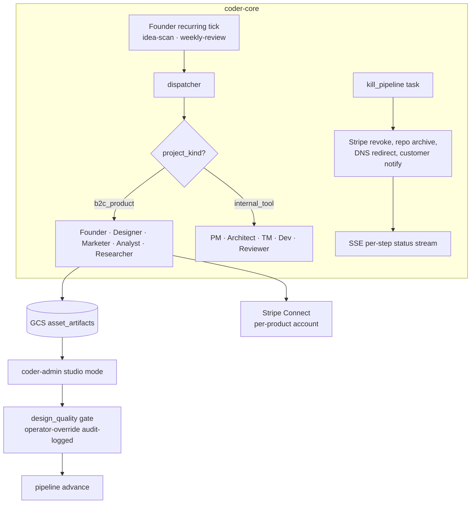

# Studio Architecture

## Context

The Studio is a B2C product portfolio built and operated by the Coder agent fleet — five new role workers (Founder, Designer, Marketer, Analyst, Researcher) and five integrations (Stripe Connect, PostHog, Resend, Replicate, Cloudflare DNS) extending the existing system. Four non-obvious architectural decisions constrain the shape; each is documented in ADRs 0032–0035.

## Goals / non-goals

**Goals:** `project_kind = b2c_product` on coder-core; Founder recurring job; Designer launch-gate (`design_quality`); `asset_artifact` type stored in GCS; `kill_pipeline` cascade task; studio mode in coder-admin; per-product Stripe Connect per ADR 0009.

**Non-goals:** separate Studio service or SPA; native mobile apps; social-platform distribution automation.

## Design

### Components

**`project_kind` column** on `projects` (new migration, default `internal_tool`). The dispatcher reads `worker_eligibility` from the roles registry — each role lists the `project_kind` values it serves. No code branch; a table lookup.

**Founder recurring job** (`coder-core-founder-tick`, Cloud Scheduler). Two modes: `idea-scan` (score candidates, emit `create-product` task to PM) and `weekly-review` (portfolio pulse, flag kill-threshold products). State in `founder_job_runs` table (`status ∈ running | succeeded | failed | paused`). Operator pauses via `POST /v1/admin/founder-job/pause`, which emits an audit event. Retry: 3 attempts exponential backoff; on permanent failure pages via stuck-pipeline-slack-paging. Overlap guard: new tick skips if a prior run row is still `running`, logging `skipped_reason = already_running`.

**Designer launch-gate** (`design_quality`) — new `pipeline_gate_type` enum value. Pipeline halts at `blocked` until the Designer passes or fails. `gate_fail` returns the pipeline to the responsible worker with specific remediation notes. Operator override: `POST /v1/projects/{id}/gates/{gate_id}/override` requires `{reason}`; emits audit event and increments `operator_override_count` on the product row.

**`asset_artifact` type** — new artifact type (`storage_backend = gcs`, path `gs://coder-studio-assets/{project_id}/{artifact_id}`). Workers upload via Workload Identity; coder-core stores the GCS URI. Admin panel renders an `AssetGallery` via `GET /v1/projects/{id}/artifacts?type=asset_artifact` returning signed URLs.

**`kill_pipeline` task** — fixed cascade: (1) Stripe Connect account deactivated, (2) source repos archived, (3) Cloudflare DNS redirected to `{slug}.studio.coder.dev/sunset`, (4) paying customers emailed via Resend. Each step writes a `kill_step_event` row and emits SSE (`kill_pipeline:{task_id}:step:{n}`). Steps are idempotent; operator can resume from the last failed step via the admin panel.

**Per-product Stripe Connect** — one connected account per `b2c_product` project, consistent with ADR 0009 per-project isolation. Account id stored in Secret Manager at `coder/{project_id}/stripe_connect_account_id`. Revenue pulled into `product_metrics` nightly; visible in the studio P&L dashboard.

### Edge cases

- **Designer gate before assets exist**: gate fires only after at least one `asset_artifact` exists; otherwise returns `gate_not_ready` and re-queues with a 10-minute delay.
- **`kill_pipeline` Stripe failure**: Stripe deactivation runs first — live traffic with no active Stripe account is the worst partial state. On failure no repos are archived; operator is paged and can resume from step 1.
- **GCS delete on kill**: `kill_pipeline` applies a 30-day GCS lifecycle rule on the bucket prefix rather than immediate delete, to preserve assets for post-mortem review.
- **`project_kind` filter on fleet queries**: all admin-panel endpoints that list projects must include `project_kind` in the index to avoid full-table scans as the fleet grows.

## Rollout

1. **Flag** `STUDIO_ENABLED=false`; gate all `b2c_product` dispatcher routing and studio-mode UI behind it.
2. **Migrations** (`project_kind`, `asset_artifacts`, `kill_step_events`, `founder_job_runs`) applied to prod with flag off.
3. **Founder job** deployed with `paused = true`; operator enables after 3 internal dogfood cycles confirm judgment quality.
4. **Designer gate** deployed in `log_only` mode for the first product; flips to `blocking` once pass/fail rate is calibrated.
5. **Kill workflow** smoke-tested against a throwaway product before Phase C.

## Links

- ADRs: 0032, 0033, 0034, 0035
- Designs: system-overview, worker-roles, worker-dispatch-durability, audit-log, stuck-pipeline-slack-paging
- Charter: `system/STUDIO_CHARTER.md` · Roadmap: `system/STUDIO_ROADMAP.md`
