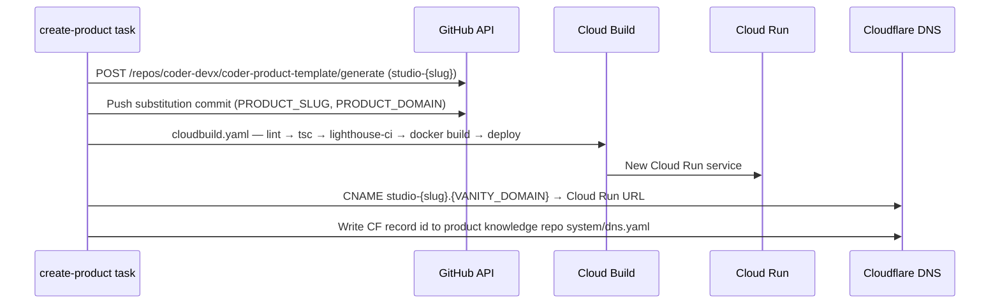

# Coder Product Template Repo Contract

## Context

`create-product` (spec 0077 AC3) emits a PM draft task with `repo = studio-{slug}` but has nowhere to scaffold from. This design defines the engineering contract for `coder-product-template`: repo layout, integration wiring, CI gates, deployment shape, and how already-instantiated products receive template updates (ADR 0036).

## Goals / non-goals

**Goals:** full page contract (8 routes), Lighthouse LCP < 2 s enforced in CI, Stripe/PostHog/Resend wiring with graceful degradation, `theme.config.ts` visual-identity isolation, end-to-end `create-product` bootstrap including Cloudflare DNS registration.

**Non-goals:** Founder orchestration (spec 0077); product-specific content; Designer worker (Phase B); `coder-product-template` registration in `system/repos.yaml` (a separate PR once the repo exists).

## Design



### Repo layout

```
theme.config.ts                       # primaryColor/secondaryColor/accentColor; fontPair; heroIllustrationSlot
app/
  layout.tsx                          # PostHog init; DNT + EU-region guard; "built by Coder" footer
  page.tsx                            # /
  pricing/page.tsx                    # /pricing
  checkout/page.tsx                   # /checkout → Stripe hosted redirect or 503
  success/page.tsx                    # /success
  sunset/page.tsx                     # /sunset
  contact/page.tsx                    # /contact (Resend form)
  legal/{privacy,terms}/page.tsx      # static; no client JS; no PostHog bundle
  api/contact/route.ts                # 5 req/min/IP sliding-window → 429
  api/internal/stripe-status/route.ts # { state: live | pending | disconnected }
lib/analytics.ts                      # frozen events: signup, activate, checkout_start, checkout_complete
cloudbuild.yaml                       # lint → tsc → lighthouse-ci (LCP<2000ms, runs:3) → deploy
lighthouserc.json / Dockerfile
```

### Integration wiring

**Stripe Connect.** Reads `STRIPE_CONNECT_ACCOUNT_ID` (Cloud Run env; Secret Manager `coder/{project_id}/stripe_connect_account_id`) at request time. Absent → `/checkout` returns HTTP 503 "Checkout is being configured". `/api/stripe/webhook` verifies `Stripe-Signature` against `STRIPE_WEBHOOK_SECRET` (`coder/{project_id}/stripe_webhook_secret`). Both secrets mounted as Cloud Run env vars at deploy time.

**PostHog.** `POSTHOG_PROJECT_API_KEY` inits the SDK in `app/layout.tsx`. `POSTHOG_EU_COMPLIANCE=true` overrides SDK host to `eu.i.posthog.com` (EU cloud region, no event-buffering change). `/legal/*` excludes the PostHog bundle entirely (Next.js static generation + CSP). All tracking calls go through `lib/analytics.ts`; direct SDK calls banned by ESLint rule.

**Resend.** `RESEND_API_KEY` + `PRODUCT_DOMAIN` (substituted at instantiation). `/api/contact` sends `from: noreply@{PRODUCT_DOMAIN}`. In-process sliding-window counter caps at 5 req/min/IP; excess returns HTTP 429.

### Edge cases

- **Lighthouse cold-start:** `numberOfRuns: 3`, median LCP is the gate verdict; warmup URL ping precedes each run to avoid cold-start spikes artificially failing the gate.
- **DNS propagation:** `create-product` polls `dig {slug}.{VANITY_DOMAIN} CNAME` at 10 s intervals (60-attempt max) before reporting success; timeout fails the task with `failure_reason: dns_propagation_timeout` — Cloud Run service remains deployed.
- **Template vars missing:** bootstrap validates all required vars before touching files; missing var → non-zero exit, task fails with `failure_reason: missing_template_vars`.
- **Stripe webhook replay:** `checkout_events.stripe_payment_intent_id` carries a UNIQUE constraint; Stripe retries are idempotent.

## Rollout

1. Operator creates `coder-devx/coder-product-template` as a GitHub template repository (one-time manual action).
2. Developer task: implement pages, integrations, CI, Dockerfile per this contract; add repo to `system/repos.yaml` in the same PR.
3. Smoke-test instantiation against throwaway `studio-test-0001`; verify spec 0079 AC1–AC7.
4. On green smoke test, `create-product` pipeline is unblocked and Phase A can close.

## Links

- Spec: [0079 — coder-product-template repo contract](../../product-specs/wip/0079-coder-studio-coder-product-template-repo-contract.md)
- Parent design: [0075 — Studio Architecture](../wip/0075-studio-architecture.md)
- ADR: 0036 — Template version sync strategy
- Charter: `system/STUDIO_CHARTER.md` · Roadmap: `system/STUDIO_ROADMAP.md`
