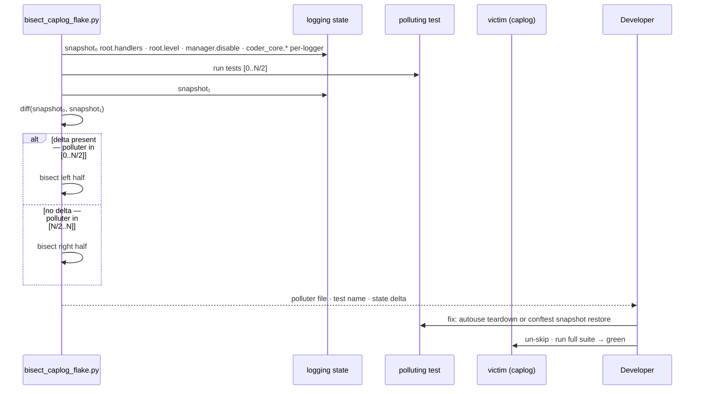

# 0091 — Caplog inter-test pollution: bisect, fix, and harness regression

## Context

Four pytest tests in `coder-core` fail deterministically in the full suite but pass in isolation. All four use `caplog.at_level()` or `caplog.set_level()` to assert log records; under full-suite ordering, `caplog.records` is empty even though the application code emits the expected line (verified via print shims). PR #252 applied `pytest.mark.skip` as a hotfix to unblock the 2026-05-13 prod-recovery deploy. This design specifies the real fix: bisect the polluter, eliminate the root cause, add a regression tripwire.

The four skipped tests:
- `tests/test_auto_approve_api.py::test_plan_create_shadow_mode_logs_but_writes_no_row`
- `tests/test_broker.py::test_local_broker_issue_records_audit_log`
- `tests/test_workers.py::test_parse_review_verdict_heuristic_fires_warning`
- `tests/workers/test_dispatcher_preloads.py::test_preload_index_skips_on_404_and_logs`

Known negatives: no `logging.disable()` calls in the codebase; adding a propagate-reset autouse fixture (in #252) did not fix the flake — so the leak is not in the `propagate` flag.

## Goals / non-goals

**Goals:** Identify the polluting test or fixture; restore all four tests with the root cause fixed; add a regression test; document the failure mode.

**Non-goals:** Switching caplog to stdout assertions; adding `pytest-rerunfailures`; splitting the test suite by directory.

## Design



### Bisect script (`scripts/bisect_caplog_flake.py`)

A standalone script invoked as `uv run python scripts/bisect_caplog_flake.py --victim <test-id>`. Per bisect step:

1. **Snapshot** — records `logging.root.handlers` (type + id + level), `logging.root.level`, `logging.root.manager.disable`, and per-logger `(level, propagate, handler_ids)` for every `coder_core.*` entry in `logging.Logger.manager.loggerDict`.
2. **Subprocess run** — collects ordered test IDs via `pytest --collect-only -q`, runs the candidate range in a subprocess, re-snapshots after.
3. **Diff and recurse** — if any field changed, bisects the left half; otherwise the right half. Terminates when the candidate range is one test.

Output format: `polluter: <file>::<test> | delta: root.level 20→30, coder_core.workers.reviewer.propagate True→False`.

The script is permanent infrastructure under `scripts/`; future caplog flakes reuse it without re-derivation.

### Root-cause fix (two ranked paths)

**Preferred — source fix**: once the bisect names the polluter, add an `autouse` fixture in that test file (or a narrow teardown call) that restores the specific mutated state after the test. Zero overhead outside the affected file.

**Fallback — conftest snapshot**: if the polluter is in a third-party import path or spans multiple fixtures, add an autouse fixture to `tests/conftest.py`:

```python
@pytest.fixture(autouse=True)
def _restore_logging_state() -> Iterator[None]:
    snap = _snap_logging()  # root handlers, levels, disable, coder_core.* propagate
    yield
    _restore_logging(snap)
```

If the conftest snapshot approach is used, remove the existing `_reset_coder_core_log_propagation` fixture (it becomes a subset of the broader restore).

### Regression test (`tests/test_caplog_harness.py`)

A new test file (added in the same PR as the fix) that:
1. Directly applies the identified polluting state mutation.
2. Asserts `caplog.records` still captures log records correctly across that mutation.
3. Fails immediately if a future change re-introduces the leak — before any of the four originally-skipped tests would break.

## Edge cases

- **Multi-polluter**: if binary search can't isolate to one test (two tests together cause the leak), the bisect reports both and the conftest snapshot fix is the correct path.
- **Third-party import-time side effect**: a library that calls `logging.basicConfig()` or `logging.disable()` on import mutates state at collection time, not at test-run time. The bisect detects this via a pre-collection snapshot; the conftest snapshot handles it at runtime.
- **Concurrent dispatches**: not applicable — tests run serially (`pytest-xdist` not in use), so pollution is deterministically intra-process ordering.

## Rollout

1. **Bisect** (local): run `scripts/bisect_caplog_flake.py --victim tests/test_broker.py::test_local_broker_issue_records_audit_log` on `main`; obtain the polluter report (AC1).
2. **Fix**: apply source or conftest fix; run `uv run pytest tests/` with all four skip markers removed; verify zero failures (AC2).
3. **Regression test**: add `tests/test_caplog_harness.py` in the same PR as step 2 (AC3).
4. **Unskip**: remove the four `pytest.mark.skip` markers from PR #252 and delete the corresponding entries in `tests/SKIPPED.yml` (AC4). CI must pass before merge.

## Links

- Spec: [0091](../../product-specs/wip/0091-conftest-log-pollution-root-cause.md)
- Hotfix: [coder-core#252](https://github.com/coder-devx/coder-core/pull/252) — the test-skip PR this design replaces
- Related spec: [0090](../../product-specs/wip/0090-deploy-chain-resilience-to-test-flake.md) — deploy-chain CI resilience (the other half of the 2026-05-13 incident)
- ADR [0011](../../adrs/0011-orphan-dispatch-reaper.md) — context on the in-process serialisation guarantee (no xdist)
