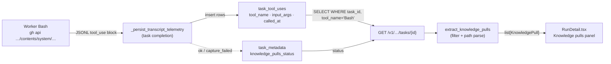

# Worker knowledge-pull visibility

## What it does today

After a task completes, the admin panel task detail page surfaces a "Knowledge pulls" panel listing every knowledge-repo content fetch the worker made during execution — no transcript download required. Pulls are derived at query time from the existing `task_tool_uses` table by filtering `Bash` calls whose `input_args` match the `repos/*/contents/system/` knowledge-repo URL pattern. `GET /v1/projects/{id}/tasks/{task_id}` includes a `knowledge_pulls` array so automated grounding audits need no transcript. A `knowledge_pulls_status` key in `task_metadata` distinguishes "zero fetches" (status `ok`, empty list) from "capture failed" (status `capture_failed`) from "pre-feature task" (key absent).

## Architecture

### Parts

- **`knowledge_pull_extractor.py`** — pure function `extract_knowledge_pulls(rows: list[TaskToolUseRow]) -> list[KnowledgePull]`; matches `input_args` against regex `repos/[^/]+/[^/]+/contents/system/`; maps path prefix to `artifact_type` (`design` | `spec` | `adr` | `other`); extracts artifact id from filename; deduplicates by path keeping earliest `fetched_at`.
- **`task_metadata["knowledge_pulls_status"]`** — string key stamped in `_persist_transcript_telemetry`'s try/except block: `"ok"` on success, `"capture_failed"` on exception; absent for pre-feature tasks.
- **`KnowledgePull`** — Pydantic model `{path: str, artifact_type: str, artifact_id: str | None, fetched_at: datetime | None}`; added to `TaskRead` as `knowledge_pulls: list[KnowledgePull] | None`.
- **`GET /v1/projects/{id}/tasks/{task_id}`** — reads `knowledge_pulls_status` from `task_metadata`; when present, joins `task_tool_uses` on `task_id` and calls `extract_knowledge_pulls`; populates `knowledge_pulls` (null when key absent, i.e. pre-feature).
- **"Knowledge pulls" panel (`RunDetail.tsx`)** — rendered below stage timeline when `knowledge_pulls !== null`; `artifact_type` in `{design, spec, adr}` → in-app link to Registry artifact detail; `other` → plain-text path; empty list → "None fetched" notice; `knowledge_pulls_status == "capture_failed"` → "Capture unavailable for this task" notice.

### Data flow

Workers fetch knowledge-repo artifacts via `gh api repos/{org}/{kr}/contents/system/…`. The Claude CLI JSONL transcript records each invocation as a `type=tool_use` block with `tool_name="Bash"`. On task completion, `_persist_transcript_telemetry` writes `task_tool_uses` rows (existing path, no change). A sibling call in the same try/except stamps `task_metadata["knowledge_pulls_status"] = "ok"` (or `"capture_failed"` on exception). At task detail read time the API filters `task_tool_uses` for Bash rows matching the knowledge-repo pattern and returns the extracted, deduplicated list.

### Invariants

- Extraction is fail-open: exceptions in the status-stamp path set `"capture_failed"` and are caught; the task's own `status` and `result` are never affected (AC5).
- Pattern `repos/[^/]+/[^/]+/contents/system/` safely excludes source-repo reads (`src/`, `migrations/`, `tests/` path prefixes are never under `system/`).
- `input_args` is stored truncated to 4 096 bytes; a `gh api` command for a knowledge-repo path is under 200 bytes — truncation never clips a fetch.
- Deduplication by path (earliest `fetched_at`) is applied in the extractor output only; raw `task_tool_uses` rows are never modified.
- Pre-feature tasks (no `knowledge_pulls_status` key) → `knowledge_pulls: null` in the API response → no panel in the UI; no retroactive backfill (non-goal).

## Interfaces

| Surface | Change |
|---|---|
| `GET /v1/projects/{id}/tasks/{task_id}` | `knowledge_pulls: [{path, artifact_type, artifact_id, fetched_at}] \| null` added to `TaskRead` |
| `task_metadata` JSON column | New string key `knowledge_pulls_status`: `"ok"` \| `"capture_failed"` (absent = pre-feature) |
| `task_tool_uses` | Read-only; no schema change |
| `RunDetail.tsx` | "Knowledge pulls" panel below stage timeline; entries link into Registry artifact detail page |

## Where in code

- `src/coder_core/workers/dispatcher.py` — `_persist_transcript_telemetry` (stamp `knowledge_pulls_status` in try/except)
- `src/coder_core/workers/knowledge_pull_extractor.py` — `extract_knowledge_pulls` (pure filter + parse function)
- `src/coder_core/domain/task.py` — `TaskRead` (add `knowledge_pulls` and `KnowledgePull` model)
- `src/coder_core/domain/task_tool_use.py` — `TaskToolUseRow` (source rows for extraction)
- `coder-admin/src/pages/RunDetail.tsx` — "Knowledge pulls" panel

## Evolution

Builds on `task_tool_uses` telemetry introduced by the observability / compliance gate work (specs 0025, 0027). ADR 0041 records the query-time derivation decision over pre-store alternatives.

## Links

- Spec: [0097](../../../product-specs/wip/0097-worker-knowledge-pull-visibility-on-task-detail.md)
- ADRs: [ADR 0041](../../../adrs/0041-knowledge-pulls-query-time-derivation.md)
- Designs: [worker-communication](./worker-communication.md), [task-lifecycle](./task-lifecycle.md), [observability-and-cost-tracking](./observability-and-cost-tracking.md), [admin-panel](../knowledge/admin-panel.md)
- Repos: `coder-core`, `coder-admin`
