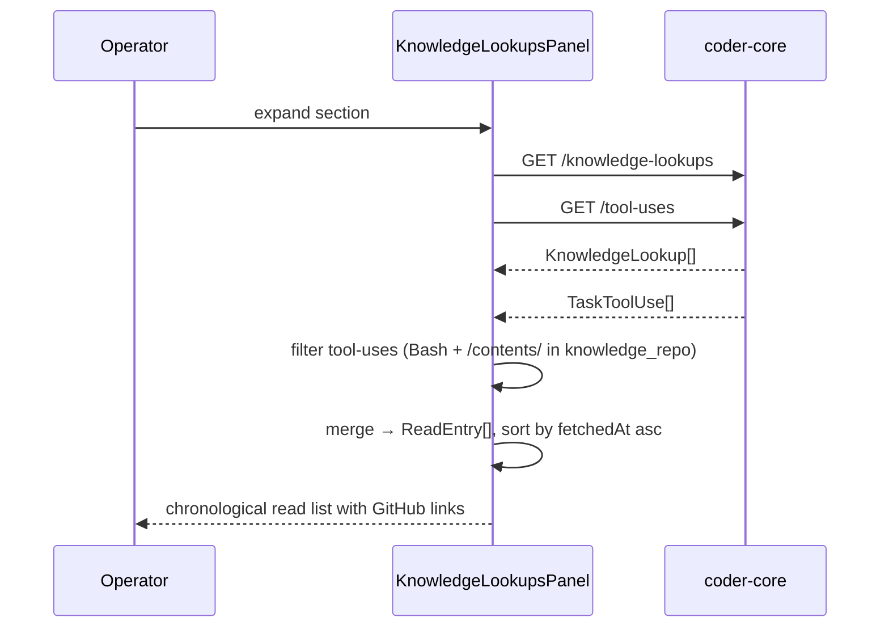

# Task Knowledge Reads Panel

## What it does today

`KnowledgeLookupsPanel` in `TaskDetail.tsx` surfaces every knowledge-repo artifact a worker fetched during a task run, directly on the task detail page (`/projects/:id/pipeline/:taskId`). It merges two coder-core data sources — `GET /{task_id}/knowledge-lookups` (reads through the KnowledgeService) and `GET /{task_id}/tool-uses` (filtered client-side to Bash calls whose command targets the project's knowledge repo `/contents/` path) — into a single list sorted chronologically by fetch time. Each row shows the artifact path as a GitHub deep link, the fetch timestamp, and a source badge (`KnowledgeService` or `Direct Bash`). The panel collapses by default and lazy-loads both fetches in parallel on first expand.

## Architecture

### Parts

- **`KnowledgeLookupsPanel`** (`src/pages/TaskDetail.tsx`) — collapse-on-load React panel receiving `project` (for `knowledge_repo`), `taskId`; fires two parallel fetches on first expand; merges results into `ReadEntry[]`.
- **`getTaskKnowledgeLookups`** (`src/api/client.ts`) — `GET /{task_id}/knowledge-lookups`; returns `KnowledgeLookup[]` with `path`, `cache_hit`, `bytes_read`, `looked_up_at`, `ref`.
- **`getTaskToolUses`** (`src/api/client.ts`) — `GET /{task_id}/tool-uses`; returns all `TaskToolUse[]`; panel filters for `tool_name === "Bash"` and `input_args.command` containing `repos/{knowledge_repo}/contents/`.
- **`extractBashContentsPath`** (local helper in `TaskDetail.tsx`) — parses the repo-relative path from a Bash command string matching `repos/{org}/{repo}/contents/{path}`; returns `null` on parse failure so the row is silently dropped.
- **`buildKnowledgeGitHubUrl`** (local helper in `TaskDetail.tsx`) — constructs `https://github.com/{project.knowledge_repo}/blob/{ref}/{path}`; uses `main` as fallback ref for Direct Bash rows that carry no `ref` field.

### Data flow

On first expand, `KnowledgeLookupsPanel` issues `Promise.all([getTaskKnowledgeLookups, getTaskToolUses])`. KnowledgeService rows project directly to `ReadEntry` with `source: "KnowledgeService"`, `fetchedAt: looked_up_at`, and `ref` from the row. Tool-use rows are filtered to `tool_name === "Bash"` with a command containing `repos/{project.knowledge_repo}/contents/`; `extractBashContentsPath` extracts the path; `fetchedAt` comes from `called_at`. Both sets merge into one `ReadEntry[]` sorted ascending by `fetchedAt`; the panel renders the result with `buildKnowledgeGitHubUrl` per row.

### Invariants

- **Zero merged entries after a successful fetch** → renders `"No knowledge reads recorded."` (AC3; never hidden or absent).
- **Legacy task** (zero KnowledgeService rows AND `task.completed_at` predates the `knowledge_lookups` migration, migration revision `0025`) → renders `"Reads not available for this task"` instead of the empty-state message; does not suppress Direct Bash rows if any exist.
- **`extractBashContentsPath` returns null** → that tool-use row is silently omitted; no error surfaced to the operator.
- **Panel fires fetches exactly once** — guarded by `lookups !== null` check; re-expanding after collapse does not re-fetch.
- **Each path link** is an `<a href={...} target="_blank" rel="noreferrer">` so keyboard navigation and screen readers work and the JWT never travels to GitHub.

## Interfaces

| Surface | Effect |
|---|---|
| `GET /v1/projects/{id}/tasks/{task_id}/knowledge-lookups` | Returns KnowledgeService artifact reads for the task |
| `GET /v1/projects/{id}/tasks/{task_id}/tool-uses` | Returns all tool calls; panel filters to Bash + `/contents/` |
| `KnowledgeLookupsPanel` in `TaskDetail.tsx` | Renders the Knowledge reads section; receives `project` prop for `knowledge_repo` and GitHub link construction |

## Where in code

- `src/pages/TaskDetail.tsx` — `KnowledgeLookupsPanel` (two-fetch merge, ReadEntry list render)
- `src/pages/TaskDetail.tsx` — `extractBashContentsPath` (parses repo-relative path from Bash command string)
- `src/pages/TaskDetail.tsx` — `buildKnowledgeGitHubUrl` (constructs GitHub blob URL from knowledge_repo + ref + path)
- `src/api/client.ts` — `getTaskKnowledgeLookups`, `getTaskToolUses`, `KnowledgeLookup`, `TaskToolUse` (API fetchers and wire types)

## Evolution

- spec 0097 shipped the `knowledge_lookups` table (migration 0025) and the bare `KnowledgeLookupsPanel` stub with cache-hit badges.
- 0098 closes AC2 (Direct Bash source), AC5 (GitHub links), timestamps, and the legacy-task notice.

## Links

- Spec: [0098-worker-knowledge-read-log-in-task-detail](../../../product-specs/wip/0098-worker-knowledge-read-log-in-task-detail.md)
- Design: [admin-panel](./admin-panel.md)
- Design: [knowledge-stack](./knowledge-stack.md)
- Repos: `coder-admin`, `coder-core`
