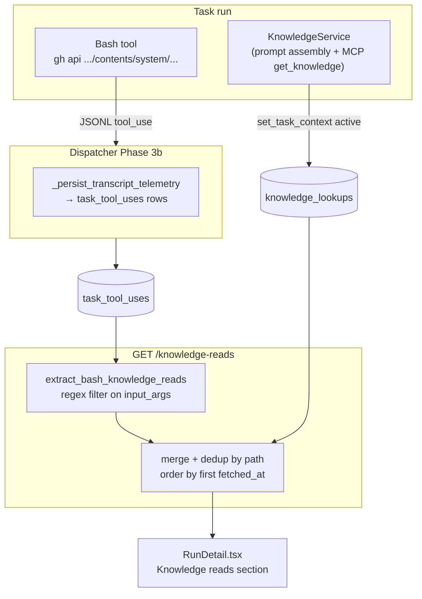

# Task Knowledge-Read Trace

## What it does today

After a task completes, `GET /v1/projects/{id}/tasks/{task_id}/knowledge-reads` returns the ordered, deduplicated list of knowledge-repo artifacts a worker fetched during that run. The list is assembled at query time from two existing stores: `knowledge_lookups` (rows written by `KnowledgeService` whenever it serves content within an active task context) and `task_tool_uses` (rows parsed from the session JSONL by `_persist_transcript_telemetry`, filtered to `Bash` calls whose `input_args` match the knowledge-repo `contents/system/` URL pattern). The admin panel task detail page surfaces the merged list inline on completed and failed tasks — no transcript download required. MCP `get_knowledge` calls are attributed to the requesting task when the caller supplies an `X-Task-Id` header; the MCP auth adapter threads it through `MCPCaller.task_id` so `KnowledgeService` writes a `knowledge_lookups` row under the right task.

## Architecture

### Parts

- **`GET /v1/projects/{id}/tasks/{task_id}/knowledge-reads`** — new handler in `api/tasks.py`; queries both `knowledge_lookups` and `task_tool_uses` scoped to `task_id + project_id`; returns 404 when the task doesn't belong to the requested project; merges into `KnowledgeReadEntry[]` deduplicated by path.
- **`KnowledgeReadEntry`** — Pydantic response model: `{path: str, fetched_at: datetime | None, source: Literal["service", "bash"]}`; `source` distinguishes `KnowledgeService` rows from Bash-extracted rows.
- **`extract_bash_knowledge_reads(rows: list[TaskToolUseRow]) -> list[KnowledgeReadEntry]`** — in `knowledge_pull_extractor.py`; filters `tool_name == "Bash"`, applies `re.search(r'repos/[^/]+/[^/]+/contents/(system/[^\s\'"]+)', input_args)`, deduplicates by path keeping earliest `called_at`, maps to `KnowledgeReadEntry(source="bash")`.
- **`MCPCaller.task_id: str | None`** — optional field added to the MCP auth dataclass; `resolve_caller` populates it from the `X-Task-Id` HTTP header when present.
- **`get_knowledge._handler`** — calls `set_task_context(caller.task_id, "mcp")` before delegating to `KnowledgeService.get_artifact` when `caller.task_id` is set; resets via `reset_task_context` in `finally`.
- **"Knowledge reads" section (`RunDetail.tsx`)** — fetches `GET /knowledge-reads` on task detail mount; shown only on `completed` and `failed` tasks; empty list renders `"No knowledge reads recorded."` (no spinner, no error state).

### Data flow

**Service reads:** `KnowledgeService.get_artifact` writes a `KnowledgeLookupRow` whenever `get_task_id()` returns non-null — i.e., during a worker subprocess run with `set_task_context` active, or from an MCP `get_knowledge` call whose caller carries `task_id`. These rows land in `knowledge_lookups` synchronously during the task run.

**Bash reads:** Workers call `gh api repos/{org}/{knowledge_repo}/contents/system/...` directly. The Claude CLI records each Bash invocation in the session JSONL; `_persist_transcript_telemetry` writes `TaskToolUseRow` records post-completion. The endpoint extracts knowledge paths at query time via regex over `input_args` (capped at 4 096 bytes — well above any `gh api` command length).

**Merge:** The handler fetches both sets, merges into a single list keyed on `path`, keeps the earliest `fetched_at` when a path appears in both sources, and sorts ascending by `fetched_at`.

### Invariants

- **Tenant isolation:** `project_id` is present on both source tables; the handler resolves the task's `project_id` and returns 404 if it doesn't match the URL's project id before querying either table (AC4).
- **Fail-open extraction:** `extract_bash_knowledge_reads` is wrapped in `try/except` in the handler; an extraction failure returns only `knowledge_lookups` rows with no 5xx.
- **Empty-list state:** tasks with zero knowledge reads return `[]` — not an error and not a missing section (AC3).
- **MCP unattributed reads:** when `X-Task-Id` is absent, `get_knowledge` runs without setting task context; those reads are invisible in the trace. This is expected — unbound MCP sessions have no task to attribute to.
- **Pattern scope:** `repos/[^/]+/[^/]+/contents/system/` safely excludes source-repo reads (`src/`, `migrations/`, `tests/` path prefixes never live under `system/`).

## Interfaces

| Surface | Effect |
|---|---|
| `GET /v1/projects/{id}/tasks/{task_id}/knowledge-reads` | `200 [{path, fetched_at, source}]` ordered by `fetched_at`; `404` task not in project |
| `MCPCaller.task_id` | Optional `str | None` from `X-Task-Id` header; absent for non-task MCP callers |
| `get_knowledge._handler` | Sets/resets task context around `KnowledgeService` call when `caller.task_id` is present |
| "Knowledge reads" section | Renders on `completed` / `failed` tasks in `RunDetail.tsx`; empty list shows notice |

## Where in code

- `src/coder_core/api/tasks.py` — `list_task_knowledge_reads` (new handler at `/{task_id}/knowledge-reads`)
- `src/coder_core/workers/knowledge_pull_extractor.py` — `extract_bash_knowledge_reads` (new function; regex filter over `TaskToolUseRow.input_args`)
- `src/coder_core/mcp/auth.py` — `MCPCaller` (add `task_id: str | None`; populate from `X-Task-Id` in `resolve_caller`)
- `src/coder_core/mcp/tools/get_knowledge.py` — `_handler` (add `set_task_context` / `reset_task_context` around `service.get_artifact`)
- `src/coder_core/observability.py` — `set_task_context`, `get_task_id` (existing; no change needed)
- `coder-admin/src/pages/RunDetail.tsx` — "Knowledge reads" section fetch + render

## Evolution

Specs 0097–0100 drove knowledge-read visibility in fragments (query-time Bash extraction, panel prototype, routing chips). Design 0101 consolidates into one endpoint and closes the MCP attribution gap via `X-Task-Id`.

## Links

- Spec: [0101](../../../product-specs/wip/0101-task-knowledge-read-trace.md)
- Designs: [admin-panel](./admin-panel.md), [knowledge-stack](./knowledge-stack.md), [mcp-agent-interface-design](./mcp-agent-interface-design.md), [task-lifecycle](../pipeline/task-lifecycle.md)
- Repos: coder-core, coder-admin
