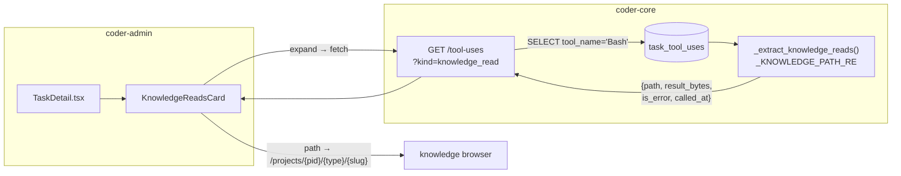

# Knowledge-read trace on task detail

## What it does today

The knowledge-read trace surfaces every direct `gh api` knowledge-repo fetch made by a worker during a task, inline on the admin-panel task detail page. When a task completes, a collapsible "Knowledge reads" card calls `GET /v1/projects/{id}/tasks/{tid}/tool-uses?kind=knowledge_read`, which filters `task_tool_uses` rows for Bash calls whose `input_args` command matches the `coder-system/contents/system/` path pattern, extracts the artifact path via regex, and returns `{path, result_bytes, is_error, called_at}` per row. Each path that resolves to a known artifact type and slug renders as a deep-link into the knowledge browser; the card shows an OK/ERR badge per fetch and "No reads recorded" when empty.

This is distinct from the existing `KnowledgeLookupsPanel`, which reads `knowledge_lookups` (reads via coder-core's `KnowledgeService` cached layer). This card reads from `task_tool_uses` — raw Bash invocations parsed from the JSONL transcript. Together they give complete grounding coverage: service-layer reads and direct-CLI reads.

## Architecture

### Parts

- **`KnowledgeReadRead` read-model** (`domain/task_tool_use.py`) — Pydantic model with `path: str`, `result_bytes: int | None`, `is_error: bool | None`, `called_at: datetime | None`. Returned only when `kind=knowledge_read`.
- **`_KNOWLEDGE_PATH_RE`** (`domain/task_tool_use.py`) — compiled regex `r'gh api ["\']?repos/[^/]+/[^/]+/contents/(system/[^\s\'"\|&>]+)'` that extracts the `system/…` portion from a Bash command string.
- **`list_task_tool_uses` extension** (`api/tasks.py`) — adds `kind: str | None = Query(None)` param; when `kind='knowledge_read'`, queries rows with `tool_name='Bash'`, applies `_extract_knowledge_reads()`, returns `list[KnowledgeReadRead]`. Unknown `kind` values return HTTP 422. Absent `kind` preserves existing `list[TaskToolUseRead]` behaviour unchanged.
- **`KnowledgeRead` type + `getTaskKnowledgeReads()`** (`coder-admin/src/api/client.ts`) — TypeScript interface `{path, result_bytes, is_error, called_at}` and fetch wrapper appending `?kind=knowledge_read`.
- **`KnowledgeReadsCard`** (`coder-admin/src/pages/TaskDetail.tsx`) — collapsible panel following the `KnowledgeLookupsPanel` pattern: lazy-load on first expand, count badge in header, empty-state "No reads recorded", per-row path + `result_bytes` as `Nk` + OK/ERR/? badge + `called_at`. Paths matching `system/(designs|product-specs|adrs)/[^/]+/(.+)\.md` render as `<Link>` to `/projects/{pid}/{type}/{slug}`.

### Data flow

1. Worker task completes; `transcript_parser.py` writes one `task_tool_uses` row per tool invocation, including every Bash call that ran `gh api repos/*/coder-system/contents/system/*`.
2. Operator expands the "Knowledge reads" card; `getTaskKnowledgeReads(projectId, taskId)` calls `GET /tool-uses?kind=knowledge_read`.
3. Endpoint queries `task_tool_uses WHERE tool_name='Bash' AND task_id=?`, iterates rows: parses `input_args` JSON → extracts `command` field → applies `_KNOWLEDGE_PATH_RE` → yields `KnowledgeReadRead` for each match. Non-matching and unparseable rows are silently skipped.
4. Card renders in call order (ascending `turn_index`). Paths rooted at `system/designs/active/…` or `system/product-specs/active/…` render as navigation links into the `Artifact` route.

### Invariants

- `kind` absent or unknown leaves existing `/tool-uses` response shape and behaviour unchanged.
- Path extraction is best-effort: truncated `input_args` (>4 KiB), malformed JSON, or commands with no matching URL are silently dropped — never a 500.
- Empty filtered result returns `[]` (HTTP 200); card renders "No reads recorded" rather than hiding (AC4).
- Tenant boundary: `_assert_task_in_tenant` runs before any query; a leaked cross-tenant task id is indistinguishable from not-found.
- Tasks dispatched before this feature ships have no matching rows; card shows empty state.
- The same path fetched multiple times in one task generates one row per fetch — all shown, preserving the call sequence.
- `is_error=null` (unpaired `tool_result` in transcript) renders the badge as "?" not OK or ERR.

## Interfaces

| Surface | Effect |
|---|---|
| `GET /v1/projects/{id}/tasks/{tid}/tool-uses?kind=knowledge_read` | Returns `[{path, result_bytes, is_error, called_at}]` extracted from `task_tool_uses` Bash rows |
| `GET /v1/projects/{id}/tasks/{tid}/tool-uses` (no `kind`) | Unchanged — returns `list[TaskToolUseRead]` |
| Admin `TaskDetail` page | New `KnowledgeReadsCard` rendered below the existing `KnowledgeLookupsPanel` |
| Deep-link `/projects/{pid}/{type}/{slug}` | Routes to `Artifact` component for designs, product-specs, and adrs |

## Where in code

- `src/coder_core/domain/task_tool_use.py` — `TaskToolUseRow` (source table; add `KnowledgeReadRead`, `_KNOWLEDGE_PATH_RE`, `_extract_knowledge_reads`)
- `src/coder_core/api/tasks.py` — `list_task_tool_uses` (add `kind` query param; branch to path-filtered response)
- `src/coder_admin/src/api/client.ts` — `getTaskKnowledgeLookups` (pattern for new `getTaskKnowledgeReads` + `KnowledgeRead` type)
- `src/coder_admin/src/pages/TaskDetail.tsx` — `KnowledgeLookupsPanel` (pattern for new `KnowledgeReadsCard`)

## Evolution

- Specs 0099–0101 established `knowledge_lookups` + `KnowledgeLookupsPanel` (KnowledgeService-layer reads); this design adds `task_tool_uses` Bash-layer reads on the same page.
- The `kind=` query param is the extension point for a future `kind=source_repo_read` (deferred per spec 0102 open question).

## Links

- Spec: [0102](../../../product-specs/wip/0102-knowledge-read-trace-on-task-detail.md)
- Designs: [admin-panel](./admin-panel.md), [observability-and-cost-tracking](../pipeline/observability-and-cost-tracking.md)
- Repos: `coder-core`, `coder-admin`
