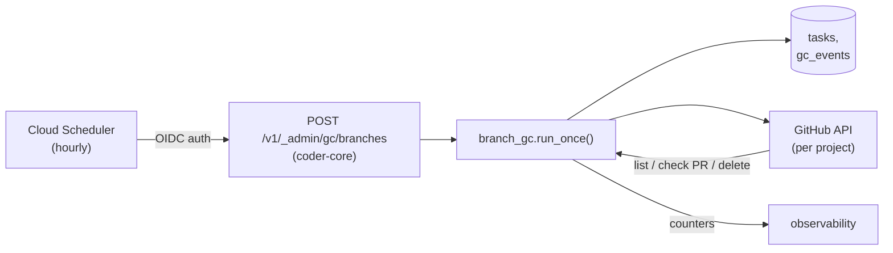

# Branch cleanup GC job

## Context

Every developer-worker dispatch pushes a `task/<task_id>` branch. A
PR is opened, reviewed, merged, rejected, or abandoned. GitHub's
"auto-delete merged branches" handles the happy path, but everything
else leaks: failures, timeouts, rejected PRs, PRs closed without merge.
After ~30 days of dog-fooding we have ~hundreds of stale branches across
`coder-core` and `vibetrade-app`. The spec calls for automated cleanup
within 24h of eligibility, with strong safety guards.

## Goals / non-goals

**Goals**
- Hourly GC pass that deletes eligible `task/*` branches across all
  managed projects without human involvement.
- Multi-layer safety (name prefix, age, task state, PR state).
- Audit trail queryable per project per branch.
- Observable via the existing `observability` surface (counters,
  Slack alerts on failures).

**Non-goals**
- Cleaning up merged `task/*` branches (GitHub does that for us once
  the repo has the setting enabled — onboarding runbook already
  flips it).
- Any UI in `coder-admin`. Operators read logs + metrics.
- A new worker role. See "Worker role vs. cron" below.

## Design



### Worker role vs. cron — decision

**Decision: Cloud Scheduler cron → `coder-core` admin endpoint.**
No new worker role.

Rationale:
- The task is stateless enumeration + idempotent deletes. There is no
  prompt, no LLM, no transcript. A worker-role harness adds cost
  (dispatcher lease, token broker round-trip, `claude` subprocess)
  with zero benefit.
- `coder-core` already holds per-project GitHub App credentials and
  the `tasks` table; the GC job needs both. Running in-process keeps
  the query path short and avoids cross-service auth.
- A new worker role costs a Terraform SA, an entry in `roles.yaml`, a
  `capability_matrix` change, and dispatcher plumbing. For a 200-line
  job that's overkill.

If a future policy makes GC LLM-driven (e.g., "judge whether to keep
a stale branch based on PR comments"), promote it to a worker role.
Until then: cron.

### Parts

**1. `branch_name` column on `tasks` (migration 0019)**

```sql
ALTER TABLE tasks ADD COLUMN branch_name text;
CREATE INDEX ix_tasks_branch_name ON tasks (project_id, branch_name)
  WHERE branch_name IS NOT NULL;
```

Populated by the developer worker after a successful `git push`
(parsed from the push output — already captured in the transcript).
Null for roles that don't push. Not derived from `task_id` because
Claude occasionally renames the branch (e.g., conflict resolution),
and we'd miss those on enumeration.

**2. `gc_events` table (migration 0019)**

```sql
CREATE TABLE gc_events (
  id           uuid primary key default gen_random_uuid(),
  run_id       uuid not null,
  project_id   text not null,
  branch_name  text not null,
  task_id      uuid,            -- null if orphaned
  action       text not null,   -- 'deleted' | 'skipped' | 'error'
  reason       text,            -- e.g. 'open_pr', 'too_young', 'not_terminal'
  error        text,            -- populated when action='error'
  created_at   timestamptz not null default now()
);
CREATE INDEX ix_gc_events_project_run ON gc_events (project_id, run_id, created_at);
```

Every candidate branch produces exactly one row per GC pass. `run_id`
groups a pass for forensics. `action='skipped'` rows let an operator
answer "why didn't this branch get deleted?" without re-running.

**3. `branch_gc` module**

`src/coder_core/ops/branch_gc.py`:
- `run_once(dry_run: bool = False) -> GcRunSummary` — main entry point.
- Iterates projects with `gc_enabled = true`.
- For each project, lists `task/*` branches via `GitHubClient.list_branches(prefix="task/")`.
- For each branch, applies the eligibility pipeline (see below).
- Writes one `gc_events` row per candidate.
- Returns aggregate counts; caller logs them.

**4. `GET /v1/_admin/gc/branches` + `POST` admin endpoints**

- `POST /v1/_admin/gc/branches` — trigger a run. Body: `{"dry_run": bool}`.
  Auth: Cloud Scheduler OIDC (service account allow-listed). Returns
  `run_id` and aggregate counts.
- `GET /v1/_admin/gc/branches/runs?project_id=...&limit=...` — list
  recent runs (operator debugging).
- `GET /v1/_admin/gc/branches/runs/{run_id}` — per-branch outcomes.

Not in the per-project router (these span projects). Lives under
`/_admin/` to signal no tenant scoping.

**5. `projects.gc_enabled` column (same migration)**

```sql
ALTER TABLE projects ADD COLUMN gc_enabled boolean NOT NULL DEFAULT true;
```

Default true. `coder project onboard` keeps it true; incident runbook
documents how to flip it off per project during investigations.

**6. Cloud Scheduler job**

Terraform adds a job per `coder-core` env calling the admin endpoint
hourly with OIDC auth. `infra/terraform/branch_gc.tf`. Dry-run in the
staging env only for the first 48h after deploy (env var flip).

### Data flow — eligibility pipeline

For each `task/*` branch in a project:

1. **Name guard.** Must match `^task/` exactly. Anything else is
   skipped with `reason='name_mismatch'` (defence in depth — we
   enumerate with prefix but double-check).
2. **Age.** `branch.commit.committed_date < now - 24h`. Younger
   branches are `skipped reason='too_young'`.
3. **Task lookup.** Find the task with matching `(project_id, branch_name)`.
   - If none: check branch age > 7d. If yes, proceed with
     `task_id = null`. If no, `skipped reason='orphan_young'`.
   - If found: task must be in `{accepted, failed, timed_out, rejected}`.
     Otherwise `skipped reason='not_terminal'`.
4. **PR check.** `GitHubClient.list_prs(head=branch_name, state='open')`.
   If any open PR, `skipped reason='open_pr'`.
5. **Delete.** `GitHubClient.delete_branch(branch_name)`.
   - Success → `action='deleted'`.
   - GitHub 422 "branch not found" → treat as success (idempotent).
   - Other errors → `action='error'`, log, continue.

Dry-run flips step 5 to log-only while still writing `gc_events` rows
with `action='skipped' reason='dry_run'`.

### Invariants

- A branch is never deleted while any PR (open or draft) references it.
- A branch is never deleted within 24h of its last commit.
- A GC pass with 10 failures still deletes the 90 eligible branches
  (per-branch try/except, not a bulk transaction).
- `gc_events` has exactly one row per (run_id, project_id, branch_name).
- Concurrent runs are idempotent: deleting an already-deleted branch
  produces `action='deleted'` (via the 422 mapping) with no duplicate
  row because of the run_id key in the index.

## Interfaces

- **REST (admin-scoped)**
  - `POST /v1/_admin/gc/branches` — trigger (Cloud Scheduler)
  - `GET /v1/_admin/gc/branches/runs`
  - `GET /v1/_admin/gc/branches/runs/{run_id}`
- **Metrics** (Prometheus via `observability`)
  - `gc_branches_candidates_total{project}`
  - `gc_branches_deleted_total{project}`
  - `gc_branches_skipped_total{project, reason}`
  - `gc_branches_errors_total{project}`
  - `gc_branches_false_delete_total` (guardrail — should always be 0)
- **Slack alert** via the existing observability webhook when
  `gc_branches_errors_total` for a project exceeds 5 per run OR
  `gc_branches_false_delete_total` is non-zero.

## Open questions

- Should orphan-branch grace be per-project-configurable? Starting with
  hard-coded 7d; revisit if a project needs a different window.
- Rate limiting — GitHub allows 5k req/h per installation; at one
  `list_prs` call per candidate, a 200-branch project uses 200 calls
  per GC pass (1/200 of budget). Fine. Flag for revisit if we hit
  >500 candidates per pass per project.

## Rollout

1. **Migration 0019** — `branch_name`, `gc_events`, `projects.gc_enabled`.
   Backfill `branch_name` for the last 30 days of tasks by parsing
   stored transcripts (one-shot script in `scripts/backfill_branch_names.py`).
2. **Developer worker** writes `branch_name` on push (new code path,
   guarded by a feature flag for one release cycle).
3. **`branch_gc` module + admin endpoints** land behind
   `BRANCH_GC_ENABLED=false`.
4. **Staging soak.** Enable with `BRANCH_GC_DRY_RUN=true` for 48h.
   Operators inspect `gc_events` and confirm no surprise candidates.
5. **Staging live.** Flip dry-run off. Verify deletion rate and zero
   false deletes for 72h.
6. **Production.** Enable in `prod`. Cloud Scheduler job starts.
7. **Runbook.** Publish `runbooks/branch-gc.md` covering: per-project
   disable, one-off dry-run, forced delete, triage when a PR's branch
   went missing.

## Links

- Spec: [`../../product-specs/wip/0023-branch-cleanup-gc.md`](../../product-specs/wip/0023-branch-cleanup-gc.md)
- Active components extended: [`developer-worker`](../../product-specs/active/developer-worker.md),
  [`task-orchestration`](../../product-specs/active/task-orchestration.md),
  [`observability`](../../product-specs/active/observability.md)
- Relevant ADRs: 0005 (multi-tenant coder-core), 0006 (per-role service
  accounts — confirms why GC is *not* a worker role)
