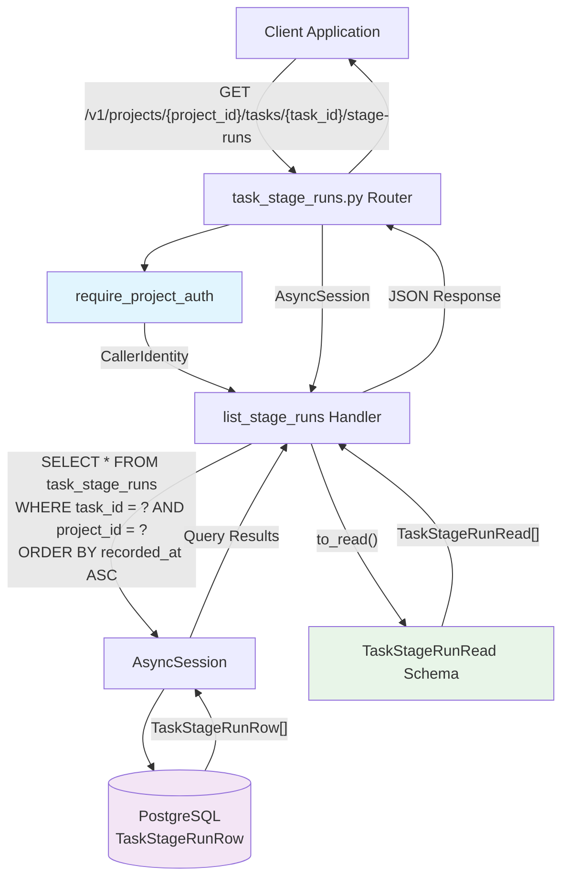

# Task Stage Runs API Endpoint

## Context

The TaskStageRunRow table was introduced in migration 0018 to archive historical stage execution data for debugging purposes. While the live TaskRow shows only the current stage state, TaskStageRunRow preserves complete execution history with metadata like tokens consumed, execution time, and artifacts produced.

Currently, this archived data has no API endpoint, limiting its utility for debugging failed pipelines, analyzing execution patterns, and providing operational visibility into task stage transitions.

## Goals / non-goals

**Goals:**
- Expose TaskStageRunRow data via REST API following established project patterns
- Enable chronological debugging of task stage execution history  
- Provide filtering capabilities by stage and status for targeted analysis
- Maintain strict multi-tenant security with cross-tenant access protection
- Include comprehensive integration test coverage

**Non-goals:**
- Admin UI or frontend components
- Real-time updates or server-sent events
- Advanced pagination beyond simple limit-based queries
- Schema modifications to existing TaskStageRunRow or TaskStageRunRead
- Performance optimizations beyond existing database indexing

## Design



### Components

**New Component: `/app/src/coder_core/api/task_stage_runs.py`**
- FastAPI router with single GET endpoint
- Follows established patterns from `task_messages.py` and `task_logs.py`
- Imports: `TaskStageRunRow`, `TaskStageRunRead`, `to_read()` from domain layer
- Uses standard dependency injection: `CallerDep`, `SessionDep`

**Modified Component: `/app/src/coder_core/main.py`**
- Register new router: `app.include_router(task_stage_runs_api.router)`
- Add import: `from coder_core.api import task_stage_runs as task_stage_runs_api`

**Existing Components (leveraged):**
- `TaskStageRunRow` ORM model with composite index `(task_id, recorded_at)`
- `TaskStageRunRead` Pydantic schema (currently marked "TBD" for API usage)
- `to_read()` conversion function
- `require_project_auth` dependency for multi-tenant security
- `get_session` dependency for database access

### Data flow

1. **Request Processing:**
   - Client sends GET request with path params `project_id`, `task_id`
   - Optional query params: `limit` (1-500, default 100), `stage`, `status`
   - FastAPI validates path/query parameter types

2. **Authentication & Authorization:**
   - `require_project_auth` validates API key/JWT token
   - Returns `CallerIdentity` with authenticated project context
   - Multi-tenant isolation enforced by matching `caller.project.id`

3. **Database Query:**
   - Base query: `WHERE task_id = ? AND project_id = ?` (tenant isolation)
   - Optional filters applied: `WHERE stage = ?`, `WHERE status = ?`
   - Ordering: `ORDER BY recorded_at ASC` (chronological history)
   - Limit applied: `LIMIT ?` (max 500 rows)
   - Leverages existing index: `ix_task_stage_runs_task_recorded`

4. **Response Transformation:**
   - Convert ORM rows to DTOs using `to_read()` function
   - Return `list[TaskStageRunRead]` as JSON
   - Empty list `[]` returned for tasks with no stage runs (not 404)

### Edge cases

**Cross-tenant access attempt:**
- Task exists but belongs to different project → 404 Not Found
- Prevents information leakage about task existence across tenants

**Invalid query parameters:**
- `limit < 1` or `limit > 500` → 422 Unprocessable Entity  
- Invalid `stage` enum value → 422 Unprocessable Entity
- Invalid `status` enum value → 422 Unprocessable Entity

**Task not found:**
- Non-existent `task_id` → 404 Not Found
- Same error response as cross-tenant access (security)

**Empty result set:**
- Task exists but has no stage runs → 200 OK with `[]`
- Distinguishes "no data" from "no access"

**Large result sets:**
- Bounded by `limit` parameter (max 500)
- Efficient due to existing composite database index

## Implementation Details

**Endpoint Signature:**
```python
@router.get("/", response_model=list[TaskStageRunRead])
async def list_stage_runs(
    task_id: str,
    caller: CallerDep,
    session: SessionDep,
    limit: int = Query(100, ge=1, le=500),
    stage: Optional[str] = Query(None),
    status: Optional[str] = Query(None),
) -> list[TaskStageRunRead]:
```

**Query Construction Pattern:**
```python
stmt = select(TaskStageRunRow).where(
    TaskStageRunRow.task_id == task_id,
    TaskStageRunRow.project_id == caller.project.id,
)
if stage is not None:
    stmt = stmt.where(TaskStageRunRow.stage == stage)
if status is not None:
    stmt = stmt.where(TaskStageRunRow.status == status)
stmt = stmt.order_by(TaskStageRunRow.recorded_at.asc()).limit(limit)
```

**Error Response Format:**
```python
raise HTTPException(
    status_code=status.HTTP_422_UNPROCESSABLE_ENTITY,
    detail={
        "code": "invalid_limit", 
        "message": "limit must be between 1 and 500"
    }
)
```

## Open questions

None - all implementation details are clear from existing codebase patterns and available infrastructure.

## Rollout

**Phase 1: Implementation**
1. Create `/app/src/coder_core/api/task_stage_runs.py` following `task_messages.py` pattern
2. Register router in `main.py`
3. Update `TaskStageRunRead` docstring to reference new API endpoint

**Phase 2: Testing**
1. Create `/app/tests/integration/test_task_stage_runs_api.py`
2. Test all acceptance criteria from spec
3. Focus on cross-tenant security validation
4. Validate query parameter edge cases

**Phase 3: Deployment**
1. Standard deployment through existing CI/CD pipeline
2. No database migrations required (schema already exists)
3. No configuration changes required
4. Backward compatible (additive API change)

**Rollback Plan:**
- Remove router registration from `main.py`
- Delete `/app/src/coder_core/api/task_stage_runs.py`
- No data or schema changes to rollback

## Links

- **Spec 0024**: Task Stage Runs API specification
- **Migration 0018**: TaskStageRunRow table creation
- **Reference Implementation**: `/app/src/coder_core/api/task_messages.py` (similar patterns)
- **Domain Model**: `/app/src/coder_core/domain/task_stage_run.py` (existing schemas)
- **Auth Patterns**: `/app/src/coder_core/auth.py` (`require_project_auth`)
- **Database Index**: `ix_task_stage_runs_task_recorded` composite index
