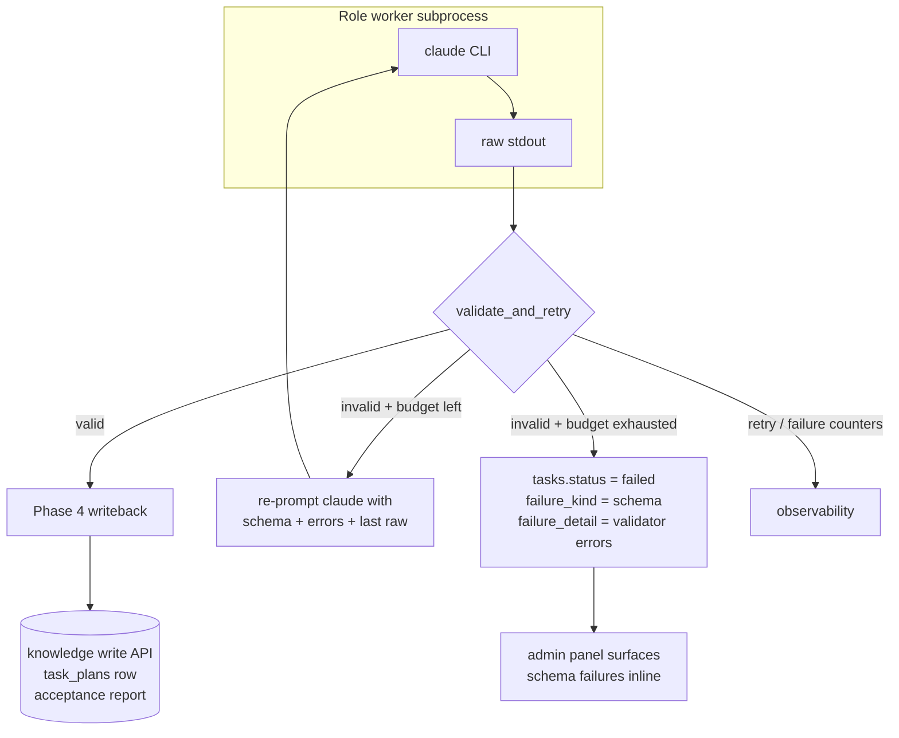

# Worker output compliance

## Context

PM (draft + accept), Architect, and Team Manager workers each shell out
to `claude` and expect a JSON payload back. Today the dispatcher's
Phase 4 writeback trusts the payload: it `json.loads` the stdout, pulls
the expected keys, and starts writing — knowledge files, `task_plans`
rows, ADRs, commits. When the model returns a preamble, wraps the JSON
in a fence, or ships a semantically-broken object (missing
`acceptance_criteria`, malformed Mermaid block, non-kebab slugs, etc.),
the failure lands *after* some side effect is already on disk or in
the database. The operator then reconciles by hand.

Worker output compliance introduces a pre-side-effect validation
stage: every worker declares a JSON schema for its output, the
dispatcher validates before writing anything, and malformed output is
corrected by re-prompting the model rather than by programmatic
repair. See [ADR 0012](../../adrs/0012-re-prompt-only-worker-output-remediation.md)
for the rationale on "re-prompt only, no auto-repair".

## Goals / non-goals

- **Goals**
  - A single `validate_and_retry` path used by all structured-output
    workers, with per-worker schemas.
  - Zero side effects on schema-failed runs (no partial files, no
    orphan DB rows, no stray commits).
  - Re-prompt up to a configurable budget; give up with a structured
    failure reason.
  - Metrics surface which worker/schema is drifting, not just a total
    failure count.
- **Non-goals**
  - Validating the *developer* worker's code output. Handled by the
    reviewer role, not schema.
  - Repairing malformed JSON in-process (fence strip, trailing-comma
    fix, etc.). ADR 0012 rules that out.
  - Cross-run schema migration. Schemas are versioned per-task and
    only one version is in flight per task.

## Design

### Parts

- `src/coder_core/workers/schemas/` — one JSON Schema per worker
  output shape (`pm_draft.json`, `pm_accept.json`, `architect.json`,
  `team_manager.json`). Version stamped in the schema's
  `$id`; task row captures which version produced the output
  (`tasks.output_schema_version`).
- `src/coder_core/workers/_compliance.py` —
  `validate_and_retry(raw_text: str, schema: Schema, prompt_ctx:
  PromptCtx) -> ValidatedOutput | SchemaFailure`. Pure function of
  inputs; no I/O beyond the claude re-prompt.
- `src/coder_core/workers/{pm,architect,team_manager}.py` — each
  worker loads its schema(s) and routes output through the helper
  before returning to the dispatcher. Phase 4 writeback only runs on
  the `ValidatedOutput` path.
- `migrations/versions/0020_worker_output_compliance.py` — adds
  `tasks.failure_kind TEXT NULL`, `tasks.failure_detail JSONB NULL`,
  `tasks.output_schema_version TEXT NULL`, and an index on
  `(failure_kind, created_at)` for admin queries.
- `src/coder_core/api/tasks.py` — task detail response gains
  `failure_kind` + `failure_detail` fields (null on success).
- `coder-admin/src/routes/tasks/[id]/+page.svelte` — renders the
  failure detail panel for `failure_kind === "schema"`: raw snippet
  (truncated to 4 KB), validator error list, link to the worker's
  schema file on GitHub.
- `src/coder_core/ops/metrics.py` — exposes
  `worker_schema_failures_total{worker,schema_version,error_kind}`
  and `worker_schema_retries_total{worker,outcome}` counters.

### Data flow

1. Dispatcher invokes `workers.<role>.run(task)`.
2. Worker builds the prompt, shells out to `claude`, captures stdout.
3. Worker calls `validate_and_retry(raw, schema, prompt_ctx)`:
   - Strip the known benign wrapper (trailing whitespace, final
     newline). **Do not** strip fences or repair commas — ADR 0012.
   - `jsonschema.validate(parsed, schema)`.
   - On success: increment `retries_total{outcome=success}` if we're
     past attempt 0, return `ValidatedOutput(parsed, version)`.
   - On failure with budget remaining: increment
     `retries_total{outcome=retry}`, construct the re-prompt (see
     "Re-prompt shape"), recurse with `attempt += 1`.
   - On failure with budget exhausted: increment
     `failures_total{...}`, return `SchemaFailure(errors, last_raw)`.
4. Dispatcher Phase 4:
   - `ValidatedOutput` → existing writeback (knowledge write, commit,
     pipeline chaining).
   - `SchemaFailure` → `tasks.status=failed`,
     `failure_kind="schema"`, `failure_detail={errors, last_raw,
     attempts}`. No knowledge write, no commit, no DB mutations
     outside the `tasks` row.
5. Admin panel polls `/v1/tasks/{id}`; schema-failed rows render the
   failure panel without requiring a log dive.

### Re-prompt shape

The re-prompt is sent as a new user turn to the same `claude`
invocation. It contains:

- A short preamble: "Your previous reply didn't match the required
  schema. Fix it and reply with ONLY the JSON object."
- The schema (inline, not a link — the model doesn't browse).
- The validator error list in the human-readable form produced by
  `jsonschema.Draft202012Validator.iter_errors`.
- The last raw output **verbatim** — the model needs to see its own
  mistake, not a paraphrase.

This is deliberately high-context and therefore expensive; the retry
budget default of 2 caps the blast radius. The retry-success-rate
metric tells us whether re-prompting is actually recovering work or
just burning tokens.

### Invariants

- A schema failure produces exactly one `tasks` row mutation (status
  + failure fields) and zero writes anywhere else — no knowledge
  file, no `task_plans` row, no commit, no outbound message.
- The schema version in `tasks.output_schema_version` is whatever
  version was loaded when the task started. If the schema file
  changes mid-flight, the in-flight task keeps validating against
  its original version. New tasks pick up the new version.
- Retries share the same subprocess and task row; they are not new
  dispatch attempts. The orphan reaper (ADR 0011) sees a single
  long-running task, not three quick ones.
- The retry budget is counted against the worker, not against the
  model call. A worker that fails validation, then fails the
  re-prompt, then the API 529s on the second re-prompt, has **not**
  consumed its budget on the 529 — that's 0027's territory.

### Edge cases

- **Empty stdout.** Treated as a schema failure with a synthetic
  "empty response" validator error. Counts toward the budget.
- **Valid JSON, wrong shape.** Standard path — validator errors
  feed the re-prompt.
- **JSON parse error.** Parse failure is also a schema failure (we
  don't distinguish "invalid JSON" from "valid JSON, wrong shape" at
  the worker level — both go through re-prompt).
- **Oversized output.** If the raw payload exceeds 256 KB we treat
  it as a schema failure with a `too_large` error kind; truncate to
  4 KB before storing in `failure_detail.last_raw`.
- **Schema loading failure.** A worker starting with an unreadable
  schema file fails the task immediately with
  `failure_kind="schema"`, `error_kind="schema_load"`. This should
  only happen via a bad deploy; the metric will spike loudly.

## Rollout

Single PR, behind `settings.worker_output_compliance_enabled`
(default `false` on merge, `true` after a 48h soak).

1. Ship migration + helper + schemas + worker wiring behind the flag.
   In flag-off mode the workers call the helper but ignore its
   verdict (shadow validation — we emit metrics but still write on
   failure). This gives us a real-world failure-rate signal before
   we start blocking writes.
2. After 48h of shadow data, flip the flag to `true`. Existing
   running tasks are unaffected (they don't re-enter the worker
   path). New tasks enforce validation.
3. Admin-panel failure-detail view ships in the same PR but is only
   visible when `failure_kind` is non-null, so it's a no-op until
   step 2.
4. Runbook entry: "a pipeline task failed with `failure_kind=schema`"
   — covers reading the `failure_detail`, deciding between (a)
   re-running (transient drift), (b) loosening the schema (genuine
   format evolution), (c) rewriting the prompt (chronic drift).

## Open questions

- **Which schema fields are strict vs. permissive?** The PM accept
  report is mostly prose with a strict `verdicts` array. Architect
  output has a strict frontmatter but a free-form body with only a
  "contains at least one mermaid fence" constraint. The schemas
  themselves encode this — listed here so reviewers check the
  strictness calls in the PR.
- **Retry budget per worker vs. global.** Starting global (`2`). If
  one worker is chronically flaky we might want a worker-specific
  override — add later if data supports it.
- **Truncation of `last_raw`.** 4 KB is enough to see the malformed
  boundary in practice, but pathological cases (a 200 KB response
  that drifts at the end) will hide the failure site. Revisit if
  operators complain.

## Links

- Spec: [wip/0025-worker-output-compliance](../../product-specs/wip/0025-worker-output-compliance.md)
- ADR: [0012 — re-prompt-only worker output remediation](../../adrs/0012-re-prompt-only-worker-output-remediation.md)
- Related designs: [pm-worker](../active/pm-worker.md),
  [architect-worker](../active/architect-worker.md),
  [team-manager-worker](../active/team-manager-worker.md),
  [worker-communication](../active/worker-communication.md)
