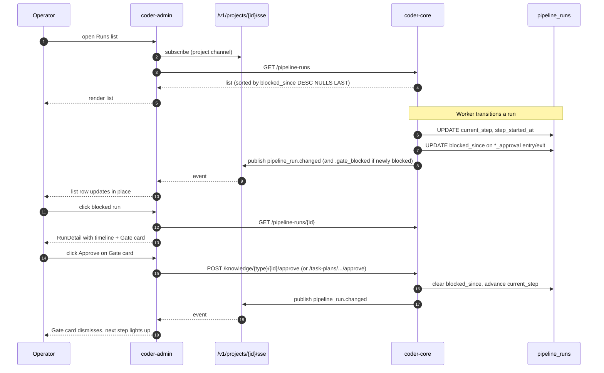

# Pipeline run dashboard — live timeline + inline gates

## Context

[`worker-communication`](../active/worker-communication.md) already
owns the `pipeline_runs` table and the SSE feed the admin panel
subscribes to. The existing `RunDetail.tsx` + `Runs.tsx` poll every
3 s, render the run's step as a string, and offer pause / resume /
cancel controls. What's missing is anything that lets an operator
skim a list of active runs and triage — which are blocked, on what
gate, for how long.

Spec 0026 fills that gap with three additions:

1. Two timestamp columns on the existing row so the dashboard can
   render without joining back to `task_stage_runs`.
2. A 7-day per-step median rollup so the timeline has a comparator.
3. Admin-panel work that replaces polling with SSE, adds an
   inline Gate card with the existing approve / reject endpoints,
   and sorts the list by blocked-longest-first.

Phase 5's admin-v2 (spec 0033) builds on this with cross-project
fan-in, knowledge-editor inline gates, and a command palette;
this design deliberately keeps its scope to the Phase 3 foundation.

## Goals / non-goals

- **Goals**
  - Single source of truth for "where is this run" — in-row
    timestamps, no joins for the common view.
  - Live updates via SSE; no polling in the default path.
  - Inline Gate card on `RunDetail`: one click to approve /
    reject / request-changes from the run view.
  - Sort-by-blocking as the default Runs list order.
- **Non-goals**
  - Cross-project fan-in (Phase 5, spec 0033).
  - Historical replay / stage-run archive browsing (spec 0024).
  - New gate types or new approval flows.
  - Rewriting the `pipeline_runs` row shape — columns only.

## Design

### Parts

- **Schema additions** (`migrations/versions/0028_pipeline_run_timing.py`)
  - `pipeline_runs.blocked_since TIMESTAMPTZ NULL` — set when the
    run enters a `*_approval` step; cleared on gate resolution
    (approve / reject / cancel / step progression out of the gate).
  - `pipeline_runs.step_started_at TIMESTAMPTZ NULL` — reset on
    every `current_step` transition. Used by the timeline's
    wall-clock tick so the dashboard doesn't need a per-second
    refetch.
  - Both nullable so existing rows remain valid; the populators
    below write them on every mutation going forward. A one-shot
    back-fill sets `step_started_at` from the most recent
    `task_stage_runs` entry per run.

- **`pipeline_step_stats` table** (`migrations/versions/0029_pipeline_step_stats.py`)
  - Columns: `project_id VARCHAR(40)`, `step VARCHAR(40)`,
    `median_duration_seconds INTEGER`,
    `p75_duration_seconds INTEGER` (future-proof),
    `sample_size INTEGER`,
    `computed_at TIMESTAMPTZ`.
  - Primary key `(project_id, step)`.
  - Populated nightly by a Cloud Scheduler job hitting
    `POST /v1/_admin/ops/step-stats/recompute` (admin auth).
    SQL: for each (project, step), take the median of
    `step_finished_at - step_started_at` over the last 7 days
    from `pipeline_run_transitions` (an audit view of
    `pipeline_runs` step changes; see data-flow below).

- **Step-stats API** (extends `src/coder_core/api/ops.py`)
  - `GET /v1/projects/{id}/ops/step-stats` — project-API-key
    auth; returns the rows for this project.
  - `POST /v1/_admin/ops/step-stats/recompute` — admin JWT;
    triggers the nightly rollup on demand (used by Cloud
    Scheduler and by operators after a backfill).

- **Pipeline-run writebacks** (extends
  `workers/pipeline_chain.py` and the orchestrator's step-
  transition path)
  - Every `current_step` mutation sets `step_started_at = now()`
    in the same UPDATE.
  - On entry into any `*_approval` step: `blocked_since = now()`.
  - On exit from any `*_approval` step (approved / rejected /
    cancelled): `blocked_since = NULL`.
  - Single SQL statement per transition — no race window.

- **SSE event extensions** (extends
  `src/coder_core/api/sse.py` + the publisher in
  `coder_core/events.py`)
  - New `event_type = "pipeline_run.changed"` carrying the full
    updated `PipelineRunRead`. Fires on every mutation.
  - New `event_type = "pipeline_run.gate_blocked"` carrying
    `{run_id, step, blocked_since}`. Fires only on entry into a
    `*_approval` step. Used by the admin list to flash a "new
    gate" indicator without a full re-render.
  - Both events are project-scoped — published to
    `/v1/projects/{id}/sse` only.

- **Admin — `RunDetail.tsx` rewrite**
  - Header: `PipelineRun` metadata (id, status, started_at,
    spec link).
  - New **Timeline strip** component: horizontal row of step
    pills (PM Draft → Architect → TM → PM Accept), each with
    - elapsed time bar (ticks every second when running, frozen
      on terminal states)
    - median-duration overlay as a light grey line across the
      bar; anomaly colouring (amber > 1.5× median, red > 2×)
    - status pill: waiting / running / done / blocked.
  - New **Gate card** (mounted when `blocked_since` is non-null):
    - Title: "Spec / Design / Plan approval needed".
    - Preview of the artifact (heading + ACs for specs, diff
      summary for designs, task list for plans).
    - Three buttons: Approve, Request changes (with a text
      area for the note), Reject.
    - Button handler dispatches to the right endpoint based on
      `current_step`.
  - Existing override controls (pause / resume / cancel) stay.
  - SSE subscription replaces polling: `useSSE(projectId)` hook
    filters `pipeline_run.changed` where
    `payload.id === runId` and updates local state.

- **Admin — `Runs.tsx` rewrite**
  - Default sort: `(blocked_since ASC NULLS LAST)` first, then
    `(started_at DESC)`. A "Chronological" toggle falls back to
    the current order.
  - Each row shows the current step, elapsed-step time, and a
    red "blocked for N min" badge when `blocked_since` is set.
  - SSE subscription — on `pipeline_run.changed` events, the
    list re-sorts and updates the specific row.
  - The existing 3-s poll is removed.

- **Backfill script**
  `scripts/backfill_pipeline_run_timing.py`
  - Reads the last `task_stage_runs` entry per `pipeline_run`
    and stamps `step_started_at`.
  - Sets `blocked_since` on any run currently in a `*_approval`
    step using the row's `updated_at` as a conservative
    estimate. Runs once as part of the rollout PR.

- **Runbook** `runbooks/pipeline-run-blocked.md` — five outcomes
  (approve / request-changes / reject / cancel run / escalate to
  PM worker for revision) mapped to the three `*_approval`
  step types.

### Data flow

**Run enters PM-draft approval gate.**

1. Orchestrator writes the PM-draft task outcome; the chain
   advances `current_step = "spec_approval"`.
2. Same UPDATE sets `step_started_at = now()` and
   `blocked_since = now()`.
3. Publisher fires `pipeline_run.changed` + `pipeline_run.gate_blocked`.
4. Admin list re-sorts the now-blocked run to the top; detail
   view (if open on this run) mounts the Gate card with the
   drafted spec's content.

**Operator approves inline.**

1. Click **Approve** on the Gate card → POST
   `/v1/projects/{pid}/knowledge/specs/{spec_id}/approve`.
2. Handler marks the spec `active`, advances the pipeline
   (existing chain hook). UPDATE clears `blocked_since`, sets
   `step_started_at = now()` for the next step, and writes the
   new `current_step`.
3. Publisher fires `pipeline_run.changed`.
4. Gate card dismisses; next step's pill lights up.

**Background rollup (nightly).**

1. Cloud Scheduler hits
   `POST /v1/_admin/ops/step-stats/recompute`.
2. Handler runs the SQL rollup over the last 7 days of
   step transitions, upserts `pipeline_step_stats`.
3. Admin `RunDetail` fetches the table on mount (once per
   session) to get comparator values.

### Invariants

- `step_started_at` is set on every write that changes
  `current_step`. A UPDATE that changes `status` or other
  fields without changing `current_step` must not touch
  `step_started_at` — same step, same clock.
- `blocked_since` is non-null iff `current_step` is in
  `{spec_approval, design_approval, plan_approval}`. Any other
  state with `blocked_since != NULL` is a bug.
- SSE publishes `pipeline_run.changed` exactly once per row
  mutation. Multiple writes in one handler must be batched so
  the subscriber sees one event, not three.
- The Gate card only ever calls one endpoint per button click;
  the "which endpoint" is decided from `current_step` at click
  time, not at mount time (so a step transition during a
  millisecond pause can't hit the wrong endpoint).
- Comparator thresholds (amber 1.5×, red 2× median) are config,
  not hardcoded — admin settings page exposes them.

### Edge cases

- **Empty history for a step.** `pipeline_step_stats` row
  missing → timeline doesn't render the comparator overlay;
  status pill still ticks. No error surfaced.
- **Run paused mid-step.** `status = "paused"` — timeline
  continues rendering but ticks freeze (via a `stopped_at`
  check on the payload). Resume sets `step_started_at` to
  `now()` minus the paused duration? First cut: step clock is
  wall-clock only, pauses don't rewind. Revisit if operators
  find it misleading.
- **Gate card on a run whose underlying artifact was deleted.**
  Possible if an operator hand-deleted a spec from the
  knowledge repo. The card renders a warning ("artifact not
  found — run can't advance") and the approve button is
  disabled; only Reject + Cancel are available.
- **Concurrent approve from two operators.** The underlying
  approval endpoint is idempotent at the knowledge level; the
  second POST returns 409 or a no-op. The Gate card catches
  the 409 and refreshes from SSE.
- **SSE dropped.** `useSSE` has built-in reconnect (existing
  infrastructure). On reconnect, a single `GET /pipeline-runs`
  pulls the latest snapshot so the view catches up. No stale
  state persists across a reconnect > 10 s.
- **`pipeline_step_stats` absent or stale.** Timeline still
  renders; comparator overlay just doesn't draw. The weekly
  job's health check (admin widget) surfaces a yellow dot when
  `computed_at` > 36 h old.

## Rollout

Phased, shadow-free — this is additive UI on top of existing
data. No flag-flip ceremony.

1. **Migrations 0028 + 0029.** Ship both in one PR. Populators
   write the new columns on every new run; the back-fill script
   handles historical rows.
2. **Step-stats recompute endpoint + Cloud Scheduler entry.**
   Run once manually to seed; schedule nightly at 02:00 UTC.
3. **SSE event type additions.** Publisher changes land behind
   the existing SSE infra; admin doesn't consume them yet.
4. **Admin `RunDetail` redesign.** Timeline + Gate card + SSE
   subscription replace the poll. Ship feature-flagged
   (`VITE_FEATURE_RUN_TIMELINE=true`) for a week so the old
   detail view is reachable via `?classic=1` during the
   transition.
5. **Admin `Runs` list redesign.** Default sort + SSE
   subscription. Ship immediately after (4) — same flag gates
   both.
6. **Runbook** `runbooks/pipeline-run-blocked.md` lands in step
   4 and is linked from the Gate card.

## Open questions

- **SSE vs polling fallback.** If SSE drops and reconnect
  fails, we fall back to a 10-s poll. The fallback timer is
  inside `useSSE` — no changes here beyond confirming the
  pipeline-run channel is subscribed.
- **Gate card for a run where the artifact has zero ACs.**
  Rare (PM-draft schema requires ACs since 0025) but possible
  for historical runs. Gate renders with a "no ACs recorded"
  notice; Approve still works.
- **Per-step timing granularity.** `step_started_at` is the
  outer step's clock; a step that fix-loops internally
  (developer → reviewer → fix → reviewer) doesn't expose the
  inner timing on this dashboard. `task_stage_runs` (spec 0024)
  is the drill-in; surface a "drill into stages" link on each
  step pill.
- **Gate card read-model.** The card embeds a preview of the
  pending artifact (spec body, design diff, plan tasks). First
  cut inlines the preview via the existing knowledge read API;
  at scale we may want a dedicated lightweight preview endpoint
  that returns only what the card needs.

## Links

- Spec: [wip/0026-pipeline-run-dashboard](../../product-specs/wip/0026-pipeline-run-dashboard.md)
- Related designs: [worker-communication](../active/worker-communication.md)
  (owns `pipeline_runs`, the SSE feed, and the approve/reject
  endpoints this design reuses),
  [observability-and-cost-tracking](../active/observability-and-cost-tracking.md),
  [system-overview](../active/system-overview.md).
- Runbook: `runbooks/pipeline-run-blocked.md` (lands in rollout step 4).
- Adjacent roadmap: 0033 (Phase 5 live timeline) and 0034
  (in-panel diff & PR viewer) build on this.
