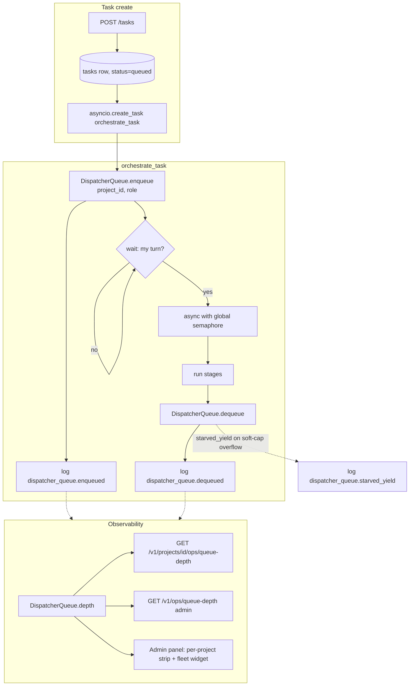

# Concurrent pipeline execution with per-project fairness

## Context

[Task orchestration](../active/worker-communication.md) already has a
process-wide `asyncio.Semaphore` (spec 0028's first slice, shipped) —
`orchestrate_task` gates on `settings.worker_concurrency`, and
`get_concurrency_status()` exposes `{cap, in_flight, available}` to
an admin endpoint. That cap is fleet-level: it stops Cloud Run
OOMs but doesn't stop one project from holding every slot.

This design adds the second layer: **per-project fair scheduling**
in front of the existing semaphore, plus **queue-depth
observability** per-project and fleet-wide. The existing semaphore
keeps its contract (hard ceiling on simultaneous orchestrations);
fairness decides *who* gets a slot when contention exists, not
*how many* slots exist.

ADR 0005's multi-tenancy invariant is the motivation — a fleet
where project B's tasks sit behind A's 30-task fan-out for 10 min
is not actually isolated, even if the data boundaries are clean.

## Goals / non-goals

- **Goals**
  - Round-robin over projects when multiple have queued tasks.
  - Per-`(project_id, role)` queue-depth gauges exposed via the
    observability endpoints.
  - Optional soft per-project cap (yield-on-contention) for
    projects that want to bound their own footprint.
  - Zero behavioural change when only one project is active.
- **Non-goals**
  - Cross-Cloud-Run-instance coordination (see spec non-goals).
  - Priority queues or SLA-aware scheduling.
  - Replacing the global semaphore.
  - Backpressure at the HTTP task-create boundary.

## Design

### Parts

- **`DispatcherQueue`** (`src/coder_core/workers/_dispatcher_queue.py`)
  - Pure in-memory data structure, singleton per process.
  - State:
    - `waiters: dict[str, deque[_Waiter]]` — project_id → FIFO of
      pending orchestrations, each a small record
      `{role, event, enqueued_at}`.
    - `round_robin_cursor: list[str]` — ordered list of project
      ids with pending work; the fair-scheduling selector rotates
      through it.
    - `in_flight_per_project: dict[str, int]` — active slot count
      per project, for the soft-cap decision.
  - Methods:
    - `enqueue(project_id, role) -> asyncio.Event` — registers a
      waiter and returns an event the caller waits on; the
      scheduler `set()`s it when it's the project's turn.
    - `dequeue(project_id)` — called *after* the orchestration
      finishes; decrements the in-flight counter and kicks the
      scheduler to consider the next waiter.
    - `depth(project_id=None, role=None) -> int` — pure read for
      the observability endpoints; snapshot of the waiters
      `deque` lengths.
    - `set_soft_cap(project_id, n | None)` — loaded from
      `projects.worker_concurrency_soft`; rechecked on every
      scheduling decision so admin overrides take effect without
      a restart.
  - A background `_scheduler()` coroutine runs when the queue is
    non-empty. It:
    1. Picks the next project via the round-robin cursor.
    2. Skips projects at or over their soft cap *when another
       project has waiters*. Yields with a
       `dispatcher_queue.starved_yield` log.
    3. Pops the project's oldest waiter and sets its event.
    4. Advances the cursor.
  - The global semaphore still gates actual subprocess execution
    — `DispatcherQueue.dequeue` doesn't free a semaphore slot
    directly; `orchestrate_task`'s `async with` does.

- **`orchestrate_task` integration** (extends
  `workers/orchestrator.py`)
  - Before `async with sem:`, call
    `event = queue.enqueue(project_id, role); await event.wait()`.
  - After the `async with` block exits, call
    `queue.dequeue(project_id)`.
  - Wait-time is captured (`time.monotonic()` around `event.wait()`)
    and emitted on the `dispatcher_queue.dequeued` log for P95
    metrics.
  - Backwards compatible: when `DISPATCHER_FAIRNESS_ENABLED=false`
    (default during soak), `enqueue` is a no-op that returns an
    already-set event, and the semaphore alone gates dispatch.

- **`projects.worker_concurrency_soft` column** (migration 0027)
  - `INT NULL`. NULL = project uses the global cap without a soft
    ceiling. Positive value = soft cap used by the fairness
    scheduler when contention exists.
  - Surfaced via the existing project settings page in the admin
    panel; change triggers a `DispatcherQueue.set_soft_cap` call.

- **Queue-depth endpoints** (extend `src/coder_core/api/ops.py`)
  - `GET /v1/projects/{id}/ops/queue-depth` — project-scoped, same
    auth as existing `ops/concurrency`.
  - `GET /v1/ops/queue-depth` — admin-only, fleet summary.
  - Both read from `DispatcherQueue.depth(...)` — no DB round-trip.

- **Observability events** (structured log feed,
  see [observability-and-cost-tracking](../active/observability-and-cost-tracking.md))

  | Event | Fields |
  |---|---|
  | `dispatcher_queue.enqueued` | `project_id, role, queue_depth_project, queue_depth_fleet` |
  | `dispatcher_queue.dequeued` | `project_id, role, wait_ms, queue_depth_project, queue_depth_fleet` |
  | `dispatcher_queue.starved_yield` | `project_id, role, soft_cap, in_flight_project` |

  No new counter table; existing log-based observability consumes
  these. A nightly rollup extracts median / P95 wait_ms per project
  into the weekly metrics report.

- **Admin panel** (`coder-admin/src/pages/ProjectDashboard.tsx` +
  `AdminHome.tsx`)
  - **Per-project Queue strip**: a horizontal row on the project
    dashboard showing depth per role (`developer: 3 | reviewer: 1 | pm: 0 | arch: 0 | tm: 0`)
    + wait-time P95 over last 5 min. SSE-driven at 5 s cadence via
    a new `queue_depth` event on the existing per-project SSE.
  - **Fleet Queue widget** on admin home: total depth, busiest
    project, starvation-yield count. Three-colour pill (green / yellow
    / red) per the spec thresholds. Admin-only.
  - No new page or route; reuses the dashboard shell.

- **Runbook** `runbooks/concurrency-overflow.md`
  - When the fleet widget goes yellow/red:
    1. Identify driver project (busiest-project field).
    2. Is the driver's soft cap set? If not, consider setting one.
    3. Is the overall cap saturated (`in_flight == cap`)? If yes and
       the spike is legitimate, raise `WORKER_CONCURRENCY`.
    4. If wait P95 > 5 min for any non-driver project,
       investigate for a stuck orchestration via the existing
       orphan-reaper (ADR 0011).

### Data flow

**Happy path under contention.**

1. Project A submits 6 developer tasks. `orchestrate_task` fires
   for each via `asyncio.create_task`.
2. First 4 reach `enqueue(A, developer)` and the scheduler sets
   their events immediately (cap=4, fleet empty).
3. Tasks 5 & 6 enqueue and wait.
4. Project B submits 2 tasks; both enqueue behind A's 2 waiters
   in their own per-project deque.
5. A's first task finishes → `dequeue(A)` kicks the scheduler.
6. Scheduler cursor advances: **B's turn**. Sets B task 1's event.
   B task 1 enters the semaphore.
7. Next dequeue → cursor: **A's turn**. A task 5 proceeds.
8. Continues round-robin; B's two tasks get slots without waiting
   on all 4 of A's remaining.

**Soft cap enforcement.**

1. Project A has `worker_concurrency_soft=2`. A submits 10 tasks.
2. First 2 run immediately (cap not yet met).
3. Project B submits 1 task while A has 2 in-flight and 8 waiting.
4. A's task 3 reaches the front of A's deque. Scheduler checks:
   `in_flight_per_project[A] == 2 == soft_cap[A]` and B has
   waiters → starved yield. A waits; B proceeds.
5. Once B finishes, if A is still the only waiter, A ignores its
   soft cap (soft semantics) and drains. If new B tasks appear, A
   yields again.

**Empty queue (no behaviour change).**

1. Only project A has work. `enqueue(A, ...)` adds to A's deque,
   scheduler immediately sets the event.
2. `in_flight` only gated by the global semaphore.
3. Soft cap is not checked because no other project has waiters.

### Invariants

- `DispatcherQueue.depth()` is the authoritative queue-size signal.
  The global semaphore's `_value` is **not** exposed as "queue
  depth" — it's an internal counter conflating running + waiting.
- Round-robin order is stable under churn: when a project drains
  its deque, the cursor advances past it on the next empty pick;
  when a project re-enqueues, it lands at the end of the cursor
  list.
- A waiter's `asyncio.Event` is set exactly once; `orchestrate_task`
  only proceeds past the enqueue gate after `event.wait()` returns.
- Per-project in-flight counts are incremented **inside** the
  semaphore `async with`, not at `enqueue` time, so the fairness
  decision about soft-cap-vs-yield reflects actual running
  subprocess count, not scheduled-but-not-yet-started count.
- When `DISPATCHER_FAIRNESS_ENABLED=false`, enqueue returns an
  already-set event and dequeue is a noop. The semaphore alone
  governs dispatch — v0 (pre-0028) shape.
- No DB read/write inside the scheduler. All state is in-memory;
  crash recovery relies on the orphan reaper (ADR 0011) to
  re-dispatch abandoned tasks, same as today.

### Edge cases

- **Task cancelled while waiting.** Operator override calls
  `task.cancel()` on the orchestrating coroutine. The cancellation
  interrupts `event.wait()`; the finally block calls
  `queue.cancel_waiter(project_id, waiter)` to remove the entry
  from the deque so the scheduler doesn't try to wake a dead
  coroutine.
- **Process restart with waiters.** In-memory waiters are lost.
  Tasks stay at `queued` in DB; the orphan reaper catches them
  and re-dispatches at the new process. Expected and documented.
- **Single-project flood with soft cap undefined.** Project A
  submits 100 tasks, no other project active, no soft cap. A
  uses all `worker_concurrency` slots without yielding. This is
  correct — fairness is a contention signal, not a rate limit.
- **Scheduler starvation by itself.** The scheduler coroutine
  is a single `async def _scheduler()` that loops on an
  `asyncio.Event` bumped by enqueue/dequeue. If the event loop
  is itself blocked (synchronous work in an `async` handler),
  the scheduler won't run — but neither will anything else, so
  it's not a fairness bug.
- **Soft cap lowered mid-flight.** A project has 4 tasks
  in-flight and soft cap is lowered to 2 via admin. The running
  tasks complete normally; new waiters for that project yield
  once the scheduler sees another project with waiters. No
  preemption.
- **`worker_concurrency` raised while queues are non-empty.**
  The global semaphore is a `asyncio.Semaphore` — its value is
  set at construction. Raising the config at runtime requires
  calling `reset_concurrency_sem()` (existing test hook); the
  scheduler then sees more available capacity on the next kick.
  Document in the runbook rather than auto-wiring.

## Rollout

Shadow → enforce, same pattern as 0025/0027.

1. **Ship `DispatcherQueue` + hook in `orchestrate_task`** behind
   `settings.dispatcher_fairness_enabled` (default `false`).
   Shadow mode: `enqueue` logs
   `dispatcher_queue.shadow_enqueued` and `shadow_dequeued` but
   always returns a set event so the scheduler doesn't gate.
   This gives us real wait-time data for tuning before enforce.
2. **Ship the queue-depth endpoints + admin strips.** Read from
   the same `DispatcherQueue.depth()` that's already populated in
   shadow mode. Admin surfaces go live immediately; the widget
   colours depth based on real data.
3. **Migration 0027** — `projects.worker_concurrency_soft`.
   Admin project-settings UI exposes the field but leaves it
   NULL by default.
4. **Soak 48 h.** Review shadow logs for distribution of
   `wait_ms`, per-project depth histograms, soft-cap
   interaction. Confirm round-robin cursor advances correctly
   via an integration smoke test on a sandbox project.
5. **Flip** `DISPATCHER_FAIRNESS_ENABLED=true`. Enforce in one PR
   alongside the test updates that unlock the flip (see the 0025
   / 0027 pattern).
6. **Runbook** `runbooks/concurrency-overflow.md` lands with step
   2 and is linked from the admin fleet-queue widget.

## Open questions

- **Data structure: deque vs heap.** Deque is O(1) for
  enqueue/dequeue and matches FIFO within a project. Heap would
  allow future priority without restructuring. Starting deque;
  the priority is a non-goal for v1.
- **Cursor vs round-robin counter.** The cursor is a `list[str]`
  rebuilt as projects enter/leave the waiting state. An index
  counter over a stable list of *all* projects (even with no
  waiters) is simpler but O(N) in the project count. At fleet
  scale (~10–100 projects) either is fine; picking cursor for
  clarity.
- **Wait-time histogram storage.** First cut emits wait_ms on
  every dequeued log, and a nightly SQL rollup derives P95.
  Persisting a per-minute histogram in a new table would enable
  finer alerting — defer until the rollup shows we need it.
- **Soft cap as percentage vs absolute.** Absolute is simpler.
  Percentages ("project A gets 50% of the cap") would be more
  expressive at scale. Deferred; if someone asks we'll revisit.
- **Interaction with 0027 transient retry.** Transient retry
  happens *inside* `orchestrate_task` after the semaphore is
  acquired, so retry backoff holds the slot. A long transient
  outage could keep slots pinned. Alternative: release the
  semaphore during backoff, re-acquire after. Deferred — wait
  for evidence that real outages hit this.

## Links

- Spec: [wip/0028-concurrent-pipelines](../../product-specs/wip/0028-concurrent-pipelines.md)
- Related designs: [worker-communication](../active/worker-communication.md)
  (this design extends the dispatcher it describes),
  [worker-roles](../active/worker-roles.md),
  [observability-and-cost-tracking](../active/observability-and-cost-tracking.md).
- Related ADRs:
  [0005 — multi-tenant coder-core](../../adrs/0005-multi-tenant-coder-core.md)
  (the invariant this design operationalises at the dispatch layer).
- Runbook: `runbooks/concurrency-overflow.md` (lands in rollout step 2).
