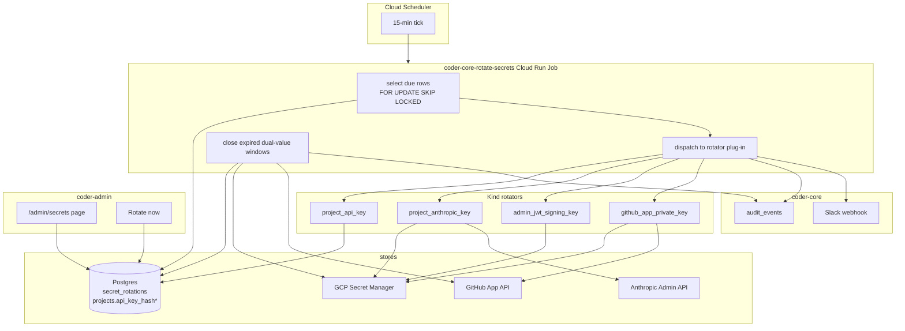

# Automated secret rotation

## Context

The system has four long-lived, rotatable secrets today, each with
an ad-hoc rotation story (see spec 0038 "Problem"). The common
structure is: a canonical name, a storage location (Secret Manager
or Postgres), a read path, a cadence expectation, and a need to
rotate without downtime. This design turns that common structure
into one registry table + one Cloud Run Job + one plug-in per secret
kind, and reuses the audit log from 0037 for attribution.

The lift is deliberately narrow: ~one table, ~200 lines of rotator
core, four plug-ins of ~50 lines each, one admin page. Anything
beyond that (detection of compromise, KMS-managed keys, multi-region
replication) is out of scope.

## Goals / non-goals

**Goals**

- One table (`secret_rotations`) is the canonical registry of
  what gets rotated, how often, and when last. Everything else
  reads it.
- One Cloud Run Job (`coder-core-rotate-secrets`) ticks every 15
  min via Cloud Scheduler. No in-process cron; no long-running
  goroutine in FastAPI.
- Every rotation is atomic from the caller's perspective: a
  dual-value window means no 401/403 during the swap.
- Every rotation writes an `audit_events` row (spec 0037). Operators
  already query the audit log; rotations show up there for free.
- Adding a new rotatable secret = write one plug-in + insert one
  registry row.

**Non-goals**

- Not a KMS. GCP Secret Manager keeps doing the at-rest job.
- Not a leak detector. "Rotate now" is an operator button.
- Not multi-region. One GCP project, one Secret Manager.
- Not a replacement for `POST /v1/projects/{id}/rotate-api-key`;
  the rotator *calls* that endpoint for the `project_api_key` kind.
- Not a retention / expiration framework for the audit log itself.
  0037 already stamps `retention_until`; a future spec collects.

## Design



### Parts

- **`secret_rotations` table** (migration 0042). 11 columns per spec
  0038 Scope. Unique index on `canonical_name`. Partial index on
  `(next_due_at)` where `last_rotated_at IS NOT NULL OR last_error_at
  IS NULL` for the hot "what's due now" scan. Seed rows:
  `admin_jwt_signing_key` (30 d), `github_app_private_key` (180 d).
  Data migration step inserts per-project rows for existing projects
  at `next_due_at = now() + random()` to stagger.

- **`projects.api_key_hash_previous`** (migration 0043) — nullable
  TEXT, holds the prior SHA-256 during the dual-value window. Auth
  middleware (`require_project_auth`) already checks
  `projects.api_key_hash`; adds an `OR api_key_hash_previous = hash`
  guard gated on `old_value_expires_at > now()`.

- **Rotator registry** — `src/coder_core/rotation/__init__.py`:
  ```python
  @dataclass
  class RotationResult:
      new_version: str
      dual_value_window: timedelta

  class Rotator(Protocol):
      kind: str
      async def rotate(self, entry: SecretRotationRow,
                       *, secret_manager: SecretManagerClient,
                       session: AsyncSession) -> RotationResult: ...
      async def close_window(self, entry: SecretRotationRow,
                             *, secret_manager: SecretManagerClient,
                             session: AsyncSession) -> None: ...

  ROTATORS: dict[str, Rotator] = {
      "project_api_key": ProjectApiKeyRotator(),
      "project_anthropic_key": ProjectAnthropicKeyRotator(),
      "admin_jwt_signing_key": AdminJwtSigningKeyRotator(),
      "github_app_private_key": GithubAppPrivateKeyRotator(),
  }
  ```

- **Cloud Run Job entry point** — `src/coder_core/rotation/job.py`,
  runnable via `python -m coder_core.rotation.job`. Single tick:
  ```python
  async def tick(now: datetime) -> TickResult:
      if not settings.secret_rotation_enabled:
          return TickResult(skipped="disabled")
      async with session_scope() as session:
          due = await _select_due_rows(session, now=now)
          for entry in due:
              await _dispatch(entry, session=session)
          expiring = await _select_windows_expiring(session, now=now)
          for entry in expiring:
              await _close_window(entry, session=session)
  ```
  `_select_due_rows` uses `SELECT ... FOR UPDATE SKIP LOCKED` so
  two overlapping job invocations can't rotate the same row twice.

- **Dispatch helper** — wraps the kind-specific rotator:
  ```python
  async def _dispatch(entry, *, session):
      rotator = ROTATORS[entry.kind]
      correlation_id = _run_id()
      try:
          result = await rotator.rotate(entry, secret_manager=SM,
                                        session=session)
          entry.last_rotated_at = now
          entry.next_due_at = now + timedelta(days=entry.cadence_days)
          entry.old_value_expires_at = now + result.dual_value_window
          entry.last_error = None
          entry.last_error_at = None
          entry.rotation_version += 1
          await record_audit_event(
              session, caller=_system_caller(),
              correlation_id=correlation_id,
              action="secret.rotate",
              target_type="secret", target_id=entry.canonical_name,
              after={"trigger": "scheduled",
                     "new_version": result.new_version,
                     "dual_value_window_hours":
                       int(result.dual_value_window.total_seconds() / 3600)},
          )
      except Exception as e:
          entry.last_error = str(e)[:500]
          entry.last_error_at = now
          logger.exception("rotation_failed", extra={...})
          await _slack_alert("secret_rotation.failed", entry, e)
  ```

- **Kind rotators**:

  - **`ProjectApiKeyRotator`** — generates a 32-byte token via
    `secrets.token_urlsafe`, hashes with SHA-256, writes to
    `projects.api_key_hash`, copies the previous hash to
    `projects.api_key_hash_previous`. Writes the new plaintext to
    Secret Manager `coder-{project}-api-key`. `close_window` nulls
    `api_key_hash_previous` and disables the old Secret Manager
    version.

  - **`ProjectAnthropicKeyRotator`** — calls Anthropic admin API
    `POST /v1/organizations/.../api_keys` to create a new
    per-project key (pending open question — see spec), writes it
    to Secret Manager `coder-{project}-developer-anthropic-api-key`
    as a new version, and sets the previous version as
    `destroy_scheduled` for `now + dual_value_window`. Workers read
    the latest enabled version via the existing per-role SA binding;
    in-flight workers continue using the key they hold until their
    next broker fetch (∼every task).

  - **`AdminJwtSigningKeyRotator`** — writes a new 64-byte random
    secret to Secret Manager `coder-admin-jwt-signing-key`. The
    coder-core issuer signs with the new secret; the verifier
    adds a ~180-line `JwtVerifier` helper that caches both versions
    and tries the new version first. `close_window` disables the
    old version.

  - **`GithubAppPrivateKeyRotator`** — calls GitHub's "create a new
    private key for an app" API, stores the returned PEM in Secret
    Manager `coder-github-app-private-key` as a new version. The
    App auth path always uses the latest enabled version.
    `close_window` calls GitHub's "delete private key" API on the
    previous key and disables the Secret Manager version.

- **JwtVerifier** (`src/coder_core/auth/jwt_verifier.py`) — caches
  the latest + previous Secret Manager versions of
  `admin-jwt-signing-key`, TTL 60 s. `verify(token)` tries the
  latest first, falls back to the previous if
  `old_value_expires_at > now()`. Keeps a `jwt_verify.fallback`
  counter metric so the admin page can render "N verifications used
  the old key" during a window.

- **Break-glass endpoint** — `api/rotation.py`:
  `POST /v1/_admin/secrets/{canonical_name}/rotate-now`. Admin-JWT
  guard. Sets `next_due_at = now()` and writes an audit row
  (`after.trigger="break_glass"`). Returns 202 with
  `{expected_by: now + 15 min}`.

- **Admin page** — `src/pages/AdminSecrets.tsx` + `GET /v1/_admin/
  secrets` endpoint that returns `[{canonical_name, kind, project_id,
  cadence_days, last_rotated_at, next_due_at, old_value_expires_at,
  last_error, last_error_at}, ...]`. Table + red past-due chip +
  "Rotate now" button that calls the break-glass endpoint.
  Disabled-banner when `SECRET_ROTATION_ENABLED=false`.
  Behind `VITE_SECRET_ROTATION_ENABLED` (default on).

- **Terraform** — new Cloud Scheduler job
  `secret-rotation-tick-15min` pointed at the existing
  `coder-core-rotate-secrets` Cloud Run Job (new resource). Service
  account for the job gets `secretmanager.secretVersionAdder` and
  `secretmanager.secretVersionDisabler` on each rotatable secret.
  IAM bindings live next to the existing per-role SA bindings so
  `capability_matrix.py` picks them up.

### Data flow

**Scheduled per-project API key rotation**

1. Cloud Scheduler fires the 15-min tick.
2. Job selects rows where `next_due_at <= now()` — finds
   `project:coder:api_key` is due (cadence 90 d, last rotated 91 d
   ago).
3. `ProjectApiKeyRotator.rotate` generates a new token, writes the
   new hash, saves the old one to `api_key_hash_previous`, writes
   plaintext to Secret Manager.
4. Registry row updated: `last_rotated_at=now`,
   `next_due_at=now+90d`, `old_value_expires_at=now+24h`,
   `rotation_version += 1`.
5. `audit_events` row: `action=secret.rotate`,
   `target_id=project:coder:api_key`, `after.trigger=scheduled`.
6. For 24 h, both hashes authenticate. Ops can update the
   CI/automation key in that window.
7. The next tick after `old_value_expires_at < now()` calls
   `close_window`: nulls `api_key_hash_previous`, disables the old
   Secret Manager version. Audit row
   (`action=secret.rotate.window_closed`).

**Break-glass GitHub App key**

1. Operator suspects a leak. Opens `/admin/secrets`, clicks "Rotate
   now" on `github_app_private_key`.
2. UI calls `POST /v1/_admin/secrets/github_app_private_key/rotate-now`.
3. Endpoint sets `next_due_at=now()`, writes an audit row with
   `after.trigger=break_glass`, returns 202.
4. Next tick (≤15 min) runs the rotator. New key written; old key
   still accepted for 6 h (configurable to 0 if we want immediate
   revocation — see Open questions in spec).
5. Ops force-rolls any long-running background jobs that use the
   old installation token, then lets the window close naturally.

**Rotation failure**

1. Anthropic admin API returns 503 mid-rotation.
2. Dispatch catches the exception, writes `last_error` +
   `last_error_at`, does NOT advance `next_due_at`.
3. Slack alert `secret_rotation.failed` fires (deduped per
   canonical_name per hour via the existing alert rate limiter).
4. Next tick retries after the 15-min floor.
5. Admin page renders the red chip + last-error text on the row.

### Invariants

- **At most one in-flight rotation per canonical name.** The
  advisory lock on `canonical_name` enforces this across job
  invocations.
- **Old value is always readable during its window.** Every kind
  rotator preserves the old value until `old_value_expires_at`.
  Window close is a separate tick step, never combined with
  rotation.
- **Audit log is the source of truth for rotation history.** The
  registry table holds `last_rotated_at` for efficiency; the
  authoritative timeline is the audit log keyed on
  `target_type=secret`.
- **Failure preserves the old value.** A partial-write on the new
  value that doesn't get to commit leaves the old value intact
  (Secret Manager versioning is atomic; the DB transaction covers
  `projects.*` updates).
- **Flag off is observable.** The admin page's "Disabled" banner +
  break-glass 503 + scheduler-tick noop make the non-rotating state
  visible.

## Open questions

- **Anthropic admin API support.** Does Anthropic expose a
  programmatic key-creation endpoint to our organisation? If no, the
  `project_anthropic_key` rotator ships as a stub that writes a
  `rotation_unsupported` audit row and leaves `next_due_at` at a
  far-future date until the API (or a workaround) exists. This lets
  the spec ship with three live kinds + one clearly-marked gap.
- **Break-glass window override.** Should the break-glass endpoint
  accept `{dual_value_window_hours: 0}` to skip the grace and force
  immediate invalidation of the old value? Security pragmatist yes;
  ops-against-self-inflicted-outage leans "allow but warn." Default
  to the normal window in phase 1; add the override in phase 2 once
  we have a real compromised-key drill.
- **Per-project rotation jitter.** Seeding all projects' rotation
  dates at `now + random(0, 90d)` staggers the fleet's load. Is
  random enough or should we use consistent hashing on project_id
  so the same project lands on the same day each cycle (helpful
  for runbook correlation)? Lean consistent hashing; decide before
  the first prod tick.
- **Admin JWT verifier's `JwtVerifier` replacement scope.** The
  current middleware decodes inline. Replacing it with a cached
  verifier that accepts both versions is pulled in by 0038 but is
  a cleanup many would want anyway. Confirm we don't spook existing
  tests.

## Rollout

Three stages, flag-gated throughout.

- **Stage 1 — registry + job + 1 kind wired.** Migration 0042 + 0043
  ship. `AdminJwtSigningKeyRotator` is the smoke test (low blast
  radius — admin-only surface, 2 h window). Admin page skeleton.
  Cloud Run Job scheduled but `SECRET_ROTATION_ENABLED=false`
  in prod (manual invocation only during soak).
- **Stage 2 — three more kinds wired.** `ProjectApiKeyRotator`,
  `GithubAppPrivateKeyRotator`, and `ProjectAnthropicKeyRotator`
  (or its stub) go in one deploy. Break-glass endpoint + admin
  page filters go live. Flag flipped on after a 48 h manual-invoke
  soak.
- **Stage 3 — active transition.** After 1-2 real scheduled
  rotations complete cleanly across every kind, merge into `active/`
  (new `secret-rotation` component in both spec and design folders,
  per AGENTS.md rule 5) and retire 0038 from `wip/`.

**Backout plan.** `SECRET_ROTATION_ENABLED=false` + redeploy.
Next scheduler tick is a no-op. In-flight windows continue to close
on their own (the dual-value window sweeper runs independently of
the main rotator). Migrations 0042/0043 are forward-compatible;
downgrade drops only the new columns (on-purpose — we'll recreate
from Secret Manager state if we ever roll back, which we won't).

## Links

- Specs: [0038 — automated secret rotation](../../product-specs/wip/0038-secret-rotation.md),
  [service-accounts](../../product-specs/active/service-accounts.md),
  [continuous-deployment](../../product-specs/active/continuous-deployment.md),
  [multi-tenancy](../../product-specs/active/multi-tenancy.md),
  [admin-panel](../../product-specs/active/admin-panel.md),
  [audit-log](../../product-specs/active/audit-log.md).
- ADRs: none yet. A "rotator plug-in contract" ADR may be worth
  writing if we add kinds beyond phase 1.
- Services: `coder-core` (new rotation package + Cloud Run Job),
  `coder-admin` (new Secrets page), `coder-infra` (Cloud Scheduler,
  IAM bindings).
- Related designs: [audit-log](../active/audit-log.md) (every
  rotation writes one row),
  [system-overview](../active/system-overview.md) (Cloud Run Jobs +
  Scheduler story),
  [observability-and-cost-tracking](../active/observability-and-cost-tracking.md)
  (`secret_rotation.failed` Slack alert rides the existing webhook;
  `jwt_verify.fallback` counter feeds the observability feed),
  [impersonation](../active/impersonation.md) (admin JWT lives
  adjacent; impersonation tokens are not in scope).
