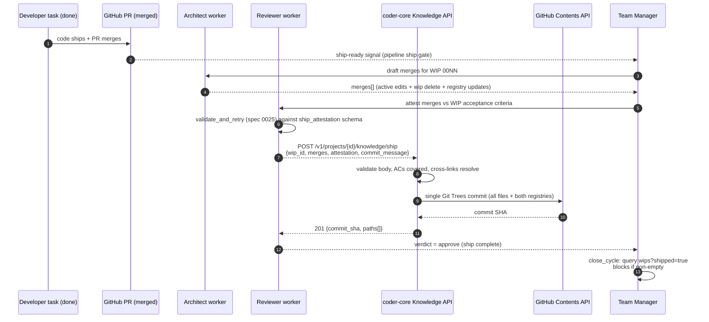

# Write-through enforcement on ship

## Context

[AGENTS.md](../../../AGENTS.md) rule 5 says: when a WIP spec or
design ships, its content is merged into `active/` and the numbered
WIP file is deleted. Today this is human discipline, and humans miss
it. The failure is silent: the code ships, the PR merges, the WIP
file lingers, and `active/` silently lags reality.

This is *active* misleading, not *ambient* rot — freshness signalling
(spec 0043) catches ambient decay but cannot see the specific case
where a ship skipped the merge step. Both specs cooperate: 0043
watches for rot after the fact; 0044 prevents one deliberate source
of rot at ship time.

The natural enforcement point is the role contract. The Reviewer
worker is already the last checkpoint before ship and already owns a
structured output envelope (under spec 0025). Extending that envelope
with a required `ship_attestation` block puts the check in the
reviewer's schema, not in a parallel gate. The Team Manager's
cycle-close step is the backstop for anything that slips past.

The gate deliberately lives in the Coder pipeline rather than in
GitHub branch protection — see [ADR 0015](../../adrs/0015-ship-gate-in-coder-pipeline.md).

## Goals / non-goals

- **Goals**
  - Shipping is an atomic commit: `active/` edits + WIP delete +
    both registry updates in a single GitHub Contents operation.
    No partial ship state representable on disk.
  - Reviewer worker output schema gains a required
    `ship_attestation`. Every AC of the shipping WIP names either a
    home in `active/` or an explicit drop reason.
  - Team Manager's `close_cycle` refuses to close a cycle whose
    features have shipped but whose WIP specs still sit in `wip/`.
  - Architect drafts the wip-to-active merge patch as part of the
    ship task so the reviewer has concrete material to attest against.
  - A once-off back-fill script finds existing orphan WIPs (shipped
    code + un-merged WIP) and queues them for remediation.
- **Non-goals**
  - Deciding *how* WIP content folds into `active/`. That's the
    Architect's drafting job; the spec enforces that the fold happens.
  - Rewriting AGENTS.md. This design operationalises rule 5; the rule
    stays authoritative.
  - Blocking the GitHub PR merge (ADR 0015).
  - Multi-WIP ship transactions. One WIP per `/ship` call.
  - Template-blueprint changes (those go through a separate path —
    see spec 0047).

## Design



### Parts

- **Ship endpoint** on `coder-core`
  - `POST /v1/projects/{id}/knowledge/ship`
  - Body (stable contract — schema lives alongside the Reviewer's
    worker schema, see spec 0025 ties):
    ```json
    {
      "wip_id": "0044",
      "wip_type": "spec" | "design",
      "merges": [
        {"artifact_type": "spec" | "design",
         "artifact_id": "<slug-or-number>",
         "action": "create" | "edit",
         "patch": "<unified diff or full body>"}
      ],
      "attestation": {
        "reviewer": "<actor-slug>",
        "acs": [
          {"ac": "<text>", "merged_into": "<artifact_id>", "section": "<heading>"},
          {"ac": "<text>", "dropped": true, "reason": "<text>"}
        ]
      },
      "commit_message": "<required>"
    }
    ```
  - Implementation: the [Knowledge Write API](../active/knowledge-write-api.md)
    currently uses `create_or_update_file` (one-file-per-commit). The
    ship endpoint uses the GitHub **Git Trees API** (`POST /repos/{o}/{r}/git/trees`
    + `POST .../git/commits` + `PATCH .../git/refs/heads/{default}`)
    to build one tree covering every touched file and both
    registries, then a single commit — atomic on the GitHub side.
    This is the same atomicity upgrade flagged as a "future optimisation"
    in `knowledge-write-api`; ship is the first caller that needs it.

- **Ship validator** (server-side, pre-commit)
  - Every AC text in the WIP's `## Acceptance criteria` section (parsed
    from the in-flight markdown) must appear in `attestation.acs` by
    text match (normalised whitespace). Missing ACs → 400 with the
    specific AC(s) flagged. Not a fuzzy match — exact text or drop.
  - Every `merged_into` in the attestation must reference either an
    existing `active/` artifact slug or one of the `create` entries in
    the same request. Dangling references → 400.
  - Every `patch` is applied in-memory against a snapshot of the repo
    at `HEAD`; the resulting frontmatter is validated by the existing
    Write API validator (required fields, cross-link resolution,
    `type`/`id` immutability). Any validation failure → 400, nothing
    written.
  - WIP delete is included in the same tree: the in-memory snapshot
    removes `wip/00NN-*.md` and drops the registry entry.
  - Both affected registries (`{folder}/registry.yaml` for each
    touched folder) are rewritten by the handler — not hand-patched
    — so entry ordering and formatting stay stable.

- **Reviewer schema extension** (under spec 0025's umbrella)
  - `src/coder_core/workers/schemas/reviewer_ship.json` — new schema
    added to the 0025 registry. Required fields: `verdict`,
    `ship_attestation` (structure above), `review_url`.
  - The existing Reviewer worker at `src/coder_core/workers/reviewer.py`
    gains a `ship_mode: bool` task input. In ship mode, the worker
    loads `reviewer_ship.json` instead of the default reviewer schema
    and passes it to `validate_and_retry`. A reviewer that emits an
    `approve` verdict without a compliant attestation triggers the
    0025 re-prompt loop.
  - Non-ship reviews (the common case: a developer PR partway through
    the cycle) use the existing schema unchanged.

- **Orphan-WIP query**
  - `GET /v1/projects/{id}/knowledge/wips?shipped=true` — returns
    `[{wip_id, wip_type, developer_task_id, pr_url, merged_at}, ...]`
    for WIPs whose correlated developer task is `closed` + PR `merged`
    but whose file is still in `wip/`.
  - Correlation path: `tasks` rows carry `spec_id` (for specs) or
    `design_id` (for designs). The handler joins the `tasks` table on
    task status + PR state, filters by "WIP file still exists", and
    returns. No new table required.

- **Team Manager close-cycle backstop**
  - The existing [team-manager-worker](../active/team-manager-worker.md)
    `close_cycle` step gains a call to the orphan-WIP query. On
    non-empty result, it exits with a structured
    `wips_pending_merge` error:
    ```json
    {"error": "wips_pending_merge",
     "wips": [{"wip_id": "0044", "pr_url": "..."}]}
    ```
  - The admin panel renders this as a block on the cycle close view
    with one-click "Open ship gate for WIP 00NN" links.

- **Admin panel ship gate** (`coder-admin`)
  - Pipeline run view grows a **Ship** gate, distinct from the
    existing PR-merge gate. Shown when: PR merged + WIP still exists.
  - Two-column layout: left renders the Architect-drafted merges
    (per file: diff + frontmatter change); right renders the
    reviewer's `ship_attestation`. Operator can approve, reject, or
    request changes.
  - **Approve** calls `POST .../ship`. **Reject** opens a structured
    audit record and leaves the WIP in place.
  - No branch protection integration: the gate lives entirely in
    coder-core + coder-admin (ADR 0015).

- **Architect drafting task**
  - A new task kind `knowledge-ship-draft` that the pipeline dispatches
    automatically when the developer task of a WIP closes. The
    architect-worker task prompt includes: the WIP body, the
    acceptance criteria, the target `active/` files it's most likely
    to touch (looked up via `related_specs` + `related_designs`), and
    the diff of the shipping code.
  - Architect output: a `merges[]` array. This becomes the left
    column of the admin ship gate.

- **Back-fill script** `scripts/find_orphan_wips.py`
  - Iterates every project, runs the orphan-WIP query, prints a
    report (`project | wip | pr | merged_at | days_lagging`), and
    behind `--open-audit` opens a `needs-merge` audit record for
    each hit. Runs once as part of the Phase 8 rollout; after that
    the ship gate keeps the count at zero.

- **Runbook** `runbooks/ship-wip-into-active.md` — the
  Architect-draft / Reviewer-attest / TM-close path end to end, with
  the rejection / rework loop documented.

### Data flow

**Happy ship (new behaviour).**

1. Developer task for WIP 0044 closes; PR merges.
2. Pipeline dispatches a `knowledge-ship-draft` task for the Architect
   worker.
3. Architect produces `merges[]`: edits to `active/reviewer-worker.md`
   and `active/team-manager-worker.md`, plus a new `active/ship-gate.md`
   if warranted.
4. Pipeline dispatches a ship-mode Reviewer task with the merges and
   the WIP ACs as context.
5. Reviewer emits `{verdict: "approve", ship_attestation: {...}}`;
   0025's schema loop catches any shape error.
6. The coder-core dispatcher calls `POST .../ship` with the merges
   and attestation. Endpoint validates, builds a tree, commits.
7. Registry changes + file changes + WIP delete land in one commit.
8. Pipeline marks the ship stage complete. Task orchestration closes
   the cycle.

**Rejected ship.**

1. Steps 1–5 as above.
2. Operator reviews the two-column diff and clicks Reject with a
   reason.
3. `knowledge_audit_reports` row is created referencing the WIP,
   the rejected merge, and the reviewer.
4. Pipeline does not call `.../ship`. The WIP stays in flight. The
   cycle does not close until a re-drafted ship attests clean.

**Close-cycle block.**

1. Team Manager reaches `close_cycle`.
2. Worker queries `wips?shipped=true`; non-empty.
3. Worker returns `wips_pending_merge`; cycle stays open.
4. Admin panel shows the offending WIPs with "Open ship gate" links.

### Invariants

- One commit per ship. The tree either lands whole or not at all;
  no half-state where `active/` updated but WIP still exists.
- Reviewer cannot produce a valid `approve` verdict without a
  compliant `ship_attestation` — the 0025 schema loop forces this,
  with re-prompt retries on shape errors.
- Every AC in the WIP body maps to exactly one attestation entry
  (`merged_into` or `dropped`). Missing or duplicated ACs → 400.
- Close-cycle is the backstop, not the primary gate. If it fires,
  something upstream skipped the ship gate and that's a bug worth
  an alert.
- Cross-link resolution happens against the *post-merge* registry
  snapshot, not the pre-merge one — so a `create` inside the same
  request can be referenced by an `edit` in the same request
  without a chicken-and-egg failure.
- One WIP per `/ship` call. Concurrent calls for the same WIP
  serialise via GitHub's branch ref SHA; the loser gets 409.

### Edge cases

- **AC text slightly edited after developer task started.** Exact
  text match would break. Mitigation: the validator normalises
  whitespace and ignores trailing punctuation; anything beyond that
  is a drop-and-rewrite case (caller passes `dropped: true, reason: "ac reworded — covered by <new text>"`). A fuzzy-match would be convenient but hides real drift; we prefer the friction.
- **WIP's only AC is "no-op / rolled back".** Entire AC list may be
  `dropped`. Allowed, but the `reason` on each must be non-empty
  and the final commit message should reflect it. The back-fill
  script's rollout PR is the first likely hit.
- **Ship creates a new `active/` artifact and another WIP's future
  ship wants to edit it.** Fine — once committed, it's an existing
  `active/` artifact like any other.
- **Two WIPs want to ship into the same `active/` section
  simultaneously.** Second ship sees the first's registry change and
  must rebase its `merges[]`. The 409 is a reviewer signal, not a
  bug — redraft against fresh HEAD.
- **Rejected merge where the developer PR has already merged.** The
  code is in production; only `active/` lags. The rejection doesn't
  unmerge the code. The operator's job is to re-draft a better
  merge, not to revert. The audit record tracks the lag.
- **Back-fill finds 200 orphan WIPs.** The report prints them; the
  `--open-audit` flag is off by default so we don't spam the
  operator queue. Human triages and opens audit records in batches.
- **Template-blueprint change.** Out of scope — the ship gate
  refuses a `/ship` call whose touched paths include `template/`
  with a specific error pointing at spec 0047.

## Rollout

Phased so we land the mechanism before enforcing it.

1. **Git Trees atomic write.** First, upgrade the Knowledge Write
   API's internal commit helper to use Git Trees when asked. This is
   the dependency 0044 needs and a standalone win for the
   multi-file-commit gap in the existing write API. Behind
   `settings.knowledge_atomic_writes_enabled` (default `false`).
2. **Ship endpoint + orphan-WIP query + back-fill script.** Ship
   endpoint lives but accepts requests only when `settings.ship_gate_enabled` is `true`; off at merge. Back-fill script runs once with `--dry-run` to size the orphan population before any enforcement.
3. **Reviewer ship-mode schema + Architect drafting task.** Both
   land disabled: the reviewer still uses the old schema, the
   architect task kind is registered but not dispatched. Internal
   smoke test uses a hand-crafted ship attestation against a
   sandbox project.
4. **Admin ship gate UI.** Lands behind the same `ship_gate_enabled`
   flag. Off, the pipeline run view continues to close at the
   PR-merge gate.
5. **Canary flip.** Flip `ship_gate_enabled=true` on one managed
   project. Run one real ship end-to-end; watch the
   `knowledge_freshness_audit` metric for that project to confirm
   the active/ artifacts started reflecting reality sooner.
6. **Fleet enable.** Flip globally. Team Manager's close-cycle
   backstop becomes active.
7. **Back-fill `--open-audit`.** Once the gate is live, run the
   back-fill with auditing on. Operator works the queue in batches.
8. **Runbook** `runbooks/ship-wip-into-active.md` lands with step 4
   and is linked from the admin ship-gate view.

## Open questions

- **Rejection semantics when the PR already merged.** Two choices:
  (a) reject-and-loop — operator redrafts a better merge and
  re-submits `/ship` until it passes; (b) reject-and-compensate —
  the rejected ship is recorded, `active/` stays stale, and a
  follow-up task tracks the remediation. Leaning (a) because
  `active/` drift is exactly what this spec exists to prevent;
  (b) is only acceptable if the redraft is genuinely blocked.
- **Architect drafting quality.** The first cut has Architect draft
  without opinion from the operator. If Architect consistently drafts
  merges the reviewer sends back, we may need an operator-pre-hint
  input. Wait for the metric.
- **Attestation dropout pattern.** If many attestations carry
  `dropped: true` ACs, either the Reviewer is lazy *or* the WIPs
  are being written with aspirational ACs the ship can't meet.
  Both are worth catching; the `attestation_dropout_rate` metric
  plus weekly sampling by the operator covers it.
- **Correlating WIPs to developer tasks.** Today the link is
  `spec_id → task_id` via `task_plans`. The back-fill will reveal
  whether it's robust. If it isn't, an explicit `ships_wip` column
  on the `tasks` row is the cheapest fix.
- **Interaction with 0043.** A shipped-and-merged artifact inherits
  the freshness of its `active/` home, not the WIP's. `last_verified_at`
  on the created/edited `active/` artifact is set to the ship commit
  date automatically — the ship *is* an attestation, and the
  reviewer's `ship_attestation` doubles as the `verified_by` trail
  for 0043's scoring.

## Links

- Spec: [wip/0044-write-through-enforcement](../../product-specs/wip/0044-write-through-enforcement.md)
- ADRs:
  [0001 — knowledge repo layout](../../adrs/0001-knowledge-repo-layout.md),
  [0012 — re-prompt-only worker output remediation](../../adrs/0012-re-prompt-only-worker-output-remediation.md)
  (the schema retry loop ship-mode reviewer plugs into),
  [0015 — ship gate lives in the Coder pipeline, not GitHub branch protection](../../adrs/0015-ship-gate-in-coder-pipeline.md).
- Related designs: [knowledge-repo-model](../active/knowledge-repo-model.md),
  [knowledge-write-api](../active/knowledge-write-api.md)
  (the Git Trees upgrade lands here),
  [architect-worker](../active/architect-worker.md),
  [team-manager-worker](../active/team-manager-worker.md),
  [worker-communication](../active/worker-communication.md).
- Peer WIPs: [0043 — knowledge freshness signals](./0043-knowledge-freshness-signals.md)
  (the "last_verified_at is set at ship" integration lives there).
- Prior shipped work: worker output compliance (0025, shipped
  2026-04-17) — folded into
  [pm-worker](../active/pm-worker.md),
  [architect-worker](../active/architect-worker.md),
  [team-manager-worker](../active/team-manager-worker.md),
  [worker-communication](../active/worker-communication.md). This
  design's Reviewer ship-mode schema plugs into the
  `validate_and_retry` gate shipped by 0025.
- Runbook: `runbooks/ship-wip-into-active.md` (lands in rollout step 4).
- AGENTS.md: [rule 5 — Two lifecycles for specs and designs](../../../AGENTS.md#hard-rules-for-agents)
  is the canonical rule.
