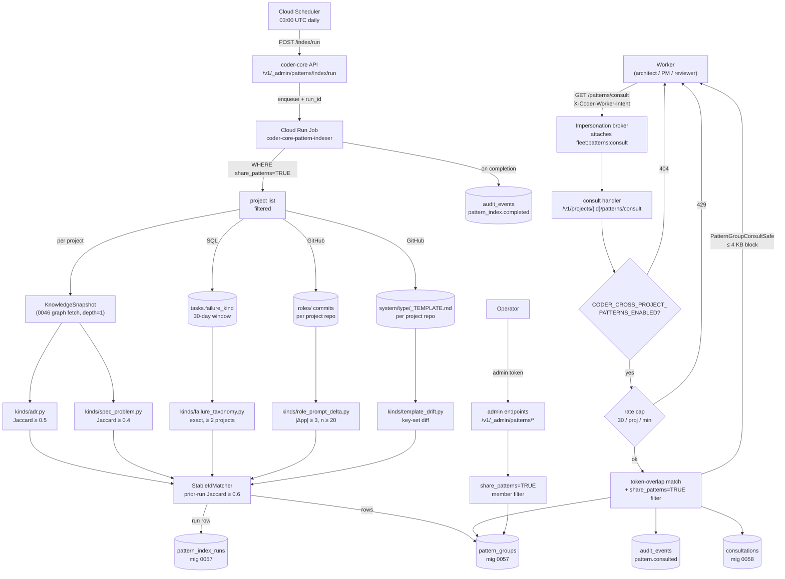

# 0048 — Cross-project pattern surfacing

## Context

Spec 0048 wants a **read-only fleet-scoped pattern index** that
operators can browse and that workers can opt in to consult before
making decisions. The five v1 pattern kinds are `adr`,
`spec_problem`, `failure_taxonomy`, `role_prompt_delta`, and
`template_drift`. Membership is computed daily by an offline
indexer; per-request endpoints serve the persisted index. Worker
consultations are audit-logged and cite-trail-visible via a new
`informed_by_patterns` frontmatter field.

This design wires the indexer Cloud Run Job, the persisted tables
(`pattern_groups`, `pattern_index_runs`, `consultations`), the
admin endpoints + worker consult endpoint, the broker change that
lets a project-scope worker call a fleet-scope pattern API without
leaking content across tenants, and the admin UI page (deferred).

The **isolation invariant** is the load-bearing constraint: nothing
in this design lets project B's content reach project A through a
worker call. The consult endpoint returns _structural metadata +
stable `pattern_id` + project-id list of origins_; to read another
project's actual artifact body the operator must use the per-project
admin API directly with their own admin scope.

**Post-seal revisions (2026-04-28).** This document supersedes the
pre-seal draft (2026-04-19). Key refinements:

- Multi-tenancy tightened: `projects.share_patterns BOOLEAN NULL`
  (migration 0059); NULL = opt-out, not opt-in-by-default. A
  project must explicitly set `share_patterns=TRUE` to contribute.
- Fleet flag renamed to `CODER_CROSS_PROJECT_PATTERNS_ENABLED`.
- All pre-seal open questions resolved inline.
- Worker integration section added: 4 KB hint payload cap +
  redaction rule.
- Worked example (ADR pattern end-to-end) added.
- ADRs 0022 (discovery mechanism), 0023 (surface choice), 0024
  (enforcement boundary) drafted.

## Goals / non-goals

**Goals:**

- Indexer is the only producer. No per-request similarity
  computation; daily Cloud Run Job writes `pattern_groups` rows.
- Stable `pattern_id` across runs so `informed_by_patterns`
  citations survive re-indexing (ADR 0022).
- Structural similarity only in v1: Jaccard for `adr` /
  `spec_problem`, exact for `failure_taxonomy`, pre/post window
  for `role_prompt_delta`, key-set diff for `template_drift`. No
  embeddings, no LLM (ADR 0014 rationale applies here too).
- One audit row per consult, in two places: `consultations` table
  + `audit_events`.
- Per-project per-minute rate cap on the consult endpoint.
- Admin scope on fleet endpoints; project scope through the broker
  on the consult endpoint (ADR 0023).
- `share_patterns=TRUE` required for a project's knowledge to appear
  in any pattern group or consult response (ADR 0024).

**Non-goals:**

- Cross-project writes. Nothing here writes to any project repo.
- Semantic or LLM similarity (ADR 0014 + ADR 0022).
- MCP resource in v1 (ADR 0023; deferred to Stage 2).
- Admin SPA page in v1 (separate WIP, deferred).
- Pattern curation or editing flow (Stage 2).

## Design

### Architecture



### Parts

- **`coder_core/patterns/indexer.py`** (new) — entry point for the
  Cloud Run Job. Owns per-kind dispatch, stable-id matching,
  `pattern_groups` row writes, audit event at completion. Takes a
  `PatternIndexerInputs` value object (snapshots dict,
  tasks_aggregate, role_commits dict, template_files dict) and
  returns `list[PatternGroupCandidate]`; the runner wrapper does I/O.
- **`coder_core/patterns/kinds/`** (new) — one module per kind.
  Each exports a pure `compute(inputs) -> list[PatternGroupCandidate]`.
  v1: `adr.py`, `spec_problem.py`, `failure_taxonomy.py`,
  `role_prompt_delta.py`, `template_drift.py`. Unit-testable in
  isolation.
- **`coder_core/patterns/stable_id.py`** (new) — `StableIdMatcher`
  loads the prior run's `pattern_groups`, matches new candidates by
  member-key Jaccard ≥ 0.6 on `{(project_id, member_artifact_key)}`,
  reuses the prior `id` on match, or mints
  `<kind>-<sha1(kind|sorted_member_keys)[:12]>` on first appearance.
- **`coder_core/patterns/runner.py`** (new) — Cloud Run Job wrapper.
  Filters the project list to `share_patterns=TRUE`, fetches per-
  project snapshots via the existing 0046 graph endpoint (depth=1),
  fetches tasks aggregate + role commits + template files, invokes
  the indexer, writes rows, manages `pattern_index_runs` open/close,
  emits audit event.
- **`coder_core/api/patterns.py`** (new) — FastAPI router for every
  endpoint.
- **`coder_core/api/_brokers/patterns_consult.py`** (new) — consult
  helper: token-overlap match against latest run's `pattern_groups`,
  applies `share_patterns=TRUE` member filter, reduces to safe shape,
  writes consultation row and audit row.
- **Impersonation broker change** — `coder_core/impersonation/broker.py`
  recognises `X-Coder-Worker-Intent: patterns_consult`; validates
  project scope; attaches `fleet:patterns:consult` scope on outbound;
  emits `broker.scope_attached` audit row. This scope is accepted by
  exactly one endpoint (`/patterns/consult`) — ADR 0023.
- **Tables:** `pattern_groups` + `pattern_index_runs` (mig 0057),
  `consultations` + `projects.fleet_patterns_enabled` (mig 0058),
  `projects.share_patterns` (mig 0059).

### Pattern definition — first targets

A **pattern** is a named group of same-kind artifacts from two or
more `share_patterns=TRUE` projects where the kind-specific
similarity score meets the configured floor. Each pattern has:

- A stable `pattern_id` sticky across indexer runs.
- A `kind` from the five v1 kinds.
- A `members[]` list of `(project_id, artifact_id,
  decision_pill_or_summary)` — structural metadata only,
  no artifact bodies.
- A `score` (Jaccard for `adr`/`spec_problem`, failure count for
  `failure_taxonomy`, Δpp for `role_prompt_delta`, field count for
  `template_drift`).

**Concrete first targets:**

| Kind | First real pattern | Contributing projects |
|---|---|---|
| `adr` | "Background job runner: Cloud Run Jobs + Scheduler" — both `coder` and `vibetrade` have ADRs rejecting Celery. Jaccard on title tokens = 0.63. | coder, vibetrade |
| `spec_problem` | "Knowledge silo across projects" — both have a spec whose `## Problem` first paragraph describes per-project knowledge isolation. Jaccard ≈ 0.47. | coder, vibetrade |
| `failure_taxonomy` | `schema_validation_failed` appearing in both projects' failed tasks over the last 30 days. | coder, vibetrade |
| `role_prompt_delta` | `coder`'s `roles/reviewer.md` edit on 2026-04-12 → approval-rate delta +6 pp (n=47). | coder (single-member; intrinsically per-project) |
| `template_drift` | `informed_by_patterns` field present in `coder`'s `system/designs/_TEMPLATE.md` but absent from the central template. | coder |

The `adr` background-job-runner pattern is the worked example below.

### Worked example — ADR pattern surfaced to the Architect worker

**Setup.** `coder` has ADR 0041 titled "Use Cloud Run Jobs and
Cloud Scheduler for background work"; its `## Decision` first
sentence: "Use Cloud Run Jobs + Cloud Scheduler for all background
job workloads; reject Celery." `vibetrade` has ADR 0009 titled
"Background job runner: Cloud Run Jobs + Scheduler"; first sentence:
"Cloud Run Jobs + Scheduler; Celery explicitly rejected due to ops
overhead." Both projects have `share_patterns=TRUE`.

**Indexer run:**

1. `kinds/adr.py` collects all ADR titles from `share_patterns=TRUE`
   projects. Tokenises coder/adr-0041:
   `{cloud, run, jobs, scheduler, background, work}`. Tokenises
   vibetrade/adr-0009: `{background, job, runner, cloud, run,
   jobs, scheduler}`.
2. Jaccard = |{cloud,run,jobs,scheduler,background}| /
   |{cloud,run,jobs,scheduler,background,work,job,runner}| = 5/8 =
   0.625 ≥ 0.5 floor → grouped.
3. `StableIdMatcher`: no prior group with overlapping members → mint
   `pattern_id = "adr-cloud-run-background-a3f2c8"` (deterministic
   SHA of sorted member keys).
4. `pattern_groups` row written: `id='adr-cloud-run-background-a3f2c8'`,
   `kind='adr'`, `title='ADR: background job runner (2 projects)'`,
   `score=0.625`, `members=[{project_id:'coder', artifact_id:'adrs/0041',
   decision_pill_or_summary:'Use Cloud Run Jobs + Cloud Scheduler...'
   (truncated to 200 chars)}, {project_id:'vibetrade', artifact_id:
   'adrs/0009', decision_pill_or_summary:'Cloud Run Jobs + Scheduler;
   Celery explicitly rejected...'}]`.

**Worker consultation.**
Architect worker assembling context for a `vibetrade` task
"Design notification dispatch service". The spec has an
`## Open questions` bullet about "background job runner choice".

1. `architect_pattern_consult_enabled=true` → worker calls
   `GET /v1/projects/vibetrade/patterns/consult?topic=background+job+runner&kinds=adr&max_results=5`
   with `X-Coder-Worker-Intent: patterns_consult`.
2. Broker validates `vibetrade` project token, attaches
   `fleet:patterns:consult` scope.
3. Handler: `CODER_CROSS_PROJECT_PATTERNS_ENABLED=true`,
   `vibetrade.fleet_patterns_enabled=NULL` (inherits fleet = true).
   Rate cap ok. Tokenises topic → matches `adr-cloud-run-background-a3f2c8`
   (score 0.63). Both members' `project_id` have `share_patterns=TRUE`
   → include. Writes `consultations` row + `audit_events` row.
4. Response: `{groups:[{pattern_id:'adr-cloud-run-background-a3f2c8',
   kind:'adr', title:'ADR: background job runner (2 projects)',
   members:[{project_id:'coder',artifact_id:'adrs/0041',
   decision_pill_or_summary:'Use Cloud Run Jobs + Cloud Scheduler...'
   },…]}], consultation_id:'…', index_age_minutes:420}`.

**Prompt injection (worker side):**

```
# Cross-project precedent
Index age: 7 h | Pattern adr-cloud-run-background-a3f2c8

## ADR: background job runner (2 projects)
- coder / adrs/0041: "Use Cloud Run Jobs + Cloud Scheduler for all
  background job workloads; reject Celery."
- vibetrade / adrs/0009: "Cloud Run Jobs + Scheduler; Celery
  explicitly rejected due to ops overhead."
```

Block size: ~320 bytes (well within 4 KB cap).

**Worker output.** New design's frontmatter includes
`informed_by_patterns: ['adr-cloud-run-background-a3f2c8']`. No
content from `coder`'s ADR body appears in the design; only the
200-char pill was available to the worker.

### Discovery mechanism

Structural Jaccard similarity, computed offline by the daily indexer
(ADR 0022). v1 ships no manual annotation surface and no
audit-emitted hint capture. The bootstrap is operator-triggered:
after at least two projects have `share_patterns=TRUE`, the operator
calls `POST /v1/_admin/patterns/index/run` to inspect the first
groups before the daily tick fires.

**Threshold tuning.** The initial floors (0.5 for `adr`, 0.4 for
`spec_problem`) are hand-calibrated for a 2-project fleet. The
runbook specifies: spot-check 20 groups per run at each fleet-size
milestone (3, 4, 8 projects); label false-positives and false-negatives;
adjust in a small reviewable PR carrying the labelling data.

**Consult endpoint match.** The `topic` string from the worker is
tokenised with the same tokeniser the indexer uses (lowercase,
stop-word-removed, 1-char tokens dropped). Jaccard is computed
against group titles + member `decision_pill_or_summary` fields in
the latest run. v1 ships Jaccard because the indexed set is small
(≤ few hundred groups); n-gram or IDF reweighting is a v2 option
if recall proves poor.

### Surface

Three surfaces ship in v1 (ADR 0023):

1. **Admin API** (`/v1/_admin/patterns/*`, admin token) — the
   primary operator surface. Paginated group list, single-group
   detail, indexer run history, manual trigger.
2. **Worker consult endpoint**
   (`/v1/projects/{id}/patterns/consult`, project scope through
   the broker) — the primary worker surface. Rate-capped,
   audited, safe-shape only.
3. **`informed_by_patterns` frontmatter field** — artifact-level
   citation trail. Written by the worker into any produced
   design/ADR/spec. Not a live endpoint; visible in the artifact.

MCP resource is **deferred to Stage 2**. The consult endpoint is
the canonical pattern surface; duplicating it as an MCP tool before
adoption is validated adds risk with no benefit (ADR 0023).

Admin SPA page (`/admin/patterns`) is deferred (separate WIP) and
ships behind `VITE_FLEET_PATTERNS_ENABLED`.

### Multi-tenancy

**Column:** `projects.share_patterns BOOLEAN NULL` (migration 0059).

| Value | Meaning |
|---|---|
| `NULL` | Opt-out (default). Project does not contribute to the index and its artifacts never appear in any pattern group. No project shares unless explicitly enabled. |
| `TRUE` | Active share. The project's artifacts are included in indexer runs and may appear in `pattern_groups` members. |
| `FALSE` | Explicit hide. Semantically equivalent to NULL for current runs; carries the intent that the project was previously opted in and deliberately opted back out. |

**Read-side enforcement (ADR 0024):**

- **Indexer** — `runner.py` opens with
  `SELECT id FROM projects WHERE share_patterns = TRUE`. Projects
  with `NULL` or `FALSE` are never fetched; their artifacts never
  enter any `pattern_groups` row.
- **Consult endpoint** — after the token-overlap match, the handler
  re-verifies each candidate group's members: any member whose
  project has `share_patterns != TRUE` is stripped. A group that
  falls below 2 remaining members is dropped from the response.
  This serve-time re-check handles the case where a project sets
  `share_patterns=FALSE` after a group was indexed.
- **Admin endpoints** — same member-project filter applied. Admin
  scope bypasses authentication, not data policy. An admin token
  cannot see a non-sharing project's knowledge through the patterns
  surface; they must use the per-project `/v1/projects/{id}/knowledge/`
  endpoints.
- **`fleet_patterns_enabled` (consumption gate)** — separate from
  `share_patterns`. A project can share (`share_patterns=TRUE`) but
  disable its own workers from consulting (`fleet_patterns_enabled=FALSE`),
  or vice versa. The consult endpoint checks both:
  `CODER_CROSS_PROJECT_PATTERNS_ENABLED` (fleet) AND
  `projects.fleet_patterns_enabled` (project, NULL=inherit fleet).

### Pattern storage

A dedicated `pattern_groups` table (not a derived view). Patterns
are computed at index time and persisted; endpoints serve
pre-computed rows. A view cannot persist stable `pattern_id` values
across runs, and per-request Jaccard computation over full knowledge
snapshots would be 10–100× more expensive than serving pre-built
rows. The table is the right choice.

Old rows (from prior index runs) are retained. `GET
/v1/_admin/patterns` filters to the latest run by default; an
operator can pass `?run_id=<prior>` to inspect history. Default
`?since=90d` on the admin endpoint surfaces only groups active in
the last 90 days (computed_at window); the operator can toggle to
see all.

### Refresh

**Daily Cloud Run Job** at 03:00 UTC (Cloud Scheduler), also
triggerable via `POST /v1/_admin/patterns/index/run`. The 24-hour
cadence is appropriate because:

- Pattern computation reads the full knowledge snapshot for every
  participating project. Event-driven refresh would require O(projects
  × commits/day) full-snapshot reads vs O(projects) per day.
- Operator browsing and worker pre-decision consultation are both
  ≤-daily in practice. Sub-daily freshness is not needed.
- `index_age_minutes` in every response makes staleness observable.

_Event-driven_ and _lazy-on-read_ were both rejected: event-driven
multiplies costs proportionally with commit frequency; lazy-on-read
is incompatible with the consult endpoint's < 200 ms p99 SLA.

**Failure recovery.** A watchdog Cloud Scheduler tick (every 30 min)
flips `pattern_index_runs` rows with `status='running'` and
`started_at < now() - interval '60 minutes'` to
`status='failed', error_kind='watchdog_timeout'`. Prevents orphaned
run rows from blocking "get latest run" queries.

### Audit

Every **consult call** writes:

1. A `consultations` row.
2. An `audit_events` row (`action='pattern.consulted'`,
   `target_type='pattern_consultation'`,
   `target_id=<consultation_id>`,
   `detail={topic, kinds_requested, pattern_ids_returned}`).

Every **indexer run** writes:
- `audit_events` row on completion or failure
  (`action='pattern_index.completed'|'pattern_index.failed'`,
  `target_type='pattern_index_run'`, `target_id=<run_id>`).

Every **broker scope attachment** writes:
- `audit_events` row (`action='broker.scope_attached'`,
  `target_type='fleet:patterns:consult'`).

Operators answer "which projects' knowledge surfaced in which workers?"
by querying `consultations JOIN pattern_groups ON
pattern_ids_returned && ARRAY[pattern_groups.id]` filtered by date.

### Worker integration

**Architect worker — trigger conditions** (gated on
`architect_pattern_consult_enabled`, default false):

- Spec frontmatter has a `decided_by` request field, OR
- Spec body has an `## Open questions` section with ≥ 1 bullet.

`topic` = spec title + first sentence of `## Problem` section
(regex-extracted). Both parts concatenated, stop-word-removed, fed
to the consult call.

**PM worker + TM worker** — deferred to Stage 5 per spec; same
shape.

**Hint payload cap.** The `# Cross-project precedent` prompt block
is hard-truncated to **4 096 bytes** total before injection into
the pre-claude context. Calculation: 5 groups × 2 members × ~200
chars/pill + headers ≈ 2 200 bytes at default `max_results=5`;
headroom is consumed by longer pills or more members. If truncation
fires, the worker appends `[… N groups omitted — consult
/v1/_admin/patterns for the full list]`.

**Redaction rule.** The `PatternGroupConsultSafe` Pydantic model
(Config.extra='forbid') enforces that only these fields cross tenant
lines per member:

| Field | Max length | Notes |
|---|---|---|
| `project_id` | opaque str | Already known as "a fleet project" |
| `artifact_id` | opaque str | Not the title or body |
| `decision_pill_or_summary` | 200 chars | `## Decision` first sentence, hard-truncated by indexer |
| `pattern_id` | stable str | Identifier only |

Stripped at the model level: `body`, raw `frontmatter`, `freshness`,
`last_verified_at`, `created_at`, role-prompt diff hunks (for
`role_prompt_delta`, the consult response carries only
`delta_pp + sample_size_n`). A schema test asserts
`Config.extra = 'forbid'` prevents any field addition that is not
explicitly reviewed under this invariant.

## Data flow — daily indexer run

1. Cloud Scheduler POSTs to `/v1/_admin/patterns/index/run` at
   03:00 UTC. Endpoint inserts a `pattern_index_runs` row
   (`status='running'`, `started_at=now()`), returns `{run_id}`,
   enqueues the Cloud Run Job with `PATTERN_INDEX_RUN_ID=<run_id>`.
2. Job opens with `SELECT id FROM projects WHERE share_patterns=TRUE`.
   Also captures `main` branch SHA per project (used as snapshot ref).
3. Per opted-in project, fetches the knowledge snapshot via the
   existing `/v1/projects/{id}/knowledge/graph` endpoint (0046),
   depth=1 from the registry root. Snapshots cached in-memory.
4. Runs per-kind modules:
   - **`adr`** — collect `(project_id, adr_id, adr_title,
     decision_first_sentence)` across snapshots; tokenise titles;
     group by transitive Jaccard ≥ `adr_jaccard_floor`; keep groups
     with ≥ 2 distinct `project_id`s.
   - **`spec_problem`** — same shape on first `## Problem` paragraph,
     Jaccard ≥ `spec_jaccard_floor`.
   - **`failure_taxonomy`** — SQL: group `tasks.failure_kind` by
     `(failure_kind, project_id)` over the last 30 days where
     `status='failed'`; keep `failure_kind`s present in ≥ 2 projects.
   - **`role_prompt_delta`** — for each project's `roles/*.md`,
     find the latest commit in the last 30 days; compute
     `tasks.status='accepted'/total` in `(T-3d, T)` and `(T, T+7d)`
     windows per role; keep `|delta_pp| ≥ min_pp` with `n ≥ min_sample_n`.
     Each surviving (project, role) is a single-member group.
   - **`template_drift`** — parse each project's
     `system/<type>/_TEMPLATE.md` frontmatter key sets; diff against
     the central `coder-system/template/system/<type>/_TEMPLATE.md`;
     emit one group per `(artifact_type, field_name)` present in ≥ 1
     project but absent centrally.
5. `StableIdMatcher.assign_ids(candidates, prior_run_id)`: for each
   candidate, compute Jaccard on `{(project_id, member_key)}` against
   each prior group of the same kind. If overlap ≥ 0.6 → reuse the
   prior `id`. Else mint
   `<kind>-<sha1(kind|sorted_member_keys)[:12]>` as a new id.
   Iteration order is sorted on `(kind, sorted_member_keys)` to
   guarantee determinism.
6. Write one `pattern_groups` row per assigned candidate. Old rows
   from prior `index_run_id`s are kept; `GET /v1/_admin/patterns`
   filters to the latest run by default.
7. Flip `pattern_index_runs.status='completed'`, set `completed_at`,
   write `per_kind_counts` and `snapshots_at`. Emit
   `audit_events` row (`action='pattern_index.completed'`). On
   exception: `status='failed'`, `error_kind`, `error_detail`, emit
   `'pattern_index.failed'`.

## Data flow — worker consultation

1. Architect worker decides (per trigger conditions above) to call
   the consult endpoint. Builds `topic` from spec title + first
   sentence of `## Problem`.
2. Calls `GET /v1/projects/{id}/patterns/consult?topic=…&kinds=adr
   &max_results=5` with `X-Coder-Worker-Intent: patterns_consult`
   and project-scope token.
3. Impersonation broker validates project token; recognises intent
   header; attaches `fleet:patterns:consult` scope on outbound;
   emits `broker.scope_attached` audit row.
4. Handler:
   - Checks `CODER_CROSS_PROJECT_PATTERNS_ENABLED` (fleet) AND
     `projects.fleet_patterns_enabled` (tri-state, NULL=inherit
     fleet). If either resolves to false → 404 `not_enabled`.
   - Checks per-project per-minute rate cap via `consultations`
     row count in the last minute. If ≥ cap → 429 `Retry-After: 60`.
   - Tokenises `topic`, runs Jaccard match against the latest run's
     `pattern_groups` of the requested `kinds`, ranks by score,
     truncates to `max_results`.
   - **Re-verifies** each candidate group's members:
     `SELECT share_patterns FROM projects WHERE id = member.project_id`.
     Strips members with `share_patterns != TRUE`; drops groups with
     < 2 remaining members.
   - Reduces surviving members to `PatternGroupConsultSafe` shape.
   - Inserts `consultations` row + `audit_events` row in the same
     transaction.
   - Returns response.
5. Worker incorporates the response into the `# Cross-project
   precedent` block (≤ 4 KB cap). Proceeds with the claude spawn.
   If citing any pattern, writes `informed_by_patterns: [pattern_id,
   …]` into the produced artifact's frontmatter.

## Invariants

- **No body content crosses tenant lines via consult.** The consult
  endpoint's `PatternGroupConsultSafe` model (`Config.extra='forbid'`)
  excludes `body`, raw `frontmatter`, and freshness detail. A schema
  test asserts this. Adding any content-bearing field requires an
  explicit review against this invariant.
- **`share_patterns=TRUE` is the only gate for contributing.** A
  project with `share_patterns=NULL` or `share_patterns=FALSE` never
  contributes to any pattern group in any run.
- **Serve-time re-check prevents stale opt-outs surfacing.** Even
  if a group was indexed while a project was sharing, a subsequent
  opt-out is reflected at the next consult call without waiting for
  a new indexer run.
- **Admin scope does not bypass `share_patterns`.** Admin tokens see
  the same `share_patterns=TRUE` filter as project tokens. Only the
  per-project knowledge API (separate surface) lets admins read any
  project's content directly.
- **Indexer only reads.** The indexer never opens a PR, never writes
  to any project repo, never mutates `audit_events` beyond its own
  completion event.
- **`pattern_index_runs` rows are append-only** except
  `completed_at` / `status` / `error_*` on the run's own completion.
  Historical runs stay queryable.
- **Stable ID reuse is deterministic.** `StableIdMatcher` iterates
  candidates in sorted order; the same (prior run, candidates) input
  produces the same IDs.
- **`fleet:patterns:consult` scope grants exactly one endpoint.**
  The broker whitelist accepts this scope only for
  `/v1/projects/{id}/patterns/consult`. Presenting it elsewhere →
  403.
- **Rate cap is project-keyed.** A fleet of workers in one project
  shares the cap; the cap cannot be circumvented by using multiple
  worker tokens for the same project.

## Interfaces

### API

```
GET  /v1/_admin/patterns
     ?kinds=adr,spec_problem
     &min_projects=2
     &since=90d          # default; pass since=all to see full history
     &page=1&page_size=50
→ {groups: [PatternGroup], page, total,
   latest_run: {id, completed_at, index_age_minutes}}

GET  /v1/_admin/patterns/{pattern_id}
→ {group: PatternGroupFull, members_full: [PatternMemberFull],
   index_age_minutes: N, history: [{run_id, computed_at, score}]}

GET  /v1/_admin/patterns/index/runs[?limit=20]
→ {runs: [{id, started_at, completed_at, status,
           per_kind_counts, snapshots_at, error_kind, error_detail}]}

POST /v1/_admin/patterns/index/run
     body: {kinds_filter?: [string]}
→ {run_id, enqueued_at}

GET  /v1/projects/{id}/patterns/consult
     ?topic=<short string>
     &kinds=adr          # comma-separated; default adr
     &max_results=5      # default 5; max 20
     header: X-Coder-Worker-Intent: patterns_consult
→ 200 {groups: [PatternGroupConsultSafe], consultation_id,
       index_age_minutes}
→ 404 {error: 'not_enabled'}
→ 429 {error: 'rate_capped', retry_after_seconds: 60}
```

### Pydantic models

```python
class PatternGroupConsultSafe(BaseModel):
    pattern_id: str
    kind: Literal['adr', 'spec_problem', 'failure_taxonomy',
                  'role_prompt_delta', 'template_drift']
    title: str
    members: list[PatternMemberConsultSafe]

    class Config:
        extra = 'forbid'  # invariant guard

class PatternMemberConsultSafe(BaseModel):
    project_id: str
    artifact_id: str | None   # None for failure_taxonomy
    decision_pill_or_summary: str   # ≤ 200 chars, hard-truncated

    class Config:
        extra = 'forbid'
```

### CLI

```
coder patterns index --run-now
    → POST /v1/_admin/patterns/index/run

coder patterns list [--kind adr] [--since 30d] [--min-projects 2]
    → GET /v1/_admin/patterns

coder patterns show <pattern_id>
    → GET /v1/_admin/patterns/{pattern_id}
```

### Cloud infrastructure

- **Cloud Scheduler:** daily 03:00 UTC POST to
  `/v1/_admin/patterns/index/run` with no kinds filter.
- **Cloud Run Job:** `coder-core-pattern-indexer`, oneshot, reads
  `PATTERN_INDEX_RUN_ID` env var. Exits 0 on success, 1 on
  uncaught exception (also writes `status='failed'` row before exit).
- **Watchdog tick:** Cloud Scheduler every 30 min. Calls a lightweight
  endpoint `POST /v1/_admin/patterns/index/watchdog` that flips
  `status='failed', error_kind='watchdog_timeout'` on any
  `pattern_index_runs` row where `status='running'` and
  `started_at < now() - interval '60 minutes'`.

### Audit actions

| action | target_type | When |
|---|---|---|
| `pattern_index.completed` | `pattern_index_run` | Indexer run finishes normally |
| `pattern_index.failed` | `pattern_index_run` | Indexer run fails (including watchdog flip) |
| `pattern.consulted` | `pattern_consultation` | Consult endpoint call (including rate-capped calls; the row records the 429) |
| `broker.scope_attached` | `fleet:patterns:consult` | Broker attaches fleet scope on a valid consult intent |

### Tables — migration 0057

```sql
CREATE TABLE pattern_index_runs (
  id          UUID PRIMARY KEY,
  started_at  TIMESTAMPTZ NOT NULL,
  completed_at TIMESTAMPTZ,
  status      TEXT NOT NULL,          -- running | completed | failed
  error_kind  TEXT,
  error_detail JSONB,
  per_kind_counts JSONB,
  snapshots_at JSONB                  -- {project_id: sha, ...}
);
CREATE INDEX ON pattern_index_runs (started_at DESC);

CREATE TABLE pattern_groups (
  id           TEXT NOT NULL,
  index_run_id UUID NOT NULL REFERENCES pattern_index_runs(id),
  kind         TEXT NOT NULL,
  title        TEXT NOT NULL,
  members      JSONB NOT NULL,        -- [PatternMemberFull]
  score        DOUBLE PRECISION,
  sample_size_n INT,
  computed_at  TIMESTAMPTZ NOT NULL DEFAULT now(),
  PRIMARY KEY (index_run_id, id)
);
CREATE INDEX ON pattern_groups (kind, index_run_id);
CREATE INDEX ON pattern_groups (id);
```

### Tables — migration 0058

```sql
CREATE TABLE consultations (
  id                   UUID PRIMARY KEY DEFAULT gen_random_uuid(),
  project_id           TEXT NOT NULL,
  requesting_task_id   UUID,
  topic                TEXT NOT NULL,
  kinds_requested      TEXT[] NOT NULL,
  pattern_ids_returned TEXT[] NOT NULL,
  consulted_at         TIMESTAMPTZ NOT NULL DEFAULT now()
);
CREATE INDEX ON consultations (project_id, consulted_at DESC);

ALTER TABLE projects
  ADD COLUMN fleet_patterns_enabled BOOLEAN NULL;
  -- NULL = inherit fleet flag; TRUE = enabled; FALSE = disabled
```

### Tables — migration 0059

```sql
ALTER TABLE projects
  ADD COLUMN share_patterns BOOLEAN NULL;
  -- NULL = opt-out (default); TRUE = share; FALSE = explicit hide
```

### Settings

| Key | Default | Notes |
|---|---|---|
| `patterns_consult_per_project_per_minute` | `30` | Rate cap |
| `patterns_indexer_adr_jaccard_floor` | `0.5` | `adr` similarity threshold |
| `patterns_indexer_spec_jaccard_floor` | `0.4` | `spec_problem` threshold |
| `patterns_indexer_role_delta_min_pp` | `3.0` | `role_prompt_delta` minimum |Δpp| |
| `patterns_indexer_role_delta_min_sample_n` | `20` | `role_prompt_delta` minimum sample size |
| `patterns_stable_id_jaccard_floor` | `0.6` | StableIdMatcher reuse threshold |
| `architect_pattern_consult_enabled` | `false` | Architect worker consultation gate |

Fleet flag: `CODER_CROSS_PROJECT_PATTERNS_ENABLED` (default false).
Per-project consumption gate: `projects.fleet_patterns_enabled`
(BOOLEAN NULL, migration 0058).
Per-project contribution gate: `projects.share_patterns`
(BOOLEAN NULL, migration 0059).

## Rollout

- **Stage 0 — schemas + endpoints, everything off.** Migrations
  0057–0059 apply. The indexer module + runner ship; nothing
  schedules them yet. `CODER_CROSS_PROJECT_PATTERNS_ENABLED=false`
  fleet-wide. All endpoints return 404 `not_enabled`. The CI
  validator's `informed_by_patterns` soft check ships (no patterns
  exist → every cite warns, but no artifact has cites yet). Admin SPA
  page ships empty behind `VITE_FLEET_PATTERNS_ENABLED=false`.

- **Stage 1 — manual indexer run, `coder` only.** Operator sets
  `projects.share_patterns=TRUE` on `coder` only, sets
  `CODER_CROSS_PROJECT_PATTERNS_ENABLED=true`, triggers
  `POST /v1/_admin/patterns/index/run`. Single-project run: only
  `role_prompt_delta` and `template_drift` may produce groups
  (they're per-project intrinsically); `adr` / `spec_problem` /
  `failure_taxonomy` need ≥ 2 projects. Operator inspects the admin
  API, the per-kind counts in `pattern_index_runs`. Consult endpoint
  stays disabled (`fleet_patterns_enabled=NULL` on `coder` = inherit
  fleet = still disabled until Stage 3).

- **Stage 2 — second project (e.g. `vibetrade`) added with
  `share_patterns=TRUE`.** Indexer now produces real cross-project
  groups. Operator reviews the admin API for the first time with
  meaningful content. Spot-check 20 groups for false positives; tune
  Jaccard floors if needed. Schedule the daily 03:00 UTC tick.

- **Stage 3 — `architect_pattern_consult_enabled=true` for `coder`.**
  `coder`'s architect worker calls consult before drafting designs.
  Monitor `consultations` row count and the headline KPI (≥ 30%
  of architect tasks producing an ADR call the consult endpoint).
  `informed_by_patterns` frontmatter starts appearing on designs.

- **Stage 4 — fleet flip.** `CODER_CROSS_PROJECT_PATTERNS_ENABLED=true`
  fleet-wide; per-project `fleet_patterns_enabled` default flips on.
  Workers in any project that shares patterns can consult.
  `VITE_FLEET_PATTERNS_ENABLED=true` lights up the admin page.

- **Stage 5 — PM + TM workers added to consult.** PM worker's draft
  path gains the same opt-in step (deferred AC). TM worker added
  subsequently.

- **Stage 6 — `template_drift` → 0047 promotion loop active.** First
  operator-driven template promotion via the "Propose template
  promotion" button validates the 0047 ↔ 0048 handoff.

## Backout plan

- **Per-project disable consultation:** `PATCH /v1/projects/{id}`
  `fleet_patterns_enabled=false`. Next worker call → 404 immediately.
- **Per-project disable contribution:** `PATCH /v1/projects/{id}`
  `share_patterns=false`. Serve-time re-check strips that project's
  members at the next consult call; next indexer run excludes the
  project entirely.
- **Fleet kill switch:** `CODER_CROSS_PROJECT_PATTERNS_ENABLED=false`.
  All consult calls → 404; indexer job aborts with
  `status='failed', error_kind='disabled'` if invoked. Data preserved.
- **Admin UI off:** `VITE_FLEET_PATTERNS_ENABLED=false`. Endpoints
  remain live for CLI + worker traffic.
- **Bad indexer ship producing nonsense groups.** Disable the daily
  tick, fix the bug, re-run manually. Stable-id reuse means citations
  to ids from the bad run resolve to bad-run rows; per AC5 these are
  warnings not errors, so artifacts stay valid.
- **Bad consult endpoint leaking content.** Most serious failure.
  Kill `CODER_CROSS_PROJECT_PATTERNS_ENABLED` immediately. Audit any
  `consultations` rows from the affected window. Notify affected
  tenants. The `Config.extra='forbid'` + schema test are the
  primary guard; this path exists if both are somehow bypassed.
- **Rate cap misconfigured.** Pure config:
  `patterns_consult_per_project_per_minute` is a settings knob;
  re-deploy or hot patch.

## Links

- Spec: [0048](../../product-specs/wip/0048-cross-project-patterns.md)
- ADRs: [0022](../../adrs/0022-structural-jaccard-for-pattern-discovery.md),
  [0023](../../adrs/0023-admin-api-and-consult-endpoint-as-pattern-surfaces.md),
  [0024](../../adrs/0024-share-patterns-column-as-enforcement-boundary.md)
- Related designs:
  [0046](./0046-graph-aware-retrieval.md) (graph fetch reused by indexer),
  [0049](./0049-mcp-agent-interface.md) (MCP surface deferred here),
  [impersonation](../active/impersonation.md) (broker extension),
  [audit-log](../active/audit-log.md) (audit parity),
  [knowledge-write-api](../active/knowledge-write-api.md),
  [knowledge-freshness](../active/knowledge-freshness.md)
