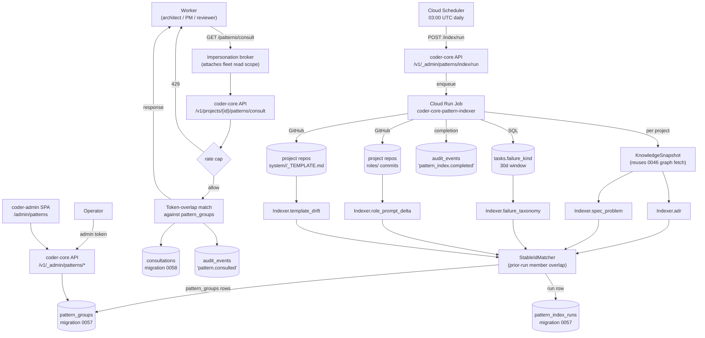

# 0048 — Cross-project pattern surfacing

## Context

Spec 0048 wants a **read-only fleet-scoped pattern index** that
operators can browse and that workers can opt in to consult before
making decisions. The five v1 pattern kinds are `adr`,
`spec_problem`, `failure_taxonomy`, `role_prompt_delta`, and
`template_drift`. Membership is computed daily by an offline
indexer; per-request endpoints serve the persisted index. Worker
consultations are audit-logged and cite-trail-visible via a new
`informed_by_patterns` frontmatter field.

This design wires the indexer Cloud Run Job, the persisted tables
(`pattern_groups`, `pattern_index_runs`, `consultations`), the
admin endpoints + worker consult endpoint, the broker change
that lets a project-scope worker call a fleet-scope pattern API
without leaking content across tenants, and the admin UI page.

The **isolation invariant** is the load-bearing constraint:
nothing in this design lets project B's content reach project A
through a worker call. The consult endpoint returns _structural
metadata + stable pattern_id + project-id list of origins_; to
read another project's actual artifact body, the operator must
click through to the admin panel with their own admin scope.

## Goals

- **Indexer is the only producer.** No per-request similarity
  computation. The five pattern kinds are computed by one daily
  Cloud Run Job that writes `pattern_groups` rows under a single
  `pattern_index_runs.id`. Endpoints serve the persisted state.
- **Stable `pattern_id` across runs** so `informed_by_patterns`
  citations don't break when the indexer re-runs (per spec OQ on
  stable ids — design lands the "match against prior run" pass).
- **Pure similarity in v1** — Jaccard on token bags for `adr`
  and `spec_problem`, exact equality for `failure_taxonomy`,
  pre/post window aggregate for `role_prompt_delta`, key-set
  diff for `template_drift`. No embeddings, no LLM.
- **One audit row per consult.** `consultations` table + an
  `audit_events` row with `action='pattern.consulted'`. The trail
  exists in two places (table + audit) so operator queries
  ("which tasks consulted patterns?") can come from either side.
- **Consult endpoint is rate-capped.** Per-project per-minute cap
  guards against runaway worker loops. 429 with `Retry-After`.
- **Admin scope on the fleet endpoints; project scope through the
  broker for the consult endpoint.** The broker, not the worker,
  attaches the fleet read scope on outbound for `/patterns/consult`
  — workers continue to hold project-scope tokens. Same pattern
  as the impersonation broker uses today for cross-tenant reads
  the worker is allowed to make on the user's behalf.

## Architecture



### Parts

- **`coder_core/patterns/indexer.py`** (new) — entry point for
  the Cloud Run Job. Owns: per-kind dispatch, stable-id matching,
  `pattern_groups` row writes, audit event at completion.
  Pure-ish: takes a `PatternIndexerInputs` value object
  (snapshots dict, tasks_aggregate, role_commits dict,
  template_files dict) and returns
  `list[PatternGroupCandidate]`; the runner wrapper does the I/O.
- **`coder_core/patterns/kinds/`** (new) — one module per pattern
  kind. Each exports a pure function
  `compute(inputs) -> list[PatternGroupCandidate]`. v1 ships
  `adr.py`, `spec_problem.py`, `failure_taxonomy.py`,
  `role_prompt_delta.py`, `template_drift.py`. Unit-testable in
  isolation with synthetic inputs.
- **`coder_core/patterns/stable_id.py`** (new) — `StableIdMatcher`
  loads the prior run's `pattern_groups`, matches new candidates
  by member-key overlap (Jaccard ≥ 0.6 on member key set
  `{(project_id, member_artifact_key)}`), and either reuses the
  prior `id` (sticky) or mints a new deterministic id
  `<kind>-<hash(sorted_member_keys)>` (first-appearance fallback).
- **`coder_core/patterns/runner.py`** (new) — Cloud Run Job
  wrapper. Owns: per-project snapshot fetch (one call per project
  through the existing graph endpoint, depth=1 from the
  registry root), tasks SQL aggregate, role-commits + template
  fetches via `GitHubClient`, indexer invoke, row writes,
  `pattern_index_runs` row open + close, audit event emit.
- **`coder_core/api/patterns.py`** (new) — FastAPI router for
  every endpoint:
  - `GET /v1/_admin/patterns` — admin token, paginated list.
  - `GET /v1/_admin/patterns/{pattern_id}` — admin token, full
    detail.
  - `GET /v1/_admin/patterns/index/runs` — admin token, recent
    runs.
  - `POST /v1/_admin/patterns/index/run` — admin token, manual
    trigger (enqueues the Cloud Run Job).
  - `GET /v1/projects/{id}/patterns/consult` — project or admin
    token, rate-capped, writes consult row + audit row.
- **`coder_core/api/_brokers/patterns_consult.py`** (new) — the
  consult endpoint's helper that runs the token-overlap match
  against the latest run's `pattern_groups`, returns up to
  `max_results` groups, reduces members to the safe shape
  `(project_id, artifact_id, decision_pill_or_summary,
  pattern_id)`. Takes the worker's `topic` string as the query.
- **Impersonation broker change** —
  `coder_core/impersonation/broker.py` recognises the `consult`
  call shape (worker attaches `X-Coder-Worker-Intent:
  patterns_consult`); the broker validates the worker's project
  scope, then attaches a special **read-only fleet pattern
  scope** (`fleet:patterns:consult`, distinct from
  `admin:full`) on the outbound call. No other endpoint accepts
  this scope. Audit row is emitted by the broker
  (`action='broker.scope_attached'`,
  `target_type='fleet:patterns:consult'`).
- **Tables:**
  - `pattern_groups` (migration 0057) per AC1.
  - `pattern_index_runs` (migration 0057) per AC1.
  - `consultations` (migration 0058) per AC4.
  - `projects` columns (migration 0058):
    `fleet_patterns_enabled BOOLEAN NULL` (tri-state inherit),
    `fleet_patterns_index_opt_in BOOLEAN NOT NULL DEFAULT
    true` (per spec OQ on tenant opt-out).
- **Settings:**
  - `patterns_consult_per_project_per_minute` (default 30) —
    rate cap.
  - `patterns_indexer_role_delta_min_sample_n` (default 20) —
    `role_prompt_delta` minimum n.
  - `patterns_indexer_role_delta_min_pp` (default 3.0) —
    `role_prompt_delta` minimum |delta|.
  - `patterns_indexer_adr_jaccard_floor` (default 0.5).
  - `patterns_indexer_spec_jaccard_floor` (default 0.4).
  - `architect_pattern_consult_enabled` (default false) — per AC10.
- **Admin SPA:** `PatternsPage.tsx` (new) at
  `/admin/patterns`; `PatternGroupCard.tsx` per row;
  `TemplatePromotionScaffoldDialog.tsx` for the
  `template_drift` "Propose template promotion" button.

### Data flow — daily indexer run

1. Cloud Scheduler at 03:00 UTC posts to
   `/v1/_admin/patterns/index/run`. The endpoint inserts a
   `pattern_index_runs` row with `status='running'`,
   `started_at=now()`, returns `{run_id}` and enqueues the
   Cloud Run Job with the row id as an env var.
2. Job loads the project list (filters out projects where
   `fleet_patterns_index_opt_in=false`).
3. Per project, it fetches the knowledge snapshot via the
   existing `/v1/projects/{id}/knowledge/graph` endpoint
   (0046) rooted at the registry, depth=1 — this gets every
   artifact's frontmatter + body in one call. Snapshots cached
   in-memory for the run.
4. Per kind module, the indexer invokes
   `kinds.<name>.compute(inputs)`:
   - **`adr`** — collect `(project_id, adr_id, adr_title,
     decision_first_sentence)` for every adr across snapshots;
     tokenise titles (lowercase, strip stopwords, drop
     1-char tokens); group pairwise where Jaccard ≥
     `adr_jaccard_floor`; expand groups by transitive overlap;
     keep groups with ≥ 2 distinct project_ids.
   - **`spec_problem`** — same shape on the first paragraph of
     each spec's `## Problem` section (regex-extracted), Jaccard
     ≥ `spec_jaccard_floor`.
   - **`failure_taxonomy`** — SQL:
     `SELECT failure_kind, project_id, COUNT(*) AS n,
      MAX(updated_at) AS last_seen
      FROM tasks
      WHERE status='failed' AND updated_at >= now() - interval '30 days'
      GROUP BY failure_kind, project_id`. Group by
     `failure_kind`, keep where
     `count(distinct project_id) >= 2`.
   - **`role_prompt_delta`** — for each role file under each
     project's `roles/`, find the latest commit in the last 30
     days touching that path. For each (project, role,
     commit_at), compute the project's
     `tasks.status='accepted' / total` for the relevant
     `task.role` over the 3 days before commit and the 7 days
     after. Skip if either window has < `min_sample_n` tasks.
     Keep where `|delta_pp| >= min_pp`. Each surviving row is
     a single-member group (no cross-project equivalence
     here; the surface is "this role-prompt edit moved the
     needle for this project — consider adopting it").
   - **`template_drift`** — for each project, parse
     `system/<type>/_TEMPLATE.md` frontmatter key sets;
     diff against the central `coder-system/template/system/
     <type>/_TEMPLATE.md` key set; emit one group per
     `(artifact_type, field_name)` where the field is
     present in 1+ project but absent centrally. Members
     list every project carrying the field plus
     `first_seen_in_artifact` (which artifact in that
     project's repo first added the key — found by
     `git log -S` on the field name in the artifact tree).
5. The matcher's `StableIdMatcher.assign_ids(candidates,
   prior_run_id)` walks the prior run's `pattern_groups`
   rows. For each candidate, computes Jaccard on
   `{(project_id, member_key)}` against each prior group of
   the same `kind`. If overlap ≥ 0.6 → reuse the prior
   `id`. Else mint
   `<kind>-<sha1(kind | sorted_member_keys)[:12]>` as the
   first-appearance id. The deterministic fallback ensures
   re-running the indexer on identical inputs produces
   identical ids (per AC6 determinism).
6. Indexer writes one `pattern_groups` row per assigned
   candidate with the resolved id, the new
   `pattern_index_runs.id`, the kind-specific score, and
   members JSONB. **Old rows are kept**; a candidate
   reusing a prior id has two rows (different `index_run_id`).
   `GET /v1/_admin/patterns` filters to the latest run by
   default.
7. Indexer flips `pattern_index_runs.status='completed'`,
   `completed_at=now()`, `per_kind_counts`. Emits an
   `audit_events` row (`action='pattern_index.completed'`,
   `target_type='pattern_index_run'`,
   `target_id=<run_id>`, `detail={per_kind_counts}`). On
   uncaught exception: `status='failed'`,
   `error_kind`, `error_detail`, audit event
   `'pattern_index.failed'`.

### Data flow — worker consultation

1. Architect worker, in its pre-claude assembly, decides
   (gated on `architect_pattern_consult_enabled` and the
   triggers in AC10) to call the consult endpoint. It builds
   a topic string from the spec's title + first ADR-ish
   open question.
2. Worker calls
   `GET /v1/projects/{id}/patterns/consult?topic=<>&kinds=adr&max_results=5`
   with header `X-Coder-Worker-Intent: patterns_consult` and
   its project-scope token.
3. The impersonation broker validates the worker's project
   token, recognises the intent header, attaches the
   `fleet:patterns:consult` scope on the outbound, and
   logs `broker.scope_attached`.
4. Endpoint handler:
   - Checks `CODER_FLEET_PATTERNS_ENABLED` (fleet) AND
     `projects.fleet_patterns_enabled` (resolves tri-state
     against the fleet flag — same shape as 0030/0040). If
     either disabled → 404 (looks the same as "feature
     missing"; no information about the flag state to the
     worker).
   - Checks the per-project per-minute rate cap by counting
     `consultations` rows for `project_id` in the last
     minute. If ≥ cap → 429 with `Retry-After: 60`.
   - Tokenises `topic`, runs token-overlap match against the
     latest `pattern_index_runs.id`'s `pattern_groups` rows
     of the requested `kinds`, ranks by overlap score,
     truncates to `max_results`.
   - Reduces each group's members to the safe shape (no
     bodies; only `project_id, artifact_id,
     decision_pill_or_summary, pattern_id`).
   - Inserts a `consultations` row inside the response
     transaction; emits an `audit_events` row in the same
     transaction (`action='pattern.consulted'`,
     `target_type='pattern_consultation'`,
     `target_id=<consultation_id>`,
     `detail={topic, kinds_requested, pattern_ids_returned}`).
   - Returns the response.
5. Worker incorporates the response into its prompt context
   block titled `# Cross-project precedent` and proceeds with
   the claude spawn. If the worker chooses to cite any of
   the returned groups in its output, it writes
   `informed_by_patterns: [pattern_id, ...]` into the new
   artifact's frontmatter. The runner doesn't see this; the
   citation is just a string in the worker's normal output
   schema.

### Validator change

`scripts/validate.py` (the AGENTS.md ADR 0008 validator)
gains a soft check: for each artifact whose frontmatter
contains `informed_by_patterns`, verify each id resolves
against the latest `pattern_index_runs.id`'s
`pattern_groups`. Missing → **warning** (per AC5),
collected into the validation report but not exit-failing.
Patterns may have rotated out of the latest run when an
older artifact still cites them; that's acceptable.

### Invariants

- **No body content crosses tenant lines via consult.** The
  consult endpoint's response shape is enforced by a Pydantic
  model that excludes `body`, `frontmatter` (raw),
  `freshness`, and any other field that could leak content.
  Members carry _only_ `project_id`, `artifact_id`,
  `decision_pill_or_summary`, `pattern_id`. A schema test
  asserts the model rejects extra fields (`Config.extra =
  'forbid'`). Adding any content-bearing field to that model
  is a deliberate change reviewed under this invariant.
- **Admin endpoints serve full member detail, including
  `decision_pill` longer than the safe consult version.** An
  operator with admin scope can see the full ADR title +
  decision sentence + freshness + last-verified for each
  member. The endpoint reads through the existing per-project
  artifact cache; admin scope is enough to read across
  projects.
- **Indexer only reads.** The indexer never opens a PR, never
  writes to any project's repo, never mutates audit events
  beyond its own completion event. Its output is rows in
  `pattern_groups` + `pattern_index_runs` + one audit event
  per run.
- **`pattern_index_runs` rows are append-only.** No row is
  ever updated except `completed_at`/`status`/`error_*` on
  the row's own completion. Historical runs stay queryable
  for "what did the indexer think 3 weeks ago?" — useful for
  debugging the matcher.
- **Stable id reuse is deterministic given (prior run,
  candidates).** Re-running the matcher against the same
  prior run with the same candidates produces the same ids
  (the candidate-loop iteration order is sorted on
  `(kind, sorted_member_keys)`). This is what keeps AC6 true.
- **Rate cap is project-keyed, not token-keyed.** A project
  with multiple workers shares the cap. Prevents a fleet of
  workers in one project from collectively storming the
  endpoint.
- **`fleet:patterns:consult` scope grants exactly one
  endpoint.** The broker check is whitelist, not blacklist:
  the scope only accepts requests to
  `/v1/projects/{id}/patterns/consult` and only via the
  intent header. Trying to use the scope elsewhere → 403.
- **Indexer determinism doesn't require deterministic GitHub
  state.** The indexer reads each project's `main` SHA at
  invocation start and uses that SHA for every read in the
  run; the report records the per-project SHA in
  `pattern_index_runs.detail.snapshots_at`. Running the
  indexer at 03:00 UTC vs 03:01 UTC may legitimately produce
  different membership because a project landed a commit in
  between — that's not a determinism violation, it's the
  feature.

## Interfaces

- **API** — `coder_core/api/patterns.py`:

  ```
  GET  /v1/_admin/patterns
       ?kinds=adr,spec_problem
       &min_projects=2
       &since=30d
       &page=1&page_size=50
  → {groups: [PatternGroup], page, total, latest_run: {id, completed_at}}

  GET  /v1/_admin/patterns/{pattern_id}
  → {group: PatternGroupFull, members_full: [PatternMemberFull],
     index_age_minutes: N, history: [{run_id, computed_at}]}

  GET  /v1/_admin/patterns/index/runs[?limit=20]
  → {runs: [{id, started_at, completed_at, status,
             per_kind_counts, error_kind, error_detail}]}

  POST /v1/_admin/patterns/index/run
       body: {kinds_filter?: [string]}
  → {run_id, enqueued_at}

  GET  /v1/projects/{id}/patterns/consult
       ?topic=<short>&kinds=adr&max_results=5
       header: X-Coder-Worker-Intent: patterns_consult
  → {groups: [PatternGroupConsultSafe], consultation_id,
     index_age_minutes}
  → 429 {error: 'rate_capped', retry_after_seconds}
  → 404 {error: 'not_enabled'}
  ```

- **Pydantic models:**

  ```python
  class PatternGroupConsultSafe(BaseModel):
      pattern_id: str
      kind: Literal['adr','spec_problem','failure_taxonomy',
                    'role_prompt_delta','template_drift']
      title: str
      members: list[PatternMemberConsultSafe]

      class Config:
          extra = 'forbid'  # invariant guard

  class PatternMemberConsultSafe(BaseModel):
      project_id: str
      artifact_id: str | None  # None for failure_taxonomy
      decision_pill_or_summary: str  # truncated 200 chars

      class Config:
          extra = 'forbid'
  ```

- **CLI:**
  - `coder patterns index --run-now` — admin convenience for
    `POST /v1/_admin/patterns/index/run`.
  - `coder patterns list [--kind adr] [--since 30d]` — admin
    list view.
  - `coder patterns show <pattern_id>` — admin detail view.
- **Cloud Scheduler:** daily 03:00 UTC POST to
  `/v1/_admin/patterns/index/run` with no kinds filter.
- **Cloud Run Job:** `coder-core-pattern-indexer`, oneshot,
  reads `PATTERN_INDEX_RUN_ID` env var, exits 0 on success, 1
  on uncaught (the indexer also writes `status='failed'` row
  before exit).
- **Audit:**
  - `pattern_index.completed` / `pattern_index.failed`
    (`target_type='pattern_index_run'`).
  - `pattern.consulted`
    (`target_type='pattern_consultation'`).
  - `broker.scope_attached`
    (`target_type='fleet:patterns:consult'`).
- **Tables (migration 0057):**

  ```sql
  CREATE TABLE pattern_index_runs (
    id UUID PRIMARY KEY,
    started_at TIMESTAMPTZ NOT NULL,
    completed_at TIMESTAMPTZ,
    status TEXT NOT NULL,
    error_kind TEXT,
    error_detail JSONB,
    per_kind_counts JSONB,
    snapshots_at JSONB
  );
  CREATE INDEX ON pattern_index_runs (started_at DESC);

  CREATE TABLE pattern_groups (
    id TEXT NOT NULL,
    index_run_id UUID NOT NULL REFERENCES pattern_index_runs(id),
    kind TEXT NOT NULL,
    title TEXT NOT NULL,
    members JSONB NOT NULL,
    score DOUBLE PRECISION,
    sample_size_n INT,
    computed_at TIMESTAMPTZ NOT NULL DEFAULT now(),
    PRIMARY KEY (index_run_id, id)
  );
  CREATE INDEX ON pattern_groups (kind, index_run_id);
  CREATE INDEX ON pattern_groups (id);
  ```

- **Tables (migration 0058):**

  ```sql
  CREATE TABLE consultations (
    id UUID PRIMARY KEY DEFAULT gen_random_uuid(),
    project_id TEXT NOT NULL,
    requesting_task_id UUID,
    topic TEXT NOT NULL,
    kinds_requested TEXT[] NOT NULL,
    pattern_ids_returned TEXT[] NOT NULL,
    consulted_at TIMESTAMPTZ NOT NULL DEFAULT now()
  );
  CREATE INDEX ON consultations (project_id, consulted_at DESC);

  ALTER TABLE projects
    ADD COLUMN fleet_patterns_enabled BOOLEAN NULL,
    ADD COLUMN fleet_patterns_index_opt_in BOOLEAN NOT NULL
      DEFAULT true;
  ```

## Open questions

- **Token-overlap match in the consult endpoint vs query
  rewriting.** The consult endpoint takes a free-form
  `topic` string from the worker and matches it against
  pattern group titles + member `decision_pill` strings via
  the same Jaccard tokeniser the indexer uses. A more
  expressive match (e.g. n-gram + IDF reweighting) would
  improve recall but adds an in-process index per query.
  Leaning: ship Jaccard v1 because the surface is small
  (a few hundred groups), revisit if recall is poor in the
  metrics. Risk: poor recall → worker stops calling →
  citation rate drops → headline KPI dies.

- **What does the worker's `topic` derivation look like in
  AC10?** The architect's pre-claude assembly needs to
  derive a topic string from the spec it's drafting against.
  Options: (a) spec title + first `## Open questions`
  bullet; (b) spec title + first sentence of
  `## Problem`; (c) deferred: ship AC10 with
  topic = spec title only and improve in v2. Leaning (b)
  because problem-statement language tends to align with
  cross-project ADR titles. Worth a 10-task spot-check on
  `coder` once the surface lands.

- **Stable-id matching threshold.** Jaccard ≥ 0.6 on member
  keys is a guess. Too high → ids churn (citations break).
  Too low → unrelated groups inherit each other's ids
  (citations point at the wrong thing). Leaning 0.6 with
  runbook-documented tuning loop: weekly inspect 10 reuses,
  flag false-reuses by hand, adjust. The matcher could
  alternatively require _all_ members to overlap (a strict
  superset/subset rule) for higher precision but lower
  recall — worth experimenting after the fleet has 4+
  projects.

- **Should `failure_taxonomy` aggregate at fleet scope or
  per-`failure_kind`?** v1 groups by `failure_kind` only —
  one group per kind appearing in ≥ 2 projects. An
  alternative: cluster by `failure_kind + first failing
  stage` (a `schema` failure at PM draft is a different
  pattern from a `schema` failure at architect). More
  precise, finer groups, more rows. Leaning v1's coarser
  grouping; refine if operators report the groups are too
  noisy.

- **Privacy of `role_prompt_delta` diff content.** The
  indexer materialises a `diff_summary` field per the
  spec's open question — the design lands "include the
  unified diff hunks in `members` JSONB but mark them
  `admin_only: true` and strip them from the consult
  endpoint's safe shape". The admin detail endpoint
  returns hunks; the consult endpoint returns only
  `delta_pp` + `sample_size_n` + `pattern_id`. This
  follows the spec's leaning while preserving the
  isolation invariant.

- **Aging-out logic location.** Spec OQ leans toward
  default-90-day filter on the admin page. Two places to
  enforce: (a) endpoint default `?since=90d` →
  `WHERE computed_at >= now() - interval '90 days'`; (b)
  client-side filter in the SPA. (a) is simpler and
  applies to CLI + admin alike. Leaning (a). Hard
  retention (deleting old rows) is deferred — `pattern_groups`
  growth is bounded by group count × kept runs; a separate
  GC spec can land later if it becomes a problem.

- **Indexer cost at scale.** Current sizing: ~5 projects ×
  ~100 artifacts = 500 snapshots, no LLM calls (the
  similarity is structural), one SQL aggregate, ≤ 1k
  GitHub Contents calls (cached behind the Knowledge API's
  TTL). Wall-clock target < 10 min. At 50 projects this
  becomes ≥ 5k snapshots and 10k Contents calls — still
  fine but worth re-checking. The runner already supports
  per-project parallelism; the limiter will be the
  GitHub rate limit, not compute.

- **Failure recovery for a partial indexer run.** If the
  job dies after writing some `pattern_groups` rows but
  before flipping `pattern_index_runs.status='completed'`,
  the run row stays at `'running'` indefinitely. Add a
  watchdog (separate Cloud Scheduler tick every 30 min)
  that flips runs older than `started_at + 60 min` to
  `status='failed'` with `error_kind='watchdog_timeout'`.
  Cheap insurance.

## Rollout

- **Stage 0 — schemas + tables + endpoints land, behind
  flags.** Migrations 0057 + 0058 apply. The indexer
  module + runner ship but nothing schedules them yet
  (`CODER_FLEET_PATTERNS_ENABLED=false` fleet). The
  endpoints exist but return `404 not_enabled`. The
  validator's `informed_by_patterns` soft check ships
  (no patterns exist yet → every cite warns, but no
  artifact has cites yet either). Admin SPA page ships
  empty behind `VITE_FLEET_PATTERNS_ENABLED=false`.

- **Stage 1 — manual indexer run on `coder` only.**
  Operator sets `projects.fleet_patterns_index_opt_in=true`
  on `coder` only, sets `CODER_FLEET_PATTERNS_ENABLED=true`,
  triggers `POST /v1/_admin/patterns/index/run`.
  Single-project indexer: `failure_taxonomy` and
  `template_drift` produce zero groups (need ≥ 2 projects);
  `adr` / `spec_problem` produce zero (single project's ADRs
  don't pair); `role_prompt_delta` may produce groups (it's
  per-project intrinsically). Operator inspects the admin
  page, the per-kind counts in `pattern_index_runs`. The
  consult endpoint stays disabled (`fleet_patterns_enabled
  =NULL` per project = inherit fleet → still effectively off
  until the next stage).

- **Stage 2 — second managed project added (e.g.
  `vibetrade`) with index opt-in.**
  Indexer now produces real cross-project groups. Operator
  reviews `/admin/patterns` for the first time with
  meaningful content. Spot-check 20 groups for false
  positives, tune Jaccard floors if needed. Schedule the
  daily 03:00 UTC tick.

- **Stage 3 — `architect_pattern_consult_enabled` on for
  `coder`.**
  Architect worker starts calling consult before drafting
  designs. Operator monitors `consultations` row count and
  the headline KPI (consultation rate ≥ 30% target).
  `informed_by_patterns` frontmatter starts appearing on
  designs.

- **Stage 4 — fleet flip.**
  `CODER_FLEET_PATTERNS_ENABLED=true` per-project default
  flipped on. Workers in any opted-in project consult.
  `VITE_FLEET_PATTERNS_ENABLED=true` lights up the admin
  page for everyone.

- **Stage 5 — second worker on consult.**
  PM worker's draft path gains the same opt-in consultation
  step (deferred AC). Then reviewer (deferred AC).

- **Stage 6 — `template_drift` → 0047 promotion loop
  active.**
  First operator-driven template promotion authored from a
  `template_drift` group via the "Propose template
  promotion" button. Validates the 0047 ↔ 0048 handoff.

## Backout plan

- **Per-project disable consultation:** `PATCH
  /v1/projects/{id}` setting
  `fleet_patterns_enabled=false`. Worker calls return 404
  immediately. The project's snapshots still feed the
  indexer (separate flag).
- **Per-project disable indexing:** `PATCH
  /v1/projects/{id}` setting
  `fleet_patterns_index_opt_in=false`. The next indexer run
  excludes the project from snapshots; existing
  `pattern_groups` rows referencing the project become
  stale (the next run will drop members from groups that
  lose their second project, the group itself disappears
  if `< 2` distinct projects remain).
- **Fleet kill switch:** flip
  `CODER_FLEET_PATTERNS_ENABLED=false`. All consult calls
  return 404; the indexer Cloud Run Job aborts with
  `pattern_index_runs.status='failed',
  error_kind='disabled'` if invoked. Existing data stays
  in the tables for re-enable.
- **Admin UI off:** flip `VITE_FLEET_PATTERNS_ENABLED=false`.
  Page hides; endpoints stay live for CLI + worker traffic.
- **Bad indexer ship.** A bug that produces nonsense groups
  is harmless at the read side (operator notices and the
  next good run overwrites — though history rows stay).
  Backout: disable the daily tick, fix the bug, ship a new
  image, re-run manually. The matcher's stable-id reuse
  means citations to ids assigned in the bad run will
  resolve to the bad-run rows; per AC5 these are warnings
  not errors, so artifacts stay valid.
- **Bad consult endpoint ship that leaks content.** Most
  serious failure mode, guarded by the `Config.extra =
  'forbid'` Pydantic model + a schema test. If the test
  somehow passes but the endpoint still leaks: kill switch
  the fleet flag immediately, audit any consultations from
  the affected window for what they returned, notify
  affected tenants. The consultations table is the
  audit trail.
- **Rate cap too low / too high.** Pure config:
  `patterns_consult_per_project_per_minute` is a settings
  knob. Re-deploy or a hot patch to raise/lower; existing
  consultations are unaffected.
- **`role_prompt_delta` produces noisy groups due to small
  sample size.** Raise `patterns_indexer_role_delta_min_sample_n`
  in settings; the next run filters them out.
- **`pattern_groups` row count blows up.** Add a hard cap
  on members per group (default 100; over-cap members
  truncate with `truncated_at` annotation, same shape as
  0046's graph cap). Apply to the indexer; existing rows
  unaffected.
