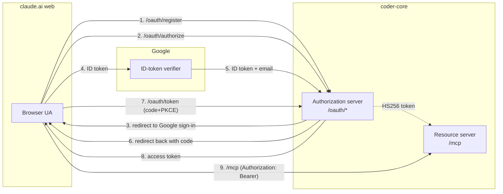
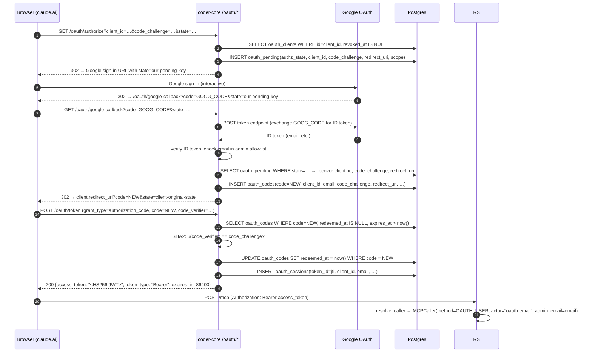

# 0050 — OAuth 2.1 for MCP clients (design)

## Context

Spec [0050](../../product-specs/wip/0050-oauth-for-mcp-clients.md)
adds an OAuth 2.1 surface to `coder-core` so claude.ai web (and
any other OAuth-only MCP client) can authenticate. This design
covers the route layout, the four new tables, the auth-code+PKCE
sequence, the resource-server validation hook, and the rollout
plan.

The core insight: we're not building a new identity store. The
admin allowlist + Google ID-token verification already decide
*who is an admin*. OAuth on top of that is a **protocol shim**
that lets a third-party client speak a standard handshake and
end up with one of our existing-shape JWTs. The new code is
mostly endpoint plumbing + state tables; the trust decisions
reuse what's already wired.

## Architecture

`coder-core` plays both roles defined by the MCP authorisation
spec:



Same FastAPI app, two route prefixes (`/oauth/*` for the AS
surface, `/mcp` for the RS surface), one signing key shared with
admin + broker JWT issuance.

## Route layout

All seven new routes mount conditionally on `MCP_OAUTH_ENABLED`.

| Route                                        | Method | Body / params                                                                                              | Returns                                |
|----------------------------------------------|--------|------------------------------------------------------------------------------------------------------------|----------------------------------------|
| `/.well-known/oauth-authorization-server`    | GET    | (none)                                                                                                     | RFC 8414 metadata JSON                 |
| `/oauth/register`                            | POST   | `{client_name, redirect_uris[], software_id?, software_version?}`                                          | 201 `{client_id, client_id_issued_at}` |
| `/oauth/authorize`                           | GET    | `?client_id&redirect_uri&response_type=code&code_challenge&code_challenge_method=S256&state&scope=mcp`     | 302 redirect to Google                 |
| `/oauth/google-callback`                     | GET    | Google's callback (`?code` from Google's flow + state we threaded through)                                 | 302 redirect back to client's URI with `?code&state` |
| `/oauth/token`                               | POST   | form: `grant_type=authorization_code, code, code_verifier, client_id, redirect_uri`                        | 200 `{access_token, token_type=Bearer, expires_in}` |
| `/oauth/clients/{id}/revoke` (admin only)    | POST   | (none)                                                                                                     | 204                                    |
| `/oauth/sessions/{jti}/revoke` (admin only)  | POST   | (none)                                                                                                     | 204                                    |

The two `/revoke` routes live on the OAuth surface for
discoverability but are gated by the existing admin JWT — they're
operator tools, not part of the OAuth dance.

`/oauth/google-callback` is the redirect URI we register with
Google for the OAuth dance. We do *not* expose Google's
client_secret over the network — it stays in Secret Manager,
mounted as `GOOGLE_OAUTH_CLIENT_SECRET`. Google verifies our
redirect URI against the one configured in their console.

## Data model

Three new tables. Schemas are defensive — every column has an
explicit type and an explicit NOT NULL where the data is
required at write time.

```sql
-- Migration 0NNN_oauth_tables.py

CREATE TABLE oauth_clients (
  id              TEXT PRIMARY KEY,            -- client_id (random, ~32 char)
  client_name     TEXT NOT NULL,
  redirect_uris   JSONB NOT NULL,              -- list[str], exact-match
  software_id     TEXT,                        -- optional, RFC 7591 §2
  software_version TEXT,
  registered_at   TIMESTAMPTZ NOT NULL,
  registered_ip   TEXT NOT NULL,               -- for rate-limit + audit
  revoked_at      TIMESTAMPTZ                  -- NULL = active
);
CREATE INDEX idx_oauth_clients_active ON oauth_clients (registered_at) WHERE revoked_at IS NULL;

CREATE TABLE oauth_codes (
  code            TEXT PRIMARY KEY,            -- random, single-use
  client_id       TEXT NOT NULL REFERENCES oauth_clients(id),
  email           TEXT NOT NULL,               -- from Google ID token
  redirect_uri    TEXT NOT NULL,
  code_challenge  TEXT NOT NULL,               -- S256 hash from /authorize
  scope           TEXT NOT NULL,               -- "mcp" for v1
  issued_at       TIMESTAMPTZ NOT NULL,
  expires_at      TIMESTAMPTZ NOT NULL,        -- issued_at + 5 min (OQ2)
  redeemed_at     TIMESTAMPTZ                  -- NULL = redeemable; once set, code is dead
);
CREATE INDEX idx_oauth_codes_expiry ON oauth_codes (expires_at);

CREATE TABLE oauth_sessions (
  token_id        TEXT PRIMARY KEY,            -- jti claim
  client_id       TEXT NOT NULL REFERENCES oauth_clients(id),
  email           TEXT NOT NULL,
  scope           TEXT NOT NULL,
  issued_at       TIMESTAMPTZ NOT NULL,
  expires_at      TIMESTAMPTZ NOT NULL,        -- issued_at + 24 h
  revoked_at      TIMESTAMPTZ                  -- mirrors AdminSessionRow shape
);
CREATE INDEX idx_oauth_sessions_active ON oauth_sessions (expires_at) WHERE revoked_at IS NULL;
```

Garbage collection: a daily job (or on-write cleanup in
`/oauth/token`) deletes `oauth_codes` where `expires_at < now() -
1 hour` so the table doesn't grow unbounded.

## Auth-code + PKCE flow (sequence)



The `oauth_pending` table isn't in the schema above — it's a
lightweight in-memory dict on the AS keyed by `authz_state`,
TTL'd at 5 minutes. The state survives the Google round-trip
(seconds) but doesn't need durability — if the service restarts
mid-flow, the user retries.

## Resource-server validation

`coder_core.mcp.auth.resolve_caller` grows a fourth branch:

```python
async def resolve_caller(authz, session, settings) -> MCPCaller:
    ...
    # 1. Admin JWT
    # 2. Broker JWT
    # 3. Project API key
    # 4. NEW — OAuth user token
    oauth_caller = await _try_oauth_token(token, session, settings)
    if oauth_caller is not None:
        return oauth_caller
    raise MCPAuthError(JSONRPC_UNAUTHENTICATED, ...)
```

`_try_oauth_token` peeks the token unverified; if `type ==
"oauth_user"` it verifies signature + claims (`aud="coder-core/mcp"`,
`iss="coder-core/oauth"`), looks up `oauth_sessions` by `jti`,
checks `revoked_at` and `expires_at`, returns:

```python
MCPCaller(
    method=AuthMethod.OAUTH_USER,        # new enum value
    actor=f"oauth:{claims['sub']}",
    bound_project_id=None,
    role=None,
    token_id=claims["jti"],
    admin_email=claims["sub"],
)
```

`AuthMethod.OAUTH_USER` is treated as admin-equivalent in v1:
`tools/list` filtering, `authorise_for_project`'s admin bypass,
and `_handle_tools_call`'s `required_admin` check all gate on
`method in {ADMIN_TOKEN, OAUTH_USER}`.

The HS256 verification reuses the existing `JwtVerifier` (same
dual-key window, same rotator), so signing-key rotation works for
OAuth tokens transparently — that's OQ5 from the spec, answered
**yes by construction**.

## Audit hooks

Three new `Actions` constants:

```python
class Actions:
    ...
    OAUTH_CLIENT_REGISTERED = "oauth.client_registered"
    OAUTH_CODE_ISSUED       = "oauth.code_issued"
    OAUTH_TOKEN_ISSUED      = "oauth.token_issued"
```

Each row carries the standard `actor + actor_method +
correlation_id` envelope. The `correlation_id` chains the OAuth
flow's three rows so an operator searching for a session can find
the code mint and the client registration with one query:

```sql
SELECT * FROM audit_events
WHERE correlation_id = '<flow-correlation-id>'
ORDER BY occurred_at;
```

## Stage rollout

Same shape as 0049 — build behind a flag, soak admin-only, then
project-equivalent (in this case, "claude.ai web actually
works"), then expand.

| Stage | Code change | Deploy state | Verification |
|------:|------------|--------------|--------------|
| 1 | Migration + tables; no routes registered. `MCP_OAUTH_ENABLED=false`. | Schema lands; flag off. | `oauth_clients` etc. exist; `/.well-known/oauth-authorization-server` 404s. |
| 2 | Mount endpoints behind flag; rate-limit DCR; full flow except no production claude.ai client registered. | Flag on **fleet**, but no client in DB → no real users. | `/.well-known/...` returns valid metadata; `curl` of registration + auth + token round-trips against a CLI test client. |
| 3 | Hand-register claude.ai's client_id (or let DCR fire when an operator clicks "Add custom connector"). Operator completes the flow on their own claude.ai account. | Same as Stage 2; first real user lands. | claude.ai chat session can call `list_tasks` against `coder` project. AC10 passes. |
| 4 | Admin panel UI grows the "Revoke OAuth client / session" buttons + a list view of active OAuth sessions. | UI ships; no backend change. | Operator can see + revoke active sessions from the admin panel. |
| 5 | Soak for 30 days, then fold spec + design into `active/` per AGENTS.md rule 5. | No infra change. | Spec + design move to `active/`; WIP files deleted. |

Each stage is one PR. Stage 1 + 2 can ship in the same PR (flag
gates everything anyway). Stage 3 is a manual operator action,
not a code change. Stage 4 is `coder-admin` only.

## Decisions to lock before Stage 1

These map 1:1 to the spec's open questions; locking them is the
gate from spec → design → code.

- **OQ1 (issuer URL)** — recommend pinning to the current
  Cloud Run URL for v1 + setting up a custom domain (e.g.
  `mcp.<your-domain>`) as a Stage 4 follow-up. Re-issuing
  client registrations on URL change is acceptable for v1
  scale.
- **OQ2 (code TTL)** — 5 minutes.
- **OQ3 (redirect_uri match)** — exact match.
- **OQ4 (scope handling)** — accept only `scope=mcp`; any
  other scope returns `invalid_scope`.
- **OQ5 (key rotation interaction)** — handled transparently
  via `JwtVerifier`'s dual-key window. No new code.
- **OQ6 (DCR spam)** — rate-limit per source IP (10/hour);
  admin can bulk-revoke from the panel; no CAPTCHA in v1.

## Failure modes + mitigations

- **Signing key compromised** — rotates via the existing
  `AdminJwtSigningKeyRotator` (spec 0038). Every OAuth token
  signed with the old key remains valid until expiry; new
  tokens use the new key. Worst case: the operator force-revokes
  all `oauth_sessions` rows, forcing every client to re-auth.
- **Hostile client registration** — admin sees the row in the
  panel + audit log; one click revokes the client and cascades
  to all its sessions. Per-IP rate limit blunts the spam vector.
- **Google outage** — the `/oauth/authorize` redirect to Google
  fails, the user can't complete the flow. Existing admin JWT
  callers (Google ID-token-driven) are similarly broken; this
  isn't OAuth-specific. Surface a clear error in the redirect
  back to the OAuth client (`error=server_error`).
- **PKCE bypass attempt** (S256 hash mismatch) — `/oauth/token`
  returns `400 invalid_grant` and the audit log captures the
  failure with the offending `client_id`. Repeated failures
  from one client → operator revokes the client.

## Risks

- **Auth-flow tests are fragile.** The full code+PKCE flow
  involves three HTTP round-trips and two redirects. CI tests
  must mock Google's verifier (we already do for admin login —
  see `tests/test_admin_auth.py`). Reuse the mock; don't hit
  real Google in CI.
- **Token surface widens.** A fourth bearer type means a fourth
  failure mode for token-handling bugs. Mitigation: every
  `MCPCaller` flows through the same downstream code paths;
  authorisation decisions don't fork on `method`. The new
  branch in `resolve_caller` is the only OAuth-specific code in
  the auth surface.
- **HS256 inflexibility.** v1 ships HS256. If we later need
  third-party verifiers (e.g. claude.ai pre-validating tokens
  before sending requests), we'll need RS256 + JWKS. That's a
  migration, not a rewrite — `JwtVerifier` already abstracts
  the algorithm.

## Links

- Spec: [0050](../../product-specs/wip/0050-oauth-for-mcp-clients.md)
- Predecessor design: [0049](./0049-mcp-agent-interface.md) — same
  service, adjacent surface.
- Related active: [impersonation](../active/impersonation.md),
  [audit-log](../active/audit-log.md).
- MCP authorisation revision 2025-03-26.
- RFC 6749 (OAuth 2.0 framework), RFC 7591 (DCR), RFC 7636
  (PKCE), RFC 8414 (AS metadata).
