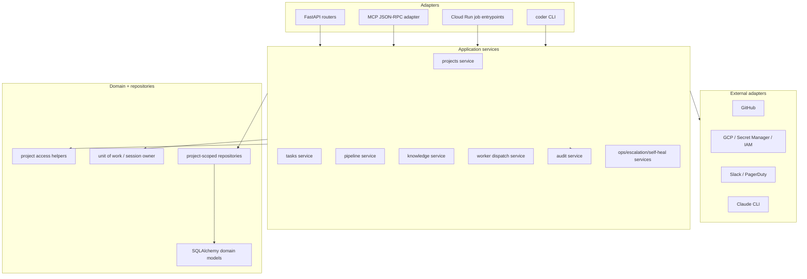

# 0051 — coder-core modular monolith hardening (design)

## Context

`coder-core` should stay one deployed service for now. The system's
most important guarantees are local and cross-cutting: every request is
project-scoped, every mutation is auditable, worker identity is carried
through task state, and knowledge writes must stay consistent with
registries and ship gates. Splitting those responsibilities across
services before the internal boundaries are explicit would make
correctness harder.

The target design is a modular monolith. `coder-core` keeps one FastAPI
app and one Postgres schema, but its internals are shaped like stable
subsystems with clear application services and one-way dependencies.
Future extraction remains possible, but the near-term win is safer
local change.

## Goals / non-goals

- Goals:
  - Thin HTTP/MCP adapters.
  - Application services own workflows and transaction boundaries.
  - Central project access and project-scoped query helpers.
  - In-process protocols for future extraction seams.
  - Service-level tests for behavior; route tests for wiring.
- Non-goals:
  - No runtime service split.
  - No database split.
  - No public API redesign.
  - No frontend redesign.

## Design



The intended dependency direction is:

```text
adapters -> application services -> domain/repositories -> db/external adapters
```

Feature modules may depend on shared infrastructure and protocols, but
not on each other's routers. Cross-feature workflow calls happen
through application-service methods or explicit protocols.

## Target package shape

The exact file movement should be incremental, but the desired shape is:

```text
coder_core/
  api/                 # HTTP adapters only
  mcp/                 # JSON-RPC adapter; calls application services
  projects/            # project lifecycle, auth mode, budget config
  tasks/               # task lifecycle, retry, merge, transcript
  pipeline/            # pipeline runs, stages, gates, orchestration
  knowledge/           # knowledge repo parsing/service/ship/freshness
  workers/             # role execution, dispatcher, subprocess auth
  audit/               # audit writer/query service
  ops/                 # queue depth, GC, self-heal, escalation jobs
  integrations/        # GitHub/GCP/Slack/Secret Manager adapters
  domain/              # SQLAlchemy models and domain enums
  db.py                # engine/session/unit-of-work primitives
```

Some folders already exist. The work is mostly to tighten ownership:
routers stop owning workflow logic, feature internals stop reaching
around one another, and cross-cutting behavior gets shared APIs.

## Components

### HTTP and MCP adapters

Routers validate inputs, obtain caller context, call one application
service method, and translate application errors to HTTP responses.
They should not coordinate multi-step business workflows directly.

MCP tools follow the same rule: the JSON-RPC layer resolves the caller,
validates the tool payload, and calls the same application services as
HTTP where semantics overlap.

### Application services

Each service owns a Coder capability, not a transport:

- `ProjectService`: project CRUD/admin mutation/auth-mode/budget/MCP
  toggles.
- `TaskService`: create, retry, override, merge, transcript, feedback.
- `TaskPlanService`: draft reads, approve/reject, task fan-out.
- `PipelineService`: run state, gates, stage transitions, run
  timeline.
- `KnowledgeService`: list/read/write/verify/ship/freshness.
- `WorkerDispatchService`: enqueue/kick off role work and expose a
  dispatch protocol.
- `AuditService`: append/query audit rows.
- `OpsService` family: queue depth, branch GC, regression checks,
  escalation watches, self-healing watches.

Application services may call other application services only through
documented methods when the workflow is truly cross-component. The
caller owns the transaction unless the callee is explicitly documented
as a whole-workflow operation.

### Unit of work

Mutation services use a consistent unit-of-work pattern:

```python
async with session_scope() as session:
    project = await access.require_project(session, project_id, actor)
    result = await repository.mutate(session, project, ...)
    await audit.record(session, ...)
    return result
```

The important rule is visible ownership. A helper either participates
in the caller's session or owns the entire transaction; it does not
commit as a hidden side effect.

### Tenant access helpers

All touched workflows route through shared access helpers:

```python
project = await project_access.require_project(session, project_id, actor)
await project_access.require_admin(actor)
```

Project-scoped repositories accept `project_id` or a verified project
object and include that scope in every query. Raw cross-tenant reads
are centralized and named as fleet/admin operations.

### Extraction-ready protocols

Define protocol boundaries where future service extraction is plausible:

```python
class WorkerDispatcher(Protocol):
    async def dispatch(self, project_id: str, task_id: str) -> None: ...

class KnowledgeRepository(Protocol):
    async def read_artifact(self, project_id: str, artifact_ref: ArtifactRef) -> Artifact: ...
    async def write_artifact(self, project_id: str, change: KnowledgeChange) -> WriteResult: ...

class AuditRecorder(Protocol):
    async def record(self, event: AuditEventCreate) -> None: ...

class EventPublisher(Protocol):
    async def publish(self, event: DomainEvent) -> None: ...
```

The first implementation stays in-process. The interface exists to
make dependencies explicit and to keep future extraction from turning
into a behavioral rewrite.

## Data flow

Task creation after the refactor:

1. `POST /v1/projects/{id}/tasks` resolves actor and request model.
2. Router calls `TaskService.create_task(project_id, actor, command)`.
3. `TaskService` opens/uses the unit of work.
4. `ProjectAccess` verifies the caller can act on the project.
5. `TaskRepository` inserts the task row scoped to the project.
6. `AuditService` records `task.created` in the same transaction.
7. `WorkerDispatchService` is invoked through a protocol after commit
   or via an explicit outbox-style callback if dispatch must observe
   committed state.
8. Router returns the existing response model.

Knowledge write follows the same shape, except the service coordinates
GitHub tree writes and registry updates through `KnowledgeRepository`
and records audit rows atomically with local DB state where applicable.

## Edge cases

- **Dispatch before commit:** worker dispatch must not observe a task
  that can still roll back. Dispatch happens after commit or through a
  durable transition that the dispatcher leases.
- **Audit rollback:** for mutations requiring atomic audit, audit rows
  use the caller's transaction. Non-atomic operational observations are
  named separately.
- **Admin/fleet reads:** any intentionally cross-project query uses a
  fleet/admin service method and is covered by admin auth tests.
- **External failure after local write:** workflows that touch GitHub,
  Slack, GCP, or Claude must document whether the external call happens
  before local commit, after local commit, or with compensating state.
- **Tests bypassing services:** fixtures may insert setup rows directly,
  but behavior tests should exercise services or routes, not private
  repository helpers alone.

## Rollout

1. **Map and guard.** Add `docs/module-boundaries.md` (or equivalent)
   in `coder-core`; introduce first import-boundary checks.
2. **Pilot one router.** Start with `task_plans` or `tasks` because the
   workflows are important but bounded enough to prove the pattern.
3. **Move knowledge write/ship.** Apply the same service/transaction
   shape to the riskiest GitHub + registry workflows.
4. **Unify access helpers.** Route touched project-scoped workflows
   through shared tenant access helpers.
5. **Add protocols.** Introduce worker dispatch and knowledge
   repository protocols with in-process implementations.
6. **Test migration.** Move behavior-heavy route tests down to service
   tests and keep route smoke/contract tests.
7. **Document extraction decision.** At the end, record whether worker
   runtime extraction is now justified. Default expected outcome:
   "not yet; boundaries are clean enough to wait."

No feature flag is needed because public behavior should not change.
Rollout is by small PR slices, each preserving the full test suite.

## Links

- Spec: [0051](../../product-specs/wip/0051-coder-core-modular-monolith.md)
- Related designs: system-overview, worker-communication,
  knowledge-write-api, audit-log, tenant-isolation, worker-roles,
  observability-and-cost-tracking
