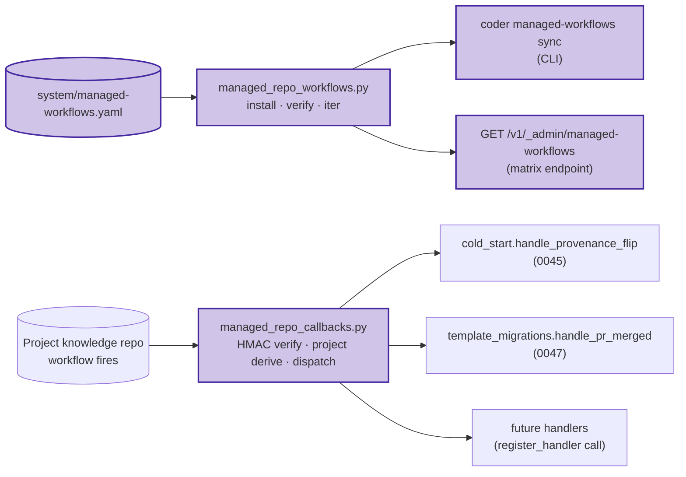

# 0052 — Managed-repo GitHub Action distribution

## Context

See [spec 0052](../../product-specs/wip/0052-managed-repo-action-distribution.md)
for the problem framing. This design is the lightweight technical
counterpart — the spec is detailed enough that the architecture
fits in one page.

## Goals / non-goals

Match the spec's scope/non-goals one-for-one. No expansion at
the design layer.

## Design

### Architecture

### Parts

- **`coder-system/system/managed-workflows.yaml`** (new) —
  fleet manifest. CI validator: unique `id`,
  `template_path` exists, `receiver_endpoint` is a valid path
  string. Schema documented in
  [spec 0052 § Scope > fleet manifest](../../product-specs/wip/0052-managed-repo-action-distribution.md).
- **`coder_core/integrations/managed_repo_workflows.py`** (new) —
  the helper. Three functions: `install_workflow`,
  `verify_workflow`, `iter_managed_workflows`. Backed by
  GitHub Trees API for install (atomic per-PR commit), GitHub
  Contents API for verify (uses existing TTL cache).
- **`coder_core/integrations/managed_repo_callbacks.py`** (new) —
  receiver middleware + handler registry. Module-import-time
  registration (each consuming spec calls `register_handler`
  in its router module).
- **`coder_core/cli/managed_workflows.py`** (new) —
  `coder managed-workflows sync [--workflow] [--projects]`.
- **`coder_core/api/admin_managed_workflows.py`** (new) —
  `GET /v1/_admin/managed-workflows` matrix endpoint with
  5-min cache.
- **Admin SPA:** `ManagedWorkflowsPage.tsx` (new). Renders the
  fleet × workflow matrix; cell click → PR / drift diff /
  workflow source.

### Data flow — install (sync)

1. Operator runs `coder managed-workflows sync` (or it's run
   by a deploy-time hook — see Rollout).
2. CLI loads the manifest, iterates `(project, workflow)` pairs.
3. For each pair, calls `install_workflow(project_id,
   workflow_id)`.
4. Helper checks the project repo's
   `.github/workflows/<workflow_id>.yml` content via Contents
   API. If byte-identical to `template_path`: returns
   `Skipped(reason="already_installed")`, no PR opened.
5. Otherwise: builds a Git Trees commit on a
   `managed-workflow/install-<workflow_id>` branch (one tree,
   adds the workflow file + appends to
   `.github/managed-workflows.txt`), opens a PR titled
   `managed-workflow: install <workflow_id>`. Returns
   `Opened(pr_url)`.
6. CLI prints summary: opened / skipped / errors.

### Data flow — callback (runtime)

1. Workflow in a managed knowledge repo POSTs to a coder-core
   endpoint (per the consuming spec's path —
   e.g. `/v1/projects/{project_id}/cold-start/provenance-flipped`).
2. Common middleware verifies HMAC against
   `GITHUB_APP_WEBHOOK_SECRET`. On mismatch: 401.
3. Middleware derives `project_id` from the calling repo
   (using `projects.github_org` + `projects.github_repo`
   lookup). On no match: 404.
4. Middleware looks up the `workflow_id` in the registered
   handlers. On no match: 404 with
   `reason="handler_not_registered"`.
5. Middleware invokes the handler with `(project_id,
   request_body)`. Handler returns its own status.
6. On 2xx, middleware writes
   `audit_events.action='managed_workflow.callback'` with
   `{workflow_id, project_id, handler_outcome}`.

### Invariants

- **Idempotency on install.** `install_workflow` is
  content-comparison idempotent — re-running the sweep is
  free.
- **HMAC verification before any state mutation.** The
  receiver never invokes a handler without a verified
  signature. Spoofed callbacks land as 401 with no audit
  trail beyond the standard request log.
- **Handler-registry is import-time.** A consuming spec's
  router module imports `register_handler` at startup; if
  the import fails, the receiver returns 404 for that
  workflow's callbacks (fail-safe — no silent dropped
  state changes).
- **No workflow deletion on manifest removal.** Removing a
  workflow from the manifest does not delete it from project
  repos. Drift surfaces on the admin matrix; operator
  decides explicitly.

## Open questions

Inherited from spec — see
[spec 0052 § Open questions](../../product-specs/wip/0052-managed-repo-action-distribution.md).

## Rollout

- **Stage 0 — helper + receiver land, no workflows in
  manifest.** Ship `managed_repo_workflows.py`,
  `managed_repo_callbacks.py`, the matrix endpoint, the
  CLI, the admin page. Manifest exists with empty
  `workflows: []`. Flag `CODER_MANAGED_WORKFLOWS_ENABLED=false`.

- **Stage 1 — first workflow registered (no projects yet).**
  0045 lands `flip-cold-start-provenance.yml` in `template/`
  + adds the manifest row. `coder managed-workflows sync
  --projects coder` opens the install PR for `coder` only.
  Smoke-test the end-to-end: install PR merged, callback
  fires, handler runs.

- **Stage 2 — fleet sweep + flag flip.**
  `CODER_MANAGED_WORKFLOWS_ENABLED=true` fleet-wide. Run
  full sweep (`coder managed-workflows sync` no filters).
  Both managed projects (`coder`, `vibetrade`) get the
  install PR; merge order is operator's choice. After both
  merge, the admin matrix shows ✓ everywhere.

- **Stage 3 — second workflow consumer (0047
  `record-template-migration`).** Same shape — manifest row
  + workflow file + handler registration; sweep distributes.

- **Stage 4 — admin UI on.**
  `VITE_MANAGED_WORKFLOWS_ENABLED=true`. Matrix visible to
  operators.

## Backout plan

- **Per-workflow disable.** Remove the manifest row. The
  matrix flags installed workflows as drift; operator
  decides whether to leave (no-op until callbacks fire) or
  open removal PRs.
- **Fleet kill switch.**
  `CODER_MANAGED_WORKFLOWS_ENABLED=false`. Receiver returns
  503; matrix endpoint returns 404. Workflows in managed
  repos still fire but every callback bounces — consuming
  features must tolerate this gap or independently disable.
- **Wholesale removal.** The helper, receiver, manifest,
  matrix endpoint can be dropped at the next major version
  if no consuming feature remains.

## Links

- Spec: [0052](../../product-specs/wip/0052-managed-repo-action-distribution.md)
- Related designs:
  [0045](./0045-cold-start-ingestion.md) (consumes for flip-provenance),
  [0047](./0047-template-schema-migration.md) (consumes for record-migration),
  [knowledge-write-api](../active/knowledge-write-api.md) (Git Trees commit pattern shared)
