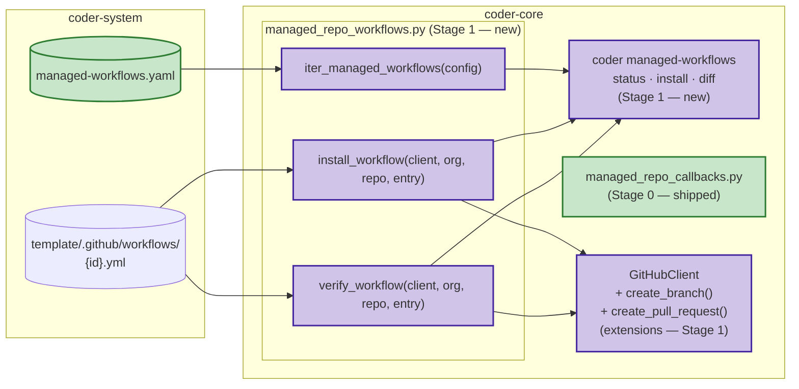

# 0052 — Managed-repo GitHub Action distribution

## Context

See [spec 0052](../../product-specs/wip/0052-managed-repo-action-distribution.md)
for the problem framing.

**Stage 0 shipped 2026-04-27** (coder-system PR #9, coder-core PR #33):
- `coder-system/system/managed-workflows.yaml` — fleet manifest (empty `workflows: []`)
- `coder_core/integrations/managed_repo_callbacks.py` — HMAC-verified callback
  receiver with handler registry (`register_handler`, `POST /v1/managed-workflows/callbacks/{workflow_id}`)

**This document refines Stage 1:** the three helper functions
(`install_workflow`, `verify_workflow`, `iter_managed_workflows`), the
`GitHubClient` extensions required, and the `coder managed-workflows` CLI
subcommand group.

Out of scope here: Stage 2 (admin matrix endpoint + SPA page) and the first
concrete consumers (0045 `flip-cold-start-provenance`, 0047
`record-template-migration`) — they register handlers and add manifest rows
in their own PRs.

## Goals / non-goals

Match spec 0052 scope/non-goals one-for-one. No expansion at the design layer.

## Design

### Architecture



### Data types

```python
# ── Manifest entry (parsed from managed-workflows.yaml) ────────────────
@dataclass(frozen=True)
class WorkflowEntry:
    id: str              # stable kebab-slug, e.g. "flip-cold-start-provenance"
    template_path: str   # path relative to coder-system root,
                         # e.g. "template/.github/workflows/flip-cold-start-provenance.yml"
    receiver_endpoint: str  # coder-core path, e.g. "/v1/projects/{project_id}/cold-start/provenance-flipped"
    consuming_spec: str  # e.g. "0045"
    introduced: str      # YYYY-MM-DD

# ── install_workflow return variants ───────────────────────────────────
@dataclass(frozen=True)
class Created:
    path: str      # ".github/workflows/{id}.yml"
    pr_url: str    # URL of the PR opened in the managed repo
    sha: str       # Git blob SHA of the installed file content

@dataclass(frozen=True)
class UpdatedExisting:
    path: str
    sha: str       # existing file's blob SHA — equals expected (no-op)

@dataclass(frozen=True)
class SkippedDivergent:
    path: str
    observed_sha: str  # blob SHA currently in the repo
    expected_sha: str  # blob SHA of the template file

InstallResult = Created | UpdatedExisting | SkippedDivergent

# ── verify_workflow return variants ────────────────────────────────────
@dataclass(frozen=True)
class Installed:
    path: str
    sha: str       # observed blob SHA (matches expected)

@dataclass(frozen=True)
class Missing:
    path: str

@dataclass(frozen=True)
class Drifted:
    path: str
    observed_sha: str
    expected_sha: str

VerifyResult = Installed | Missing | Drifted

# ── iter_managed_workflows inputs ──────────────────────────────────────
@dataclass(frozen=True)
class SyncTarget:
    project_id: str
    org: str
    repo: str      # knowledge repo name, e.g. "acme-coder-system"

@dataclass
class SyncConfig:
    manifest: list[WorkflowEntry]
    targets: list[SyncTarget]
    project_filter: str | None = None   # --project slug
    workflow_filter: str | None = None  # --workflow id
```

### `install_workflow`

```python
async def install_workflow(
    client: GitHubFileReader,
    org: str,
    repo: str,
    entry: WorkflowEntry,
    *,
    manifest_dir: Path,        # local path to coder-system root
    force: bool = False,
    base_branch: str = "main",
) -> InstallResult:
```

**Algorithm:**

1. Read template bytes: `content = (manifest_dir / entry.template_path).read_bytes()`
2. Compute expected Git blob SHA:
   `expected_sha = sha1(b"blob " + str(len(content)).encode() + b"\0" + content).hexdigest()`
   This matches the `sha` field returned by GitHub's Contents API.
3. Derive target path: `path = f".github/workflows/{entry.id}.yml"`
4. Call `client.read_file_meta(org, repo, path)`:
   - **404** → file absent:
     call `_open_install_pr(client, org, repo, entry, content, base_branch, overwrite=False)`
     → return `Created`
   - **200**, `meta["sha"] == expected_sha`:
     → return `UpdatedExisting(path, meta["sha"])`
   - **200**, `meta["sha"] != expected_sha`, `force=False`:
     → log `WARNING managed_workflow.divergent` with `{org}/{repo}:{path}`,
       `observed_sha`, `expected_sha`
     → return `SkippedDivergent(path, meta["sha"], expected_sha)`
   - **200**, `meta["sha"] != expected_sha`, `force=True`:
     call `_open_install_pr(client, org, repo, entry, content, base_branch, overwrite=True)`
     → return `Created`

**`_open_install_pr` helper:**

1. Branch name:
   - New install: `managed-workflow/install-{entry.id}`
   - Force overwrite: `managed-workflow/overwrite-{entry.id}`
2. Resolve `base_branch` HEAD SHA via `GET /repos/{org}/{repo}/git/refs/heads/{base_branch}`
3. `client.create_branch(org, repo, branch=branch_name, from_sha=head_sha)`
4. `client.commit_tree(org, repo, branch=branch_name, changes=[TreeChange(path=path, action="create" | "update", content=content)], message=f"managed-workflow: install {entry.id}")`
5. `client.create_pull_request(org, repo, title=f"managed-workflow: install {entry.id}", head=branch_name, base=base_branch, body=f"Managed by coder-core — spec 0052. Workflow: `{entry.id}`. Consuming spec: {entry.consuming_spec}.")`
6. Return `Created(path=path, pr_url=pr["pr_url"], sha=expected_sha)`

**Idempotency on re-run:** a second call with the file present and matching SHA returns
`UpdatedExisting` immediately — no GitHub writes. If the install PR was opened but not yet
merged, `read_file_meta` still returns 404 (the PR branch has the file, `main` does not)
and a second run will open a duplicate PR. For v1, concurrent / repeated runs are
operator-triggered and duplicates are benign; see Edge cases below.

**`GitHubClient` extensions required for Stage 1:**

```python
# Add to GitHubClient and GitHubFileReader protocol
async def create_branch(
    self,
    org: str,
    repo: str,
    *,
    branch: str,
    from_sha: str,
) -> None:
    """Create a new git ref via POST /repos/{org}/{repo}/git/refs."""

async def create_pull_request(
    self,
    org: str,
    repo: str,
    *,
    title: str,
    head: str,     # branch name (short, not qualified)
    base: str,     # target branch
    body: str = "",
    draft: bool = False,
) -> dict[str, object]:  # {"pr_url": str, "pr_number": int}
    """Open a PR via POST /repos/{org}/{repo}/pulls."""
```

Both use `application/vnd.github+json` and the same `TokenProvider` pattern as
existing methods. `create_branch` returns 201 on success, 422 if the ref already
exists (caller should handle as a conflict and fail with a clear error).

### `verify_workflow`

```python
async def verify_workflow(
    client: GitHubFileReader,
    org: str,
    repo: str,
    entry: WorkflowEntry,
    *,
    manifest_dir: Path,
) -> VerifyResult:
```

**Algorithm:**

1. Read template bytes and compute `expected_sha` (same as `install_workflow` step 1–2).
2. `path = f".github/workflows/{entry.id}.yml"`
3. Call `client.read_file_meta(org, repo, path)`:
   - **404** → `Missing(path)`
   - **200**, `meta["sha"] == expected_sha` → `Installed(path, meta["sha"])`
   - **200**, `meta["sha"] != expected_sha` → `Drifted(path, meta["sha"], expected_sha)`
4. Never mutates. No PRs, no commits, no branches.

### `iter_managed_workflows`

```python
def iter_managed_workflows(
    config: SyncConfig,
) -> Iterator[tuple[str, str, str, WorkflowEntry]]:
    """Yield (project_id, org, repo, entry) tuples.

    Deterministic ordering: sorted by (project_id, entry.id) so CLI output
    is stable across runs regardless of manifest or project-list insertion order.
    Applies config.project_filter and config.workflow_filter before yielding.
    """
    pairs = [
        (t, e)
        for t in sorted(config.targets, key=lambda t: t.project_id)
        for e in sorted(config.manifest, key=lambda e: e.id)
        if (config.project_filter is None or t.project_id == config.project_filter)
        if (config.workflow_filter is None or e.id == config.workflow_filter)
    ]
    for t, e in pairs:
        yield (t.project_id, t.org, t.repo, e)
```

### Manifest consumption in the CLI

`SyncConfig` is assembled by the CLI from two sources:

1. **Manifest** — read `manifest_dir / "system" / "managed-workflows.yaml"` (a local path in
   the operator's coder-system checkout); parse the `workflows:` list into
   `list[WorkflowEntry]`. Default `manifest_dir` is `../coder-system` relative to cwd, or
   `$CODER_SYSTEM_DIR`.
2. **Targets** — call `GET {base_url}/v1/projects` with the operator's API key or
   `$CODER_API_KEY`; for each project record, construct
   `SyncTarget(project_id=p["id"], org=p["github_org"], repo=p["knowledge_repo"])`.

Filters from `--project` / `--workflow` flags are forwarded as `SyncConfig.project_filter`
and `SyncConfig.workflow_filter`.

### `coder managed-workflows` CLI

Attaches as a new top-level subcommand group in `cli.py`, parallel to `coder project`:

```
coder managed-workflows <subcommand> [flags]

Subcommands:
  status     Verify installation state across all managed projects. No mutations.
             (alias: verify)
  install    Install or re-sync workflows; opens PRs in managed repos.
  diff       Show per-file expected vs observed content for drifted files.

Flags (all subcommands):
  --project <slug>       Filter to a single project
  --workflow <id>        Filter to a single workflow
  --manifest-dir <path>  Path to coder-system root
                         (default: ../coder-system or $CODER_SYSTEM_DIR)
  --base-url <url>       coder-core API base URL
                         (default: $CODER_BASE_URL or prod URL)
  --json                 Machine-readable JSON output

Flags (install only):
  --dry-run              Show what would be done; make no mutations
  --force                Overwrite divergent files (open overwrite PR instead of skipping)
```

**Exit codes:**

| Code | Meaning | Applies to |
|------|---------|------------|
| 0 | All targeted pairs are `Installed` / `UpdatedExisting` — fleet fully in sync | status, install |
| 1 | Transport or auth error (GitHub API or coder-core API unavailable) | all |
| 2 | Drift or missing detected (fleet not fully in sync, but no I/O failure) | status, install when `SkippedDivergent` remain |
| 3 | One or more install failures (API errors during PR creation or commit) | install |

`status` exits 2 when any result is `Missing` or `Drifted`.
`install` exits 0 only when every targeted pair resolves to `Created` or `UpdatedExisting`.
`SkippedDivergent` without `--force` → install exits 2 (not an I/O failure, but not clean).

**JSON output schema:**

```json
{
  "command": "status",
  "results": [
    {
      "project_id": "acme",
      "org": "acme-org",
      "repo": "acme-coder-system",
      "workflow_id": "flip-cold-start-provenance",
      "status": "installed | missing | drifted | created | updated_existing | skipped_divergent | error",
      "observed_sha": "abc123",
      "expected_sha": "def456",
      "pr_url": "https://github.com/...",
      "error": "..."
    }
  ],
  "summary": {
    "total": 4,
    "installed": 2,
    "updated_existing": 1,
    "created": 0,
    "drifted": 0,
    "missing": 1,
    "skipped_divergent": 0,
    "errors": 0
  }
}
```

### Divergent-file policy

By default `install_workflow` **skips** a file whose content differs from the template,
returning `SkippedDivergent` and logging a `WARNING`. The `--force` flag on the CLI causes
`install_workflow` to open an overwrite PR instead, returning `Created`.

Rationale and trade-offs: see [ADR 0018](../adrs/0018-managed-workflows-divergent-file-policy.md).

## Edge cases

**Template file missing locally.** If `manifest_dir / entry.template_path` does not exist,
`install_workflow` and `verify_workflow` raise `FileNotFoundError`. The CLI catches it and
records the pair as an error (`"status": "error"`); the install command exits 3.

**Concurrent install runs.** Two simultaneous `coder managed-workflows install` runs against
the same (project, workflow) pair may both see "file absent" and both open a PR on the same
`managed-workflow/install-{id}` branch name. The second `create_branch` call receives a 422
(ref already exists) and fails with an install error. For v1, concurrent operator runs are
unlikely; a future iteration may check for an existing open PR before creating the branch.

**GitHub App lacks write access.** `create_branch` or `commit_tree` returns 403. Surfaced
as an install error with the hint from `GitHubClient` about checking App installation.

**Install branch already exists from an interrupted run.** `create_branch` returns 422.
For Stage 1, the CLI records this as an install error; the operator deletes the stale branch
manually and re-runs. A future iteration may auto-delete and retry.

**Empty manifest.** `iter_managed_workflows` with an empty `manifest` list yields nothing.
`coder managed-workflows status` on an empty manifest exits 0 with an empty results list —
correct since there is nothing to check.

## Open questions

Inherited from spec — see
[spec 0052 § Open questions](../../product-specs/wip/0052-managed-repo-action-distribution.md).

**Resolved by this design:**
- Divergent-file policy → skip-with-warning by default; `--force` to overwrite (ADR 0018).
- SHA comparison → Git blob SHA (`SHA1("blob {N}\0{content}")`) matches Contents API `sha` field; no extra API call needed.
- Ordering → deterministic `(project_id, workflow_id)` sort in `iter_managed_workflows`.

**Still open:**
- Webhook-secret dual-value window during secret rotation (spec 0052 OQ1, deferred to 0038 integration).
- Auto-removal of workflow files when a row is removed from the manifest (spec 0052 OQ2, deferred; admin matrix flags the drift).

## Rollout

**Stage 1 (this PR):** design only — no implementation yet.

Implementation work expected in coder-core:
1. `managed_repo_workflows.py` — `WorkflowEntry`, `SyncTarget`, `SyncConfig`, result types,
   `install_workflow`, `verify_workflow`, `iter_managed_workflows`.
2. `GitHubClient` + `GitHubFileReader` protocol — add `create_branch` and `create_pull_request`.
3. `cli.py` — add `coder managed-workflows` subcommand group with `status`, `install`, `diff`.

Stage 1 smoke test (after implementation): add a single test workflow entry to the manifest
against a dev knowledge repo; run `coder managed-workflows install`; confirm PR opens; merge;
run `coder managed-workflows status`; confirm exit 0.

Stages 2–4 unchanged from the original design document section.

## Links

- Spec: [0052](../../product-specs/wip/0052-managed-repo-action-distribution.md)
- ADR: [0018 — divergent-file policy](../adrs/0018-managed-workflows-divergent-file-policy.md)
- Stage 0 PRs: coder-system#9, coder-core#33
- Related designs:
  [0045](./0045-cold-start-ingestion.md) (first consumer — flip-provenance),
  [0047](./0047-template-schema-migration.md) (second consumer — record-migration),
  [knowledge-write-api](../active/knowledge-write-api.md) (Git Trees commit pattern)
