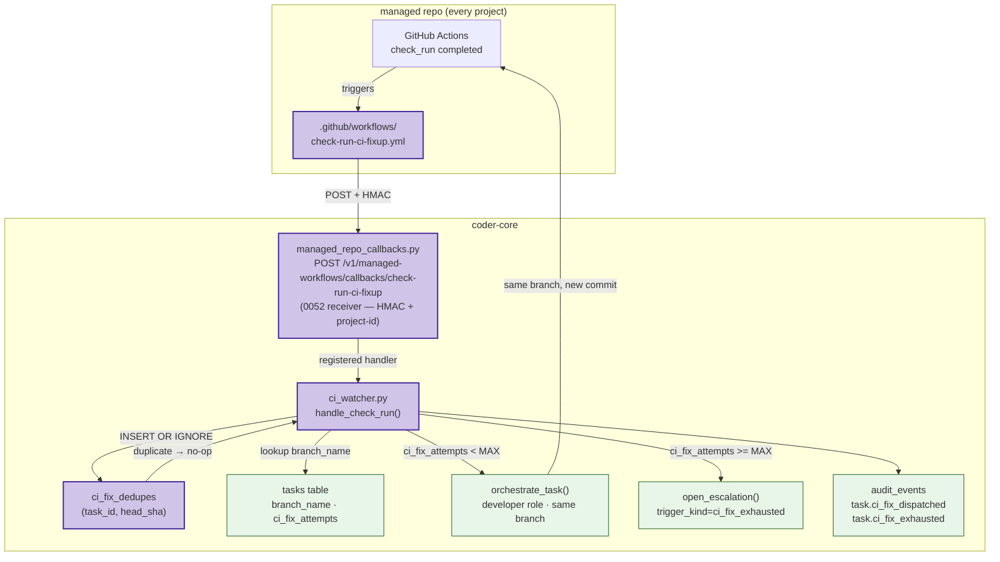

# 0053 — Post-PR CI fix loop

## Context

See [spec 0053](../../product-specs/wip/0053-post-pr-ci-fix-loop.md) for
the problem framing. This design covers the full technical shape for both
stages. Stage 0a (developer-worker pre-flight) shipped in coder-core PR
#36. **This document's Stage 1 section is the subject of the current
refinement** — it closes the post-PR external-CI feedback loop by wiring
`check_run` events from managed repos into a fix-up dispatcher.

Stage 0b (re-prompt path on internal pytest failures during the
`TESTING` stage) is already handled by spec 0025's `validate_and_retry`
pattern in the orchestrator; it is out of scope here.

## Goals / non-goals

Match the spec one-for-one. No expansion at the design layer.

## Architecture



## Stage 0 — Pre-flight on the developer worker

Stage 0a shipped in coder-core PR #36. See
[`coder_core/workers/_preflight.py`](../../../coder-core/src/coder_core/workers/_preflight.py)
for the implementation. Key properties:

- Runs after the worker's own pytest passes, before `git push`.
- Default commands: `uv run ruff format`, `uv run ruff check --fix`.
- Per-repo commands from `system/repos/<repo>.md`'s `preflight_commands:` list.
- Auto-commit path: if the working dir is dirty after commands, commits
  with message `chore: apply preflight fixes` and pushes.
- Fail-soft: surviving failures are logged and posted as a PR body note
  rather than aborting the push.

Stage 0b (re-prompt path on internal `pytest` failures) is handled by the
existing `validate_and_retry` mechanism in spec 0025's TESTING stage and
is not repeated here.

## Stage 1 — Post-PR CI watcher and fix-up dispatcher

### Module placement

**`coder_core/workers/ci_watcher.py`** — new module. Registers with
the 0052 receiver scaffold at module-import time:

```python
from coder_core.integrations.managed_repo_callbacks import register_handler

register_handler("check-run-ci-fixup", handle_check_run)
```

The handler signature matches the 0052 receiver contract:
```python
async def handle_check_run(project_id: str, request: Request) -> dict:
    ...
```

HMAC verification, feature-flag gating, and project derivation are all
handled by the receiver before this function is called. The handler
therefore starts from a verified, project-scoped payload.

**Why ``workers/`` and not ``integrations/``** — the original draft of
this design placed ``ci_watcher.py`` under
``coder_core/integrations/``, but ``pyproject.toml``'s
``Integrations are leaf adapters`` import-linter contract forbids
``coder_core.integrations`` from depending on either
``coder_core.workers`` (needed for ``orchestrate_task``) or
``coder_core.escalations`` (needed for ``open_escalation``). Living
under ``coder_core.workers`` keeps the module-graph clean while still
letting it import the receiver's ``register_handler`` (the
"Feature modules do not depend on adapters" contract only forbids the
``api`` and ``mcp`` adapter packages). ``coder_core/main.py`` triggers
the registration via ``import coder_core.workers.ci_watcher`` after
the receiver router is mounted.

### GitHub event subscription path

A workflow file `check-run-ci-fixup.yml` is installed in
`.github/workflows/` of every managed knowledge repo via the 0052
`install_workflow` helper. The manifest entry in
`system/managed-workflows.yaml`:

```yaml
- id: check-run-ci-fixup
  template_path: template/.github/workflows/check-run-ci-fixup.yml
  receiver_endpoint: /v1/managed-workflows/callbacks/check-run-ci-fixup
  consuming_spec: "0053"
  introduced: 2026-04-28
```

The workflow template (`template/.github/workflows/check-run-ci-fixup.yml`):

```yaml
name: report-check-run-to-coder
on:
  check_run:
    types: [completed]

jobs:
  report:
    runs-on: ubuntu-latest
    steps:
      - name: POST check_run payload to coder-core
        run: |
          BODY="$(echo '${{ toJson(github.event.check_run) }}')"
          SIG="sha256=$(printf '%s' "$BODY" \
            | openssl dgst -sha256 -hmac "${{ secrets.CODER_WEBHOOK_SECRET }}" \
            | awk '{print $2}')"
          curl -sf --retry 3 --retry-delay 2 \
            -X POST \
            -H "Content-Type: application/json" \
            -H "X-Hub-Signature-256: $SIG" \
            -H "X-Coder-Project-Id: ${{ secrets.CODER_PROJECT_ID }}" \
            -d "$BODY" \
            "${{ vars.CODER_RECEIVER_BASE_URL }}/v1/managed-workflows/callbacks/check-run-ci-fixup"
```

Required per-repo GitHub secrets/vars (installed by `coder managed-workflows sync`):
- `CODER_WEBHOOK_SECRET` — shared HMAC secret (same as `github_app_webhook_secret` in coder-core config)
- `CODER_PROJECT_ID` — coder-core project id for this repo
- `CODER_RECEIVER_BASE_URL` (var, not secret) — base URL of the coder-core service

### check_run conclusion routing

| `check_run.conclusion` | Action |
|---|---|
| `failure` | Trigger fix-up dispatch |
| `timed_out` | Trigger fix-up dispatch |
| `action_required` | Trigger fix-up dispatch |
| `cancelled` | No-op (log at DEBUG) |
| `skipped` | No-op (log at DEBUG) |
| `success` / `neutral` / `stale` | No-op |
| `null` (still in progress) | No-op (should not arrive on `completed` but guard anyway) |

The handler short-circuits on any non-triggering conclusion before touching
the database.

### Payload fields consumed

The handler reads only the following fields from the `check_run` JSON
object (all others are ignored):

| Field | Used for |
|---|---|
| `head_sha` | Dedupe key + fix-up prompt context |
| `name` | Fix-up prompt (human-readable check name) |
| `conclusion` | Routing decision (table above) |
| `output.summary` | Included in fix-up prompt (first 2 000 chars) |
| `output.text` | Appended to prompt excerpt (first 2 000 chars, after summary) |

The head branch is **not** read from the payload; the watcher derives it
from the task row to avoid trusting caller-controlled input for the
branch lookup.

### Schema changes (migration 0054)

Migration 0054 bundles all four schema deltas into one Alembic
revision so the watcher can ship behind ``coder_ci_fix_loop_enabled``
without partial-schema window:

1. ``tasks.ci_fix_attempts INTEGER NOT NULL DEFAULT 0``
2. ``ci_fix_dedupes`` table with composite PK ``(task_id, head_sha)``
3. ``projects.ci_fix_loop_enabled BOOLEAN NULL``
4. Widen ``ck_escalations_trigger_kind`` to allow the new
   ``ci_fix_exhausted`` value via ``op.batch_alter_table`` (works for
   both Postgres and the SQLite test driver)

**`tasks.ci_fix_attempts` (new column)**

```sql
ALTER TABLE tasks
  ADD COLUMN ci_fix_attempts INTEGER NOT NULL DEFAULT 0;
```

Decision rationale — separate from `fix_attempts` (see ADR 0017 for the
dedupe decision; the column-vs-table choice is addressed here):

- `tasks.fix_attempts` tracks internal orchestrator loops (TESTING →
  FIXING → TESTING) that run *during* an active pipeline. It is
  incremented by the orchestrator's `_after_dispatch` while the task is
  non-terminal.
- `tasks.ci_fix_attempts` tracks external CI retries that fire *after* the
  task is terminal (stage=`accepted` or `stuck`). These are temporally and
  semantically distinct; conflating them would break the orchestrator's
  `MAX_FIX_ATTEMPTS = 3` guard and hide which kind of loop exhausted.
- Separate counters allow independent caps and independent observability
  queries.

**`ci_fix_dedupes` table**

```sql
CREATE TABLE ci_fix_dedupes (
    task_id    VARCHAR(36) NOT NULL REFERENCES tasks(id) ON DELETE CASCADE,
    head_sha   CHAR(40)    NOT NULL,
    created_at TIMESTAMPTZ NOT NULL DEFAULT now(),
    PRIMARY KEY (task_id, head_sha)
);
```

This table provides the transactional `(task_id, head_sha)` dedupe gate
(see Idempotency section below).

### Fix-up dispatch shape

When a triggering conclusion arrives for head SHA `S` on a branch that
belongs to a managed task:

1. **Resolve original task.** `SELECT * FROM tasks WHERE branch_name = <branch> AND project_id = <project_id> LIMIT 1`. If no match, log and return 200 (not this system's branch).

2. **Check exhaustion.** If `task.ci_fix_attempts >= MAX_CI_FIX_ATTEMPTS` (3), call `open_escalation(...)` with:
   ```python
   TriggerCandidate(
       project_id=task.project_id,
       trigger_kind="ci_fix_exhausted",
       task_id=task.id,
       pipeline_run_id=None,
   )
   ```
   Write audit row `task.ci_fix_exhausted` with payload `{task_id, head_sha, check_name, conclusion, summary_excerpt}`. Return.

3. **Dedupe gate.** `INSERT INTO ci_fix_dedupes (task_id, head_sha) VALUES (%s, %s) ON CONFLICT DO NOTHING`. If 0 rows inserted → SHA already processed for this task → return 200 (idempotent).

4. **Increment attempt counter.** `UPDATE tasks SET ci_fix_attempts = ci_fix_attempts + 1 WHERE id = %s`.

5. **Build fix-up prompt.**
   ```
   # CI fix-up

   PR: {task.pr_url}
   Branch: {task.branch_name}
   Failed check: {check_name}
   Conclusion: {conclusion}
   Failure excerpt:
   {output_summary[:2000]}
   {output_text[:2000]}

   Apply the minimum diff to make CI green. Do not change semantics.
   Push to the same branch — do NOT open a new PR.
   ```

6. **Dispatch new developer task.** Create a new `TaskRow` with:
   - `role = "developer"`
   - `repo = task.repo` (same repo)
   - `branch_name = task.branch_name` (same branch — worker pushes to existing branch, not a new one)
   - `pr_url = task.pr_url` (same PR — worker does not call `gh pr create`)
   - `original_task_id = task.id`
   - `stage = TaskStage.QUEUED`
   - `prompt = <fix-up prompt above>`

   Then call `orchestrate_task(new_task.id)` via the worker dispatcher.

7. **Audit.** Write `task.ci_fix_dispatched` with payload `{original_task_id, fix_task_id, attempt_number, head_sha, check_name}`.

The fix-up developer worker prompt instructs it to push to the existing
branch. The existing developer completion contract (`_DEV_COMPLETION_CONTRACT`)
requires a PR URL in the output; the fix-up variant relaxes this by
injecting the existing PR URL directly in the prompt header so the worker
records it rather than opening a new one.

### Idempotency and dedupe

**Problem.** A single PR's HEAD SHA can have N parallel check_run
`completed` events (one per failing check). Without dedupe, each event
would dispatch a separate fix-up task — N tasks racing to push to the same
branch, producing conflicts and wasted token spend.

**Solution.** The `ci_fix_dedupes(task_id, head_sha)` table provides a
transactional dedupe gate:

1. The handler atomically attempts `INSERT ON CONFLICT DO NOTHING`.
2. First arrival for a given `(task_id, sha)` succeeds → fix-up dispatched.
3. Subsequent arrivals for the same pair → 0 rows inserted → immediate 200
   return with no dispatch.
4. Concurrent webhook deliveries race on the DB constraint; only one
   wins, the others return cleanly.

The fix-up task's prompt aggregates the single check's details. If a later
CI run on a *new* SHA triggers further failures, the new SHA is a distinct
`(task_id, new_sha)` pair and correctly fires another attempt (subject to
the `ci_fix_attempts` cap).

See [ADR 0017](../../adrs/0017-ci-fixup-one-per-sha.md) for the
rationale behind dispatching one fix-up per failing SHA rather than one
per failing check.

### MAX_CI_FIX_ATTEMPTS exhaustion path

`MAX_CI_FIX_ATTEMPTS = 3` is a module-level constant in `ci_watcher.py`,
matching `orchestrator.MAX_FIX_ATTEMPTS` for consistency.

The limit is per **task** (i.e. per PR), not per check. Three consecutive
CI-red SHAs on the same PR exhaust the budget regardless of whether they
were the same check or different checks each time.

On exhaustion, the watcher calls the 0041 escalation ladder's
`open_escalation` with `trigger_kind="ci_fix_exhausted"`. This surfaces
the PR in the existing on-call routing (Slack L0, DM L1, PagerDuty L2)
with the failing check details in the escalation payload. No new
notification channel is introduced.

### Audit actions

| Action string | When written | Key payload fields |
|---|---|---|
| `task.ci_fix_dispatched` | On each fix-up dispatch (step 7 above) | `original_task_id`, `fix_task_id`, `attempt_number`, `head_sha`, `check_name`, `conclusion` |
| `task.ci_fix_exhausted` | When `ci_fix_attempts >= MAX` | `task_id`, `head_sha`, `check_name`, `conclusion`, `summary_excerpt`, `ci_fix_attempts` |

Both use `actor="coder-core-ci-watcher"`, `actor_method="webhook"` so
operators can grep audit dropdowns for watcher-driven activity. The
two labels are added to the ``Actions`` namespace in
``coder_core.audit`` (``CI_FIX_DISPATCHED`` / ``CI_FIX_EXHAUSTED``).

### Feature flags

- `coder_ci_fix_loop_enabled: bool = False` — fleet kill-switch. When off,
  `handle_check_run` returns `{"status": "disabled"}` immediately after
  the receiver's project resolution step. No DB writes.
- `projects.ci_fix_loop_enabled BOOLEAN NULL` — per-project tri-state.
  `NULL` inherits the fleet flag. `false` opts out even when the fleet
  flag is on.

## Data flow summary

```mermaid
sequenceDiagram
  participant GHA as GitHub Actions
  participant WF as check-run-ci-fixup.yml
  participant RECV as managed_repo_callbacks
  participant CIW as ci_watcher
  participant DB as PostgreSQL
  participant ORCH as orchestrate_task

  GHA->>WF: check_run completed (any conclusion)
  WF->>RECV: POST /v1/managed-workflows/callbacks/check-run-ci-fixup
  RECV->>RECV: HMAC verify · flag check · project resolve
  RECV->>CIW: handle_check_run(project_id, request)
  CIW->>CIW: parse payload; check conclusion routing
  alt non-triggering conclusion (cancelled/skipped/success)
    CIW-->>RECV: {"status":"no_op"}
  else triggering conclusion
    CIW->>DB: SELECT tasks WHERE branch_name = ?
    CIW->>DB: INSERT ci_fix_dedupes ON CONFLICT DO NOTHING
    alt SHA already deduped
      CIW-->>RECV: {"status":"deduped"}
    else
      CIW->>DB: check ci_fix_attempts vs MAX
      alt exhausted
        CIW->>DB: open_escalation(ci_fix_exhausted)
        CIW->>DB: audit task.ci_fix_exhausted
        CIW-->>RECV: {"status":"escalated"}
      else attempts remaining
        CIW->>DB: UPDATE tasks SET ci_fix_attempts += 1
        CIW->>ORCH: orchestrate_task(fix_task_id)
        CIW->>DB: audit task.ci_fix_dispatched
        CIW-->>RECV: {"status":"dispatched"}
      end
    end
  end
```

## Invariants

- **HMAC before any state write.** The 0052 receiver verifies the
  signature before invoking `handle_check_run`. The handler never touches
  the DB on an unverified payload.
- **One fix-up dispatch per `(task_id, head_sha)`.** The
  `ci_fix_dedupes` PRIMARY KEY is the correctness barrier.
- **Same branch, same PR.** Fix-up tasks push to `task.branch_name` and
  record `task.pr_url`; `gh pr create` is prohibited in the fix-up
  prompt.
- **Cap is per task, not per check.** `ci_fix_attempts` counts SHA
  transitions, not individual failing checks on one SHA.
- **Escalation is terminal for that task.** Once `ci_fix_attempts >=
  MAX_CI_FIX_ATTEMPTS`, further check_run events for the same task are
  logged and return cleanly without dispatching.
- **No new notification channel.** Exhaustion paths into the existing
  0041 ladder; no bespoke Slack message format.

## Open questions

Inherited from spec — see
[spec 0053 § Open questions](../../product-specs/wip/0053-post-pr-ci-fix-loop.md).

Additional open questions surfaced during Stage 1 design:

1. **`trigger_kind` extension for `ci_fix_exhausted`.** The 0041
   escalation model's `EscalationTrigger` enum needs a new value.
   Migration 0057 adds the DB check constraint; the Python enum needs a
   matching change in `coder_core/domain/escalation.py`. Small, but
   warrants a note for the implementing developer.

2. **Branch resolution for non-`task/*` managed PRs.** The design
   assumes `tasks.branch_name` follows the `task/<slug>` convention set
   by the developer completion contract. If a future role breaks this
   convention, the branch lookup will silently miss. Consider adding an
   index on `(project_id, branch_name)` if it does not already exist.

3. **Workflow secrets provisioning.** `coder managed-workflows sync`
   today installs the workflow file but does not provision
   `CODER_WEBHOOK_SECRET` or `CODER_PROJECT_ID`. Those secrets must be
   set manually (or via the GitHub Secrets API) before the workflow can
   deliver successfully. Automating secret provisioning is out of scope
   for this stage.

## Rollout

- **Stage 0a** — pre-flight in shadow. Shipped in coder-core PR #36.
  Pre-flight runs unconditionally; failure path opens PR with body note.

- **Stage 0b** — re-prompt on hard pre-flight failures. Covered by
  spec 0025 `validate_and_retry`; not in this PR.

- **Stage 1a — receiver registered, flag off.** Ship `ci_watcher.py`
  with `register_handler("check-run-ci-fixup", ...)`, migration 0054
  (`ci_fix_attempts`, `ci_fix_dedupes`, `projects.ci_fix_loop_enabled`,
  widened `ck_escalations_trigger_kind`), and the workflow template
  (already in coder-system). `coder_ci_fix_loop_enabled = False`.
  Webhook returns `{"status":"disabled"}`. Run
  `coder managed-workflows sync` for the `coder` project to install
  the workflow file. Verify GitHub delivers webhooks (200s in the
  GitHub webhook log).

- **Stage 1b — flag on for `coder` project only.**
  `projects.ci_fix_loop_enabled = true` for `coder`. Fleet flag still
  off. Monitor: dispatch rate, dedupe rate, fix-up success rate,
  escalation rate.

- **Stage 1c — fleet flip.**
  `CODER_CI_FIX_LOOP_ENABLED = true`. All managed projects with
  `ci_fix_loop_enabled != false` enter the loop.

- **Stage 2 — admin UI.** `VITE_CI_FIX_LOOP_ENABLED = true`. CI
  Fix Loop card visible on RunDetail / TaskDetail.

## Backout plan

- **Per-repo.** Set `system/repos/<repo>.md`'s `preflight_commands: []`.
- **Per-project.** `PATCH /v1/projects/{id}` with
  `ci_fix_loop_enabled=false`.
- **Fleet kill switch.** `CODER_CI_FIX_LOOP_ENABLED=false`. Webhook
  returns disabled; no new dispatches. In-flight fix-up tasks complete
  normally.

## Links

- Spec: [0053](../../product-specs/wip/0053-post-pr-ci-fix-loop.md)
- Stage 0 receiver scaffold: coder-core PR #33
- Stage 0a developer pre-flight: coder-core PR #36
- Stage 1 watcher: [coder-core PR #55](https://github.com/coder-devx/coder-core/pull/55) —
  adds `coder_core/workers/ci_watcher.py`, migration 0054, audit
  labels `task.ci_fix_dispatched` / `task.ci_fix_exhausted`, and the
  `CI_FIX_EXHAUSTED` escalation trigger.
- ADR: [0017](../../adrs/0017-ci-fixup-one-per-sha.md) — one fix-up per failing SHA
- Related designs:
  [0052](./0052-managed-repo-action-distribution.md) (receiver scaffold + `register_handler`),
  [worker-roles](../active/worker-roles.md),
  [worker-communication](../active/worker-communication.md),
  [escalations](../active/escalations.md)
