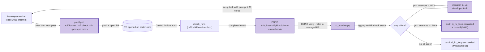

# 0053 — Post-PR CI fix loop

## Context

See [spec 0053](../../product-specs/wip/0053-post-pr-ci-fix-loop.md)
for the problem framing. This design fills in the technical shape;
the architect worker may revise during pickup.

## Goals / non-goals

Match the spec one-for-one. No expansion at the design layer.

## Architecture

## Parts

- **`coder_core/integrations/ci_watcher.py`** (new) — HMAC-verifying
  webhook handler at
  `POST /v1/_internal/github/check-run-webhook`. Filters to managed
  PRs (`branch ~= ^task/` + author = worker SA), aggregates the
  PR's check status, dispatches fix-up or escalates.
- **`coder_core/integrations/ci_fix_dispatch.py`** (new) — pure
  function that builds the fix-up task prompt from a failure
  excerpt + dispatches via the existing `create_task_in_project`
  service (NOT a new path; the watcher uses the same
  task-creation API as a CLI dispatch would).
- **`coder_core/workers/_preflight.py`** (new) — runs the
  per-repo preflight commands in the worker's working dir before
  `git push`. Returns either `Ok(applied_fixes: list[str])` or
  `Failed(error_excerpt: str)`. Called by `developer.py` after
  pytest passes and before push.
- **`coder_core/workers/developer.py`** (existing, edit) — add
  preflight invocation; on `Failed`, re-prompt the worker once
  with the error excerpt; if it still fails, open the PR with a
  body note describing the surviving issue.
- **`coder_core/api/admin_ci_fix_loop.py`** (new) — admin
  endpoint `GET /v1/_admin/ci-fix-loop/{pr_url:path}` returning
  the fix-up history for one PR. Backed by the
  `pr_to_task_map` table.
- **Tables:**
  - `pr_to_task_map` (migration 0057):
    `(pr_url PRIMARY KEY, project_id, original_task_id,
     current_fix_task_id, ci_fix_attempts, last_failure_kind,
     last_failure_excerpt, escalated_at, created_at, updated_at)`
- **`projects` columns** (migration 0058):
  `ci_fix_loop_enabled BOOLEAN NULL` (tri-state).
- **Frontmatter on `system/repos/<repo>.md`** — new optional
  `preflight_commands:` list. Validator (ADR 0008) accepts
  list-of-strings. When absent, defaults to
  `["uv run ruff format", "uv run ruff check --fix"]` for Python
  repos; empty for non-Python.
- **Admin SPA:** `CIFixLoopCard.tsx` (new) on the existing
  RunDetail / TaskDetail view, behind
  `VITE_CI_FIX_LOOP_ENABLED`.

## Data flow — pre-flight (Stage 0)

1. Worker's pytest run completes successfully.
2. Worker invokes `preflight.run(working_dir, repo_id)`.
3. `_preflight` reads the repo's `system/repos/<repo>.md`'s
   `preflight_commands` list (or default).
4. Each command runs sequentially. Auto-fixing commands
   (`ruff format`, `ruff check --fix`) modify in place.
5. After all commands run, do a `git status` check. If the
   working dir is dirty (commands made changes), commit with
   message `chore: apply preflight fixes`.
6. If any command exited non-zero AFTER its own auto-fix attempt
   (e.g. `mypy` reports an error it can't fix), capture the
   excerpt and:
   - **Re-prompt path.** Re-prompt the worker once with the
     failure excerpt + the failed-command name. The worker has
     the chance to fix it semantically.
   - **Fall-through.** If the re-prompt still produces
     preflight-failing code, open the PR anyway with a body
     note: `Pre-flight: <command> failed; <one-line summary>`.
     CI will still fail on this; Stage 1 picks it up.
7. `git push` + `gh pr create` proceed as before.

## Data flow — post-PR loop (Stage 1)

1. GitHub Actions runs `check_run`s on the PR's HEAD SHA.
2. Each `check_run.completed` event fires a webhook to
   `POST /v1/_internal/github/check-run-webhook`.
3. Watcher verifies HMAC (`X-Hub-Signature-256` against
   `GITHUB_APP_WEBHOOK_SECRET`); 401 on mismatch.
4. Filter: PR's `head_ref` matches `^task/`, PR's author is the
   worker SA. Skip otherwise.
5. Aggregate: pull all check_runs for the PR's HEAD SHA via
   GitHub API. If any are `failure`, the PR is CI-red.
6. Look up `pr_to_task_map.pr_url`. Two cases:
   - **First failure on this PR** — insert row with
     `original_task_id` from the PR-creating task,
     `ci_fix_attempts = 0`.
   - **Subsequent failure** — increment `ci_fix_attempts`. If at
     `MAX_CI_FIX_ATTEMPTS`, write
     `audit_events.action = ci_fix_loop.escalated` and stop. The
     row's `escalated_at` blocks future dispatches for this PR.
7. **Project flag check.** If
   `projects.ci_fix_loop_enabled` is False (explicit), skip
   without dispatching. Audit `ci_fix_loop.skipped_project_optout`.
8. **Dispatch fix-up.** Pull the failed check's logs (top
   `ci_fix_log_tail_lines`, default 200). Build fix_context with
   `{check_name, command, log_excerpt, branch, head_sha}`. Call
   `create_task_in_project` with role=developer, repo=PR's repo,
   prompt=`# CI fix-up\n\nPR: <url>\nBranch: <branch>\nFailed
   check: <name>\nFailure excerpt: <log tail>\n\nApply the
   minimum diff to make CI green. Do not change semantics. Push
   to the same branch — do NOT open a new PR.`,
   `original_task_id=row.original_task_id`. Update
   `current_fix_task_id` on the row.
9. **Concurrency.** The watcher takes a Postgres advisory lock
   on `hash(pr_url)` for the duration of steps 5-8. Concurrent
   webhook events for the same PR serialise.

## Invariants

- **Pre-flight is a worker-side guarantee.** The worker's
  `developer.py` runs preflight unconditionally (fleet flag
  doesn't gate it; cheap and beneficial). Per-repo
  `preflight_commands` may be empty, in which case the
  preflight phase is a no-op.
- **Fix-up tasks push to the same branch.** The fix-up
  worker's prompt forbids `gh pr create`. It uses the existing
  branch-push helper which pushes to the recorded
  `branch_name` on the original task.
- **Bounded retries.** Across the whole `pr_to_task_map.row`
  lifetime, at most `MAX_CI_FIX_ATTEMPTS` fix-up tasks fire.
  The `ci_fix_attempts` counter is the source of truth.
- **Escalation is terminal for that PR.** Once
  `escalated_at` is set, further check_run.failure events for
  the same PR are no-ops (audit `ci_fix_loop.skipped_already_escalated`).
- **Webhook is HMAC-only auth.** No JWT, no API key. The
  signature gate is the entire trust boundary.

## Interfaces

- **API:**
  - `POST /v1/_internal/github/check-run-webhook` — GitHub
    webhook receiver. HMAC-verified. Returns 204 on accept,
    401 on signature mismatch, 503 when fleet flag off.
  - `GET /v1/_admin/ci-fix-loop/{pr_url:path}` — admin token.
    Returns `pr_to_task_map` row + linked fix-up task ids.
  - `PATCH /v1/projects/{id}` — set
    `ci_fix_loop_enabled` (already exists; new column added).
- **Worker:** `developer.py` invokes `_preflight.run()` after
  pytest passes. Re-uses existing `validate_and_retry` (0025)
  shape for the optional re-prompt path.
- **Audit:** four new action strings (per AC7):
  `ci_fix_loop.dispatched`, `ci_fix_loop.succeeded`,
  `ci_fix_loop.failed`, `ci_fix_loop.escalated`. Plus
  `ci_fix_loop.skipped_project_optout` and
  `ci_fix_loop.skipped_already_escalated`.

## Open questions

Inherited from spec — see
[spec 0053 § Open questions](../../product-specs/wip/0053-post-pr-ci-fix-loop.md).

## Rollout

- **Stage 0a — pre-flight in shadow.** Ship `_preflight.py`
  + `developer.py` integration with default `preflight_commands`
  for Python repos. Initially the failure path is "open PR
  anyway with body note" (no re-prompt). Soak 3 days. Headline
  metric: count of PRs where preflight made a change.

- **Stage 0b — pre-flight with re-prompt.** Add the re-prompt
  path on hard pre-flight failures. Soak 3 days. Headline
  metric: re-prompt success rate.

- **Stage 1a — watcher dark.** Ship the webhook receiver,
  `pr_to_task_map` table, admin endpoint, but
  `coder_ci_fix_loop_enabled = False`. Webhook returns 503.
  Verify GitHub App webhook delivery infrastructure works
  (200s in the GitHub UI's webhook log).

- **Stage 1b — watcher live on `coder` only.**
  `projects.ci_fix_loop_enabled = true` for `coder` only,
  fleet flag still off. The webhook still returns 503 fleet-
  wide; for `coder` it processes events. Watch fix-up dispatch
  rate, success rate, escalation rate. Tune
  `MAX_CI_FIX_ATTEMPTS` if needed.

- **Stage 1c — fleet flip.**
  `CODER_CI_FIX_LOOP_ENABLED = true`. All managed projects
  with `ci_fix_loop_enabled != false` get the loop.

- **Stage 2 — admin UI on.**
  `VITE_CI_FIX_LOOP_ENABLED = true`. CI Fix Loop card visible
  on RunDetail / TaskDetail.

## Backout plan

- **Pre-flight off per repo.** Set
  `system/repos/<repo>.md`'s `preflight_commands:` to `[]`
  to disable for one repo.
- **Watcher off per project.**
  `PATCH /v1/projects/{id} ci_fix_loop_enabled=false`.
- **Fleet kill switch.**
  `CODER_CI_FIX_LOOP_ENABLED=false`. Webhook returns 503;
  no new dispatches. In-flight fix-up tasks complete normally
  (no mid-flight cancel).
- **Wholesale removal.** `pr_to_task_map` table + the new
  column can be dropped at next major version if abandoned.

## Links

- Spec: [0053](../../product-specs/wip/0053-post-pr-ci-fix-loop.md)
- Related designs:
  [0052](./0052-managed-repo-action-distribution.md) (HMAC webhook receiver shape, shared),
  [worker-roles](../active/worker-roles.md),
  [worker-communication](../active/worker-communication.md),
  [escalations](../active/escalations.md)
