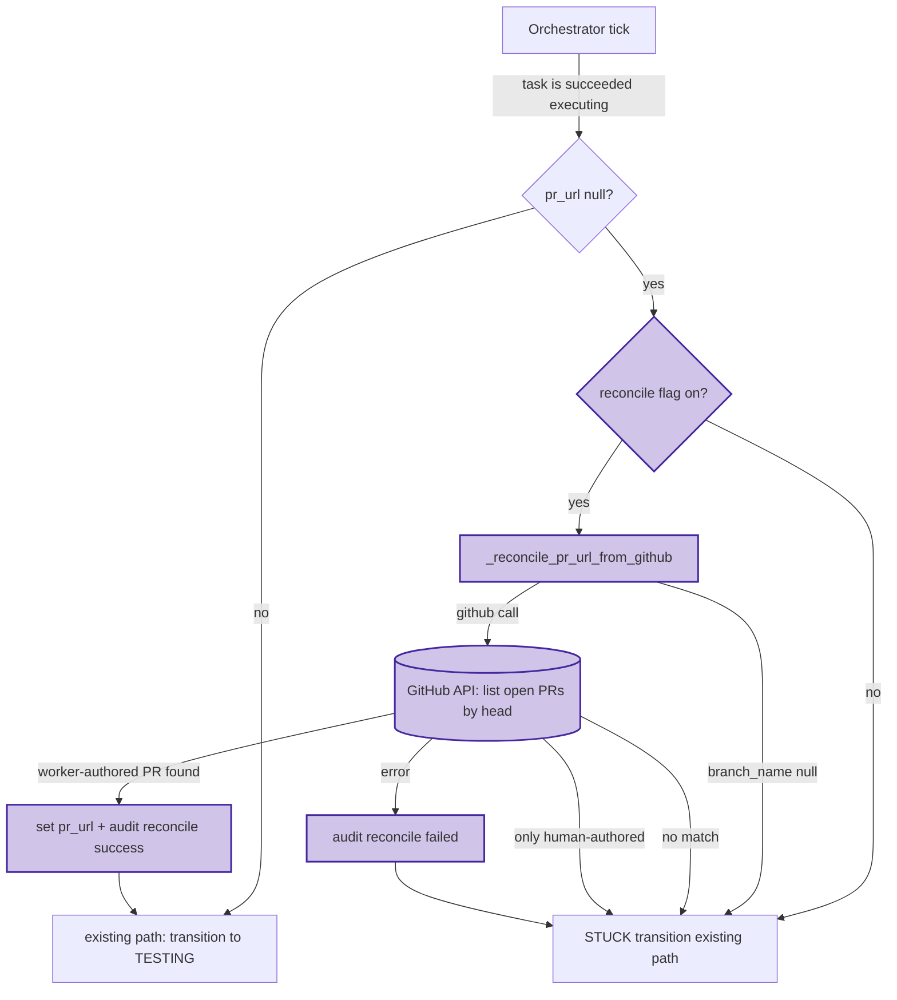

# 0054 — Orchestrator GitHub-state reconciliation

## Context

See [spec 0054](../../product-specs/wip/0054-orchestrator-github-state-reconciliation.md)
for the problem framing. This design fills in the technical shape;
the architect worker may revise during pickup.

## Goals / non-goals

Match the spec one-for-one. No expansion at the design layer.

## Architecture

## Parts

- **`coder_core/workers/orchestrator.py`** (existing, edit) — add
  the `_reconcile_pr_url_from_github` helper and the call site
  inside `_after_dispatch` lines **769-801** (the existing
  `succeeded|executing|no pr_url` branch). Lines verified by the
  architect dispatch (task `62e0c95e`) against HEAD as of
  2026-04-27. Estimated change: ~80 LoC including the helper.
- **`coder_core/integrations/github.py`** — **no new method
  needed.** `GitHubClient.list_pulls` already exists at line 678
  and accepts `head` + `state` parameters; it auto-qualifies the
  head as `{org}:{branch}`. The reconciliation helper calls this
  directly. (Original draft hedged "may need to add a helper";
  architect verified the existing method covers the case.)
- **`coder_core/audit/__init__.py`** (or wherever the action enum
  lives) — register the two new action strings.
- **`coder_core/config.py`** (existing, edit) — add the
  `coder_orchestrator_pr_url_reconcile_enabled: bool = False` setting.
- **`tests/workers/test_orchestrator_reconcile.py`** (new) — unit
  tests covering the six branches per AC5.
- **`tests/workers/test_orchestrator.py`** (existing, edit) — add the
  AC6 integration test alongside the existing orchestrator tests.

## Data flow — happy path (worker-authored PR found)

1. Orchestrator tick fires for a task in `succeeded|executing|pr_url=null`.
2. Flag check: `settings.coder_orchestrator_pr_url_reconcile_enabled`
   is True → enter reconciliation. (False → existing STUCK path.)
3. Helper checks `task_row.branch_name`. None or empty → return None
   → STUCK.
4. Helper resolves the project's `github_org` via the existing
   `projects` table lookup; constructs `org/repo`.
5. Helper calls `GitHubClient.list_pulls(repo, head=f"{org}:{branch_name}",
   state="open")`. Returns a list of PR objects. (Existing method —
   no new helper needed; verified at `integrations/github.py:678`
   by architect dispatch `62e0c95e`.)
6. Filter to worker-authored PRs via `pr["user"]["type"] == "Bot"`
   — a stable GitHub API invariant that's True for all GitHub App
   PRs and False for human accounts. **See ADR 0016** for why
   login-match was rejected (no `bot_login` field in Settings;
   misconfiguration risk; type=Bot is more robust).
7. Pick the most recently created from the filtered list. Read
   `pr.html_url`.
8. Write audit row: `action='task.pr_url_reconciled_from_github'`,
   `target_id=task_id`,
   `details={'pr_url': url, 'branch_name': branch, 'commit_sha': sha}`.
9. Return URL to caller.
10. Caller sets `task_row.pr_url = url`, writes a stage-transition
    log with `outcome='pr_url_reconciled_from_github'`, returns the
    current stage. Next orchestrator tick handles the
    `executing → testing` transition naturally.

## Data flow — fail-soft cases

- **`branch_name` is None.** Helper returns None immediately, no
  GitHub call. STUCK transition runs.
- **GitHub returns no open PRs.** Helper returns None, no audit row
  (it's not a failure, just nothing to reconcile). STUCK transition
  runs.
- **GitHub returns only human-authored PRs.** Helper returns None,
  no audit row. STUCK transition runs. Operator may have opened a
  PR separately; we don't conflate.
- **GitHub call raises (rate limit, network, auth).** Helper catches,
  writes audit row `task.pr_url_reconcile_failed` with error
  metadata, returns None. STUCK transition runs.
- **GitHub returns malformed response.** Same fail-soft path as call
  raised.

## Invariants

- **Fail-soft.** The helper never raises. Any error returns None →
  the existing STUCK path runs unchanged. We never block a task
  because reconciliation failed.
- **Read-only.** The helper makes one read against GitHub. Never
  opens, comments on, or closes a PR.
- **Idempotent.** Re-running the orchestrator tick on the same task
  with the same GitHub state produces the same outcome. Audit rows
  written once per successful reconciliation (the row's
  `target_id=task_id` makes duplicate inserts visible if the path
  fires twice; the next tick after population sees `pr_url is not
  None` and exits early).
- **Backward compatible.** When the flag is off OR when
  `parse_pr_url` already extracted a URL from worker stdout, the
  new code path is bypassed entirely.
- **Only on the success path.** The reconciliation is gated on
  `status == TaskStatus.SUCCEEDED.value` AND
  `stage == TaskStage.EXECUTING.value`. Failed and timed-out tasks
  have different recovery semantics and are out of scope.

## Interfaces

- **No new HTTP endpoints.** This is an internal orchestrator change.
- **GitHub call:** one new call (or reuse of an existing helper) at
  `GET /repos/{org}/{repo}/pulls?head={org}:{branch_name}&state=open`.
  Uses the per-project GitHub PAT already available to the
  dispatcher.
- **Audit:** two new action strings (per AC3).
- **Settings:** one new field
  (`coder_orchestrator_pr_url_reconcile_enabled`, default False).

## Open questions

Inherited from spec — see [spec 0054 § Open
questions](../../product-specs/wip/0054-orchestrator-github-state-reconciliation.md).

## Rollout

- **Stage 0 — code lands behind flag.** Ship the helper, the call
  site, the audit actions, the settings field, the tests. Default
  `coder_orchestrator_pr_url_reconcile_enabled = False`. The new
  code path is dead code in prod until the flag is flipped.

- **Stage 1 — flip on `coder` only.**
  `coder_orchestrator_pr_url_reconcile_enabled = True` via Cloud Run
  env update (no code change, no rollout race because the change
  only adds a new code path that was previously unreachable). Watch
  for a few days. Headline metric: count of
  `task.pr_url_reconciled_from_github` audit rows. Each one is a
  task that would have been mis-marked stuck under the old
  behaviour.

- **Stage 2 — fleet flip.** No project-scoped opt-in needed (this
  is orchestrator-side, not worker-side; behaviour is uniform
  across projects). Flag is fleet-wide.

## Backout plan

- **Off via flag.**
  `coder_orchestrator_pr_url_reconcile_enabled=false`. Immediate
  effect: the new code path is bypassed; the existing STUCK
  transition runs as before. No state cleanup needed.
- **Wholesale removal.** The helper, the call-site delta, the audit
  actions, and the settings field can be dropped at next major
  version if the feature is abandoned. No migrations to revert; no
  external state to undo.

## Links

- Spec: [0054](../../product-specs/wip/0054-orchestrator-github-state-reconciliation.md)
- Related designs:
  [worker-roles](../active/worker-roles.md),
  [worker-communication](../active/worker-communication.md)
- Realised pain: [coder-core#36](https://github.com/coder-devx/coder-core/pull/36)
