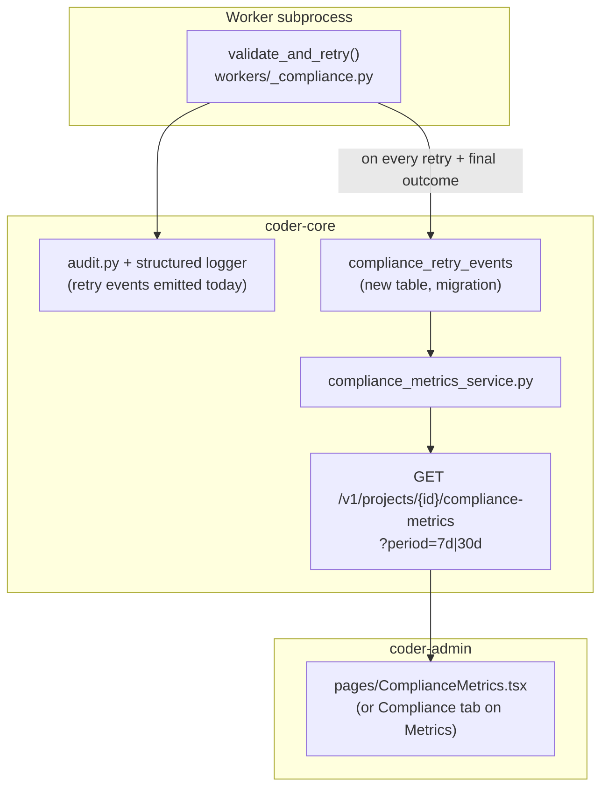

# Compliance Gate Retry Visibility

## Context

The compliance gate (`workers/_compliance.py::validate_and_retry`)
re-prompts PM / Architect / Team-Manager / Reviewer-ship workers when
their structured output fails the schema. Each retry already emits a
`worker_output_compliance.retry` structured log. The signal is
correct; the surface is wrong — operators must know the log name and
write a Cloud Logging query to see it. Prompt-quality regressions
surface weeks late, after a cost spike or a failure spike forces the
investigation. Spec 0063 asks for the same admin-panel surface that
metrics already has: per-role-per-day, scannable, with regressions
visually obvious.

## Goals / non-goals

Add a retry-rate surface to the admin panel without changing the
gate. No alert wiring (that's a separate spec), no breakdown by raw
prompt text, no fleet rollup.

## Design

### Components

**`compliance_retry_events` table (new migration).**
Per-task summary written when the gate finishes (success or
exhaustion). Columns: `id uuid PK`, `project_id text NOT NULL`,
`task_id uuid FK`, `role text NOT NULL`, `retry_count int NOT NULL`,
`error_kind text NULL` (the dominant validator-error category for the
final attempt; `null` on success), `created_at timestamptz NOT NULL
DEFAULT now()`. Indexes: `(project_id, created_at)`,
`(project_id, role, created_at)` for the rollup query.

Why a table instead of re-parsing logs: log re-parse is brittle
(format drift, retention windows) and slow at admin-panel render time.
A small append-only table is cheap to write at gate-finish and cheap
to roll up.

**Service —
`coder_core/metrics/compliance_metrics_service.py`.**
`get_compliance_metrics(project_id, period)` returns
`[{role, date, retry_count, dominant_error_kind}]` for the requested
window. Days with zero retries across all roles are omitted (AC1).
Aggregation is `GROUP BY role, date_trunc('day', created_at)` over
the table.

**API —
`GET /v1/projects/{id}/compliance-metrics?period=7d`.**
Thin adapter over the service per the modular-monolith design
(routers are thin). Period values: `7d` (default), `30d`. Auth via
the per-project API key or admin JWT.

**Gate emit point —
`workers/_compliance.py::validate_and_retry`.**
At the end of each call (success or `SchemaFailure`), insert one row
into `compliance_retry_events`. Uses the same DB session the worker
already holds; no new transaction. The structured-log emit stays for
back-compat (some queries already use it).

**Admin panel — `pages/ComplianceMetrics.tsx`.** New tab on
`/projects/:id/metrics` (or parallel route, decided by the
front-ender). Renders a role × day table with cells showing
`retry_count` + `dominant_error_kind`. Period selector (7d / 30d)
mirrors the existing metrics page. Cells with `retry_count > 0`
render highlighted (amber background) so a regression is visible
without scanning. Empty period renders the explicit empty-state
message from AC5. Behind `VITE_COMPLIANCE_METRICS_ENABLED` (default
on); `false` hides the tab/route entirely.

### Data flow

1. Worker subprocess runs `validate_and_retry`. On every attempt, the
   existing `worker_output_compliance.retry` log fires.
2. When the gate finishes (validated output OR `SchemaFailure`), the
   worker writes one `compliance_retry_events` row capturing
   `retry_count` and `dominant_error_kind` for that task.
3. Admin panel page fetches
   `GET /v1/projects/{id}/compliance-metrics?period=7d`; service
   rolls up the table; page renders.

### Edge cases

- **Schema-failed task that's later gate-replayed (spec 0064)**:
  the replay path inserts a *new* row with `retry_count=1` and the
  outcome of the replay; the original failure row stays. The table
  shows the operator-visible history.
- **Worker crash mid-validate**: no row written; the task lands in
  `failed` with `failure_kind="transient"`, which is not a compliance
  retry. Correct — we don't want crashes to inflate the retry rate.
- **Backfill**: not in scope. The admin panel surface is "going
  forward"; historical retries stay in Cloud Logging.

### Open questions

- **Write retry events at every retry, or only at finish?**
  Recommend finish-only: simpler, smaller table, the dominant
  error_kind summary is what operators care about. Per-attempt
  granularity stays in Cloud Logging if needed.

## Rollout

1. Migration: add `compliance_retry_events` table.
2. Code ship: gate emits rows; new service + endpoint; admin panel
   tab behind flag.
3. Soak 24 hours on `coder` project: verify table populates and
   queries are fast.
4. Default `VITE_COMPLIANCE_METRICS_ENABLED=true` fleet-wide.
5. Backout: set the flag to `false` (UI hidden); the table keeps
   filling, no operational impact.

## Links

- Active infra: [observability-and-cost-tracking](../active/observability-and-cost-tracking.md),
  [admin-panel](../active/admin-panel.md),
  [worker-roles](../active/worker-roles.md)
- Related WIP: [0064](./0064-schema-gate-recovery.md) — recovery path
  for tasks that exhaust the budget (this spec is the visibility surface).
- Spec: [0063](../../product-specs/wip/0063-compliance-gate-retry-visibility.md)
