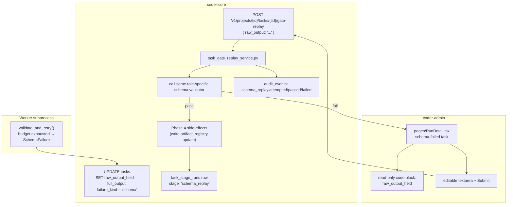

# Schema-gate recovery: persist and replay exhausted worker output

## Context

When a PM, Architect, or Team Manager worker exhausts the strict-JSON
compliance retry budget (`workers/_compliance.py::validate_and_retry`
returns `SchemaFailure`), the orchestrator marks the task `failed` with
`failure_kind="schema"`. Today only a *truncated* snippet of the last
attempt's raw output survives in `failure_detail`; the rest is dropped
to keep the column small. The full output is often a near-complete
spec / design / plan that needs only cosmetic repair (a stray fence,
a renamed field). The pipeline stalls and the model's work is silently
gone — operators have no recovery path short of re-running the worker
from scratch.

## Goals / non-goals

Persist the full last-attempt output and let operators submit a
hand-edited version back through the same schema gate. No automatic
repair, no intermediate-attempt persistence, no change to the gate
itself.

## Design

### Components

**`tasks.raw_output_held` (new column, migration).**
Nullable `TEXT`, no length cap. Populated at the moment
`failure_kind="schema"` is set on gate exhaustion. The existing
truncated `failure_detail` snippet stays — it's the at-a-glance
summary; `raw_output_held` is the full payload for recovery.

**Gate emit point —
`workers/_compliance.py::validate_and_retry`.**
On `SchemaFailure`, the dispatcher writes
`raw_output_held = last_attempt_text` in the same UPDATE that sets
`failure_kind`. No new code path — just a column added to the
existing failure write.

**Replay endpoint —
`POST /v1/projects/{id}/tasks/{task_id}/gate-replay`.**
Body: `{"raw_output": "<edited or unchanged>"}`. Returns:
- `200 { task: {...} }` if validation passes; the task transitions out
  of `failed`, Phase 4 runs, the new state is reflected in the next
  SSE tick.
- `422 { errors: [...] }` if validation still fails; task state is
  unchanged, no side-effects.

Auth: per-project API key + operator scope (or admin JWT). Idempotent
on repeated identical-payload submissions because Phase 4 registry
writes are append-idempotent.

**Service —
`coder_core/tasks/gate_replay_service.py`.**
Owns the workflow:
1. `load_in_project(session, TaskRow, task_id, project_id)` (fails 404
   on cross-project per [multi-tenancy](../active/multi-tenancy.md)).
2. Reject if `task.failure_kind != "schema"` or `task.status !=
   "failed"` (replay only applies to exhausted-gate tasks).
3. Look up the role-specific validator from
   `workers/schemas/{role}.json` and run it on `request.raw_output`.
4. On pass: parse the envelope, run the role's Phase 4 handler
   (write design + ADRs / write spec draft / write plan), record an
   `audit_events` row (`action="schema_replay.passed"`), and a
   `task_stage_runs` row with `stage="schema_replay"`. Transaction
   ownership lives in the service per the modular-monolith pattern.
5. On fail: return errors; record `audit_events` with
   `action="schema_replay.failed"`; no state change.

**Phase 4 handler factoring.** The existing per-role Phase 4 logic
(`_handle_pm_result`, `_handle_architect_result`,
`_handle_team_manager_result`) stays in `workers/dispatcher.py`. The
gate-replay service imports and calls them with a synthetic
"validated output" envelope; behaviour is identical to the original
worker path. This is the cheapest way to keep one Phase-4 code path.

**Admin panel — `pages/RunDetail.tsx`.** When the rendered task has
`failure_kind="schema"`, two new UI surfaces:
- A scrollable read-only code block showing `raw_output_held` (AC2).
- A "Replay gate" button that opens an editable textarea
  pre-populated with `raw_output_held` and a Submit button wired to
  the replay endpoint (AC3, AC4).
- On 422, validator errors render inline below the textarea (AC5).

**Audit + stage-run rows.** Successful replays land in the same
audit / stage-run streams the original worker would have written —
the admin panel's audit and stage timeline views require no special
cases.

### Data flow

1. Worker exhausts the gate; dispatcher UPDATEs `tasks` with
   `failure_kind="schema"` AND `raw_output_held=<full output>`.
2. Operator opens the admin task detail page; sees the held output.
3. Operator hand-edits, hits Submit.
4. Service runs the validator. Pass → Phase 4 + audit + stage-run +
   SSE; admin re-renders. Fail → 422 + inline errors; no state
   change.

### Edge cases

- **Replay on a non-schema-failed task**: rejected at step 2 of the
  service with `409`; UI doesn't expose the button in this case but
  defense-in-depth.
- **Concurrent replays**: SELECT FOR UPDATE on the task row inside
  the service transaction; second concurrent submitter sees the
  task already transitioned and gets `409`.
- **Phase 4 fails after validation passes**: the service rolls back
  the transaction; task stays `failed`; audit row is `schema_replay.
  failed` with the Phase-4 error in the detail. Operator can retry
  with the same payload.
- **Replay never tried**: `raw_output_held` stays in the row
  forever (no TTL). Storage cost is bounded by failed task volume,
  which is small.

### Open questions

- **Same `tasks` row vs separate `task_held_outputs` table?**
  Recommend column on `tasks` for v1 (simpler, no join, one snapshot
  per task is enough). If we need multiple snapshots per task later
  (e.g. each retry attempt) a follow-up migration to a side table is
  trivial.
- **Permission scope?** Recommend operator-level project access; no
  new scope. Replays are observable in the audit log either way.

## Rollout

1. Migration: add `tasks.raw_output_held TEXT NULL`.
2. Code ship: dispatcher writes the column on `SchemaFailure`; new
   service + endpoint; admin panel detail page renders held output
   and replay textarea behind `VITE_GATE_REPLAY_ENABLED` (default on
   in dev, off in prod for first soak).
3. Soak on `coder` project: hand-trigger a known-bad PM output;
   confirm held output appears, replay path passes Phase 4.
4. Default flag on fleet-wide.

## Links

- Active infra: [worker-roles](../active/worker-roles.md),
  [pm-worker](../active/pm-worker.md),
  [architect-worker](../active/architect-worker.md),
  [team-manager-worker](../active/team-manager-worker.md),
  [admin-panel](../active/admin-panel.md),
  [worker-communication](../active/worker-communication.md),
  [audit-log](../active/audit-log.md)
- Related WIP: [0063](./0063-compliance-gate-retry-visibility.md) —
  surfaces gate retry rate; this design is the recovery path when
  the budget exhausts.
- Spec: [0064](../../product-specs/wip/0064-schema-gate-recovery-persist-and-replay-exhausted-worker-output.md)
- Runbook: [worker-schema-failure](../../runbooks/worker-schema-failure.md)
