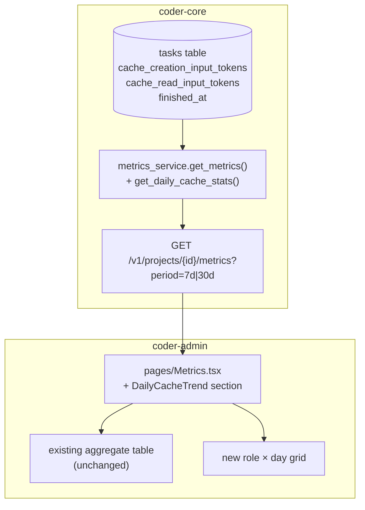

# Per-role daily cache hit rate trend in metrics

## Context

`/projects/{id}/metrics` already shows an aggregate prompt-cache hit
rate per role for the selected period via the `cache_stats:
RoleCacheStats[]` field. The aggregate masks *when* a hit-rate drop
happened — after a prompt-assembly change lands (e.g. a section
reorder), the stable prefix may break for one or more roles. With only
period-aggregate visibility, operators can't tell whether the drop is
new or chronic. Spec 0065 asks for a per-day breakdown so the
regression date stands out without a task-row dive.

## Goals / non-goals

Add a daily rollup alongside the existing aggregate. Visual marker for
day-over-day drops ≥ 30pp. Don't change the aggregate, don't add
sub-day granularity, don't add alerting (escalations spec).

## Design



### Components

**Backend rollup —
`coder_core/metrics/service.py::get_daily_cache_stats(project_id, period)`.**
Existing service module gets a new helper. SQL groups by
`role` and `date_trunc('day', finished_at AT TIME ZONE 'UTC')` over
the project's `tasks` table for the requested window:

```sql
SELECT
  role,
  date_trunc('day', finished_at AT TIME ZONE 'UTC')::date AS date,
  SUM(COALESCE(cache_read_input_tokens, 0))     AS cache_read_tokens,
  SUM(COALESCE(cache_creation_input_tokens, 0)) AS cache_creation_tokens,
  SUM(COALESCE(input_tokens, 0))                AS total_input_tokens,
  COUNT(*)                                      AS task_count
FROM tasks
WHERE project_id = :project_id
  AND finished_at >= :since
  AND finished_at < :until
GROUP BY role, date
ORDER BY date, role;
```

`cache_hit_rate` is computed in Python: `cache_read_tokens /
total_input_tokens` when `total_input_tokens > 0`, else `null`. UTC
day boundary chosen to match the existing daily metrics; documented
in the response.

**API — `GET /v1/projects/{id}/metrics?period=…`.**
Adds `daily_cache_stats: DailyCacheStat[]` alongside the existing
`cache_stats`. No breaking change — older clients ignore the new
field. Period values unchanged (`1d`, `7d`, `30d`). For `1d`, the
array contains a single date; for `7d` / `30d`, one entry per
(date × role) pair.

**Frontend — `coder-admin/src/pages/Metrics.tsx`.**
Adds a "Daily Cache Trend" section beneath the existing aggregate
table. Renders a role × day grid: dates as columns (oldest → newest),
roles as rows. Cell colour by threshold (AC3): green ≥ 0.50, amber
0.20–0.49, red < 0.20, `—` for null. A `▼` indicator marks any cell
where the rate dropped ≥ 30pp vs the same role's preceding-day cell
(AC4). Hover shows raw token counts.

**Type — `coder-admin/src/api/client.ts::DailyCacheStat`.**
```ts
type DailyCacheStat = {
  date: string;            // YYYY-MM-DD UTC
  role: string;
  cache_read_tokens: number;
  cache_creation_tokens: number;
  total_input_tokens: number;
  cache_hit_rate: number | null;
  task_count: number;
};
```

**Decision: column or rollup table?**
Computed from `tasks` at request time (no new table). The query is
cheap — `tasks` is already indexed `(project_id, finished_at)` and
the result-set size for 30 days × 5 roles is 150 rows. A rollup
table would be a premature optimisation; revisit only if 30d queries
exceed ~200 ms.

### Edge cases

- **Day with zero tasks for a role**: row absent for that
  (date, role) pair in the SQL result; the frontend grid renders the
  cell as `—`. The 30pp-drop indicator is computed only on adjacent
  non-null cells (a gap doesn't trigger ▼).
- **Day with tasks but `total_input_tokens = 0`**: unusual but
  possible (synthetic / empty prompts in tests); `cache_hit_rate` is
  `null` per AC1. Cell renders `—`; no indicator.
- **30d view becoming wide**: the open question. Initial render
  keeps daily columns; if the table overflows the viewport, an
  operator can filter by role. Weekly buckets are a follow-up if
  needed.
- **Default-collapsed?** Recommend collapsed by default with a
  disclosure triangle so the page length stays predictable; the
  aggregate table remains the at-a-glance view.

### Open questions (from spec)

- **Daily vs weekly columns at 30d**: ship daily; revisit if the
  table is unworkable in practice.
- **Section default state**: collapsed (recommended above).

## Rollout

1. Backend: SQL helper + service method + endpoint field. Behind
   no flag — purely additive to the response.
2. Frontend: new section behind `VITE_DAILY_CACHE_TREND_ENABLED`
   (default on in dev, ship on by default once styled).
3. Smoke test: AC5's seeded-data integration test in `coder-core`.
4. Visual QA on the `coder` project metrics page after the prompt-
   reorder PR (coder-devx/coder-core#80) — confirm the regression
   date the spec describes is now visible.

## Links

- Active infra: [observability-and-cost-tracking](../active/observability-and-cost-tracking.md),
  [admin-panel](../active/admin-panel.md),
  [worker-roles](../active/worker-roles.md)
- Spec: [0065](../../product-specs/wip/0065-per-role-daily-cache-hit-rate-trend-in-metrics.md)
- Related: [0029-prompt-caching](./0029-prompt-caching.md) — the
  optimisation this surface lets us verify.
