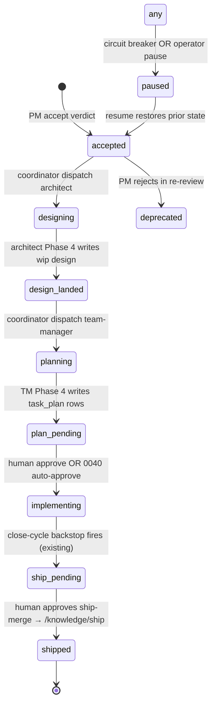

# Spec-lifecycle coordinator: auto-chain PM → Architect → TM transitions

## Context

ADR [0015](../../adrs/0015-ship-gate-in-coder-pipeline.md) put the
ship gate inside the Coder pipeline rather than in a side service.
The close-cycle backstop in `workers/pipeline_chain.py` is the
canonical example: when all task plan rows for a WIP complete and
all ACs are satisfied, the pipeline auto-dispatches the architect
ship-draft and reviewer ship-mode tasks without a human spawn. The
backstop is idempotent (per-WIP existence query), failure-tolerant
(falls open on GitHub errors), and observable (audit + SSE).

Spec [0068](../../product-specs/wip/0068-spec-lifecycle-coordinator.md)
generalizes the same pattern one level up. Three earlier transitions
are still manual today:

1. PM-accept verdict written → human spawns architect.
2. Architect lands a `wip/` design → human spawns team-manager.
3. TM lands `task_plan` rows → human approves the plan.

Each manual spawn parks the spec until a human looks. The coordinator
makes (1) and (2) automatic and lets (3) be either human-approved or
auto-approved per spec [0040](./0040-confidence-auto-approve.md).

## Goals / non-goals

Generalize the close-cycle backstop into a per-spec state machine
with auto-dispatch on transition, circuit breakers (cost cap, retry
cap, stuck threshold), and operator pause / resume. Do **not**
re-implement the per-task orchestrator (developer / reviewer fix-loop
stays unchanged), do **not** auto-approve plans (consume 0040), do
**not** auto-recover from schema-gate exhaustion (consume 0064).

## Design

### Components

**`spec_runs` table — new migration.**
One row per `(project_id, wip_spec_id)`, lifecycle of an in-flight
spec. Schema per spec 0068's *Scope*. Columns of note:

- `state text NOT NULL` — exactly one of the lifecycle states.
- `paused_reason text NULL` — `cost_cap`, `retry_cap`, `manual`,
  `stuck`, or null. Non-null implies the row is paused regardless of
  state.
- `current_task_id uuid NULL FK tasks(id)` — the latest task
  dispatched at the current state.
- `stage_retry_counts jsonb NOT NULL DEFAULT '{}'` — `{state:
  count}` for circuit-breaker enforcement.
- `cost_input_tokens bigint NOT NULL DEFAULT 0`,
  `cost_output_tokens bigint NOT NULL DEFAULT 0` — running cost
  total across every dispatched task.
- `created_at`, `updated_at timestamptz NOT NULL`.
- Unique `(project_id, wip_spec_id)`. Indexes on
  `(project_id, state)` and `(project_id, updated_at)` for the admin
  rollup and the stuck-detector.

**Domain — `coder_core/domain/spec_run.py`.**
`SpecRunRow(Base)` ORM mapping; `SpecRun` dataclass for service-layer
return shapes. Lifecycle constants (`STATE_ACCEPTED`, …) and the
`SpecRunState` enum live here.

**Application service — `coder_core/spec_runs/service.py`.**
Single owner of `spec_runs` mutations, per the
[coder-core-modular-monolith](../active/coder-core-modular-monolith.md)
contract. Public methods:

- `start_run(project_id, wip_spec_id)` — called when a PM-accept
  verdict lands. Inserts a `spec_runs` row in `accepted` state.
  Idempotent on the unique key.
- `advance(spec_run_id, to_state, *, dispatched_task_id, trigger)` —
  the only writer of `state`. Records an audit row in the same DB
  session.
- `pause(spec_run_id, reason, actor)` / `resume(spec_run_id, actor)` —
  set / clear `paused_reason`; audit emitted.
- `record_cost(spec_run_id, input_tokens, output_tokens)` — called
  from worker Phase 4 paths to attribute spend to the run.
- `bump_retry(spec_run_id, state)` — increment
  `stage_retry_counts[state]`; pause-with-reason on cap hit.

`SELECT FOR UPDATE` on the row inside every state-mutating method;
concurrent ticks see the already-advanced state and are no-ops.

**Coordinator — `coder_core/spec_runs/coordinator.py::tick()`.**
The brain. Each tick:

1. `SELECT * FROM spec_runs WHERE state NOT IN ('shipped','deprecated') AND paused_reason IS NULL FOR UPDATE SKIP LOCKED`.
2. For each row, evaluate the **transition probe** for its current
   state (see below). If matched, call `service.advance(...)` and
   dispatch the next task.
3. Run circuit-breaker checks: cost cap, stuck-stage threshold.
   Either pauses with the appropriate reason.
4. Commit. Each row's processing is its own short transaction —
   one row's failure can't stall the rest of the tick.

**Transition probes (lazy, polling-based).**
The coordinator does *not* require workers to signal it. It reads the
same data the admin panel reads:

| State | Probe |
|---|---|
| `accepted` | always advance to `designing` next tick (no condition); idempotent dispatch via existing-task query |
| `designing` | architect task with `prompt LIKE 'design: <wip>%'` + `status='succeeded'` + design registry contains `<wip>` |
| `design_landed` | always advance to `planning` next tick (no condition) |
| `planning` | task_plans rows exist for `(project_id, wip_spec_id)` |
| `plan_pending` | plan-approve audit event OR 0040 auto-approve marker on the plan row |
| `implementing` | every task in the plan has terminal status AND ship-pending stamp from close-cycle |
| `ship_pending` | `/knowledge/ship` POST audit event with `wip_spec_id` |

ADR-worthy decision (already made): probes are SQL queries against
existing tables, not new event tables. We chose lazy-poll over event-
emit so the coordinator owns its own state and no worker has to know
the coordinator exists. The 60 s tick lag is acceptable per spec AC1.

**Dispatch helpers.** Three new internal helpers wrap the existing
task-creation path:

- `dispatch_architect(spec_run, wip_spec_id)` — creates a
  `role=architect` task with `prompt: design: <wip>` and project /
  GH context loaded. Idempotency check: does an architect task for
  this `wip_spec_id` already exist in non-terminal status? If yes,
  attach to it (`current_task_id = existing.id`,
  `trigger="manual_override"` audit) instead of dispatching anew.
- `dispatch_team_manager(spec_run)` — same shape, `role=team-manager`,
  prompt references the new `wip/` design path.
- The implementing-stage dispatches are owned by the existing
  per-task orchestrator. The coordinator only stamps state.

**Circuit breakers.**

- **Per-stage retry cap (default 3).** When `dispatch_*` sees a
  worker task land in `failed` non-terminal-recoverable status,
  `service.bump_retry(spec_run_id, state)` increments
  `stage_retry_counts[state]`. On `>= cap` the run pauses with
  `paused_reason="retry_cap"` and an L0 escalation opens via the
  existing [escalations](../active/escalations.md) watcher
  (trigger_kind = `failure_streak`, scoped to the spec_run).
- **Per-spec cost cap (default $50).** On every tick, recompute
  total cost from `cost_input_tokens + cost_output_tokens` priced
  via the same model-rate table the metrics page uses. Hitting the
  cap pauses with `paused_reason="cost_cap"`. Resume requires an
  explicit operator action — *not* a budget bump (operators must
  acknowledge the cost before resuming).
- **Stuck-stage threshold.** Reuse `projects.sla_stall_minutes`. On
  each tick, if `now() - updated_at > sla_stall_minutes`, pause
  with `paused_reason="stuck"`; the existing escalations watcher
  emits the L0 page based on the same threshold.

The three breakers are independent — a single run can hit cost cap
without ever hitting retry cap. Pause-reason is the latest hit; if
multiple fire on the same tick, the more severe wins (cost > stuck >
retry).

**API — `coder_core/api/spec_runs.py`.**

| Method | Path | Purpose |
|---|---|---|
| `GET` | `/v1/projects/{id}/spec-runs?state=…` | Fleet view, filtered |
| `GET` | `/v1/projects/{id}/spec-runs/{wip_spec_id}` | Single-run detail with transition history |
| `POST` | `/v1/projects/{id}/spec-runs/{wip_spec_id}/pause` | `paused_reason="manual"` + audit |
| `POST` | `/v1/projects/{id}/spec-runs/{wip_spec_id}/resume` | Clears pause; coordinator picks up next tick |

Routes are thin adapters per the modular-monolith design; all logic
lives in the service.

**Admin panel — `coder-admin/src/pages/Specs.tsx`.**
New `/projects/:id/specs` route. Renders a table of every active
spec_run: WIP id, title, state, current task (link), last transition
timestamp, cost-to-date, paused-reason badge if any. Per-row Pause /
Resume actions visible to admin scope. Click-through opens the
existing pipeline detail view. Behind
`VITE_SPEC_COORDINATOR_ENABLED` (default off through soak; on once
fleet-stable).

**Audit.** Three new `audit_events.action` values:
- `spec_run.transitioned` — every state advance. Detail carries
  `from_state`, `to_state`, `trigger` (one of
  `coord`, `manual_override`, `pause_then_resume`), and
  `task_id` if a task was dispatched.
- `spec_run.paused` — actor + reason in detail.
- `spec_run.resumed` — actor; clears paused state.

Operators reconstruct the full lifecycle of any spec from the
audit log alone.

### Data flow

1. PM-accept verdict lands → existing PM-worker Phase 4 calls
   `spec_run_service.start_run(project_id, wip_spec_id)`. Row
   inserted in `accepted` state. (This is the only place a worker
   touches `spec_runs` directly — every other transition is
   coordinator-driven.)
2. Coordinator tick (T+≤60 s): row in `accepted` → probe always
   matches → `dispatch_architect` → `service.advance(designing,
   dispatched_task_id=arch_task.id, trigger="coord")`.
3. Architect runs (per [architect-worker](../active/architect-worker.md)),
   Phase 4 writes `designs/wip/<wip>-…md` and bumps `tasks.status =
   succeeded`.
4. Next tick: row in `designing` → probe matches succeeded
   architect task + design in registry → advance to `design_landed`,
   `dispatch_team_manager`, advance to `planning`.
5. TM runs, writes `task_plan` rows.
6. Next tick: row in `planning` → probe matches → advance to
   `plan_pending`. **Stop here.** Run waits for human or 0040.
7. Plan approved → audit event lands → next tick advances to
   `implementing`. Existing per-task orchestrator dispatches the
   developer fleet; the coordinator only observes.
8. All AC tasks done → `pipeline_chain.py` close-cycle stamps
   `wips_pending_merge` (existing, unchanged) → next tick advances
   to `ship_pending`.
9. Operator approves the ship-merge in the admin ship-gate panel →
   `/knowledge/ship` lands → audit event → next tick advances to
   `shipped`. Run is terminal.

### Edge cases

- **Concurrent ticks.** Row-level `FOR UPDATE SKIP LOCKED`. A second
  tick on the same row sees the already-advanced state and is a
  no-op. Same locking discipline as the existing self-heal-tick.
- **Manual override mid-flight.** A human spawns an architect task
  before the coordinator does. The idempotency check in
  `dispatch_architect` finds the existing task and attaches to it
  with `trigger="manual_override"` audit; no double-dispatch.
- **Spec edited mid-flight.** Hand-edits to the `wip/` spec land in
  git. The architect's reads see the new content. If the edit
  changes ACs materially, the operator pauses the run (manual) and
  later resumes; resume from `accepted` re-dispatches the architect.
  Documented in the runbook; coordinator does not detect spec edits
  on its own.
- **Worker dispatch failure (Cloud Run instance churn, etc.).** The
  task lands `failed` with `failure_kind="transient"` after the
  worker's transient retry budget exhausts. Coordinator sees the
  failed task on the next tick, calls `bump_retry`, and either
  re-dispatches (under cap) or pauses (cap hit). Spec
  [0056](./0056-worker-dispatch-durability.md) reduces the rate
  this fires.
- **Schema-gate exhaustion (PM / Architect / TM).** The task lands
  `failed` with `failure_kind="schema"`. Coordinator pauses with
  `paused_reason="retry_cap"` after the cap; operators recover via
  [0064](./0064-schema-gate-recovery.md)'s replay endpoint, which
  transitions the task out of `failed` — coordinator picks up on
  the next tick and continues.
- **Project archived during a run.** Coordinator skips archived
  projects (`projects.archived_at IS NULL` filter on the tick query).
  Existing runs stay where they are; resuming an archived project
  later picks up where it left off.
- **Spec deprecated by PM after `accepted`.** PM accept-mode can re-
  reject; coordinator detects the verdict change and advances the
  run to `deprecated` (terminal).

### Resolved open questions (from spec)

- **Cost cap shape.** Flat per-spec ($50) for v1 — simpler, tunable
  per-project. AC-scaled caps revisited only if the soak shows
  complex specs starve.
- **Eager vs lazy advance.** Lazy. Coordinator owns `spec_runs`
  state; workers don't write state transitions. Tick lag (≤60 s)
  acceptable per AC1; upgrade path to LISTEN/NOTIFY is trivial if it
  becomes a real bottleneck.
- **Cron vs LISTEN/NOTIFY.** Cron `coder-core-spec-coord-tick` Cloud
  Run Job, every 60 s. Consistent with self-heal-tick / auto-approve-
  tick / knowledge-audit-tick.
- **Hand-editing during flight.** Documented workflow, no special
  detection. Operator pauses the run before non-trivial edits.
- **Multi-WIP cycle keying.** Spec-file-keyed for v1. Add
  `wip_cycle_id` later if multi-file WIPs become common.

## Cloud Run Job — `coder-core-spec-coord-tick`

Mirrors the existing recurring-jobs set. Image is the standard
`coder-core` image; entrypoint is
`python -m coder_core.spec_runs.coordinator tick`. Synced in the same
[continuous-deployment](../active/continuous-deployment.md) workflow
step that updates the other tick jobs (so the coordinator never lags
the request handler revision).

Schedule: every 60 s via Cloud Scheduler. `--task-timeout=120s` —
generous; a real tick takes <5 s.

## Rollout

Stages, each gated on the prior:

1. **Migration only.** `spec_runs` table created; nothing reads or
   writes it. Verifies the schema lands cleanly.
2. **Service + API + admin page (read-only).** Service writes happen
   only via direct SQL or test fixtures. Admin page renders manually-
   inserted rows. Verifies the read path.
3. **PM-accept hook.** Existing PM-worker Phase 4 starts calling
   `start_run` on the accept path. Now `spec_runs` rows show up for
   every newly accepted spec, but state never advances (coordinator
   not yet running).
4. **Coordinator in shadow.** Cloud Run Job deployed; tick reads
   spec_runs but logs "would advance" rather than calling `advance`.
   Soak 24 h on the `coder` project. Confirm probes match correctly,
   no false positives.
5. **Coordinator live, accepted → designing only.** Enable just the
   first transition. Soak 24 h. Confirm architect dispatch is
   correct, idempotency holds, manual-override path works.
6. **Enable designing → design_landed → planning.** Architect-end
   probe + TM dispatch. Soak.
7. **Enable planning → plan_pending.** TM-end probe.
8. **Enable plan_pending → implementing.** Plan-approve probe.
   This depends on either the human path (existing) or
   [0040](./0040-confidence-auto-approve.md).
9. **Enable circuit breakers.** Retry cap, cost cap, stuck-stage.
   Each independently flagged.
10. **Backfill in-flight specs.** One-shot script inserts `spec_runs`
    rows for every spec currently in `wip/` with non-terminal task
    plans. Coordinator picks them up at their inferred state.
11. **`VITE_SPEC_COORDINATOR_ENABLED=true`** — the admin panel
    surface goes default-on; operators get the new view.

Backout at any stage: pause every spec_run (`UPDATE spec_runs SET
paused_reason = 'rollback'`); the coordinator stops advancing; manual
human spawn workflow still works because every transition is also
covered by the legacy path.

## Links

- Active infra: [pipeline-operations](../active/pipeline-operations.md),
  [worker-communication](../active/worker-communication.md),
  [worker-roles](../active/worker-roles.md),
  [escalations](../active/escalations.md),
  [self-healing](../active/self-healing.md),
  [audit-log](../active/audit-log.md),
  [admin-panel](../active/admin-panel.md),
  [observability-and-cost-tracking](../active/observability-and-cost-tracking.md)
- Spec: [0068](../../product-specs/wip/0068-spec-lifecycle-coordinator.md)
- Sibling WIPs: [0040](./0040-confidence-auto-approve.md) (consumes its
  auto-approve signal), [0031](./0031-token-budgets.md) (consumes its
  cost accounting), [0054](./0054-orchestrator-github-state-reconciliation.md)
  (mirrors its state-drift discipline),
  [0056](./0056-worker-dispatch-durability.md) (depends on durable
  dispatch), [0064](./0064-schema-gate-recovery.md) (hands off to its
  replay path)
- Predecessor: ADR [0015](../../adrs/0015-ship-gate-in-coder-pipeline.md)
  established the auto-dispatch pattern this design generalizes.
