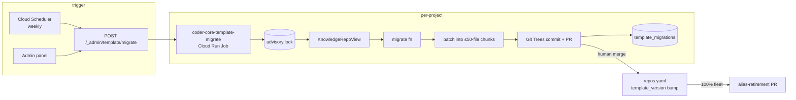

# Template Schema Migration

## Context

The `coder-system/template/` blueprint is forked by every managed project at onboarding. When the template gains a required new field or renames an existing one, every project needs to adopt the change. Today there is no automated path: adding `last_verified_at` (2026-04-18) required three coordinated PRs across three repos; the `/ship` endpoint refuses `template/` touches (spec 0044). This design implements the migration infrastructure spec 0047 defines.

## Goals / non-goals

In: migration file format, `KnowledgeRepoView` SDK, `template_migrations` table, Cloud Run Job runner, Knowledge API `409 SCHEMA_DRIFT`, admin fleet matrix, alias-tolerance infrastructure, runbook.

Out: body-content rewrites, ADR mutations, auto-merging PRs, live on-read transformation.

## Design

### Migration files

`coder-system/migrations/knowledge/00NN-<slug>.py` exports `NUMBER`, `SLUG`, `DESCRIPTION`, and `migrate(repo: KnowledgeRepoView) → list[FileChange]`. A declarative `.yaml` variant handles renames, constant-default adds, and file moves without Python. CI enforces unique `NUMBER`, importable Python, or schema-valid YAML. `migrations/_fixtures/` holds synthetic edge-case repos for `coder migrate test`.

### KnowledgeRepoView SDK

`coder_core.migrations.knowledge` exposes `list(type)`, `get(type, id)`, `iter_files(folder)` over a read-only GitHub snapshot of a project repo. Return types `FileChange | MoveFile | DeleteFile | RegistryRewrite` carry intent only; the runner rehydrates affected `registry.yaml` entries and commits via `commit_tree`. Migration code never calls GitHub directly.

### `template_migrations` table (Alembic 0055)

PK `(project_id, migration_number, batch_index)`. Columns: `status enum(pending|pr_open|merged|failed)`, `opened_pr_url`, `merged_at`, `error_kind`, `error_detail`, `total_batches`. A `status='pr_open'` row blocks re-dispatch on the same `(project, migration)` pair — the idempotency guard that makes re-runs safe.

### Cloud Run Job

Triggered by `POST /v1/_admin/template/migrate` (returns `{run_id}` immediately; see ADR 0020) or Cloud Scheduler weekly. Per-project loop: read `template_version` from `system/repos.yaml`; for each `NUMBER > template_version` in ascending order, acquire `(project_id)` advisory lock, snapshot `KnowledgeRepoView`, call `migrate(view)`, batch `FileChange[]` into ≤ `template_migration_max_files_per_pr` (default 50) chunks, open one PR per batch via `commit_tree`. Final batch PR carries the `repos.yaml` `template_version` bump; earlier batches note which batch holds it. A project with an open PR for migration N receives no PR for N+1 until N merges.

### Alias-tolerance

A rename migration declares `VALIDATOR_ALIASES = [("from_key", "to_key")]`; CI extracts this into `migrations/validator-aliases.yaml`. The ADR 0008 validator accepts both field names while any project's `template_version` is below `TARGET_VERSION`. Once the fleet matrix shows 100% adoption, the runner opens a `coder-system` alias-retirement PR (ADR 0019). Field removals follow two migrations — deprecate via `DEPRECATED_FIELDS`, then remove — to provide a tolerance window without a "target" alias (ADR 0021).

### Knowledge API extensions

`GET /knowledge/{type}/{id}?min_schema_version=N` → `409 SCHEMA_DRIFT` with `{pending_migrations: [{number, slug}]}` when the project's `template_version < N`. Default behaviour (no param) unchanged. `GET /projects/{id}/template/version` → `{template_version, current_version, pending: [{number, slug, description}]}`. Admin-only `GET /_admin/template/migrations` returns the fleet matrix row per project.

### Admin panel

`/admin/template-migrations` renders one row per project, one column per migration number with a status pill (✓ merged / ⚠ PR open / ✗ failed / ○ pending). Cell click → PR URL or error detail. Behind `VITE_TEMPLATE_MIGRATIONS_ENABLED`. `POST /v1/_admin/template/migrate` available for manual dispatch with optional `{migration_numbers, projects, dry_run}`.

## Edge cases

- **No-op migration** (project has no affected artifacts): empty `FileChange[]` → no PR; runner writes `status='merged'` with `no_op=true` and bumps `template_version` via a one-line `repos.yaml` PR.
- **Cap exceeded without `ALLOW_BATCHING`**: run fails with `error_kind='cap_exceeded'`; no partial PR is opened.
- **Failed migration recovery**: `template_migrations` rows are terminal — fix by issuing a new migration number. The stalled project is visible on the fleet matrix; other projects continue independently.
- **Concurrent dispatch** (weekly tick + manual trigger): `(project_id)` advisory lock plus `status='pr_open'` idempotency guard prevent duplicate PRs on the same `(project, migration)` pair.
- **`409 SCHEMA_DRIFT` on Knowledge API**: workers must surface the pending migration names to the operator and must not write over a pre-migration artifact.
- **`coder-system` self-update**: the runner operates only on managed projects; `coder-system`'s own `system/` updates are applied by the schema author in the same PR that adds the migration file.

## Rollout

1. `migrations/knowledge/` folder, SDK stub, `_TEMPLATE.py/yaml`, `0001-baseline.py`, `_fixtures/`. CI validation wired.
2. Alembic migration 0055 (`template_migrations` table) + `KnowledgeRepoView` implementation + Cloud Run Job deployed, flag `CODER_TEMPLATE_MIGRATIONS_ENABLED=false`.
3. `template_version` seeded per project's `repos.yaml` (one PR per project). `GET /projects/{id}/template/version` endpoint ships.
4. `409 SCHEMA_DRIFT` Knowledge API path + `audit_events` rows for migration state transitions.
5. Fleet flag enabled; admin panel page; alias-tolerance reader wired into ADR 0008 validator CI.
6. Runbook `system/runbooks/template-migration.md` + `coder migrate test --against ./fixture-repo` CLI command.

## Links

- Spec: [0047 — template schema migration](../../product-specs/wip/0047-template-schema-migration.md)
- ADRs: [0019 — alias-tolerance fleet-completion gate](../../adrs/0019-alias-tolerance-fleet-completion-gate.md), [0020 — migration runner as Cloud Run Job](../../adrs/0020-worker-dispatched-migration-runner.md), [0021 — deprecate then remove two migrations](../../adrs/0021-deprecate-then-remove-two-migrations.md)
- Designs: [knowledge-write-api](./knowledge-write-api.md), [knowledge-freshness](./knowledge-freshness.md), [knowledge-repo-model](./knowledge-repo-model.md)
