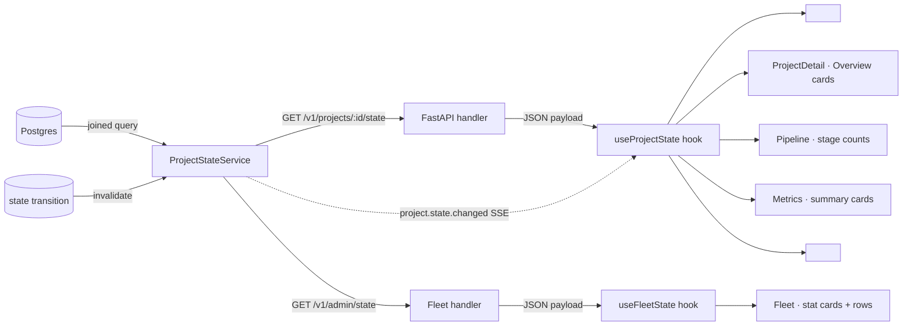

# Canonical project-state endpoint and consumers

## Context

Spec [0069](../../product-specs/wip/0069-canonical-project-state.md)
asks for one server-computed source of project-level counters that
every operator surface reads. ADR
[0031](../../adrs/0031-canonical-project-state-for-operator-surfaces.md)
records the decision.

Today the answers diverge across pages because each computes from
its own slice. The cache-hit-rate field is the loudest example: the
admin reports `351301%` on Overview and `366900%` on TaskDetail for
the same project at the same instant. That's a unit/denominator bug
hiding in two independent reducers.

## Goals / non-goals

- **Goals.** Single endpoint, typed payload, server-side joins, SSE
  invalidation, p95 ≤ 200ms. One frontend hook every page consumes.
- **Non-goals.** No new data — every counter we expose already lives
  in `tasks`, `pipeline_runs`, `task_plans`, `gates`,
  `project_budgets`, `escalations`. We are joining and rounding, not
  collecting. No design for the visual cards that consume this; that
  lives in WIP 0070 / 0072 / Fleet redesign.

## Design

### Components

- **`ProjectStateService`** (new module in `coder-core`,
  `src/coder_core/state/project_state.py`). One public method
  `compute(project_id) -> ProjectState`. Composes the joined query
  in one place. Returns a frozen Pydantic model.
- **`ProjectState` model.** Pydantic v2, `frozen=True`. Top-level
  groups: `counts`, `cost`, `workers`, `oldest`, `derived_at`. All
  fields strongly typed; `cache_hit_rate` is `float` constrained to
  `[0.0, 1.0]`.
- **HTTP handler.** `GET /v1/projects/{id}/state` →
  `ProjectStateService.compute`. `GET /v1/admin/state` returns
  `{projects: [{id, state}], totals: ProjectState}` rolled up.
- **SSE event.** Existing `pipeline-events` channel gains a new event
  type `project.state.changed` with the full `ProjectState` payload
  (not a delta — simpler invalidation, payload is small <2 KB).
- **Frontend hook** `useProjectState(projectId)` in
  `coder-admin/src/api/state.ts`. Subscribes to the SSE channel,
  caches one `ProjectState` per project in a module-scoped Map,
  exposes `{state, isStale, derivedAt}`. Stale = `derived_at`
  older than 60s.
- **`<HeaderPill/>`**, **`<NowBadge/>`** consume the hook and
  render minimal text — no recompute.

### Data flow

Happy path on a counter read:

1. Page mounts, calls `useProjectState(projectId)`.
2. Hook checks its in-memory cache. Miss → `GET /v1/projects/{id}/state`.
3. Server runs `ProjectStateService.compute`, joining `tasks`,
   `pipeline_runs`, `task_plans`, `gates`, `project_budgets`,
   `escalations` in one query plan with project-scoped indexes.
4. Returns `ProjectState`. Hook caches; renders.
5. Concurrent SSE subscription is open. On any state-affecting
   transition, server broadcasts `project.state.changed` with the
   full new payload. Hook replaces the cached value; React re-renders.

Migration path:

1. Land the endpoint behind a flag (`CODER_PROJECT_STATE_ENABLED`),
   default off.
2. Wire `<HeaderPill/>` first (cheap surface) and verify parity with
   the existing per-page counters in shadow.
3. Migrate ProjectDetail → Pipeline → Inbox → Fleet → Metrics in
   that order, one PR each. Each PR removes the page-local
   recomputation and asserts parity in tests.
4. Flip flag to on for `coder` project (canary) for 24h, then fleet.
5. After 7d soak, delete the recompute paths and the flag.

### Edge cases

- **Project with zero tasks.** All `counts.*` are 0. `cache_hit_rate`
  is `0.0` (not `None`, not `NaN`). UI renders `—` per the design
  system rule.
- **Cache hit denominator.** Today's bug suggests we're dividing
  cache_read by something that can be ≪ output tokens (probably
  the wrong field; the live values 351301% / 366900% imply a 1000×
  factor — looks like a mixed token-count scale). The fix is to
  define the field exactly: `cache_hit_rate = cache_read_tokens /
  (cache_read_tokens + non_cache_input_tokens)`, bounded `[0, 1]`.
  Server-side test fixes this once.
- **Counter that disagrees with a streaming SSE event.** SSE
  payload is authoritative; the cached HTTP response is replaced
  on receipt.
- **Worker active count vs total.** "Active" = workers currently
  holding a leased task. "Total" = configured concurrency for the
  project. Today's `0/4` on an idle queue is correct semantics; we
  preserve it.

## Open questions

- Should `ProjectStateService.compute` cache its own result with a
  short TTL (1s)? Probably yes — cheap insurance against thundering
  herd when 5 pages mount on login. Defer to implementation choice.
- Do we expose individual fields or only the whole bag? Whole bag,
  always. Page-local "I only need stuck count" is the pattern that
  caused the divergence; banning it is the point.

## Rollout

1. Endpoint behind flag, shadow parity in tests.
2. Migrate consumers in the order ProjectDetail → Pipeline → Inbox →
   Fleet → Metrics (smallest scope first).
3. Land an `eslint` rule (or AGENTS.md hard rule reinforced by a CI
   grep) banning new direct counter computations in `src/pages/*`.
4. Remove dead recompute code. Delete `Inbox.tsx` recompute path
   simultaneously with WIP 0070's Inbox removal.

## Links

- Spec: [0069](../../product-specs/wip/0069-canonical-project-state.md)
- ADR: [0031](../../adrs/0031-canonical-project-state-for-operator-surfaces.md)
- Services: [coder-core](../../services/coder-core.md), [coder-admin](../../services/coder-admin.md)
