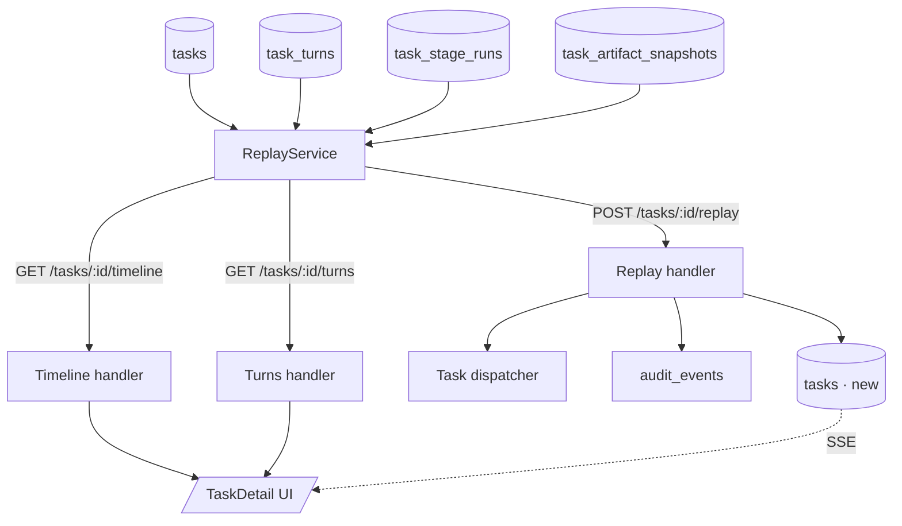

# Task replay and diagnostic surface

## Context

Spec [0072](../../product-specs/wip/0072-task-replay-and-diagnostics.md)
asks for a TaskDetail that surfaces the diagnostic data already
captured (turns, tool uses, knowledge lookups, transcript) and adds
replay-with-edit. Today these sections are collapsed, contentless,
and the page tells operators "No logs yet" on finished tasks.

The design questions are: (1) what to expose vs. what to keep in
existing tables, (2) what schema for replay, (3) where to put the
attempt-vs-attempt diff.

## Goals / non-goals

- **Goals.** A timeline endpoint, a turn-content endpoint, a replay
  endpoint that creates a linked task. UI redesign anchored on
  always-expanded timeline + content-bearing diagnostic sections.
- **Non-goals.** Mutating the original task. Replaying entire
  pipeline runs from one task. Live-streaming in-flight tool calls
  (already live via `pipeline-events` SSE; we don't redesign the
  transport).

## Design

### Components

- **`ReplayService`** (new, `src/coder_core/replay/service.py`).
  Computes the timeline and turn views; orchestrates replay.
- **Timeline endpoint.** `GET /v1/projects/{id}/tasks/{task_id}/timeline`
  returns the ordered stage transitions from `task_stage_runs`,
  joined with the prompt and input-artifact snapshot at each stage
  start. Schema: `[{stage, entered_at, left_at, duration_ms,
  outcome, model_used, cost_tokens, prompt, input_artifacts}]`.
- **Turns endpoint.** `GET /v1/projects/{id}/tasks/{task_id}/turns`
  returns the full Claude turn-by-turn from `task_turns`. The
  table already stores `content`; we surface it.
- **Replay endpoint.** `POST /v1/projects/{id}/tasks/{task_id}/replay`
  with body `{prompt?, input_artifacts?, rationale?}`. Creates a
  new `tasks` row with `replay_of=<original_task_id>` and a
  `correlation_id` linking the audit chain. Empty body == retry
  as-is; non-empty == replay-with-edit.
- **`task_artifact_snapshots` table** (new, if missing). One row
  per `(task_id, stage)` storing the resolved set of knowledge
  artifact ids the worker saw at stage entry. Already partially
  captured in `task_turns` for some roles; this normalises it.
- **UI redesign.** `TaskDetail.tsx` is refactored:
  - Top: status header (existing) + always-expanded stage timeline.
    Each segment clickable; clicking pins inputs to the left
    column.
  - Two-column body: left = inputs at pinned stage (prompt,
    input artifacts, attempt switcher with diff). Right = outputs
    (validator errors, held raw output, turns with content,
    tool uses with content, parsed result).
  - `[replay with edit]` opens a modal pre-filled from the pinned
    stage's prompt + artifact set; on submit, posts to the replay
    endpoint and navigates to the new task.

### Data flow

Replay-with-edit:

1. Operator opens TaskDetail for a failed task.
2. Stage timeline shows the failed stage in rose. Operator clicks
   the failed stage; left column pins that stage's prompt +
   artifacts.
3. Operator clicks `[replay with edit]`. Modal pre-fills.
4. Operator edits prompt or removes an artifact, clicks
   `[dispatch replay]`.
5. Frontend `POST /v1/projects/{id}/tasks/{task_id}/replay` body
   `{prompt: "...", input_artifacts: [...], rationale: "operator
   removed unused artifact"}`.
6. Server creates new task `<new_id>` with `replay_of=<orig_id>`,
   writes `audit_event(action="task.replay", correlation_id, before,
   after)`. Returns `{task_id: <new_id>}`.
7. Frontend navigates to `/projects/{id}/pipeline/<new_id>`. The
   new task's TaskDetail renders normally; its timeline shows the
   `replay_of` chip linking back.

Attempt-vs-attempt diff (a task with `attempt_count > 1`):

1. UI shows pill row `1 · 2 · 3` above inputs.
2. Click pill `2`. Frontend computes the unified diff between
   attempt 1's prompt+artifacts and attempt 2's, renders inline.
3. Diff is computed client-side from the timeline payload (which
   includes per-attempt prompt + artifacts). No server roundtrip.

### Edge cases

- **Task with no captured prompt.** Some legacy tasks predate the
  prompt persistence. UI renders "Prompt not captured · pre-{date}
  task" with a link to git for the system-prompt revision in use
  at that time.
- **Replay during outage.** If dispatcher is down, replay endpoint
  returns 503 typed; UI shows "Couldn't dispatch replay" with the
  error in mono and a retry button.
- **Replay of a task that itself was a replay.** Chains are fine;
  `replay_of` is a single hop, but a task's audit history shows the
  full chain via `correlation_id`. UI shows a small chevron in the
  timeline header indicating chain depth (`replay #2`).
- **"No logs yet" on finished task.** Today's bug. The diagnostic
  section header switches to `Logs` on running tasks (showing
  streaming output) and to `Cloud Run logs · open →` on terminal
  tasks (deep-linking to Cloud Run with a pre-filled query). The
  literal "No logs yet" string is removed.

## Open questions

- Diff computation cost for a long prompt. Probably negligible
  client-side; revisit if prompts grow past 100k tokens.
- Whether to surface the captured `task_artifact_snapshots` in
  knowledge browsing too. Useful for "show me what artifact set
  this task saw" queries; could become a follow-up.

## Rollout

1. Land `task_artifact_snapshots` table + capture writes from the
   worker dispatch path. Backfill is not required; we only need
   future tasks captured.
2. Land timeline + turns endpoints behind flag.
3. Land TaskDetail UI refactor reading from the new endpoints.
   Verify visually on a sample of failed tasks.
4. Land replay endpoint + UI modal. Manual test the round-trip
   (replay creates new task, audit chain resolves).
5. Flip flag fleet-wide. Remove the `Logs: No logs yet` string in
   the same PR.

## Links

- Spec: [0072](../../product-specs/wip/0072-task-replay-and-diagnostics.md)
- ADR: [0031](../../adrs/0031-canonical-project-state-for-operator-surfaces.md)
- Depends on design: [0069](./0069-canonical-project-state.md)
- Services: [coder-core](../../services/coder-core.md), [coder-admin](../../services/coder-admin.md)
