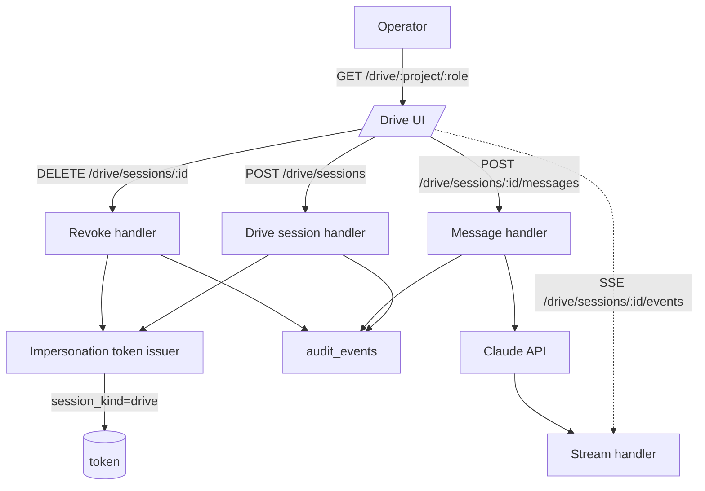

# Drive mode — operator role takeover in the browser

## Context

Spec [0073](../../product-specs/wip/0073-drive-mode-in-browser.md)
asks for an in-browser surface that lets the operator take over a
role using the same impersonation token machinery the CLI already
uses. The active design [`impersonation.md`](../active/tenancy/impersonation.md)
already defines token issuance, scopes, expiry, and audit; this
design connects a browser surface to it.

The trust model does not change — drive mode is a new entry point,
not a new authorisation primitive.

## Goals / non-goals

- **Goals.** New `/drive/{project}/{role}` route, server-issued
  drive-session token (reusing impersonation), SSE streaming of
  Claude turns, persistent session banner, audit chain per session.
  Fold `SpecTalk.tsx` into this surface.
- **Non-goals.** New auth model. Multi-operator co-presence.
  Drive-mode-specific tooling beyond what the role's worker
  contract already exposes.

## Design

### Components

- **Drive session handler.** `POST /v1/projects/{id}/drive/sessions`
  body `{role, ttl_seconds?}`. Issues an impersonation token with
  `session_kind=drive`, returns `{session_id, role, scopes,
  expires_at}`. Writes session-start audit event.
- **Impersonation token issuer extension.** Same code path as the
  CLI, with one new column on issuance audit row: `session_kind`.
  No new scope class; drive sessions reuse role-scoped tokens.
- **Message handler.** `POST /v1/projects/{id}/drive/sessions/{session_id}/messages`
  body `{content}`. Validates the session is active and the
  message comes from the issuing operator. Calls Claude with the
  role's worker prompt + tool registry. Writes per-turn audit
  events.
- **Stream handler.** SSE endpoint
  `/v1/projects/{id}/drive/sessions/{session_id}/events`. Emits
  `assistant.delta`, `tool_use`, `tool_result`, `error`, and
  `session.expired` events. Reuses the pipeline-events SSE
  transport.
- **Revoke handler.** `DELETE /v1/projects/{id}/drive/sessions/{session_id}`.
  Invalidates the impersonation token, terminates the SSE stream,
  writes `session_revoked` audit event. Operator-initiated.
- **Frontend route.** `/drive/{project}/{role}` in
  `coder-admin/src/main.tsx`. Three-pane layout:
  - Left (1/4): role context (system prompt header, allowed tools,
    last 5 audit events for this role on this project).
  - Center (1/2): conversation. Reuses chat patterns; every turn
    is a card with role chip, timestamp, content. Tool calls
    fold by default; click expands inputs/outputs.
  - Right (1/4): scratch panel (localStorage per session) +
    auto-pinned artifact preview when an artifact is referenced.
- **`<SessionBanner/>`.** New site-wide component. Amber-tinted,
  shows role + project + countdown + `[revoke]`. Imported into
  `App.tsx`; rendered when an active drive session exists in
  context.

### Data flow

Drive session start:

1. Operator clicks `[drive · architect]` on the project page (or
   from a Now row `[drive]` action, or from `⌘K`).
2. Frontend `POST /v1/projects/coder/drive/sessions` body
   `{role: "architect"}`.
3. Server issues impersonation token via the existing path (ADR
   0006: per-role service accounts), writes session-start audit.
4. Server returns `{session_id, role, expires_at}`. Token is
   stored in memory (not localStorage — drive tokens are
   shorter-lived than admin JWTs and must not survive a refresh
   except by re-issue).
5. Frontend opens SSE to `/drive/sessions/{session_id}/events`.
6. UI renders the three-pane layout. Banner countdown starts.

Conversation turn:

1. Operator types a message, clicks send.
2. Frontend `POST /drive/sessions/{session_id}/messages` body
   `{content}`. Bearer is the drive token, not the admin JWT.
3. Server appends the message to the conversation, calls Claude
   with the role's prompt + the conversation, streams the
   response back over SSE.
4. Each `tool_use` Claude emits triggers a confirm modal in the
   UI (configurable per tool — read-only tools auto-confirm,
   write tools require operator confirm). Confirm fires
   `tool_use.confirmed` audit and the server returns the
   `tool_result` to Claude.
5. Final assistant turn arrives; UI renders.

### Edge cases

- **Token expires mid-conversation.** SSE emits `session.expired`.
  UI flips banner to rose, locks composer, shows
  `[extend session]` button. Extension issues a fresh token (same
  scopes, same session_id chain) and writes a `session_extended`
  audit. Hard cap: total session duration ≤ 4h.
- **Operator closes the tab without revoking.** Server has no
  client side to detect; relies on token expiry. Acceptable —
  worst case the token sits unused until expiry. We log session
  staleness in audit for fleet review.
- **Two operators try to drive the same role on the same project.**
  Second session start succeeds — the trust model allows it. Both
  operators see each other's audit events but not each other's
  conversations. Co-presence is not promised; this is a known
  limitation surfaced as a "warning · {other_email} also
  driving" chip in the banner.
- **Drive session against a role the operator can't take over.**
  Returns 403 with typed code `role_not_authorised`. UI renders
  a "request access" CTA pointing at the access flow.
- **Auto-approve interaction.** If a worker has auto-approve
  enabled and a drive session is active for that role on that
  project, auto-approve is paused for the project's outputs of
  that role for the session's duration. Audit logs the pause and
  resume.

## Open questions

- Default TTL. CLI defaults to 60min; drive mode probably wants
  the same. Confirm during implementation.
- Whether the scratch panel persists across sessions (per
  project + role) or only for the session. Lean towards
  per-session; revisit on first 30d soak.
- Whether the right pane should also surface the role's
  "recent successful tasks" as a context aid. Useful, deferred.

## Rollout

1. Land impersonation token extension (`session_kind` column on
   audit) and drive session handler. Test via curl with manual
   token issuance.
2. Build SSE stream handler reusing the pipeline-events code path.
3. Build the frontend route end-to-end against the dev stack.
4. Pilot with one operator on `coder` project (the busy one). Run
   one session for 30min, audit the chain manually.
5. Roll to all admins. Delete `SpecTalk.tsx` and redirect the old
   route.
6. Update `coder-admin/AGENTS.md` with the drive-mode rule:
   drive-token is in-memory only, never persisted.

## Links

- Spec: [0073](../../product-specs/wip/0073-drive-mode-in-browser.md)
- ADR: [0031](../../adrs/0031-canonical-project-state-for-operator-surfaces.md)
- Active design: [impersonation](../active/tenancy/impersonation.md)
- Depends on design: [0069](./0069-canonical-project-state.md)
- Services: [coder-core](../../services/coder-core.md), [coder-admin](../../services/coder-admin.md)
