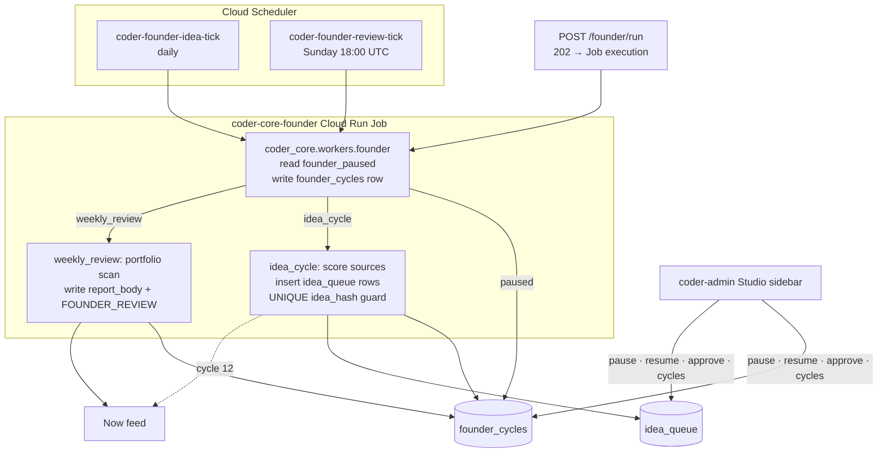

# Coder Studio — Founder Role Phase A

## Context

Design 0075 established the Studio architecture and committed to a Founder recurring job. This design covers Phase A: the minimal surface that lets the portfolio operator trust the Founder's judgment across 12 dogfood idea cycles — the recurring job, idea queue, weekly portfolio review, pause/resume controls, and the calibration card. No other Studio roles ship in Phase A.

## Goals / non-goals

**Goals:** `coder-core-founder` Cloud Run Job (entry `coder_core.workers.founder`); `founder_cycles` + `idea_queue` + `projects.founder_paused` migration; pause/resume/run API; weekly portfolio review → `FOUNDER_REVIEW` Now item; calibration card and `FOUNDER_CALIBRATION_COMPLETE` at cycle 12; Studio sidebar components in coder-admin.

**Non-goals:** idea-source plugin architecture, scoring algorithm, `coder-product-template` instantiation, Designer/Marketer/Analyst/Researcher roles.

## Design

### Data model

One migration, three changes: `projects.founder_paused BOOLEAN NOT NULL DEFAULT false`; `founder_cycles(id uuid pk, cycle_type text, outcome text, ideas_scored int, reason text, report_body text, operator_top_pick_matched bool, created_at timestamptz)`; `idea_queue(id uuid pk, project_id uuid fk projects, title text, idea_hash text, cycle_id uuid fk founder_cycles, status text default 'pending', task_id uuid nullable, created_at timestamptz, UNIQUE(project_id, idea_hash))`.

Calibration is stored as `operator_top_pick_matched bool nullable` on `founder_cycles` — one bit per cycle is sufficient for `Cycle N of 12 · Top pick matched K of N`. A child `founder_cycle_feedback` table would add a join for no Phase A benefit; deferred to Phase B.

### Job entry

`coder_core.workers.founder` (mirrors `coder_core.self_heal.watch` in shape) reads `MODE` env var (`idea_cycle` | `weekly_review`), writes a `founder_cycles` row immediately, then checks `projects.founder_paused`; if true, sets `outcome='paused'` and exits 0. Idea cycle: inserts `idea_queue` rows inside `try/except UniqueViolation`; if all sources are duplicates, sets `outcome='no_candidate'`. Weekly review: assembles one `##` section per live `b2c_product` project (MRR, cost, PostHog funnel, kill-criteria status), writes to `report_body`, inserts a `FOUNDER_REVIEW` Now item within the same transaction.

### API surface

`POST /v1/projects/{id}/founder/run?mode=idea_cycle` — calls Cloud Run Admin API (`projects.locations.jobs.run`) with `MODE` env override; returns 202. Blocked with 409 if a `founder_cycles` row has no `completed_at` (overlap guard, since Cloud Run Job `concurrency=1` is a Job-level setting, not a per-project one). `POST /v1/projects/{id}/founder/pause` / `resume` — set/clear `founder_paused`, call `record_audit_event('founder_paused' | 'founder_resumed')`. `GET /v1/projects/{id}/founder/cycles?limit=10` — last N rows, `created_at desc`. `POST /v1/projects/{id}/ideas/{idea_id}/approve` — sets `status='approved'`, dispatches PM draft task with `repo='studio-{slugified-title}'` placeholder, writes `idea_approved` audit event with `cycle_id`.

`POST /v1/projects/{id}/founder/run` invokes the Cloud Run Job (not in-process async) for consistency with the dispatch pattern in `worker-dispatch-durability` and so the founder's execution appears in `gcloud run jobs executions list` alongside the other recurring jobs.

### Admin panel (coder-admin)

Studio mode adds to `ProjectDetail`: `FounderHeader` (last cycle human-relative timestamp, next scheduled, Run now button, calibration card after cycle 1); `FounderActivityPanel` (last 10 `founder_cycles` rows — timestamp, outcome badge, ideas-scored count, reason for `failed` rows); `IdeaQueue` (rows with clickable `cycle` chip → activity row, approve button, status badge). Yellow banner when `founder_paused=TRUE`: "Founder paused since {timestamp} by {actor}" — cleared only via Resume. `FOUNDER_REVIEW` and `FOUNDER_CALIBRATION_COMPLETE` items surface in the existing Now feed.

### Edge cases

- **Mid-run pause**: `founder_paused` is checked at Job entry only; a pause issued mid-execution takes effect on the next tick. No in-flight cancellation needed — cycles are short.
- **`FOUNDER_REVIEW` SLA**: weekly review must write the Now item within 15 minutes of `review_tick` firing. Achievable at dogfood scale (one portfolio); re-evaluate before adding a second `b2c_product` project.
- **Calibration idempotency**: after the 12th idea-cycle row, the entry module inserts `FOUNDER_CALIBRATION_COMPLETE` with `ON CONFLICT (type, project_id) DO NOTHING`.
- **Cloud Scheduler retry on transient failure**: retried `idea-tick` hits `UNIQUE(project_id, idea_hash)` for every previously inserted row; all are skipped → `outcome='no_candidate'`. The `founder_cycles` row count does not grow.

## Rollout

1. **Migration** (`founder_paused`, `founder_cycles`, `idea_queue`) applied to prod before Job deploy.
2. **Job deployed** with `STUDIO_ENABLED=false` and `founder_paused=TRUE` in production.
3. **Dogfood** (coder project, flag on): run 3 manual cycles via `POST /founder/run`, verify `founder_cycles` rows, Now items, and audit log entries.
4. **Schedule live**: enable `coder-founder-idea-tick` and `coder-founder-review-tick`; set `founder_paused=FALSE`.
5. **Phase A complete** after the `FOUNDER_CALIBRATION_COMPLETE` Now item at cycle 12 is acknowledged.

## Links

- Spec: [0077 — Coder Studio Founder Role Phase A](../../product-specs/wip/0077-coder-studio-founder-role-phase-a.md)
- Design 0075: [Studio Architecture](./0075-studio-architecture.md) — project_kind, Studio mode, ADRs 0032–0035
- ADR 0035: Founder as recurring job over dispatcher task
- Charter: `system/STUDIO_CHARTER.md` · Roadmap: `system/STUDIO_ROADMAP.md`
