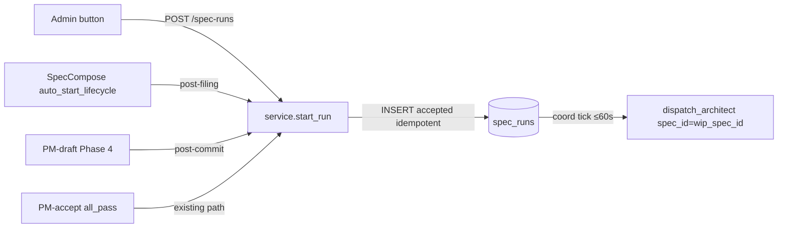

# Spec-Run Lifecycle Auto-Bootstrap

## Context

The spec_run coordinator drives the architect → TM → developer → reviewer chain once a
`spec_runs` row exists in `accepted` state. Before this design the only creation path was
the PM `accept` all_pass handler — which requires shipped implementation to grade against.
Fresh WIP specs had no bootstrap path; operators dispatched tasks by hand, one at a time.

## Goals / non-goals

Goals: one-click admin button for WIP specs with no run; `POST /v1/projects/{id}/spec-runs`
bootstrap endpoint; SpecCompose `auto_start_lifecycle` flag (default true); PM-draft Phase 4
auto-hook. Non-goals: changing the spec_run state machine; removing the PM-accept path;
retroactive backfill of pre-0078 specs; cross-project runs.

## Design

### Components

**`POST /v1/projects/{id}/spec-runs`** (`api/spec_runs.py`): body `{wip_spec_id: "NNNN"}`;
delegates to `service.start_run`; returns the `SpecRunRead` row. Returns HTTP 200 for
both create and idempotent repeat — callers need the row, not a create-vs-repeat signal.

**Admin spec-detail** (`coder-admin/src/pages/SpecDetail.tsx`): on `GET /spec-runs/{id}`
returning 404 or `spec_run_not_found`, renders a "Start lifecycle" button. On click,
POSTs to the bootstrap endpoint; success replaces the button with a link to the spec_run
detail page.

**SpecCompose `auto_start_lifecycle`** (`api/specs.py:_file_path`): `SpecComposeBody` gains
`auto_start_lifecycle: bool = True`. After `execute_filing` opens the PR, calls
`service.start_run`. Exceptions swallowed — a bootstrap failure must not roll back the PR.

**PM-draft Phase 4** (`workers/dispatcher.py`): after the spec file and registry entry
commit, calls `service.start_run(wip_spec_id=spec_id)` in a fresh session. Exceptions
swallowed, mirroring the PM-accept hook at `dispatcher.py:1645`.

### Data flow

1. Any entry point calls `service.start_run(project_id, wip_spec_id)`.
2. `start_run` inserts a `spec_runs` row at `accepted`; a SAVEPOINT absorbs concurrent
   duplicate inserts on the `(project_id, wip_spec_id)` unique constraint.
3. Coordinator tick (≤60 s) sees the `accepted` row and calls `dispatch_architect`.
4. `dispatch_architect` creates a `TaskRow` with `spec_id=wip_spec_id` (ADR 0026) and
   kicks the orchestrator; run advances to `designing`.
5. Architect → TM → developer → reviewer chain proceeds via existing coordinator logic.

### Edge cases

- **Duplicate bootstrap**: `service.start_run` is idempotent. PM-draft Phase 4 and
  PM-accept all_pass converge on the same unique `(project_id, wip_spec_id)` row; the
  second call returns the existing row without error or side effect.
- **Bootstrap exception after primary action**: SpecCompose and PM Phase 4 swallow all
  exceptions so the PR filing or spec commit is never rolled back by a lifecycle failure.
  Operators recover via the admin button.
- **Missing orchestrator kick**: `dispatch_architect` explicitly kicks the orchestrator
  after inserting the queued task — there is no background poller for queued tasks.
  Omitting the kick was an observed production bug (2026-05-05) where backfilled
  `accepted` runs created architect tasks that never started.
- **Wrong design id without `spec_id` binding**: without `spec_id=wip_spec_id` on the
  architect `TaskRow`, the dispatcher's run-context emits `Next free design ID` instead
  of the allocated id. All three of the first backfilled architect dispatches landed on
  design 0068 before this was fixed.
- **Founder-emitted specs**: auto-start fires on the operator approval click (spec 0075
  approval surface), not on Founder dispatch — confirming the spec's open question.
- **Retroactive backfill**: not automated; operators use the admin button per spec.

## Rollout

1. Ship `coder-core`: API endpoint, SpecCompose hook, PM Phase 4 hook. Coordinator picks
   up new `accepted` rows within 60 s; no flag.
2. Ship `coder-admin`: SpecDetail bootstrap UI. Button visible only when no spec_run exists.
3. Smoke-test AC1–AC7 in staging: file a fresh WIP spec, confirm architect task appears
   within one minute without operator intervention.
4. Operators bootstrap pre-0078 WIP specs individually via the admin button; no sweep.

## Links

- Spec: [0078](../../product-specs/wip/0078-spec-run-lifecycle-auto-bootstrap.md)
- `coder-core spec_runs/service.py::start_run` — idempotent bootstrap function
- `coder-core spec_runs/coordinator.py::dispatch_architect` — first consumer of new rows
- `coder-core workers/dispatcher.py:1645` — existing PM-accept start_run reference
- `coder-core api/spec_runs.py` — pause/resume endpoints this bootstrap endpoint joins
- Design: [worker-communication](./worker-communication.md)
