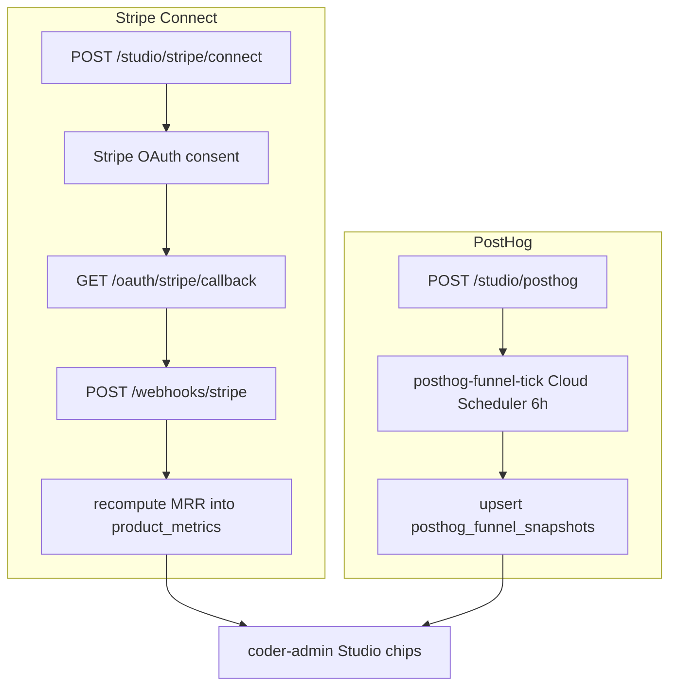

# Studio Stripe Connect and PostHog Integration

## Context

Design 0075 (studio-architecture) covers `project_kind = b2c_product`, the Founder job, and the kill pipeline. This design adds the two per-product integration layers left open by 0075: Stripe Connect Express OAuth (connected account, webhook receiver, MRR computation) and PostHog funnel polling. All server-side logic lands in coder-core; coder-admin renders the chips from `GET /v1/projects/{id}/studio/integrations`.

## Goals / non-goals

**Goals:** Stripe Connect Express OAuth flow per project; `POST /v1/webhooks/stripe` with `Stripe-Signature` verification and MRR computation; PostHog `project_api_key` + `region` verified on save and polled every 6 h; upsert-latest funnel snapshot storage; disconnect paths for both. `product_metrics` table for MRR is additive — `budget.py` is untouched.

**Non-goals:** cross-product MRR rollup (Phase C), refund initiation, PostHog cohort analysis, Stripe Tax, Stripe Connect Standard.

## Design

### Tables (new migrations)

- **`stripe_integrations`** — `(project_id PK FK, connected_account_id, oauth_state, status ∈ {disconnected,pending,live}, connected_at, disconnected_at)`. `disconnected → pending` on OAuth initiation; `pending → live` on first webhook from the account.
- **`stripe_events`** — `(id, connected_account_id, stripe_event_id UNIQUE, event_type, payload_jsonb, received_at)`. Unique on `(connected_account_id, stripe_event_id)` prevents duplicate-delivery double-counts.
- **`posthog_integrations`** — `(project_id PK FK, region ∈ {us,eu}, api_key_secret_name, verified_at, last_poll_at, disconnected_at)`. `api_key_secret_name` = `coder/{project_id}/posthog_project_api_key`.
- **`posthog_funnel_snapshots`** — `(project_id PK FK, signup, activate, checkout_start, checkout_complete, captured_at)`. One upsert-latest row per project; per-day time-series is a Phase C Analyst concern.
- **`product_metrics`** — `(project_id FK, period_yyyymm, mrr_cents, updated_at)`, PK `(project_id, period_yyyymm)`. Additive to the budget schema; `project_budget_period` and `budget.py` are unchanged.

### API surface (`src/coder_core/api/studio.py`)

- `POST /v1/projects/{id}/studio/stripe/connect` — resets `stripe_integrations` to `pending`, writes HMAC-signed nonce to `oauth_state`, returns Stripe OAuth redirect URL. Stripe app registers `{CODER_BASE_URL}/v1/oauth/stripe/callback`; staging uses its own `CODER_BASE_URL` — no cross-env routing needed.
- `GET /v1/oauth/stripe/callback` — verifies HMAC state, exchanges code for `connected_account_id`, writes to Secret Manager at `coder/{project_id}/stripe_connect_account_id`, sets status to `pending`.
- `POST /v1/webhooks/stripe` — verifies `Stripe-Signature`; on `customer.subscription.*` triggers `_recompute_mrr(project_id)`; invalid signature → 401 (persists nothing); disconnected account → 410.
- `DELETE /v1/projects/{id}/studio/stripe` — sets `status=disconnected`, disables SM version, writes `audit_event`.
- `POST /v1/projects/{id}/studio/posthog` — calls PostHog `https://{region}.posthog.com/api/projects/`; on 200 writes key to SM and persists row; on auth failure returns `{"status": "auth_failed"}` inline — no SM write.
- `DELETE /v1/projects/{id}/studio/posthog` — sets `disconnected_at`, disables SM version, writes `audit_event`.
- `GET /v1/projects/{id}/studio/integrations` — returns both chip states: Stripe (status, MRR, dashboard link), PostHog (verified, snapshot, last_poll_at).

### Processing

**MRR recompute** (`_recompute_mrr`): reads `connected_account_id` from `stripe_integrations`, calls Stripe `GET /v1/subscriptions?status=active` on the connected account, sums `plan.amount_decimal × quantity`, upserts `product_metrics` for the current `period_yyyymm`. Runs synchronously in the webhook handler — satisfies AC3's ≤5 min MRR refresh without a polling loop.

**PostHog funnel poll** (`src/coder_core/studio/posthog_poll.py`): `coder-core-posthog-funnel-tick` Cloud Scheduler Job every 6 h. For each `posthog_integrations` row where `disconnected_at IS NULL`: reads key from SM, calls PostHog `/api/projects/{ph_project_id}/query` for the four funnel steps (signup → activate → checkout_start → checkout_complete), upserts `posthog_funnel_snapshots`, sets `last_poll_at`. On 30 s timeout: previous snapshot is retained; `last_poll_at` not updated, preserving the chip's stale-since indicator.

### Secret Manager paths

- `coder/{project_id}/stripe_connect_account_id` — connected Express account id.
- `coder/{project_id}/stripe_webhook_secret` — per-account signing secret; registered as a new kind in the `automated-secret-rotation` registry at 90 d cadence.
- `coder/{project_id}/posthog_project_api_key` — written on successful verify; SM version disabled on disconnect.

### Edge cases

- **OAuth state replay**: `oauth_state` nonce is single-use; callback verifies HMAC and clears nonce; second use returns 400.
- **Unknown `connected_account_id` on webhook**: returns 400 (never silently 200) — mis-routed webhooks surface immediately.
- **Duplicate webhook events**: unique index on `stripe_event_id` causes upsert no-op; `_recompute_mrr` sums the live subscription list and is fully idempotent.
- **Disconnect during PostHog poll**: tick checks `disconnected_at` before reading SM; skips the project cleanly.
- **Budget regression (AC7)**: `product_metrics` is net-new; `project_budget_period` and `budget.py` are untouched. AC7 CI test runs against the existing budget suite before Stage 1 migration ships.

## Rollout

1. **Migrations only** (`STUDIO_INTEGRATIONS_ENABLED=false`): five new tables deployed; AC7 budget regression suite must pass before proceeding.
2. **PostHog wiring**: enable config endpoint and funnel tick on one internal `b2c_product` project; verify snapshot populated within 6 h.
3. **Stripe wiring**: enable OAuth flow, webhook endpoint, MRR computation against Stripe test-mode; verify chip transitions `disconnected → pending → live` per AC1.
4. **Disconnect paths**: smoke-test AC6 — confirm 410 on next webhook, skipped poll tick.
5. **Flag flip**: `STUDIO_INTEGRATIONS_ENABLED=true` fleet-wide.

## Links

- Spec: [0080 — Coder Studio Stripe Connect and PostHog](../../product-specs/wip/0080-coder-studio-stripe-connect-and-posthog-integration-in-coder-core.md)
- Design: [0075 — Studio Architecture](../wip/0075-studio-architecture.md)
- Design: automated-secret-rotation — webhook-secret rotation framework
- Design: admin-panel — chip render surface in coder-admin
- ADR 0009 — per-project isolation model (one Stripe account per project)
