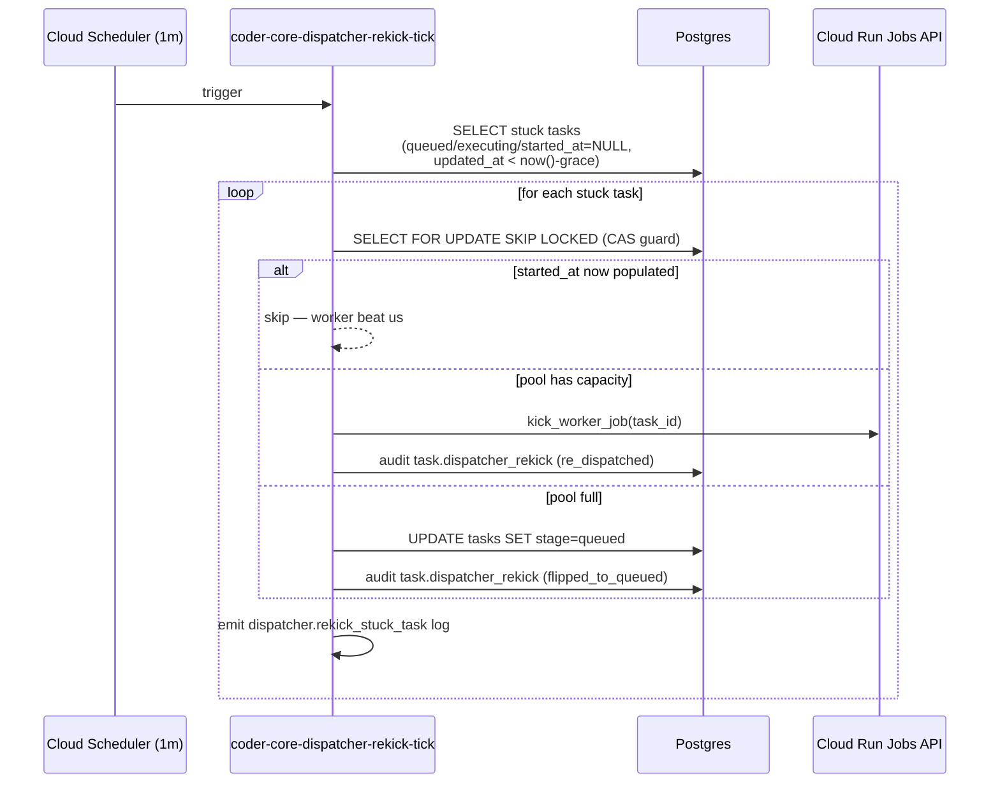

# Dispatcher re-kick for tasks stuck at queued/executing

## Context

A task lands in `status='queued', stage='executing', started_at=NULL` when the dispatcher flips the stage before kicking a Cloud Run Job execution but the kick fails or the HTTP service instance is evicted immediately after. No later tick re-evaluates it — the self-heal `stuck_queued` pattern targets `queued/queued` rows only, not `queued/executing`. Silent indefinite stall results. Observed across five tasks in Phase A (`4e07947f`, `d4741b75`, `460213bc`, `06b8a8cf`) and `36e0ed61` from the 2026-05-12 calibration cycle; each required a manual `POST /tasks/{id}/override` retry.

## Goals / non-goals

**In scope:** detect `queued/executing/started_at=NULL` tasks past a configurable grace window; re-kick via Cloud Run Job when pool has capacity; flip to `queued/queued` when pool is full; emit structured telemetry and an audit event per action.

**Out of scope:** concurrency limit changes, self-heal framework integration (different cap semantics, different recovery lifecycle), touching rows with `started_at` already populated, or broader orchestrator stage-machine refactors.

## Design

### Components

**`coder_core/workers/coordinator.py`** (new). Entry `python -m coder_core.workers.coordinator`. One async `tick(session, settings)` function:

1. Detect: `SELECT * FROM tasks WHERE status='queued' AND stage='executing' AND started_at IS NULL AND updated_at < now() - interval ':grace_s seconds'`.
2. Per row: re-fetch with `SELECT … FOR UPDATE SKIP LOCKED`; if `started_at` is now populated, skip.
3. Pool capacity = `settings.worker_concurrency` − `COUNT(tasks WHERE status='running')`. If capacity > 0: call `kick_worker_job(task_id)`. Else: `UPDATE tasks SET stage='queued'`.
4. Write `task.dispatcher_rekick` audit event with `action_taken`, `pool_capacity_at_rekick`, `task_id`.
5. Emit `dispatcher.rekick_stuck_task` structured log line.

**Config** (`config.py`): `dispatcher_rekick_enabled: bool = True` (kills the whole tick when false), `dispatcher_rekick_grace_seconds: int = 60` (tunable without a deploy).

**Audit** (`audit.py`): new action `task.dispatcher_rekick`; `action_taken ∈ {re_dispatched, flipped_to_queued}`.

**Infra**: Cloud Run Job `coder-core-dispatcher-rekick-tick` + Cloud Scheduler entry (every 1 minute), same service account, env, and Cloud SQL connector config as `coder-core-self-heal-tick`.

### Edge cases

- **Racing worker sets `started_at` between detection and CAS:** `SELECT FOR UPDATE SKIP LOCKED` catches it; silent skip, no audit row.
- **Grace window too short:** 60s is conservative — Cloud Run cold-start is < 10s in practice. Tunable via `dispatcher_rekick_grace_seconds` once post-deploy data is available.
- **Pool full across consecutive ticks:** Flipped task is now `queued/queued`; the coordinator's detection query (`stage='executing'`) won't re-match, so no duplicate audit rows. Self-heal's `stuck_queued` pattern reclaims it after 15 min.
- **Coordinator tick crashes mid-loop:** Each audit write is in its own short transaction. Next tick resumes from DB state; idempotent.

## Rollout

1. **Ship `coordinator.py` + config keys.** Default `dispatcher_rekick_enabled=false` keeps code inert.
2. **Deploy Cloud Run Job** (no Scheduler yet). Confirm Job connects to DB and exits cleanly.
3. **Enable Scheduler** with `dispatcher_rekick_enabled=true` on dogfood project. Confirm audit rows appear and no false positives (tasks with healthy `started_at`) are re-kicked.
4. **Soak one week.** Tune `dispatcher_rekick_grace_seconds` if cold-start tails in practice exceed 60s.
5. **Fleet rollout.** Flip `dispatcher_rekick_enabled` fleet-wide.

**Backout:** Set `dispatcher_rekick_enabled=false` or delete the Cloud Scheduler entry. No DB schema dependency; no downstream consumers of the attempt rows.

## Links

- Spec: [0081](../../product-specs/wip/0081-dispatcher-rekick-queued-executing-stuck-tasks.md)
- Related: [self-healing](./self-healing.md), [worker-dispatch-durability](./worker-dispatch-durability.md), [worker-communication](./worker-communication.md), [audit-log](./audit-log.md)
- ADR [0011](../../adrs/0011-orphan-dispatch-reaper.md) — orphan reaper context
