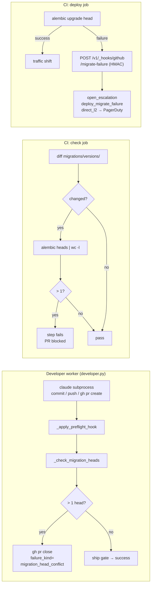

# Alembic Head-Conflict Detection and Deploy-Migrate Paging

## Context

On 2026-05-10 two developer workers authored parallel Alembic revisions both numbered `0078` with `down_revision=0077`. Both PRs merged; `alembic upgrade head` then failed on 17 consecutive main-branch deploys, discovered manually on 2026-05-12. PR #235 applied a one-off rename; this design closes the structural gap via three surfaces: a Python-level worker gate, a CI check step, and a deploy-step paging webhook.

## Goals / non-goals

**Goals:** detect and abort a dual-head state before a task PR is confirmed open; block merging any PR that introduces a second Alembic head; page on-call when `alembic upgrade head` fails on `main` (not just Slack).

**Non-goals:** serialising migration authorship; backfilling historical conflicts; generic Alembic schema review.

## Design



### Surface 1 — developer-worker migration gate

New `_check_migration_heads(repo_dir, env)` in `workers/developer.py`, called after `_apply_preflight_hook` and before `verify_ship_state` on the claude-success path. Runs `git diff origin/main --name-only` to detect files under `migrations/versions/`; if present, runs `uv run alembic heads` in the workspace and counts revision lines. More than one → closes the opened PR via `gh pr close <pr_url>` (best-effort subprocess), emits structured log event `developer.migration_head_conflict_refusal` to `task_logs`, and returns the worker failure result with `failure_kind="migration_head_conflict"`. The existing dispatcher `failure_kind` path surfaces the conflict chip in the admin panel; operator override paths (`retry` with rebase, `skip_to_stage`) are unchanged.

### Surface 2 — CI check step

New conditional step in the `check` job, inserted after `pytest`:

```yaml
- name: Alembic single-head invariant
  run: |
    if git diff --name-only origin/${{ github.base_ref }}...HEAD | grep -q '^migrations/versions/'; then
      count=$(uv run alembic heads | wc -l)
      [ "$count" -le 1 ] || { echo "::error::${count} Alembic heads detected — rebase and renumber before merging"; exit 1; }
    fi
```

PRs with no `migrations/versions/` changes skip the step entirely (AC4).

### Surface 3 — deploy migrate-failure webhook

New endpoint `POST /v1/_hooks/github/migrate-failure` (`api/github_hooks.py`), HMAC-SHA256 verified via `CODER_GITHUB_DEPLOY_WEBHOOK_SECRET` (Secret Manager). On receipt, calls `escalations.open_escalation` with `trigger_kind=deploy_migrate_failure` (new enum member; migration required) and policy `direct_l2` (new single-rung entry in `config/escalation_policies.yaml`: fires PagerDuty immediately at `severity=high`, no L0/L1 dwell). Dedup via the existing partial unique index on `(project_id, trigger_kind) WHERE status='open'`.

New deploy-job CI step (`if: failure() && steps.migrate.outcome == 'failure' && vars.DEPLOY_WEBHOOK_URL != ''`) sends an HMAC-signed POST with `{run_url, sha, step_name}`. The existing Slack `Notify deploy failure` step fires independently — paging is additive.

### Edge cases

- **Worker retry after rebase.** Operator `retry` re-runs from scratch; if the developer worker rebases and renumbers, `alembic heads` returns one line and the PR opens normally.
- **`gh pr close` fails mid-gate.** PR stays open but is blocked by the CI check step; the task still fails with `migration_head_conflict`.
- **Webhook unreachable / secret absent.** `DEPLOY_WEBHOOK_URL` missing → CI step skipped silently; Slack notification still fired.
- **Duplicate migrate-failure calls.** Partial unique index bumps `last_observed_at` without re-paging.

## Rollout

1. **Worker gate + CI check** — single coder-core PR; no flag; both are purely additive.
2. **Webhook + `deploy_migrate_failure` trigger** — same PR, activated only when `CODER_GITHUB_DEPLOY_WEBHOOK_SECRET` is set in Secret Manager; CI step is skipped until `vars.DEPLOY_WEBHOOK_URL` is present.
3. **Verify** — integration test (AC6) simulates two parallel workers against head `0077`; second PR fails at worker gate (AC1) and CI check (AC3). Confirm no spurious PagerDuty page on check-only failures.

## Links

- Spec: [0082](../../product-specs/wip/0082-alembic-head-conflict-detection-in-developer-worker.md)
- Incident PRs: [coder-core#213](https://github.com/coder-devx/coder-core/pull/213), [coder-core#214](https://github.com/coder-devx/coder-core/pull/214), [coder-core#235](https://github.com/coder-devx/coder-core/pull/235)
- Designs: [developer-worker](./developer-worker.md), [escalations](./escalations.md), [post-pr-ci-fix-loop](./post-pr-ci-fix-loop.md)
- ADR: [0037](../../adrs/0037-deploy-migrate-failure-paging.md)
