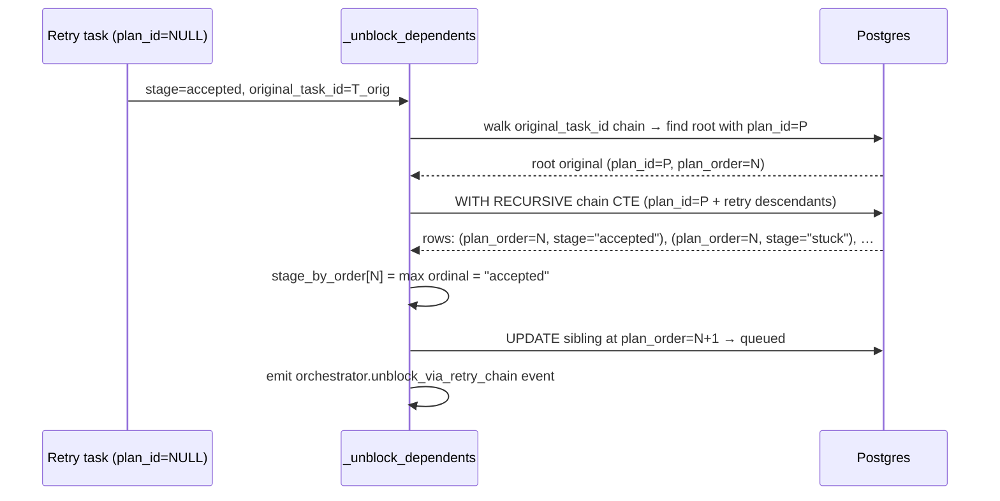

# Plan-unblock retry-chain awareness

## Context

`_unblock_dependents` (orchestrator.py) promotes `blocked` plan tasks to `queued` once their
dependencies land `accepted`. It builds `stage_by_order: dict[int, str]` keyed on `plan_order`.
Two compounding gaps prevent retried tasks from ever unblocking downstream work:

1. **Early exit**: retries are created with `plan_id=None`
   (`tasks/service.py::retry_task_in_project` does not copy `plan_id` to the new row). When a
   retry lands `accepted` and `_unblock_dependents` is called, the `if row.plan_id is None:
   return` guard fires — no unblock runs at all.
2. **Missing chain stage**: even when `_unblock_dependents` runs (triggered by an earlier
   transition on the original), `stage_by_order[N]` reflects the original's `stage=stuck`. The
   accepted retry has `plan_order=NULL` and is silently skipped. The downstream task at `N+1`
   stays `blocked` forever.

Both gaps are closed in one function.

## Goals / non-goals

**Goals**: the unblock check sees the maximum stage across a retry chain for each `plan_order`;
`plan_order=N+1` is promoted when any chain member is `accepted`; no regression for
single-task plans; operator's `skip_to_stage=accepted` override continues to work on any
task in the chain.

**Non-goals**: changing `original_task_id` semantics; auto-cancelling stuck originals when a
retry ships; altering dispatcher queue-ordering logic; the reverse case (original ships while
a retry is in flight).

## Design



### Components

**`_unblock_dependents` — two targeted changes:**

*1. Plan resolution.* When `row.plan_id is None`, walk `row.original_task_id` upward one hop
at a time until reaching a task with `plan_id` set. Chain depth is bounded in practice
(≤ 3); no hard limit required. If no ancestor has `plan_id`, the task is not a plan task
and the function returns early as before.

*2. Chain-aware stage aggregation.* Replace the flat `for t in all_plan_tasks:
stage_by_order[t.plan_order] = t.stage` loop with a `WITH RECURSIVE` CTE:

```sql
WITH RECURSIVE chain AS (
    SELECT id, plan_order, stage FROM tasks WHERE plan_id = :plan_id
    UNION ALL
    SELECT t.id, chain.plan_order, t.stage
    FROM tasks t JOIN chain ON t.original_task_id = chain.id
)
SELECT plan_order, stage FROM chain WHERE plan_order IS NOT NULL;
```

The `plan_order` value propagates from the original through all retry descendants.
Python aggregates rows per `plan_order` by ordinal: `blocked(0) < queued(1) < rejected(1)
< stuck(2) < executing(3) < testing(4) < fixing(5) < reviewing(6) < accepted(7)`. `accepted`
wins whenever any chain member ships; single-task rows are unchanged (MAX of one element).

*3. Observability.* Emit a `orchestrator.unblock_via_retry_chain` structured log event
whenever `stage_by_order[N]` is resolved via a chain retry rather than the direct original.
Payload: `plan_order`, `original_task_id`, `retry_task_id` that provided `accepted`. Answers
"which retry shipped plan_order=N?" without a new counter table.

**Migration 0082**: `CREATE INDEX CONCURRENTLY ix_tasks_original_task_id ON
tasks(original_task_id)`. Additive, zero-downtime. Required for the recursive CTE's
`t.original_task_id = chain.id` join — without it the recursion does a seqscan per level.
`original_task_id` is currently absent from `tasks.__table_args__` index list.

### Edge cases

- **2-deep chain** (orig→r1→r2 all failed; r2 accepts): CTE propagates `plan_order` from orig
  through r1 to r2; `accepted` wins the MAX. Downstream unblocked.
- **Operator `skip_to_stage=accepted` on any chain member**: that member contributes
  `accepted` to the CTE; unblock fires identically to a natural acceptance.
- **Single-task plan, no retries**: CTE returns one row per `plan_order`; MAX is a no-op.
  Behavior identical to today — AC4 regression guard.
- **Concurrent retries** (shouldn't occur; orchestrator gates one active retry): MAX picks
  the highest stage. No lock required; no correctness hazard.

## Rollout

1. Ship migration 0082 (`CREATE INDEX CONCURRENTLY`) — no downtime; can deploy ahead of code.
2. Deploy `_unblock_dependents` patch — backward compatible, no feature flag needed.
3. Verify post-deploy: confirm `orchestrator.unblock_via_retry_chain` events appear on the
   next retry cycle and that no `skip_to_stage=accepted` operator overrides are issued.

## Links

- Spec: `system/product-specs/wip/0083-plan-unblock-checks-retry-chain.md`
- Parent: [pipeline-operations](./pipeline-operations.md)
- Adjacent: [worker-communication](./worker-communication.md) — task state machine and stage flow
- Source: `src/coder_core/workers/orchestrator.py::_unblock_dependents`
- Migration chain: 0081 → **0082** (ix_tasks_original_task_id)
