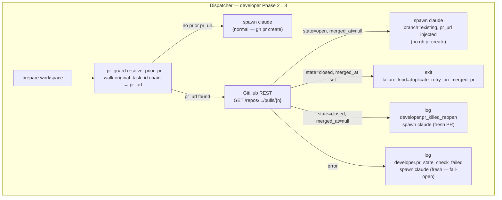

# Worker PR-URL Guard Against Duplicate PRs on Retry

## Context

Operator retries fired after a PR is already open produce a duplicate PR on a new branch suffix. Phase A logged seven duplicate-PR closures in one push (coder-core #215, #223, #226, #230; coder-admin #53, #57, #59). The original task row already carries `pr_url`; the retry task carries `original_task_id`. The developer worker spawn path consults neither.

## Goals / non-goals

Guard the developer worker's PR-open path by resolving `pr_url` from the task's `original_task_id` chain and branching on the existing PR's GitHub state. Fail-open on API errors. **Non-goals:** retroactive cleanup of already-opened duplicates; orchestrator queue-model changes; cross-task deduplication.

## Design

### `coder_core/workers/_pr_guard.py`

`resolve_prior_pr(task: TaskRow, session: AsyncSession) -> PrGuardVerdict` walks the `original_task_id` chain (max depth 5, preventing runaway on corrupt data) until a `pr_url` is found. Calls `GitHubClient.get_pull(org, repo, number)` — `GET /repos/{org}/{repo}/pulls/{n}`. Returns one of:

| Verdict | Condition |
|---|---|
| `NO_PRIOR_PR` | No `pr_url` in chain |
| `RESUME_EXISTING` | `state=open`, `merged_at=null` |
| `DUPLICATE_MERGED` | `state=closed`, `merged_at` set |
| `OPERATOR_KILLED` | `state=closed`, `merged_at=null` |
| `CHECK_FAILED` | GitHub API error / timeout |

PR `(org, repo, number)` are extracted via the existing `coder_core.integrations.github_url.parse_pr_url` parser. Guard checks `task.pr_url` first; if null, queries the row at `task.original_task_id`; repeats until a `pr_url` is found or the chain reaches a root task.

### Dispatcher integration (`dispatcher.py` — `run_developer_task`)

Inserted between workspace prep (Phase 2) and claude spawn (Phase 3):

- **`DUPLICATE_MERGED`** — set `row.failure_kind = "duplicate_retry_on_merged_pr"`, write audit event `developer.duplicate_retry_on_merged_pr`, return without spawning claude. `failure_kind` is VARCHAR(32); no migration needed (28-char value fits).
- **`RESUME_EXISTING`** — prepend a prompt header with `branch` and `pr_url`, instructing claude to push to the existing branch without calling `gh pr create`. Set `row.pr_url = prior_pr_url` before Phase 4 so the reconcile path doesn't overwrite it.
- **`OPERATOR_KILLED`** — log `developer.pr_killed_reopen` at INFO, proceed as today (fresh PR).
- **`CHECK_FAILED`** — log `developer.pr_state_check_failed` at WARNING, proceed as today (fail-open).
- **`NO_PRIOR_PR`** — proceed as today.

Pre-commit lint gate runs on every spawn path including `RESUME_EXISTING` (it operates on the workspace tree, independent of whether a new PR is opened).

### Edge cases

- **Chain depth > 1** (retry-of-retry): bounded walk at `MAX_CHAIN_DEPTH = 5` guards against corrupt `original_task_id` cycles.
- **Merge race**: PR state is read once at spawn time. A merge landing between the check and claude's first push results in a commit on an already-merged branch — the same low-probability race the CI fix loop accepts.
- **API transient error on guard call**: `CHECK_FAILED` falls through to the existing open-fresh-PR behaviour; a GitHub 503 storm degrades to pre-fix duplicate behaviour, not a hang.
- **`RESUME_EXISTING` branch deleted**: claude will fail to push to a deleted branch; this surfaces as a normal worker failure (`failure_kind=transient`) and re-queues. Operators can override.

## Rollout

1. **Flag-off** — ship `_pr_guard.py` behind `CODER_PR_GUARD_ENABLED = False`; log all verdicts at DEBUG regardless.
2. **Shadow** — enable for `coder` project only; monitor `developer.pr_state_check_failed` and `developer.pr_killed_reopen` audit event rates for false positives over one sprint.
3. **Fleet** — `CODER_PR_GUARD_ENABLED = True`; duplicate-PR closure rate should drop to near-zero on the next Phase A operator report.

## Links

- Spec: [0084](../../product-specs/wip/0084-worker-pr-url-guard-against-duplicate-prs.md)
- Related design: [developer-worker](./developer-worker.md) — extends its commit/PR-open semantics
- Related design: [post-pr-ci-fix-loop](./post-pr-ci-fix-loop.md) — established the `branch=existing, pr_url=injected` prompt-header pattern
- ADR: [0013](../../adrs/0013-worker-level-transient-retry.md) — fail-open pattern for worker-level guards
