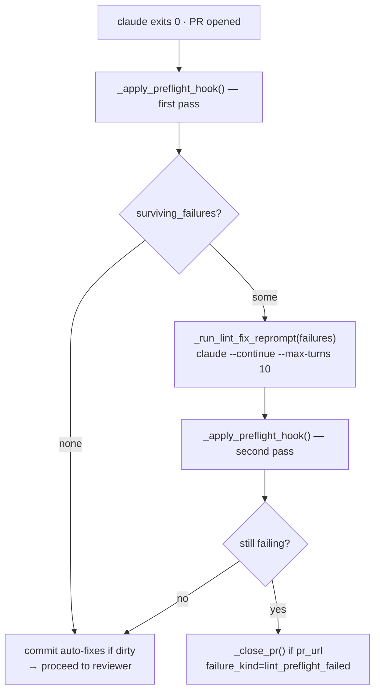

# Lint Pre-flight Hard Gate

## Context

The developer worker's pre-flight pass (`ruff format` + `ruff check --fix`)
runs after the Claude subprocess exits and the PR is open. Today it is
fail-soft: surviving failures are posted as a PR comment and the task
proceeds to review. CI then re-catches the same failures — burning a CI
slot, a reviewer slot, and an operator manual-patch. Phase A hit this
pattern on nearly every push (I001 import-sort being the dominant cause).
Spec 0087 converts that comment path into a hard gate with a one-shot
fix-loop continuation.

## Goals / non-goals

**Goals:** Surviving pre-flight failures gate the task; a one-shot
`claude --continue` fix-loop resolves mechanical failures in-worker;
unresolved failures surface `failure_kind=lint_preflight_failed`;
operators can retry or hand-patch via the existing override path.

**Non-goals:** Changing lint rules; gating on mypy or pytest (different
signal characteristics, separate spec); pre-PR preflight restructure
(would require prompt-level changes to how Claude handles `gh pr create`);
non-developer-worker lint surfaces.

## Design



### Parts

**`_LINT_FIX_MAX_TURNS = 10`** — hard turn cap for the fix-loop reprompt.
Mirrors `_SHIP_GATE_REPROMPT_MAX_TURNS = 5` in shape; lint fixes are 1–2
turns, 10 is the budget guard per AC5.

**`PreflightHookResult(ok: bool, failures: list[FailureExcerpt], detail: str)`**
— new return type for `_apply_preflight_hook`. The auto-fix commit/push path
is unchanged. The PR-comment path is removed; surviving-failure detail is
stored in `tasks.failure_detail` on the task row instead.

**`_run_lint_fix_reprompt(prompt, model, env, cwd) → int`** — spawns
`claude --continue --max-turns 10 --dangerously-skip-permissions --output-format json`
with the surviving failure log as the injected prompt. Return code is
logged but the second-pass preflight, not the exit code, is the truth.

**`_close_pr(pr_url, env, cwd) → None`** — best-effort `gh pr close <pr_url>`
so the PR doesn't land in the reviewer queue. Failure is logged but not
raised; the task is already terminal.

**Main run path (≈ line 562 of `developer.py`):**
```python
pf = await _apply_preflight_hook(cwd, env, task.task_id)  # → PreflightHookResult
if not pf.ok:
    prompt = _build_lint_fix_prompt(pf.failures)
    await _run_lint_fix_reprompt(prompt, model, env, cwd)
    pf = await _apply_preflight_hook(cwd, env, task.task_id)  # second pass
    if not pf.ok:
        if _pr_url_for_pf:
            await _close_pr(_pr_url_for_pf, env, cwd)
        return WorkerResult(
            status=TaskStatus.FAILED,
            failure_kind="lint_preflight_failed",
            failure_detail=pf.detail[:4096],
            ...
        )
```

`failure_kind="lint_preflight_failed"` is 19 chars; fits `String(32)`. No
migration required.

**`enable_lint_preflight_gate: bool = True`** in `Settings` — when `False`,
falls back to the existing fail-soft path for per-deploy opt-out.

### Edge cases

- **PR not opened** (ship-gate will also fire): skip `_close_pr`, return
  `failure_kind=lint_preflight_failed`. Both gates fire independently;
  task is terminal either way.
- **`_close_pr` fails**: log warning, still return `lint_preflight_failed`.
  PR stays open; operator sees the failure chip and can close manually.
- **Fix-loop burns ≥ 10 turns** (`error_max_turns` from CLI): treated as
  failed fix attempt; second-pass preflight decides the outcome normally.
- **Second pass dirty but clean lint**: commit + push auto-fixes, proceed.
  Formatter-introduced dirty state is orthogonal to surviving lint failures.
- **Operator retry** (`POST /override` with `action=retry`): existing
  re-queue path applies. Implementing developer should inject
  `failure_detail` (surviving lint output) as `fix_context` so the
  retried worker doesn't repeat the same mistake.

## Rollout

1. **Ship behind `enable_lint_preflight_gate=False`.** Deploy; verify
   existing pre-flight behaviour is unchanged.
2. **Enable for `coder` project** via env override. Monitor: fix-loop
   dispatch rate, second-pass resolution rate, `lint_preflight_failed` rate.
   Target: >80 % of fix-loop iterations resolve on second pass.
3. **Fleet-enable** after one week clean on `coder` project.
4. **Remove flag** after two clean weeks.

## Links

- Spec: [0087](../../product-specs/wip/0087-lint-preflight-hard-worker-gate.md)
- Precedent: [`post-pr-ci-fix-loop`](./post-pr-ci-fix-loop.md) — Stage 0a
  (coder-core PR #36) shipped the fail-soft preflight this design hardens
- Precedent: [`developer-worker`](./developer-worker.md) —
  `_reprompt_to_close_ship_gate` / `_SHIP_GATE_REPROMPT_MAX_TURNS = 5`
  is the direct shape template for `_run_lint_fix_reprompt`
- `tasks.failure_kind String(32)` — no Alembic migration needed
