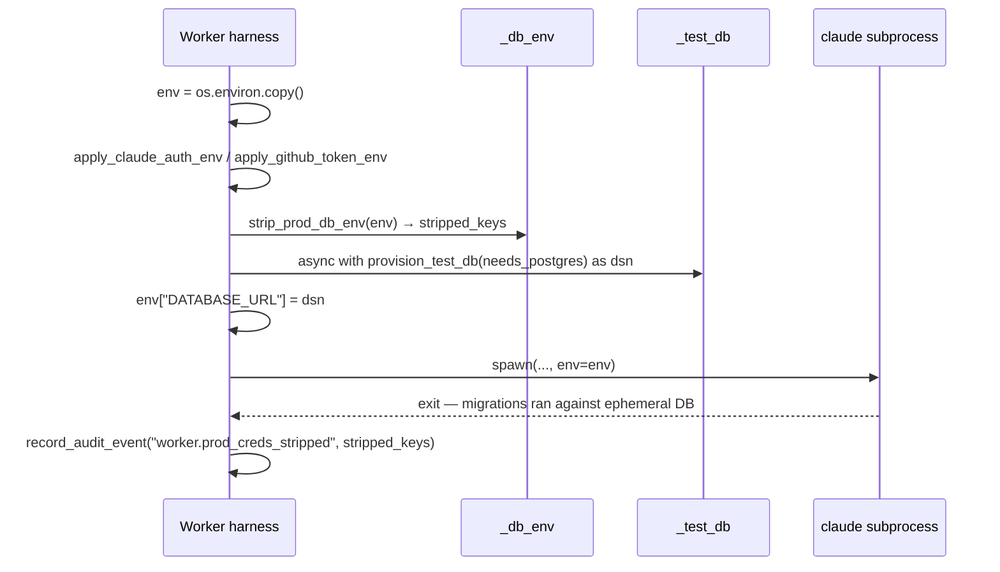

# Worker Prod-Credentials Isolation

## Context

On 2026-05-12, a developer worker subprocess ran `alembic upgrade head` against
the production Cloud SQL database (coder-core#249). Root cause: every worker
builds its subprocess env with `os.environ.copy()` then cherry-picks credentials
in — nothing stripped prod DB env vars before spawning. `CLOUD_SQL_INSTANCE`,
`CLOUD_SQL_USER`, and `CLOUD_SQL_DATABASE` inherited cleanly into the
subprocess, giving it full IAM-auth write access to prod.

This design closes the gap: a deny-list strip at env-construction time (shared
across all role workers), an ephemeral test DB in its place so
migration-exercising tasks keep working, and an audit event per turn.

## Goals / non-goals

**In:** strip prod DB creds from every worker subprocess env; inject an
ephemeral test DB DSN; emit a `worker.prod_creds_stripped` audit event per turn.

**Out:** network-layer firewall, IAM restructuring, non-DB credential scoping —
all separate specs or follow-ons.

## Design



### Components

**`coder_core/workers/_db_env.py`** — new module, one public function:

```
strip_prod_db_env(env: dict[str, str]) -> list[str]
```

Pops each key in the deny-list from `env` and returns the list of
actually-stripped keys. Deny-list: `CLOUD_SQL_INSTANCE`, `CLOUD_SQL_USER`,
`CLOUD_SQL_DATABASE`, `DATABASE_URL`, `PGHOST`, `PGUSER`, `PGPASSWORD`,
`PGDATABASE`. An env flag `CODER_WORKER_PROD_DB_CREDS_STRIP_ENABLED` (default
`true`) short-circuits to a no-op for local dev without a code change. Follows
the pattern of `_auth_env.py` and `_github_env.py` — no imports from domain or
config beyond `Settings`.

**`coder_core/workers/_test_db.py`** — new module, one public async context
manager:

```
provision_test_db(*, needs_postgres: bool = False) -> AsyncContextManager[str]
```

- **SQLite path** (default): yields `sqlite+aiosqlite:///:memory:`. Zero setup
  overhead. Existing migration suite already guards PG-only branches with
  `if bind.dialect.name != "postgresql"` — no new convention required.
- **Postgres path** (`needs_postgres=True`): boots `postgres:15` via
  `subprocess.Popen` on a random free port, waits ≤30 s for the port to accept
  connections, yields the DSN, tears down the container unconditionally in
  `__aexit__`. On boot timeout raises `TestDBProvisionError`. The
  `needs_postgres` flag is resolved from `task.metadata["needs_postgres_test_db"]`
  (boolean, set by the Team Manager when the task plan explicitly mentions
  PG-only migration features such as `CREATE INDEX CONCURRENTLY` or partial
  indexes).

**Callers** — `developer.py`, `pm.py`, `architect.py`, `reviewer.py`,
`team_manager.py`. Each already calls `apply_claude_auth_env` →
`apply_github_token_env`. Strip and test-DB provisioning land immediately after
`apply_github_token_env`, before the subprocess spawn:

```python
stripped = strip_prod_db_env(env)
async with provision_test_db(needs_postgres=task.metadata.get("needs_postgres_test_db", False)) as dsn:
    env["DATABASE_URL"] = dsn
    # ... existing spawn ...
await record_audit_event(
    session,
    action=Actions.worker_prod_creds_stripped,
    after={"task_id": str(task.task_id), "stripped_keys": stripped},
)
```

**`coder_core.audit.Actions.worker_prod_creds_stripped`** — new constant
`"worker.prod_creds_stripped"`. The `after` JSONB payload carries `task_id`
and `stripped_keys` so operators can grep the audit log by action prefix or
filter by task.

### Edge cases

- **`CLOUD_SQL_INSTANCE` absent** (local dev, unit tests): `stripped_keys` is
  `[]`; audit event still fires. No error; env strip is a no-op.
- **Postgres container fails to start**: `provision_test_db` raises
  `TestDBProvisionError`; harness surfaces it as `failure_kind="infrastructure"`
  (same slot as workspace-setup failures). Operator re-queues; audit row shows
  which task triggered the failure.
- **SQLite-incompatible migration on the default path**: PG-only branches
  no-op cleanly; the worker's run succeeds. PR CI's deploy-step `alembic
  upgrade head` against prod remains the gate for SQL correctness — the worker
  sandbox is not the final validator.
- **Audit write lost on subprocess crash before session commit**: the caller's
  session rolls back; the strip already happened; no audit row lands. Acceptable
  — the strip is the safety property; the audit event is forensic evidence.

## Rollout

1. Ship `_db_env.py` + AC1 unit test. Flag defaults `true`; verify in dev that
   all worker turns log `stripped_keys` before next pipeline cycle.
2. Ship `_test_db.py` SQLite path + callers + AC2 integration test in the same
   PR. Monitor `worker.prod_creds_stripped` events in the audit page for two
   pipeline cycles.
3. Ship Postgres container path in a follow-on PR (AC3). Opt-in only — no
   existing task prompt carries `needs_postgres_test_db: true` yet.
4. AC4 regression replay runs in CI: a synthetic task authors migration
   `0099_test_marker.py` and asserts the prod DB stays untouched after the turn.
5. Remove the feature flag when AC4 green and two production cycles confirm
   no regressions.

## Links

- Spec: [0088](../../product-specs/wip/0088-worker-prod-creds-isolation.md)
- Recovery PR: [coder-core#251](https://github.com/coder-devx/coder-core/pull/251)
- Incident PR: [coder-core#249](https://github.com/coder-devx/coder-core/pull/249)
- ADR [0038](../../adrs/0038-deny-list-over-allow-list-for-db-cred-strip.md)
- Related designs: [developer-worker](./developer-worker.md),
  [audit-log](./audit-log.md), [tenant-isolation](./tenant-isolation.md)
