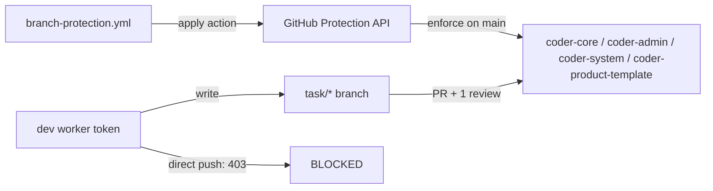

# Branch Protection Enforcement for Orchestrator-Managed Repos

## Context

On 2026-05-12 the developer worker pushed `e6f7382` directly to `coder-core/main` without a PR, bypassing CI and the Reviewer worker. Branch-protection rules were either absent or contained a bypass list covering the bot token. This design enforces the PR-review gate across all four orchestrator-managed repos and backs the protection state with version-controlled config so drift surfaces before it can be exploited.

## Goals / non-goals

**Goals:** require PR + 1 approving review on `main` for all four repos; restrict the worker PAT so direct-to-main pushes return 403 even if rules drift; version-control protection settings with CI drift detection.

**Non-goals:** restricting non-main branch writes; auditing historical direct-push commits; rotating non-GitHub credentials.

## Design

### Branch protection settings (all four repos)

Applied via `PUT /repos/{owner}/{repo}/branches/main/protection`: `required_pull_request_reviews` (1 approving review, dismiss stale on new push), `enforce_admins: true` (no admin bypass — load-bearing: a token with admin scope would otherwise circumvent the rule), empty `restrictions` actors list, `required_status_checks.strict: true`.

### Config-as-code

`coder-core/.github/branch-protection.yml` declares the desired protection state as a YAML document matching the GitHub API schema. Companion action `apply-branch-protection.yml` runs on `push: [main]` and a nightly `cron:` schedule: it PUTs the settings then reads them back and fails the run on any divergence. Drift surfaces as a CI failure before the next deploy.

### Token scope restriction

`coder-coder-github-pat` (Secret Manager) is re-provisioned by the operator per the runbook `system/runbooks/github-branch-protection.md`. Fine-grained PAT permissions: `contents: write` (non-main refs — branch protection makes main read-only regardless), `pull-requests: write`, `actions: read`. Fine-grained PAT chosen over GitHub App installation token for simpler operator provisioning without App registration; branch protection is the primary enforcement layer, token restriction is defence-in-depth.

### Regression test

A `branch-protection-gate` step in each repo's `ci.yml` uses the worker bot token (repo secret `BOT_GITHUB_TOKEN`) to attempt `git push origin HEAD:refs/heads/main`. The push must return 403. The step runs on every PR; failure blocks merge.

### Edge cases

- **Token rotation:** protection state persists across PAT rotation. The runbook requires updating `BOT_GITHUB_TOKEN` in each repo's secrets alongside Secret Manager; missing either breaks the regression test.
- **Apply-action failure:** if the nightly apply action fails (API rate limit, permission error), it fails CI rather than silently passing — all `gh api` calls use `--fail`. The CI failure notification reaches the operator.
- **coder-product-template:** included in the four-repo scope; it is in `system/repos.yaml` and writable by the worker token, making it the same risk surface as the other three repos.

## Rollout

1. **Provision fine-grained PAT** — operator generates PAT per runbook, updates `coder-coder-github-pat` in Secret Manager and `BOT_GITHUB_TOKEN` in each repo. Verify AC3 (bypass-actors field empty).
2. **Apply protection rules** — operator runs `gh api` PUT for each repo per runbook YAML. Verify AC1 (protection API read-back matches spec).
3. **Land config-as-code PR** — PR to `coder-core` adding `branch-protection.yml` + apply action; PR to `coder-system` adding runbook.
4. **Regression test green** — `branch-protection-gate` step returns 403 on the next PR cycle (AC2). Confirm AC4 via CI drift check.

## Links

- Spec: [0089](../../product-specs/wip/0089-branch-protection-enforcement-on-coder-core-main.md)
- Companion spec: [0088](../../product-specs/wip/0088-worker-prod-creds-isolation.md) — DB-creds isolation; together these close the worker-to-prod write surface
- Design: [continuous-deployment](./continuous-deployment.md) — the PR-gated deploy chain that direct-push bypasses
- Parent: [tenancy-and-access](./tenancy-and-access.md)