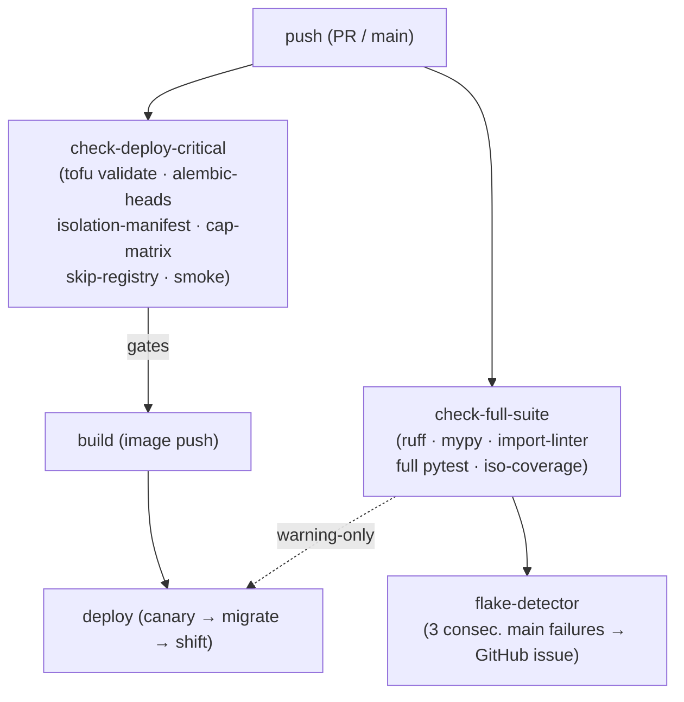

# Deploy-chain flake resilience

## Context

2026-05-13: four caplog-flaky tests killed the `check` gate; `build` and `deploy`
both `needs: check` so a merged hotfix (coder-core#251) never deployed — prod
wedged ~30 min until coder-core#252 skipped the tests manually. This design splits
the gate into a fast deploy-critical job and a non-blocking full-suite run, adds
a forced-expiry skip registry, an operator bypass with audit trail, and a self-heal
flake detector.

## Design



### CI job split (`coder-core/.github/workflows/ci.yml`)

`check-deploy-critical` merges the existing `terraform` job with the deploy-critical
checks from `check`:

- `tofu init -backend=false && tofu validate`
- Isolation-manifest drift (`scripts/check_isolation_manifest.py --check`)
- Capability-matrix drift (`infra/terraform/capability_matrix.py --check`)
- Alembic single-head: `uv run alembic heads | wc -l` must equal 1
- Skip-registry: `uv run python tests/check_skips.py`
- Smoke: `pytest tests/test_smoke.py` — SQLite migration round-trip + `GET /health`
  via `TestClient`, target <45 s; total job target <2 min.

`check-full-suite` carries ruff, mypy, import-linter, full pytest suite, and
isolation-coverage drift. `build` changes to `needs: check-deploy-critical`.

### Skip registry (`coder-core/tests/SKIPPED.yml`)

Every `pytest.mark.skip` / `pytest.mark.xfail(strict=False)` must register:
`test_id`, `reason`, `skip_date`, `expiry_date` (+30 days default), `owner`.
`tests/check_skips.py` uses `ast.parse` to collect decorators, diffs against
SKIPPED.yml, exits non-zero on missing entries or `expiry_date < date.today()`
(UTC). The 4 currently-skipped tests land in the registry on day one with
`expiry_date: 2026-06-13`.

### Operator bypass runbook (`coder-system/system/runbooks/redeploy-bypassing-test-suite.md`)

Precondition: `check-deploy-critical` passed on the target SHA; only
`check-full-suite` is red. Re-trigger via:

```bash
gh workflow run ci.yml -R coder-devx/coder-core -r main \
  -f bypass_reason="<incident description>"
```

`ci.yml` gains a `workflow_dispatch` input `bypass_reason`. When non-empty the
`deploy` job writes audit event `deploy.bypass_test_suite` (`actor`, `sha`,
`bypass_reason`) before the canary step. `check-deploy-critical` must still pass —
`bypass_reason` does not override that gate.

### Flake detection (new self-heal pattern)

`check-full-suite` posts pytest JSON results (`--json-report`) to
`POST /v1/_admin/ci/check-run-result` (OIDC GHA auth). coder-core stores per-test
failures in `ci_test_failures(test_id, branch, commit_sha, failed_at)`.
`FlakeTestRemediator` in `self_heal/patterns/flaky_test.py` detects a `test_id`
failing for 3 distinct consecutive `commit_sha` values on `main`; opens GitHub
issue `[flake] <test_id>` (label `flake`, 7-day TODO, idempotent on open issues).
Auto-close: the workflow step closes the issue after 5 consecutive passing main runs.

## Edge cases

- `check-deploy-critical` is offline (SQLite smoke, no GCP calls) — a flap is a
  real regression, not environment noise.
- `bypass_reason` does not override the deploy-critical gate; `deploy` enforces
  `needs.check-deploy-critical.result == 'success'` even on re-triggers.
- Skip expiry fires the morning after `expiry_date` (UTC), giving the owner that
  calendar day to extend or re-enable.

## Rollout

1. **Non-gating job.** SKIPPED.yml with 4 current skips; `check-deploy-critical`
   added; `build` still `needs: check` while new job soaks on main.
2. **Cut the gate.** Flip `build needs: check-deploy-critical`; verify one
   end-to-end deploy; confirm `check-full-suite` is warning-only.
3. **Bypass path.** `workflow_dispatch` input + audit event + coder-system runbook.
4. **Flake detector.** `ci_test_failures` migration, `POST /v1/_admin/ci/check-run-result`,
   `FlakeTestRemediator` in `dry_run`. Flip to `apply` after one-week soak.

## Links

- Spec: [0090](../../product-specs/wip/0090-deploy-chain-resilience-to-test-flake.md)
- Incident: [coder-core#251](https://github.com/coder-devx/coder-core/pull/251), [coder-core#252](https://github.com/coder-devx/coder-core/pull/252)
- Extends: [continuous-deployment](./continuous-deployment.md), [self-healing](./self-healing.md)
- Pairs with: [spec 0091](../../product-specs/wip/0091-conftest-log-pollution-root-cause.md)
