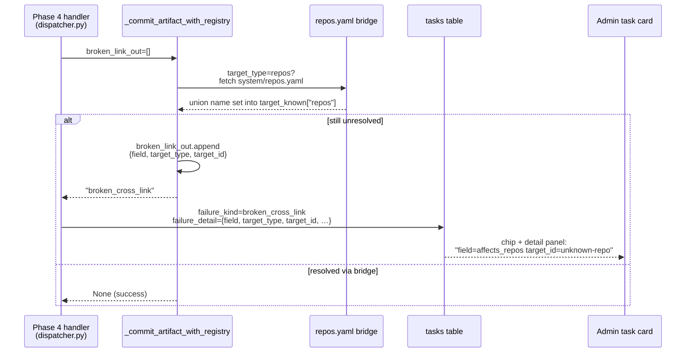

# broken_cross_link Failure Detail

## Context

`_commit_artifact_with_registry` in `dispatcher.py` detects a broken
cross-link and returns the bare string `"broken_cross_link"`. The failing
`(field_name, target_type, target_id)` triple is emitted only to a
`logger.warning` at line 1381 — never into `failure_detail` on the task row.
Phase 4 handlers build `failure_detail` with a generic message that says
"See task log for the specific field/target_type/target_id," which requires
Cloud Run log scraping to act on.

A related gap: `affects_repos` and `affects_services` are hard cross-link
targets resolved against `system/repos/registry.yaml` and
`system/services/registry.yaml`. When a repo exists in the workspace-contract
file (`system/repos.yaml`) but lags the knowledge registry — a normal Phase A
close-out state — the write fails and the operator must find and insert the
missing entry by hand. The 2026-05-13 `coder-product-template` incident
cost ~20 minutes; the information and bridge gaps were the only costs.

## Goals / non-goals

**Goals:** Embed `field/target_type/target_id` in `failure_detail` for every
`broken_cross_link` failure. Bridge `affects_repos` resolution against
`system/repos.yaml` so registry lag doesn't block correct architect output.
Add a CI-gated audit script for WIP design cross-links.

**Non-goals:** Removing cross-link validation; auto-creating missing registry
entries; collecting all broken links in one pass (first-fail is preserved).

## Design



### `_commit_artifact_with_registry` out-parameter

Add `broken_link_out: list[dict] | None = None` to the signature
(`coder-core/src/coder_core/workers/dispatcher.py`). Before
`return "broken_cross_link"` at line 1390, append
`{"field": field_name, "target_type": target_type, "target_id": target_id}`
to `broken_link_out` when provided. No other return paths change. Out-param
keeps the `str | None` return contract intact across all existing call sites.

### Phase 4 `failure_detail` enrichment

The three call sites — design write, PM spec write, ADR write — each pass
`broken_link_out: list[dict] = []`. In the `is_broken_cross_link` branch,
build `failure_detail` from `broken_link_out[0]`:

```json
{
  "kind": "broken_cross_link",
  "design_id": "0093",
  "field": "affects_repos",
  "target_type": "repos",
  "target_id": "coder-product-template",
  "reason": "target not found in registry; add to system/repos/registry.yaml or remove the reference"
}
```

`TaskDetail.tsx` already renders `failure_detail` as a JSON block — no
UI code change required.

### Workspace-contract bridge

In `_commit_artifact_with_registry`, after building `target_known["repos"]`
from `system/repos/registry.yaml`, fetch `system/repos.yaml` from the same
knowledge repo via `GitHubClient.get_file_content` and parse
`repos[*].name` as additional resolved IDs. If the fetch fails (network,
404), log a WARNING and proceed with the registry-only set — no regression
for callers that don't use `system/repos.yaml`. `services`-type cross-links
continue to resolve against `system/services/registry.yaml` only; that
registry is authoritative and rarely lags workspace state.

### `scripts/audit_wip_design_cross_links.py`

Standalone Python script in `coder-system`:

1. Glob `system/designs/wip/*.md`; skip `.gitkeep`.
2. Parse frontmatter with PyYAML.
3. For each key in `CROSS_LINK_FIELDS`, load the target
   `system/{folder}/registry.yaml` once per type; extract `id` values.
4. For each referenced ID not in the set, emit one JSON line:
   `{"file": "...", "field": "...", "target_type": "...", "target_id": "..."}`.
5. Exit 1 if any broken links found, 0 otherwise.

CI step added to `coder-system/.github/workflows/validate.yml`:
```yaml
- name: Audit WIP design cross-links
  run: python scripts/audit_wip_design_cross_links.py
```
Runs on every PR; also used for operator one-off checks.

## Edge cases

- **Multiple broken links in one artifact.** First-fail behaviour preserved;
  `broken_link_out[0]` carries the first broken link. Operator fixes and
  re-dispatches; subsequent broken links surface on the next run.
- **ADR broken_cross_link inside a batch.** Existing per-iteration write is
  enriched with the same `broken_link_out` pattern. Last-writer-wins on the
  task row (same as pre-fix) — acceptable since the goal is operator
  visibility, not atomic batch accounting.
- **`repos.yaml` fetch failure.** Logged at WARNING; commit proceeds with
  registry-only resolution. Tightens gracefully; does not regress the
  pre-bridge baseline.
- **Audit script against a clean WIP folder.** Exits 0; CI passes silently.

## Rollout

1. Land `coder-core` PR: `broken_link_out` param + workspace bridge.
   Integration tests for AC1 (field/target in `failure_detail`) and
   AC2 (workspace-contract resolve) gate the deploy. No feature flag
   needed — failure path only; clean path is untouched.
2. Land `coder-system` PR: audit script + CI step. Script must exit 0
   against current `main` before the PR can merge (self-bootstrapping AC3).

## Links

- Spec [0093](../../product-specs/wip/0093-architect-broken-cross-link-recovery.md)
- Design [architect-worker](./architect-worker.md) — Phase 4 commit path
- Design [knowledge-write-api](./knowledge-write-api.md) — cross-link contract
- Design [worker-communication](./worker-communication.md) — `failure_kind` / `failure_detail` column schema
- Design [0086](./0086-adr-collision-failure-kind-tagging.md) — companion ADR collision surface

