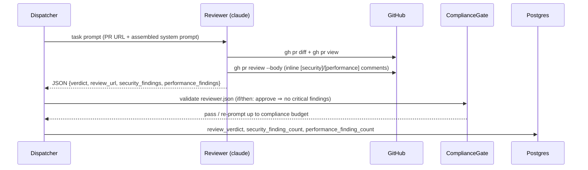

# Reviewer Security and Performance Analysis

## Context

Every reviewer-worker run evaluates convention compliance and AC coverage
but has no structured pass for security or performance. A SQL injection
vector or unbounded query passes `approve` if it isn't encoded in the
project's conventions. This design adds structured Security and
Performance analysis passes to every normal reviewer run, schema-gates
`approve` on the absence of `critical` security findings, and surfaces
finding counts in the admin panel (spec 0094).

The current reviewer emits free-text with a `VERDICT:` line; Phase 4
regex-parses it. Structured findings and schema-level enforcement of
AC3 require a JSON envelope — so this design extends the compliance
gate (already active in ship-mode via `resolve_schema_name`) to all
reviewer runs.

## Goals / non-goals

Goals: structured security + performance findings arrays in every
reviewer output; inline PR comments tagged `[security]` / `[performance]`;
`critical` security findings force `request-changes`; finding counts
persisted on the task row and visible in the admin task detail.

Non-goals: third-party SAST/DAST; runtime or load-performance testing;
escalating `high` findings or performance findings to `request-changes`;
modifying PM acceptance criteria.

## Design

### Components

**`system/roles/reviewer/tasks/review.md`** — gains two required
output sections. *Security analysis* covers OWASP Top 10 categories
(injection, broken auth, XSS, IDOR, security misconfiguration, SSRF,
crypto failures, deserialization, outdated components, logging gaps)
plus credential exposure. *Performance analysis* covers N+1 queries,
unbounded pagination, missing index hints, and O(n²)+ algorithmic
complexity. Each finding becomes an inline PR comment tagged
`[security][{severity}]` or `[performance]`. Output format shifts
from `VERDICT:` free-text to the structured JSON envelope that
`reviewer.json` validates.

**`workers/schemas/reviewer.json`** (new) — JSON Schema 2020-12
requiring `verdict`, `review_url`, `security_findings` (array),
`performance_findings` (array). Security finding objects carry
`{category, severity: critical|high|medium|low|info, file, line?,
description}`. An `if/then` clause rejects `verdict: "approve"` when
any `security_findings` entry has `severity: "critical"` — the
schema-level enforcement of AC3.

**`workers/_compliance_gate.py` `resolve_schema_name`** — the
`role == "reviewer"` branch currently returns `None` for non-ship
runs (gate skipped). Add: non-ship reviewer → `"reviewer"`. Ship-mode
continues resolving to `"reviewer_ship"` unchanged.

**`workers/dispatcher.py` Phase 4 (reviewer branch)** — after the
compliance gate passes, JSON-parse `result.result` to extract arrays;
write `len(security_findings)` → `tasks.security_finding_count` and
`len(performance_findings)` → `tasks.performance_finding_count`.
Existing `review_verdict` and `review_url` writes read from the
validated JSON fields (replacing regex parsers for gated runs).

**Migration** — adds `security_finding_count INTEGER` and
`performance_finding_count INTEGER` (both nullable) to `tasks`. Pre-existing
reviewer rows keep `NULL`; admin chips render only when non-null.

**`coder-admin`** — `client.ts` adds `security_finding_count: number | null`
and `performance_finding_count: number | null` to both `TaskRead`
interfaces. `TaskDetail.tsx` adds `SecurityFindingsChip` and
`PerformanceFindingsChip` alongside the verdict chip for `role=reviewer`
tasks, reading the new count fields. Zero counts render green; any
non-zero security count renders amber (critical findings would have
already forced `request-changes`).

### Edge cases

- **Turn cap** — reviewer emits partial text, not valid JSON; the
  compliance gate re-prompts up to budget then fails with
  `failure_kind=compliance`. Same operational path as today's
  `turn_cap_exceeded`; ops monitors failure rate during 24h soak.
- **NULL counts on historical rows** — admin chips render only when
  the field is non-null; historical tasks show no chip.
- **Re-prompt loop on critical+approve** — gate re-prompts up to
  `worker_output_compliance_budget` (default 3). On budget exhaustion:
  `failure_kind=schema`, raw output in `raw_output_held`; operator can
  retry or override.
- **Ship-mode unchanged** — ship-mode reviewer still validates
  `reviewer_ship.json` only; `security_findings` and
  `performance_findings` are not required on ship reviews.

## Rollout

1. **`coder-system`**: merge `review.md` prompt update (adds analysis
   sections + JSON output format) and this design.
2. **`coder-core`**: deploy `reviewer.json` schema, `resolve_schema_name`
   update, migration, and dispatcher count writes atomically. The gate
   validates new output from day one; old in-flight reviewer tasks may
   fail the gate once and re-prompt successfully.
3. **`coder-admin`**: deploy chip rendering. Pre-migration tasks show
   no chip (NULL counts).
4. **Soak 7 days**: monitor `security_finding_count > 0` coverage and
   `critical`-driven `request-changes` rate. Tune prompt if
   false-positive rate exceeds 5%.

## Links

- Spec: [0094](../../product-specs/wip/0094-ai-powered-code-review-security-and-performance-analysis.md)
- Designs: [reviewer-worker](./reviewer-worker.md), [observability-and-cost-tracking](./observability-and-cost-tracking.md)
- ADRs: [0039](../../adrs/0039-compliance-gate-for-normal-reviewer-runs.md), [0007](../../adrs/0007-reviewer-separated-from-pm.md)
