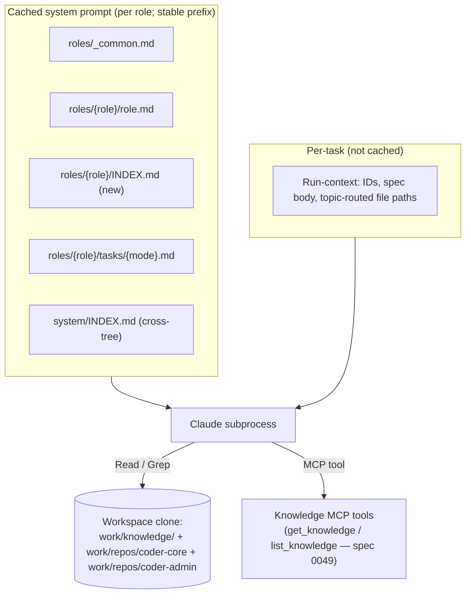

# Role-Scoped Knowledge Layout and Cached Workspace Context

## Context

Today an architect with a spec must (a) read `system/INDEX.md` (one
universal map shared by every reader), (b) predict which 3–5 of ~80
active designs are relevant, (c) `gh api` each one, (d) `gh api` source
repos to ground in code. Many active designs run past 200 body lines
(mixed current-state + rollout history), so each fetched body is
denser than it needs to be. No
workspace clone exists for non-developer roles. Result on refactor-heavy
specs: 25–46 min runs, 30+ `gh api` calls, occasional turn-budget
exhaustion.

## Goals / non-goals

Goals: a per-role reading map that routes spec topics to the relevant
active designs; multi-repo workspace clone for the read-context roles
(architect, PM, reviewer, team-manager) so code grounding is local; an
enforced `## Where in code` symbol-anchor convention on active designs
so the read jumps straight to source; preload the per-role map into the
cached system prompt prefix.

Non-goals: a new "operational" plane parallel to `designs/active/` (the
active-designs folder *is* the architect's knowledge base — the reform
is enforcing its existing lean contract, not inventing a sibling). No
changes to dispatcher leasing or task lifecycle.

## Design

### Components

**`system/roles/{role}/INDEX.md`** (new per role: architect, pm,
reviewer, team-manager). ~40-line routing table mapping spec-topic →
the relevant `designs/active/` files. The role's curated map, written
by the role's owner.

**`designs/active/_TEMPLATE.md`** — add a `## Where in code` section
convention to the active-design template (3–6 symbol anchors per file).
Validator rejects any `path.ext:N` pattern in those sections.

**Three new active designs** that fill component-level gaps the
architect already needed to understand: `dispatcher.md`,
`task-lifecycle.md`, `worker-auth-env.md`. Each is ≤90 lines, follows
the active-design template, ends with `## Where in code`.

**`coder-core/src/coder_core/workers/workspace.py`** — adds
`WorkspaceRepoSpec` + `MultiRepoWorkspaceConfig` +
`prepare_multi_repo_workspace`. Shallow-clones knowledge repo + every
code repo from the project's `system/repos.yaml` into a predictable
tree (`work/knowledge/`, `work/repos/{name}/`). `cwd=work/`.

**`coder-core/src/coder_core/workers/dispatcher.py`** —
`_preload_role_index` fetches `system/roles/{role}/INDEX.md`
(best-effort, 404 falls through). The role INDEX is inserted between
`role.md` and `tasks/{mode}.md` in `build_system_prompt` so it inherits
the per-role cache stability. `_build_workspace` is extended to build
a multi-repo config for architect tasks when
`settings.architect_workspace_enabled` is on.

**Existing Knowledge MCP tools** (`get_knowledge`, `list_knowledge`,
`submit_knowledge` — spec 0049). Role-mode prompts get a small update
to prefer them over `gh api`, and prefer local `Read` over both when
the workspace is present. Future tools (`knowledge.subgraph` per design
0046, `knowledge.by_topic`) extend the existing registry.

### Data flow

Spec arrives → dispatcher resolves topic from spec frontmatter →
fetches role INDEX + cross-tree INDEX + role + mode prompts → assembles
cached system prompt → spawns worker with multi-repo workspace under
`cwd=work/`. Architect reads INDEX → picks 2–4 active designs from the
topic row → opens them via local `Read` (or MCP `get_knowledge`) →
follows each design's `## Where in code` symbol anchors → local `Grep`
in `work/repos/coder-core/...`. Drafts design JSON; orchestrator writes
per the existing Phase-4 path.

### Edge cases

- **Cross-org repos**: single `.netrc` covers one GitHub org; multi-org
  projects need per-org tokens. Deferred; logged on detect.
- **Cache invalidation on role-prompt edit**: editing
  `roles/{role}/INDEX.md` invalidates the per-role cached prefix; cache
  miss is one-time per breakpoint.
- **Workspace size**: shallow `--depth=50` clones bound size; add
  `code_repos: include:` filter in project config when a project owns
  >5 repos.
- **Missing role INDEX**: 404 falls through; worker still has role.md +
  task contract + cross-tree INDEX. No hard failure.
- **Old bloated active designs**: routing still works; the lean
  discipline is enforced opportunistically on touch (`make boundaries`
  for content already passes; line-cap enforcement is a follow-on
  validator pass).

## Open questions

- Should the validator hard-cap active-design body length, or stay
  advisory? Lean toward advisory (warning) for the existing corpus,
  hard-cap on new designs after a soak.
- `read_first:` on specs — PM-authored or auto-derived from
  `affects_services` + parent category? Start manual; revisit after 10
  specs adopt it.

## Rollout

1. **Per-role INDEX.md** for architect, pm, reviewer, team-manager
   landed in `coder-system` (this PR).
2. **Three new lean active designs** (`dispatcher`, `task-lifecycle`,
   `worker-auth-env`) landed in `coder-system/designs/active/` (this
   PR). Demonstrate the target shape: ≤90-line body, Mermaid,
   invariants, `## Where in code`.
3. **`designs/active/_TEMPLATE.md`** updated with the `## Where in code`
   convention; `validate.py` rejects line-numbered anchors inside that
   section (this PR).
4. **`coder-core` multi-repo workspace** behind
   `CODER_ARCHITECT_WORKSPACE_ENABLED` (default off; flip per-project
   after smoke). Lands in `coder-core` (this PR).
5. **`coder-core` per-role INDEX preload** in `build_system_prompt`
   (this PR). Role-mode prompts updated to prefer MCP knowledge tools
   then local `Read` (follow-on PR).
6. **Smart hierarchical entry points for `designs/active/`** (this PR):
   top-level `system/designs/INDEX.md` routes to 5 category rollups
   (system-overview, pipeline-operations, worker-roles,
   tenancy-and-access, knowledge-and-admin, delivery-and-infra). Two
   new rollups added (`knowledge-and-admin`, `delivery-and-infra`).
   Role INDEXes route via category rollups, not direct to leaves —
   one extra hop, sharply tighter routing.

## Follow-on phases (not in this PR)

7. **Physical file moves** of active designs into
   `system/designs/active/<category>/{slug}.md` folder tree mirroring
   the entry tree. Requires:
   - `scripts/validate.py check_active_not_numbered` updated to
     recurse (currently `active.glob` not `rglob`).
   - `system/designs/registry.yaml` `file:` paths updated for every
     moved file.
   - Body cross-link path updates in every design that references
     a moved sibling (find+replace by id, since frontmatter cross-
     links use ids and only body markdown uses paths).
   - Role INDEX paths updated.
   High blast radius — best done as a single mechanical pass, not
   bundled with content rewrites.

8. **Lean-up of the 5 worst-offending leaves** (>500 body lines):
   `confidence-auto-approval` (894), `cross-project-patterns` (843),
   `template-schema-migration` (623), `graph-aware-retrieval` (559),
   `mcp-agent-interface-design` (541). Split rollout/history out of
   each (keep terse `## Evolution` section, drop multi-paragraph
   rollout narratives, move postmortem-style content to `git log` or
   ADRs). Target ≤200 lines per leaf.

9. **Opportunistic lean-up of moderate leaves** (200–500 body lines)
   on touch — when an architect drafts a follow-on design that
   touches a bloated leaf, the same PR trims it by applying the
   purpose-discipline rules (one component, current state only,
   ADR-worthy rationale moved out). The metric is *purpose, not
   length*: a 180-line file that is one tight component is right;
   a 70-line file with rollout history embedded is wrong.

## Links

- Specs: [worker-roles](../../product-specs/active/worker-roles.md), [architect-worker](../../product-specs/active/workers/architect-worker.md)
- Designs: [role-prompt-knowledge-layout](../active/workers/role-prompt-knowledge-layout.md), [graph-aware-retrieval](../active/knowledge/graph-aware-retrieval.md), [knowledge-freshness](../active/knowledge/knowledge-freshness.md), [prompt-caching-architecture](../active/pipeline/prompt-caching-architecture.md), [architect-worker](../active/workers/architect-worker.md), [pm-worker](../active/workers/pm-worker.md), [mcp-agent-interface-design](../active/knowledge/mcp-agent-interface-design.md), [dispatcher](../active/pipeline/dispatcher.md), [task-lifecycle](../active/pipeline/task-lifecycle.md), [worker-auth-env](../active/workers/worker-auth-env.md)
- Repos: coder-core, coder-system
