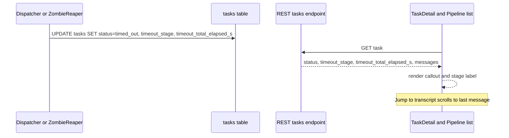

# Timeout stall visibility

## What it does today

When any code path transitions a task to `timed_out`, two fields are stamped on the `tasks` row in the same transaction: `timeout_stage` (the pipeline stage at timeout, copied from `tasks.stage`) and `timeout_total_elapsed_s` (integer seconds from `tasks.started_at` to now). Both fields surface on `GET /v1/projects/{pid}/tasks/{tid}`. `TaskDetail.tsx` renders a 'Timed out' callout above the messages panel showing the stall stage and elapsed time, plus a 'Jump to transcript' anchor that scrolls to the final pre-timeout message. Timed-out rows in the pipeline task list carry a secondary stage label so operators can identify per-stage failure patterns without opening each task.

## Architecture

### Parts

- `_stamp_timeout_fields(row, now)` — helper in `tasks/service.py`; reads `row.stage` and `row.started_at`, writes `timeout_stage` and `timeout_total_elapsed_s` onto the ORM row before any `status=timed_out` commit. No-op when `started_at` is `None`.
- `tasks.timeout_stage` — nullable `VARCHAR(20)` column; copied from `tasks.stage` at timeout. `NULL` on pre-0096 rows.
- `tasks.timeout_total_elapsed_s` — nullable `INTEGER`; `ceil((now - started_at).total_seconds())`. `NULL` when `started_at` is absent.
- `TaskRead.timeout_stage` / `TaskRead.timeout_total_elapsed_s` — new nullable fields on the Pydantic response model; both map directly to ORM columns.
- `TimeoutCallout` — new component in `TaskDetail.tsx`; renders above the messages panel when `task.status === 'timed_out'`; shows stage name and elapsed time.
- Pipeline list annotation — `Pipeline.tsx` task-row renderer appends the stage name to the status area when `status === 'timed_out'` and `timeout_stage` is non-null.

### Data flow

On any `status=timed_out` write (dispatcher lease expiry in `dispatcher.py` or zombie reaper in `self_heal.py`), `_stamp_timeout_fields` is called before the session commit. The API serialises both new fields onto `TaskRead`. The admin SPA fetches the full task on detail-view open and renders `TimeoutCallout` when `status === 'timed_out'`; the pipeline list re-uses the same `TaskSummary` payload already returned by `GET /v1/projects/{pid}/tasks`.

### Invariants

- `timeout_stage` and `timeout_total_elapsed_s` are set atomically with `status=timed_out`; no partial writes.
- Both fields remain `NULL` for tasks never started (no `started_at`).
- Legacy rows (pre-0096) keep `NULL` in both columns; the UI treats `NULL` as unknown stage.
- `timeout_total_elapsed_s` is always >= 0; the helper clamps negative deltas (clock skew) to 0.
- Re-timing-out an already-`timed_out` task (requeue to new timeout) overwrites both fields.

## Interfaces

| Surface | Effect |
|---|---|
| `GET /v1/projects/{pid}/tasks/{tid}` | Response gains `timeout_stage: str or null` and `timeout_total_elapsed_s: int or null` |
| `GET /v1/projects/{pid}/tasks` list | `TaskSummary` gains same two fields; pipeline list renders stage label on `timed_out` rows |
| `TaskDetail.tsx` | Shows `TimeoutCallout` component when `status === 'timed_out'` |
| `Pipeline.tsx` | Appends stage name in status column for `timed_out` rows |
| Alembic migration | Adds `timeout_stage VARCHAR(20)` and `timeout_total_elapsed_s INTEGER` to `tasks` table |

## Where in code

- `app/tasks/service.py` — `_stamp_timeout_fields` (stamps both columns before timed_out commit)
- `app/tasks/models.py` — `Task.timeout_stage`, `Task.timeout_total_elapsed_s` (ORM columns)
- `app/tasks/schemas.py` — `TaskRead.timeout_stage`, `TaskRead.timeout_total_elapsed_s` (response fields)
- `app/pipeline/dispatcher.py` — `_expire_leased_tasks` (calls `_stamp_timeout_fields`)
- `frontend/src/components/TaskDetail.tsx` — `TimeoutCallout` (callout component)
- `frontend/src/components/Pipeline.tsx` — task-row renderer (stage annotation)

## Evolution

Follows `self-healing` (zombie reaper writes the same timeout path) and `task-lifecycle` (status machine). No prior WIPs.

## Links

- Spec: 0096
- Designs: [task-lifecycle](../pipeline/task-lifecycle.md), [self-healing](../pipeline/self-healing.md), [admin-panel](../../knowledge/admin-panel.md)
- Repos: coder-core, coder-admin
