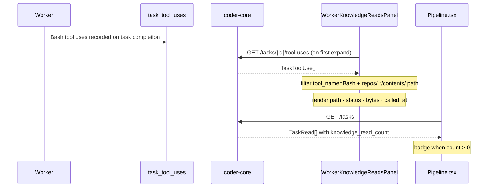

# Worker Knowledge-Read Transparency

## What it does today

`coder-admin` surfaces which knowledge-repo files a worker read during a task run without requiring operators to download the full transcript. A collapsible `WorkerKnowledgeReadsPanel` on the task detail page filters `Bash` tool calls whose command contains a `repos/{org}/{repo}/contents/` path from the existing `GET /tasks/{id}/tool-uses` endpoint and renders artifact path, HTTP status, byte size, and timestamp per fetch. The task-list endpoint stamps `knowledge_read_count` on each `TaskRead` so `Pipeline.tsx` can show a per-row badge without an extra round-trip.

## Architecture

### Parts

- **`GET /tasks/{tid}/tool-uses`** — existing endpoint in `src/coder_core/api/tasks.py`; returns `TaskToolUseRead[]`; no backend schema change.
- **`WorkerKnowledgeReadsPanel`** — new component in `coder-admin/src/pages/TaskDetail.tsx`; lazy-loads on first expand; filters `tool_name === 'Bash'` with command containing `repos/{org}/{repo}/contents/`; persists collapse in `sessionStorage` under `kr-expanded-{taskId}`.
- **`TaskRead.knowledge_read_count`** — nullable int added to `src/coder_core/schemas/tasks.py`; populated by a subcount against `task_tool_uses` in the task-list query.
- **Pipeline row badge** — `N reads` chip next to the status chip, omitted when count is null or zero.

### Data flow

On first expand the panel fires `GET /tasks/{id}/tool-uses` once and caches the result in component state. Client-side filtering retains only rows where `tool_name === 'Bash'` and the `command` field contains a `repos/{org}/{repo}/contents/` path. Each retained row renders the extracted artifact path, HTTP status parsed from the tool output string, byte count, and `called_at` timestamp. The `knowledge_read_count` field on `TaskRead` is derived server-side via a subcount so the Pipeline list badge requires no extra fetch.

### Invariants

- Panel renders only for terminal-state tasks (`completed`, `failed`, `cancelled`); in-progress tasks show the panel disabled.
- Zero matching Bash calls renders a "No knowledge reads" placeholder, not an empty table.
- `knowledge_read_count: null` signals a legacy task predating this feature; the badge is omitted, not shown as 0.
- Collapse state is scoped per task in `sessionStorage`; opening a second task does not inherit the first task's state.
- Only `gh api repos/{org}/{repo}/contents/` calls are counted; other Bash calls (git, npm, search) are excluded by the client-side path filter.

## Interfaces

| Surface | Effect |
|---|---|
| `GET /tasks/{id}/tool-uses` | Returns `TaskToolUse[]`; panel consumes client-side; no backend change |
| `GET /tasks` response | `TaskRead` gains `knowledge_read_count` (nullable int) |
| `WorkerKnowledgeReadsPanel` | Collapsible panel: artifact path, status, bytes, timestamp per read |
| Pipeline row badge | `N reads` shown when `knowledge_read_count > 0` |

## Where in code

- `src/coder_core/api/tasks.py` — `list_task_tool_uses` (existing tool-use list handler)
- `src/coder_core/schemas/tasks.py` — `TaskRead` (add `knowledge_read_count` field)
- `src/coder_core/db/tasks.py` — `list_tasks` (subcount join for `knowledge_read_count`)
- `coder-admin/src/pages/TaskDetail.tsx` — `WorkerKnowledgeReadsPanel` (new panel component)
- `coder-admin/src/pages/Pipeline.tsx` — task row badge for knowledge read count

## Evolution

Builds on `task_tool_uses` introduced by observability-and-cost-tracking. Complements `KnowledgeLookupsPanel` (spec 0098) which covers pre-task KnowledgeService reads.

## Links

- Spec: system/product-specs/wip/0099
- Designs: [admin-panel](../admin-panel.md), [observability-and-cost-tracking](../../pipeline/observability-and-cost-tracking.md), [knowledge-stack](../knowledge-stack.md)
- Repos: coder-core, coder-admin
